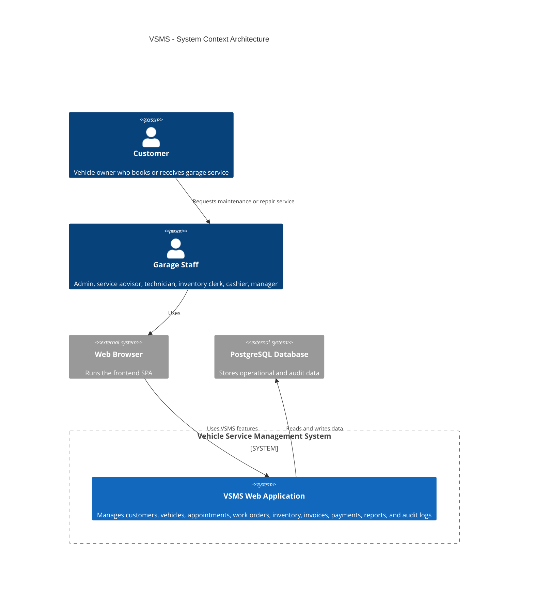
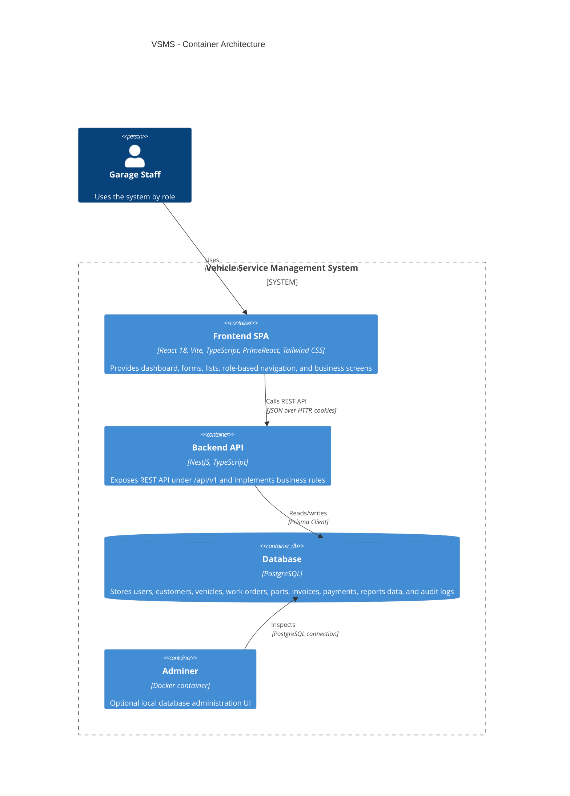
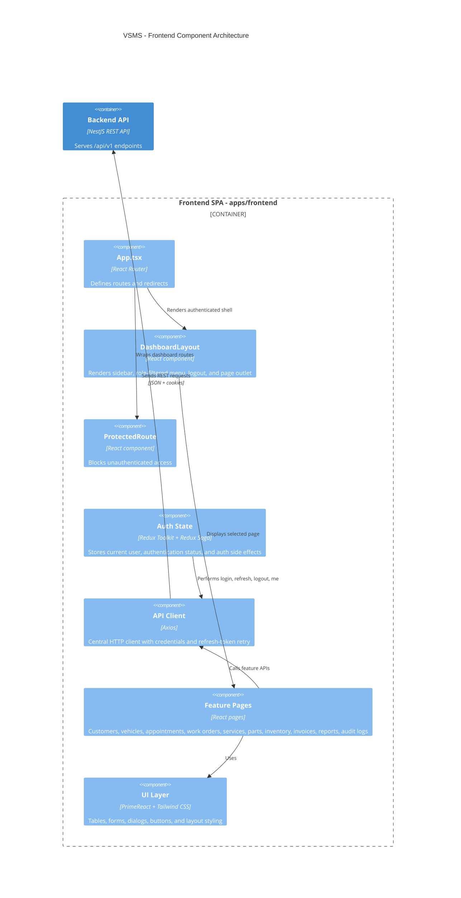
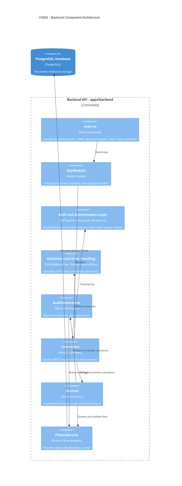
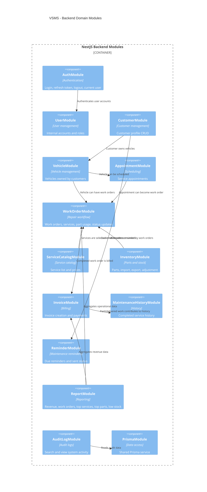
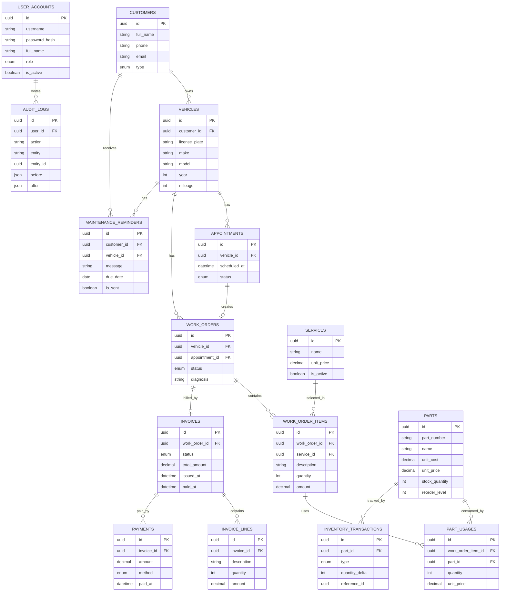
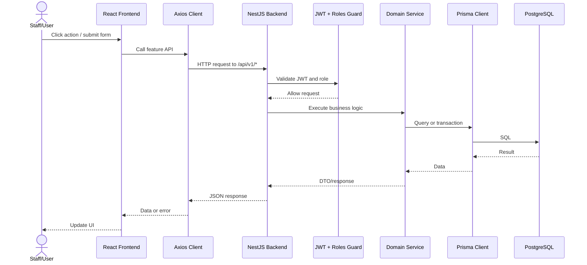
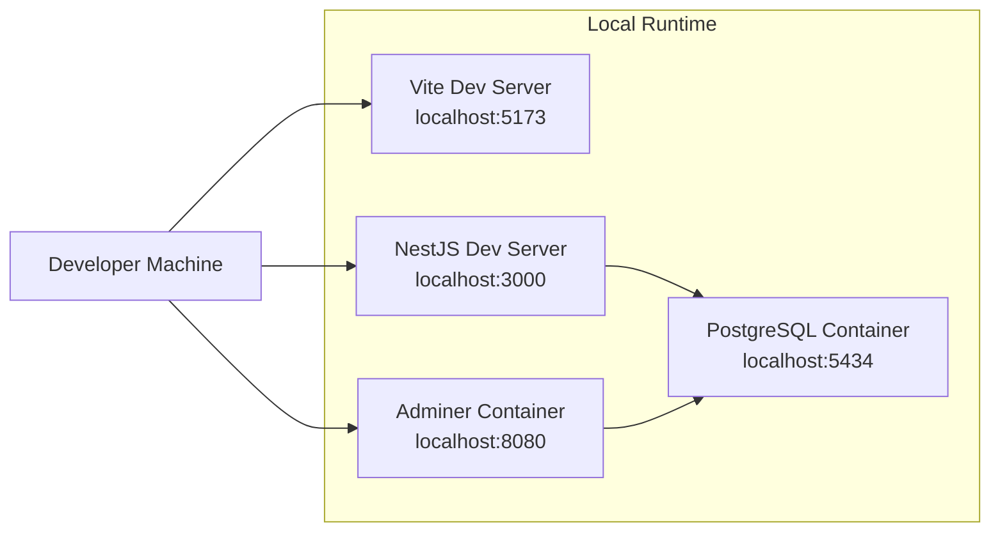

# VSMS Architecture Overview

Tai lieu nay mo ta kien truc tong quan cua project Vehicle Service Management System theo 3 lop chinh:

- Frontend: React/Vite.
- Backend: NestJS REST API.
- Database: PostgreSQL + Prisma ORM.

## 1. System Context Architecture Diagram



## 2. Container Architecture Diagram



## 3. Frontend Component Architecture Diagram



## 4. Backend Component Architecture Diagram



## 5. Backend Domain Module Architecture Diagram



## 6. Business Process Diagram

```mermaid
flowchart LR
    Customer["Customer"]
    Advisor["Service Advisor"]
    Technician["Technician"]
    Inventory["Inventory Clerk"]
    Cashier["Cashier"]
    Manager["Manager"]

    Customer -->|"Brings vehicle / books service"| Advisor
    Advisor --> C1["Create Customer"]
    C1 --> V1["Create Vehicle"]
    V1 --> A1{"Booked before?"}
    A1 -->|"Yes"| AP["Create Appointment"]
    A1 -->|"No"| WO["Create Work Order"]
    AP --> WO
    WO --> SVC["Add Services"]
    SVC --> TECH["Diagnose / Repair"]
    Technician --> TECH
    TECH --> PART{"Need parts?"}
    PART -->|"Yes"| USE["Add Part Usage"]
    Inventory --> USE
    USE --> STOCK["Decrease Stock<br/>Create Inventory Transaction"]
    PART -->|"No"| STATUS["Update Work Order Status"]
    STOCK --> STATUS
    STATUS --> READY["Ready for Delivery"]
    READY --> INV["Create Invoice"]
    Cashier --> INV
    INV --> PAY["Record Payment"]
    PAY --> HIST["Maintenance History"]
    HIST --> RPT["Reports + Audit Logs"]
    Manager --> RPT
```



## 7. Database ERD Diagram



## 8. Request Sequence Diagram



## 9. Technology Stack Summary

| Layer | Technology | Purpose |
| --- | --- | --- |
| Frontend | React 18, Vite, TypeScript | Single Page Application |
| UI | PrimeReact, PrimeIcons, Tailwind CSS | UI components and styling |
| Routing | React Router | Page navigation and protected routes |
| State | Redux Toolkit, Redux Saga | Authentication state and auth side effects |
| HTTP | Axios | Calls backend REST API |
| Backend | NestJS, TypeScript | REST API and business logic |
| Validation | Zod validation pipe | Validate request DTOs |
| Auth | JWT, refresh token, bcrypt | Login, refresh, logout, protected API |
| Authorization | RolesGuard | Role-based access control |
| ORM | Prisma Client | Type-safe database access |
| Database | PostgreSQL | Persistent relational data |
| Local infra | Docker Compose | PostgreSQL and Adminer for development |

## 10. Main API Areas

All backend routes use global prefix:

```text
/api/v1
```

Main API groups:

| API group | Backend module | Frontend feature |
| --- | --- | --- |
| `/auth` | AuthModule | `features/auth` |
| `/users` | UserModule | `features/users` |
| `/customers` | CustomerModule | `features/customers` |
| `/vehicles` | VehicleModule | `features/vehicles` |
| `/appointments` | AppointmentModule | `features/appointments` |
| `/work-orders` | WorkOrderModule | `features/work-orders` |
| `/services` | ServiceCatalogModule | `features/services` |
| `/parts` | InventoryModule | `features/parts` |
| `/inventory` | InventoryModule | `features/inventory` |
| `/invoices` | InvoiceModule | `features/invoices` |
| `/maintenance-history` | MaintenanceHistoryModule | `features/maintenance-history` |
| `/reminders` | ReminderModule | `features/reminders` |
| `/reports` | ReportModule | `features/reports` |
| `/audit-logs` | AuditLogModule | `features/audit-logs` |

## 11. Deployment Architecture Diagram


