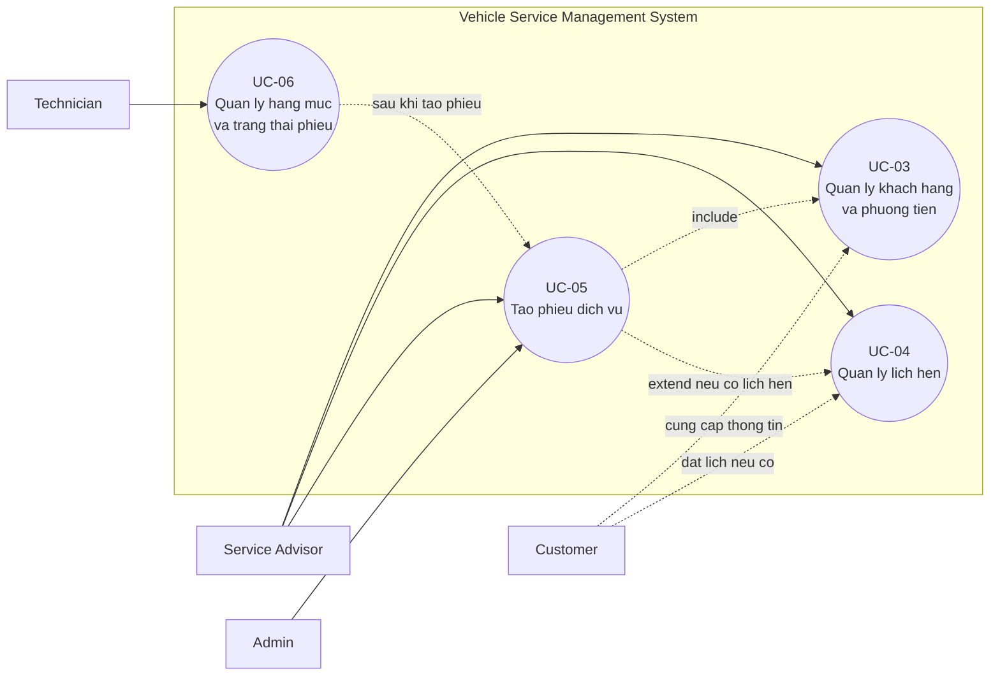
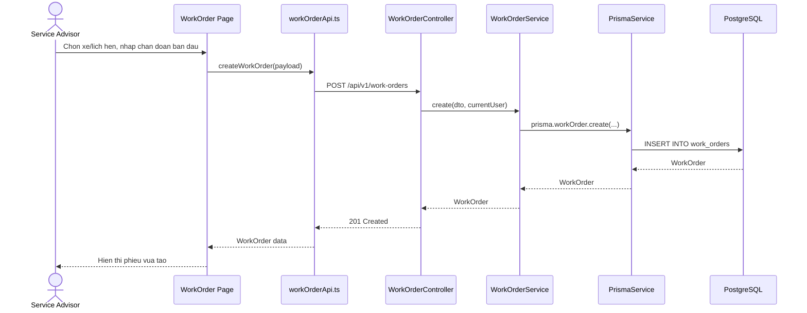
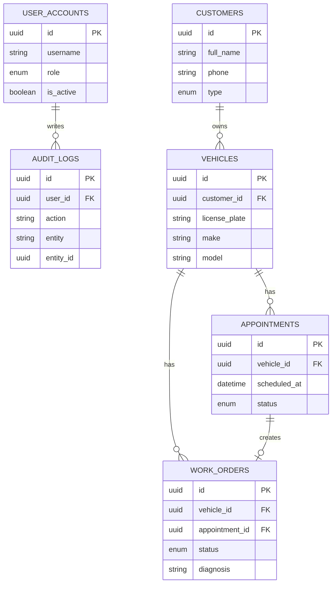

# Cau Hoi Bao Ve: Use Case Chinh Cua He Thong

Tai lieu nay dung de hoc nhanh khi giang vien hoi:

```text
Use case chinh cua he thong la gi?
Use case do xuat phat tu yeu cau chuc nang nao?
Diagram nao mo ta use case nay?
Bang database nao ho tro use case?
Code nam o module/page nao?
```

## 1. Use case chinh la gi?

Tra loi:

```text
Use case chinh em chon la UC-05 - Tao phieu dich vu.
```

Noi ro hon:

```text
UC-05 mo ta viec nhan vien tiep nhan tao phieu dich vu/work order cho xe khi khach hang mang xe den garage hoac da co lich hen truoc.
```

Ly do chon:

```text
Vi phieu dich vu/work order la doi tuong trung tam cua he thong. Sau khi tao phieu, he thong moi co du lieu de them hang muc sua chua, cap nhat trang thai, ghi nhan phu tung, lap hoa don va thanh toan.
```

Neu giang vien hoi ve UC-04:

```text
UC-04 - Quan ly lich hen dich vu la use case ho tro truoc UC-05. UC-04 chi dung khi khach dat lich truoc, con UC-05 la buoc bat buoc khi xe duoc tiep nhan vao garage.
```

## 2. Yeu cau chuc nang nao tao ra use case nay?

Yeu cau truc tiep:

| FR | Noi dung | Lien quan UC-05 |
| --- | --- | --- |
| `FR-07` | Tao phieu dich vu/work order tu lich hen hoac tiep nhan truc tiep | Day la yeu cau chuc nang sinh ra UC-05 |

Yeu cau ho tro de tao duoc phieu:

| FR | Noi dung | Vai tro |
| --- | --- | --- |
| `FR-01` | Dang nhap/dang xuat, refresh token | Nguoi dung phai dang nhap |
| `FR-02` | Quan ly nguoi dung va phan quyen RBAC | Chi role duoc phep moi tao phieu |
| `FR-03` | Quan ly khach hang | Phieu can gan voi khach hang thong qua xe |
| `FR-05` | Quan ly phuong tien | Phieu dich vu bat buoc gan voi mot xe |
| `FR-06` | Quan ly lich hen dich vu | Neu khach dat lich truoc thi tao phieu tu lich hen |

Yeu cau tiep tuc sau khi da co phieu:

| FR | Noi dung | Buoc sau UC-05 |
| --- | --- | --- |
| `FR-08` | Quan ly hang muc cong viec trong phieu | Them dich vu/cong viec vao phieu |
| `FR-09` | Quan ly trang thai phieu dich vu | Cap nhat tien do sua chua |
| `FR-13` | Ghi nhan phu tung su dung va tru ton kho | Gan phu tung vao phieu |
| `FR-14` | Lap hoa don tu phieu dich vu | Tao hoa don tu phieu |
| `FR-15` | Ghi nhan thanh toan | Thanh toan hoa don |

## 3. Diagram can trinh bay

Chi can trinh bay 3 diagram:

| Diagram | Muc dich |
| --- | --- |
| Use Case Diagram | Cho thay actor nao tham gia UC-05 |
| Sequence Diagram | Cho thay frontend goi backend tao phieu nhu the nao |
| ERD/Table Diagram | Cho thay bang database nao ho tro UC-05 |

## 4. Use Case Diagram



Giai thich ngan:

```text
Service Advisor la actor chinh tao phieu dich vu. Customer la actor phu cung cap thong tin xe/nhu cau. Technician la actor phu xu ly phieu sau khi phieu duoc tao. Admin co the thao tac thay cac role do co quyen cao nhat.
```

## 5. Sequence Diagram cho UC-05



Giai thich ngan:

```text
Khi Service Advisor tao phieu, frontend goi API POST /api/v1/work-orders. Backend nhan request o WorkOrderController, xu ly logic trong WorkOrderService, sau do dung Prisma de ghi ban ghi moi vao bang work_orders.
```

## 6. ERD/Table Diagram cho UC-05



Bang database ho tro rieng UC-05:

| Bang | Vai tro |
| --- | --- |
| `user_accounts` | Xac dinh nguoi dang nhap va role co quyen tao phieu |
| `customers` | Luu thong tin khach hang |
| `vehicles` | Luu thong tin xe, xe duoc gan vao phieu |
| `appointments` | Luu lich hen neu tao phieu tu lich hen |
| `work_orders` | Bang chinh cua UC-05, luu phieu dich vu |
| `audit_logs` | Ghi lai thao tac tao phieu neu thao tac duoc audit |

Neu giang vien hoi sau khi tao phieu thi can bang nao tiep:

| Bang | Dung cho buoc sau |
| --- | --- |
| `services` | Danh muc dich vu |
| `work_order_items` | Hang muc dich vu/cong viec trong phieu |
| `parts` | Danh muc phu tung va ton kho |
| `part_usages` | Phu tung su dung trong phieu |
| `inventory_transactions` | Giao dich tru/nhap/dieu chinh kho |
| `invoices` | Hoa don tao tu phieu |
| `invoice_lines` | Dong hoa don snapshot |
| `payments` | Thanh toan hoa don |

## 7. Code nam o dau?

Frontend:

| Thanh phan | File |
| --- | --- |
| Page tao/xem phieu | `apps/frontend/src/features/work-orders/WorkOrderListPage.tsx` |
| API goi backend | `apps/frontend/src/features/work-orders/workOrderApi.ts` |
| Axios client dung chung | `apps/frontend/src/services/api.ts` |

Backend:

| Thanh phan | File |
| --- | --- |
| Controller | `apps/backend/src/modules/work-order/work-order.controller.ts` |
| Service | `apps/backend/src/modules/work-order/work-order.service.ts` |
| Module | `apps/backend/src/modules/work-order/work-order.module.ts` |
| Prisma service | `apps/backend/src/prisma/prisma.service.ts` |
| Database schema | `apps/backend/prisma/schema.prisma` |

API chinh cua UC-05:

```text
POST /api/v1/work-orders
```

API lien quan sau khi tao phieu:

```text
GET /api/v1/work-orders
GET /api/v1/work-orders/:id
PATCH /api/v1/work-orders/:id/status
POST /api/v1/work-orders/:id/items
POST /api/v1/work-orders/:id/part-usages
```

## 8. Step demo UC-05 tren giao dien

Muc tieu demo:

```text
Chung minh UC-05 - Tao phieu dich vu hoat dong tren he thong.
```

Account nen dung:

```text
admin / Demo@123
```

Hoac dung dung vai tro nghiep vu:

```text
advisor / Demo@123
```

Nen dung `admin` khi bao cao de tranh bi thieu quyen luc demo.

### Step 1: Dang nhap

Mo frontend:

```text
http://localhost:5173
```

Dang nhap:

```text
Username: admin
Password: Demo@123
```

Noi khi demo:

```text
Em dang nhap bang tai khoan Admin de co toan quyen thao tac. Trong thuc te, nghiep vu tao phieu dich vu thuong do Service Advisor thuc hien.
```

### Step 2: Tao khach hang

Menu:

```text
Khach hang
```

Thao tac:

```text
Tao khach hang -> nhap ho ten, so dien thoai, email, dia chi -> Luu
```

Noi khi demo:

```text
Truoc khi tao phieu dich vu, he thong can co thong tin khach hang. Day la du lieu tien dieu kien cua UC-05.
```

FR lien quan:

```text
FR-03 - Quan ly khach hang
```

Bang database:

```text
customers
```

### Step 3: Tao phuong tien

Menu:

```text
Phuong tien
```

Thao tac:

```text
Tao xe -> chon khach hang vua tao -> nhap bien so, hang xe, dong xe, nam san xuat, so km -> Luu
```

Noi khi demo:

```text
Moi phieu dich vu phai gan voi mot phuong tien cu the. Vi vay sau khi co khach hang, em tao xe cua khach hang.
```

FR lien quan:

```text
FR-05 - Quan ly phuong tien
```

Bang database:

```text
vehicles
```

### Step 4: Tao lich hen neu khach dat truoc

Buoc nay co the bo qua neu demo khach den truc tiep.

Menu:

```text
Lich hen
```

Thao tac:

```text
Tao lich hen -> chon xe -> chon thoi gian hen -> nhap nhu cau dich vu -> Luu
```

Noi khi demo:

```text
Neu khach dat lich truoc, Service Advisor tao lich hen. Sau do khi khach den garage, lich hen nay co the duoc dung de tao phieu dich vu.
```

FR lien quan:

```text
FR-06 - Quan ly lich hen dich vu
```

Bang database:

```text
appointments
```

### Step 5: Tao phieu dich vu

Menu:

```text
Phieu sua chua
```

Thao tac:

```text
Tao phieu -> chon xe hoac lich hen -> nhap chan doan/tinh trang ban dau -> Luu
```

Noi khi demo:

```text
Day la buoc chinh cua UC-05. He thong tao phieu dich vu/work order cho xe. Phieu nay se la doi tuong trung tam de cac bo phan tiep tuc them hang muc sua chua, cap nhat trang thai, ghi nhan phu tung va lap hoa don.
```

FR lien quan:

```text
FR-07 - Tao phieu dich vu/work order
```

Bang database:

```text
work_orders
```

API/code lien quan:

```text
POST /api/v1/work-orders
apps/frontend/src/features/work-orders/WorkOrderListPage.tsx
apps/frontend/src/features/work-orders/workOrderApi.ts
apps/backend/src/modules/work-order/work-order.controller.ts
apps/backend/src/modules/work-order/work-order.service.ts
```

### Step 6: Mo chi tiet phieu vua tao

Menu:

```text
Phieu sua chua -> chon phieu vua tao
```

Noi khi demo:

```text
Sau khi tao, phieu co trang thai ban dau va co the duoc Technician hoac Service Advisor tiep tuc xu ly.
```

Ket qua mong doi:

```text
Phieu moi xuat hien trong danh sach.
Phieu co thong tin xe, khach hang, trang thai va chan doan ban dau.
```

### Step 7: Them dich vu/hang muc sua chua

Buoc nay khong phai UC-05 goc, nhung dung de chung minh sau khi tao phieu thi flow tiep tuc duoc.

Thao tac:

```text
Mo chi tiet phieu -> Them dich vu/hang muc -> chon dich vu -> nhap so luong/don gia -> Luu
```

Noi khi demo:

```text
Sau UC-05, he thong tiep tuc sang FR-08: quan ly hang muc cong viec trong phieu.
```

FR lien quan:

```text
FR-08
```

Bang database:

```text
services
work_order_items
```

### Step 8: Cap nhat trang thai phieu

Thao tac:

```text
Cap nhat trang thai phieu: Tiep nhan -> Chan doan -> Dang sua -> San sang giao
```

Noi khi demo:

```text
Trang thai phieu cho phep garage theo doi tien do xu ly xe.
```

FR lien quan:

```text
FR-09
```

Bang database:

```text
work_orders.status
```

### Step 9: Neu can demo tiep flow sau UC-05

Neu con thoi gian, co the demo tiep:

```text
Them phu tung su dung -> Lap hoa don -> Ghi nhan thanh toan
```

Mapping:

| Buoc | FR | Bang chinh |
| --- | --- | --- |
| Them phu tung | `FR-13` | `parts`, `part_usages`, `inventory_transactions` |
| Lap hoa don | `FR-14` | `invoices`, `invoice_lines` |
| Thanh toan | `FR-15` | `payments` |

## 9. Cau tra loi mau ngan gon

Hoc cau nay:

```text
Use case chinh em chon la UC-05 - Tao phieu dich vu. Use case nay xuat phat truc tiep tu FR-07: tao phieu dich vu/work order tu lich hen hoac tiep nhan truc tiep. De thuc hien UC-05, he thong can cac FR ho tro nhu FR-01 dang nhap, FR-02 phan quyen, FR-03 quan ly khach hang, FR-05 quan ly phuong tien va FR-06 quan ly lich hen. Em chon UC-05 vi work order la doi tuong trung tam cua he thong; sau khi co phieu thi moi co the them hang muc, cap nhat trang thai, ghi nhan phu tung, lap hoa don va thanh toan.

Diagram em trinh bay gom Use Case Diagram, Sequence Diagram cho API POST /api/v1/work-orders va ERD cac bang user_accounts, customers, vehicles, appointments, work_orders, audit_logs. Code trien khai nam o frontend features/work-orders, cu the la WorkOrderListPage.tsx va workOrderApi.ts; backend nam o WorkOrderModule gom work-order.controller.ts, work-order.service.ts va work-order.module.ts.
```
