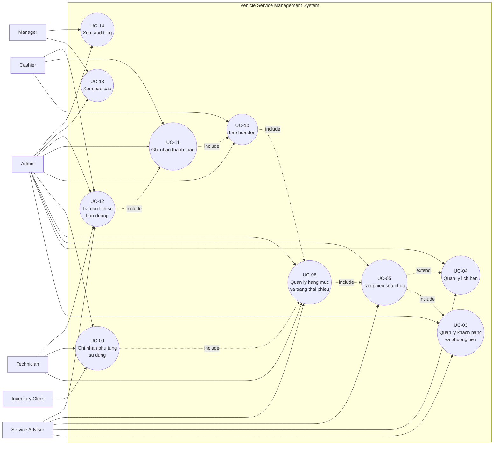
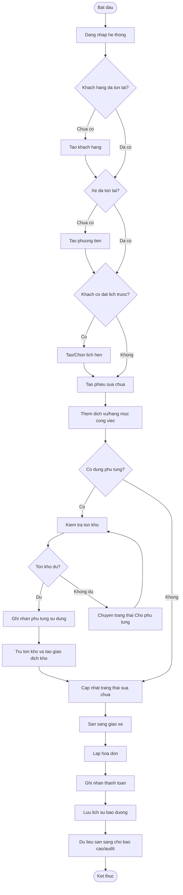
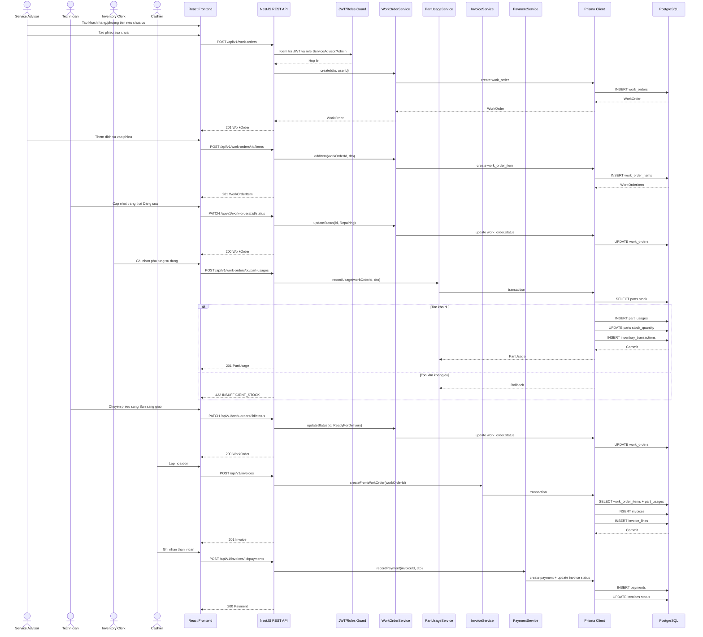
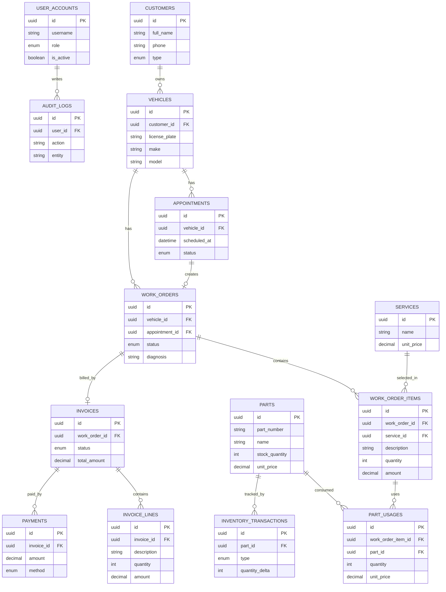

# Cau Hoi Bao Ve: Use Case Chinh, Yeu Cau Chuc Nang, Diagram Va Database

Tai lieu nay dung de team chuan bi tra loi khi giang vien hoi:

```text
Use case chinh cua he thong la gi?
Yeu cau chuc nang nao de ra use case nay?
Show trien khai use case: diagram, bang database ho tro tinh nang do.
```

## 1. Cau tra loi ngan gon

Neu giang vien hoi "use case chinh cua he thong la gi?", nen tra loi theo report:

```text
Use case trung tam em chon de trinh bay la UC-05 - Tao phieu dich vu.
```

Ly do chon `UC-05`:

- Trong report, `UC-05` co muc tieu: **khoi tao work order lam trung tam dieu phoi toan bo qua trinh xu ly xe**.
- `work_orders` la bang trung tam noi voi xe, lich hen, hang muc dich vu, phu tung, hoa don va thanh toan.
- Sau khi co `UC-05`, cac use case sau moi co du lieu de tiep tuc:
  - `UC-06`: Quan ly hang muc va trang thai phieu dich vu.
  - `UC-09`: Ghi nhan phu tung su dung.
  - `UC-10`: Lap hoa don.
  - `UC-11`: Ghi nhan thanh toan.
  - `UC-12`: Tra cuu lich su bao duong.

Neu muon noi rong hon:

```text
Luồng nghiệp vụ lõi của hệ thống là xử lý work order/phiếu dịch vụ. Trong đó UC-05 - Tạo phiếu dịch vụ là use case trung tâm, còn UC-04 - Quản lý lịch hẹn là use case hỗ trợ trước đó khi khách đặt lịch trước.
```

Khong nen tra loi:

```text
Use case chinh chi la UC-04 va UC-05.
```

Vi theo report, `UC-04` va `UC-05` chi thuoc **quy trinh tiep nhan xe**. Bao cao con neu ro quy trinh loi la **xu ly work order**, va cac use case trong flow con gom `UC-06`, `UC-09`, `UC-10`, `UC-11`.

## 1.1. Neu bi hoi "Tai sao khong chon UC-04?"

Tra loi:

```text
UC-04 quan ly lich hen la use case quan trong nhung mang tinh tien xu ly. No chi xay ra khi khach dat lich truoc. Trong khi do UC-05 tao phieu dich vu la bat buoc khi xe duoc tiep nhan vao garage, du khach co lich hen hay den truc tiep. Phieu dich vu/work order la doi tuong trung tam de ky thuat vien xu ly, thu kho tru ton, thu ngan lap hoa don va quan ly xem bao cao.
```

## 1.2. Neu bi hoi "Use case chinh cua toan he thong co phai la UC-05 khong?"

Tra loi can bang:

```text
Neu xet mot use case dai dien trong danh sach UC thi em chon UC-05 - Tao phieu dich vu, vi no khoi tao work order la trung tam cua he thong. Neu xet theo ca luong nghiep vu end-to-end thi use case/flow chinh la xu ly phieu dich vu tu tiep nhan xe den hoa don va thanh toan, bao gom UC-05, UC-06, UC-09, UC-10 va UC-11. UC-04 la nhanh truoc do cho truong hop khach dat lich.
```

## 1.3. Cong thuc tra loi nhanh

Khi bi hoi, tra loi theo thu tu:

```text
1. Em chon UC-05 - Tao phieu dich vu lam use case trung tam.
2. Ly do: UC-05 tao work order, ma work order la doi tuong trung tam cua nghiep vu garage.
3. Use case nay duoc hinh thanh truc tiep tu FR-07, va phu thuoc FR-03, FR-05, FR-06.
4. Sau UC-05, cac FR/UC tiep theo mo rong flow: FR-08/09 cho hang muc va trang thai, FR-13 cho phu tung, FR-14/15 cho hoa don va thanh toan.
5. Diagram em show: Use Case Diagram, Activity Diagram tao phieu, Sequence Diagram POST /work-orders, ERD cac bang customers, vehicles, appointments, work_orders, work_order_items.
6. Code nam o frontend features/work-orders va backend WorkOrderModule.
```

## 1.4. Neu muon trinh bay luong end-to-end

Trong tai lieu use case, day khong chi la mot thao tac nho, ma la **luong nghiep vu loi** gom nhieu use case con:

- `UC-03`: Quan ly ho so khach hang va phuong tien.
- `UC-04`: Quan ly lich hen dich vu.
- `UC-05`: Tao phieu dich vu/work order.
- `UC-06`: Quan ly hang muc va trang thai phieu dich vu.
- `UC-09`: Ghi nhan phu tung su dung cho phieu dich vu.
- `UC-10`: Lap hoa don tu phieu dich vu.
- `UC-11`: Ghi nhan thanh toan.
- `UC-12`: Tra cuu lich su bao duong.

Neu giang vien yeu cau chon **mot use case dai dien**, nen chon:

```text
UC-05: Tao phieu dich vu
```

Ly do:

- Phieu sua chua/work order la trung tam cua he thong.
- No lien ket khach hang, phuong tien, lich hen, dich vu, phu tung, hoa don, thanh toan va lich su bao duong.
- Hau het role deu tham gia quanh use case nay: Service Advisor, Technician, Inventory Clerk, Cashier, Manager.
- Neu khong co work order, cac module sau nhu hang muc sua chua, phu tung, hoa don, bao cao, lich su bao duong khong co du lieu nghiep vu de xu ly.

## 2. Cach noi khi bao ve

Co the tra loi nhu sau:

```text
Use case chinh cua he thong la xu ly mot lan khach hang mang xe den garage de sua chua/bao duong. Dau tien nhan vien tiep nhan tao ho so khach hang va phuong tien, sau do tao lich hen neu khach dat truoc hoac tao phieu sua chua truc tiep. Phieu sua chua la doi tuong trung tam. Tren phieu, nhan vien va ky thuat vien them dich vu, ghi nhan phu tung su dung, cap nhat trang thai sua chua. Khi xe sua xong, thu ngan lap hoa don tu phieu sua chua va ghi nhan thanh toan. Sau khi hoan tat, du lieu nay duoc dung cho lich su bao duong, bao cao doanh thu va audit log.
```

## 3. Actor tham gia use case chinh

| Actor | Vai tro trong use case chinh |
| --- | --- |
| `Service Advisor` | Tiep nhan khach, tao khach hang, tao xe, tao lich hen, tao phieu sua chua |
| `Technician` | Xem phieu, thuc hien sua chua, them hang muc/phu tung, cap nhat trang thai |
| `Inventory Clerk` | Quan ly phu tung, xac nhan/tru ton kho khi phu tung duoc su dung |
| `Cashier` | Lap hoa don tu phieu sua chua va ghi nhan thanh toan |
| `Manager` | Xem tien do, bao cao, audit log |
| `Admin` | Co toan quyen, co the demo thay cac role khac |

## 4. Yeu cau chuc nang nao sinh ra use case nay?

Neu chon `UC-05 - Tao phieu dich vu`, mapping FR nen trinh bay nhu sau.

### 4.1. FR truc tiep cua UC-05

| FR | Noi dung | Vi sao lien quan UC-05 |
| --- | --- | --- |
| `FR-07` | Tao phieu dich vu/work order tu lich hen hoac tiep nhan truc tiep | Day la yeu cau sinh ra truc tiep `UC-05` |

### 4.2. FR tien dieu kien cua UC-05

| FR | Noi dung | Vai tro voi UC-05 |
| --- | --- | --- |
| `FR-01` | Dang nhap/dang xuat, refresh token | Service Advisor phai dang nhap moi tao duoc phieu |
| `FR-02` | Quan ly nguoi dung va phan quyen RBAC | Chi role duoc phep nhu Admin/Service Advisor moi tao phieu |
| `FR-03` | Quan ly khach hang | Phieu can biet khach hang lien quan thong qua xe |
| `FR-04` | Ho tro khach ca nhan/doanh nghiep | Thong tin khach phuc vu hoa don ve sau |
| `FR-05` | Quan ly phuong tien | Phieu sua chua bat buoc gan voi mot xe |
| `FR-06` | Quan ly lich hen dich vu | UC-05 co the tao phieu tu lich hen hop le |

### 4.3. FR sau UC-05 trong cung luong nghiep vu

| FR | Noi dung | Vi sao la buoc sau UC-05 |
| --- | --- | --- |
| `FR-08` | Quan ly hang muc cong viec trong phieu | Sau khi co phieu moi them dich vu/cong viec |
| `FR-09` | Quan ly trang thai phieu dich vu | Sau khi co phieu moi cap nhat tien do |
| `FR-13` | Ghi nhan phu tung su dung va tru ton | Phu tung duoc gan vao phieu/hang muc |
| `FR-14` | Lap hoa don tu phieu dich vu | Hoa don duoc tao tu phieu da co dich vu/phu tung |
| `FR-15` | Ghi nhan thanh toan | Thanh toan xay ra sau khi co hoa don |
| `FR-16` | Tra cuu lich su bao duong | Lich su duoc hinh thanh tu phieu/hoa don da hoan tat |
| `FR-18` | Bao cao co ban | Bao cao tong hop tu phieu, hoa don, phu tung |
| `FR-19` | Audit log | Ghi lai thao tac tao/cap nhat phieu, hoa don, thanh toan |

### 4.4. Neu trinh bay luong end-to-end

Bang mapping giua luong nghiep vu chinh va functional requirements:

| FR | Noi dung | Ho tro phan nao cua use case |
| --- | --- | --- |
| `FR-01` | Dang nhap/dang xuat, refresh token | Nguoi dung phai dang nhap truoc khi thao tac |
| `FR-02` | Quan ly nguoi dung va phan quyen RBAC | Moi role chi lam dung nghiep vu duoc phan cong |
| `FR-03` | Quan ly khach hang | Tao/tra cuu khach hang truoc khi tao xe |
| `FR-04` | Ho tro khach ca nhan/doanh nghiep | Lay thong tin phuc vu hoa don, bao cao |
| `FR-05` | Quan ly phuong tien | Xe la doi tuong duoc sua chua/bao duong |
| `FR-06` | Quan ly lich hen dich vu | Ho tro truong hop khach dat lich truoc |
| `FR-07` | Tao phieu dich vu/work order | Khoi tao doi tuong trung tam cua flow |
| `FR-08` | Quan ly hang muc cong viec trong phieu | Them dich vu/cong sua chua vao phieu |
| `FR-09` | Quan ly trang thai phieu dich vu | Theo doi tien do: tiep nhan, dang sua, cho phu tung, san sang giao |
| `FR-10` | Quan ly danh muc dich vu | Cung cap dich vu va don gia de them vao phieu |
| `FR-11` | Quan ly danh muc phu tung | Cung cap phu tung co gia va ton kho |
| `FR-12` | Quan ly nhap/xuat/dieu chinh kho | Theo doi bien dong ton kho |
| `FR-13` | Ghi nhan phu tung su dung va tru ton | Lien ket phu tung voi phieu sua chua |
| `FR-14` | Lap hoa don tu phieu dich vu | Chot tien tu dich vu va phu tung |
| `FR-15` | Ghi nhan thanh toan | Luu so tien, phuong thuc, trang thai hoa don |
| `FR-16` | Tra cuu lich su bao duong | Sau khi hoan tat co the xem lai lich su xe |
| `FR-18` | Bao cao co ban | Tong hop doanh thu, phieu, phu tung, dich vu |
| `FR-19` | Audit log | Ghi nhan thao tac quan trong de truy vet |

Nhan xet:

```text
Use case chinh duoc sinh ra chu yeu tu FR-03 den FR-16, trong do FR-07, FR-08, FR-09, FR-13, FR-14 va FR-15 la nhom yeu cau cot loi nhat.
```

## 4.5. Khi bi hoi "Show diagram nao?"

Nen show theo thu tu nay:

| Cau hoi cua giao vien | Nen show diagram nao | Ly do |
| --- | --- | --- |
| Use case nay co actor nao? | Use Case Diagram | Cho thay Service Advisor, Technician, Inventory Clerk, Cashier tham gia nhu the nao |
| Tao phieu dien ra theo thu tu nao? | Activity Diagram | Cho thay khach co/khong co lich hen, co/khong co ho so xe, roi tao phieu |
| He thong goi code/API nhu the nao? | Sequence Diagram | Cho thay frontend goi backend, controller goi service, service ghi database |
| Database nao ho tro use case? | ERD rut gon | Cho thay quan he customers, vehicles, appointments, work_orders |

Neu chi co it thoi gian, show 3 hinh:

```text
1. Use Case Diagram
2. Sequence Diagram tao phieu dich vu
3. ERD rut gon
```

## 4.6. Code trien khai UC-05 nam o dau?

| Lop | File/thu muc | Vai tro |
| --- | --- | --- |
| Frontend page | `apps/frontend/src/features/work-orders/WorkOrderListPage.tsx` | Man hinh danh sach/tao/xem phieu sua chua |
| Frontend API | `apps/frontend/src/features/work-orders/workOrderApi.ts` | Goi API work order tu frontend |
| Shared API client | `apps/frontend/src/services/api.ts` | Axios base URL, cookie, refresh token |
| Backend controller | `apps/backend/src/modules/work-order/work-order.controller.ts` | Dinh nghia endpoint `/work-orders` |
| Backend service | `apps/backend/src/modules/work-order/work-order.service.ts` | Xu ly logic tao phieu, cap nhat trang thai, them item/phu tung |
| Backend module | `apps/backend/src/modules/work-order/work-order.module.ts` | Dang ky WorkOrder controller/service trong NestJS |
| Prisma service | `apps/backend/src/prisma/prisma.service.ts` | Ket noi Prisma Client voi PostgreSQL |
| Database schema | `apps/backend/prisma/schema.prisma` | Dinh nghia bang `work_orders`, `work_order_items`, `part_usages`, ... |

Endpoint can noi khi bao ve:

```text
POST /api/v1/work-orders
```

Endpoint lien quan sau khi tao phieu:

```text
GET /api/v1/work-orders
GET /api/v1/work-orders/:id
PATCH /api/v1/work-orders/:id/status
POST /api/v1/work-orders/:id/items
POST /api/v1/work-orders/:id/part-usages
```

## 4.7. Bang database ho tro rieng UC-05

Neu chi noi ve `UC-05 - Tao phieu dich vu`, cac bang can show la:

| Bang | Vai tro voi UC-05 |
| --- | --- |
| `user_accounts` | Xac dinh Service Advisor/Admin dang tao phieu va role co quyen |
| `customers` | Luu thong tin khach hang so huu xe |
| `vehicles` | Xe duoc gan vao phieu dich vu |
| `appointments` | Lich hen hop le neu tao phieu tu lich hen |
| `work_orders` | Bang chinh cua UC-05, luu phieu dich vu/work order |
| `audit_logs` | Ghi lai thao tac tao phieu neu action duoc audit |

Neu mo rong sang xu ly phieu sau khi tao, them:

| Bang | Vai tro sau UC-05 |
| --- | --- |
| `services` | Danh muc dich vu de them vao phieu |
| `work_order_items` | Hang muc dich vu/cong viec cua phieu |
| `parts` | Danh muc phu tung va ton kho |
| `part_usages` | Phu tung da su dung trong phieu |
| `inventory_transactions` | Lich su tru/nhap/dieu chinh kho |
| `invoices` | Hoa don tao tu phieu |
| `invoice_lines` | Snapshot dong hoa don |
| `payments` | Giao dich thanh toan |

## 5. Use Case Diagram



## 6. Activity Diagram: Luong xu ly use case chinh



## 7. Sequence Diagram: Tao phieu, them dich vu, them phu tung, lap hoa don



## 8. Bang database ho tro use case chinh

| Bang | Muc dich trong use case | Quan he chinh |
| --- | --- | --- |
| `user_accounts` | Luu tai khoan noi bo va role de phan quyen | 1 user co nhieu audit log |
| `customers` | Luu ho so khach hang | 1 customer co nhieu vehicles |
| `vehicles` | Luu xe cua khach hang | 1 vehicle co nhieu appointments/work_orders |
| `appointments` | Luu lich hen neu khach dat truoc | 1 appointment co the tao 1 work_order |
| `work_orders` | Bang trung tam cua use case, luu phieu sua chua | Gan voi vehicle, appointment, invoice |
| `services` | Danh muc dich vu va don gia chuan | Duoc chon vao work_order_items |
| `work_order_items` | Luu hang muc dich vu/cong viec trong phieu | Thuoc work_order, co the tham chieu service |
| `parts` | Danh muc phu tung, gia, ton kho | Duoc dung trong part_usages va inventory_transactions |
| `part_usages` | Luu phu tung da su dung cho phieu | Gan part voi work_order_item |
| `inventory_transactions` | Luu giao dich nhap/xuat/dieu chinh kho | Theo doi bien dong ton kho cua part |
| `invoices` | Luu hoa don tao tu phieu sua chua | 1 work_order co toi da 1 invoice |
| `invoice_lines` | Luu dong hoa don snapshot tai thoi diem lap | Thuoc invoice |
| `payments` | Luu thanh toan cua hoa don | 1 invoice co nhieu payments |
| `maintenance_reminders` | Ho tro nhac lich bao duong sau sua chua | Gan voi customer va vehicle |
| `audit_logs` | Truy vet thao tac quan trong | Gan voi user_accounts |

## 9. ERD rut gon cho use case chinh



## 10. Giai thich database khi bi hoi

Neu giang vien hoi "bang nao quan trong nhat?", tra loi:

```text
Bang work_orders la bang trung tam, vi moi lan xe vao sua chua se tao mot phieu. Tu work_orders he thong lien ket sang vehicle de biet xe nao, sang appointment neu co lich hen, sang work_order_items de biet lam dich vu gi, sang part_usages/inventory_transactions de biet dung phu tung nao va tru kho, sang invoices/payments de tinh tien va thanh toan.
```

Neu giang vien hoi "tai sao can invoice_lines?", tra loi:

```text
invoice_lines dung de snapshot du lieu tai thoi diem lap hoa don. Neu sau nay gia dich vu hoac gia phu tung trong danh muc thay doi, hoa don cu van giu dung don gia va mo ta tai thoi diem thanh toan. Day la yeu cau FR-14.
```

Neu giang vien hoi "tai sao can inventory_transactions?", tra loi:

```text
parts chi luu ton kho hien tai, con inventory_transactions luu lich su bien dong kho. Khi phu tung duoc dung trong phieu sua chua, he thong vua tru stock_quantity trong parts, vua tao mot inventory transaction loai Export de truy vet ly do ton kho thay doi.
```

Neu giang vien hoi "audit log ho tro gi?", tra loi:

```text
Audit log giup quan ly truy vet ai da tao phieu, cap nhat trang thai, lap hoa don, ghi nhan thanh toan. Day la yeu cau FR-19, phu hop voi he thong co nhieu role cung thao tac tren cung quy trinh.
```

## 11. Mapping API/module trien khai

| Buoc nghiep vu | Frontend page | Backend API | Backend module/service |
| --- | --- | --- | --- |
| Dang nhap | `features/auth/LoginPage` | `POST /api/v1/auth/login` | `AuthModule`, `AuthService` |
| Tao khach hang | `features/customers` | `POST /api/v1/customers` | `CustomerModule`, `CustomerService` |
| Tao xe | `features/vehicles` | `POST /api/v1/vehicles` | `VehicleModule`, `VehicleService` |
| Tao lich hen | `features/appointments` | `POST /api/v1/appointments` | `AppointmentModule`, `AppointmentService` |
| Tao phieu sua chua | `features/work-orders` | `POST /api/v1/work-orders` | `WorkOrderModule`, `WorkOrderService` |
| Them dich vu | `features/work-orders` | `POST /api/v1/work-orders/:id/items` | `WorkOrderService` |
| Cap nhat trang thai | `features/work-orders` | `PATCH /api/v1/work-orders/:id/status` | `WorkOrderService` |
| Them phu tung su dung | `features/work-orders` | `POST /api/v1/work-orders/:id/part-usages` | `WorkOrderService`, `PartService` |
| Lap hoa don | `features/invoices` | `POST /api/v1/invoices` | `InvoiceModule`, `InvoiceService` |
| Thanh toan | `features/invoices` | `POST /api/v1/invoices/:id/payments` | `InvoiceService` |
| Xem lich su | `features/maintenance-history` | `GET /api/v1/maintenance-history` | `MaintenanceHistoryModule` |
| Xem bao cao | `features/reports` | `GET /api/v1/reports/*` | `ReportModule`, `ReportService` |
| Xem audit log | `features/audit-logs` | `GET /api/v1/audit-logs` | `AuditLogModule`, `AuditLogService` |

## 12. Cau tra loi mau day du

Neu can tra loi day du trong 1-2 phut:

```text
Use case chinh cua he thong la xu ly mot phieu sua chua/bao duong xe end-to-end. Use case nay bat dau khi khach hang mang xe den garage. Service Advisor tao ho so khach hang, tao phuong tien, tao lich hen neu khach dat truoc, sau do tao work order. Technician cap nhat hang muc sua chua va trang thai xu ly. Neu co phu tung, Inventory Clerk xac nhan phu tung su dung, he thong kiem tra ton kho, tru ton va ghi inventory transaction. Khi xe hoan tat, Cashier lap invoice tu work order, he thong tao invoice lines de snapshot dich vu/phu tung, sau do ghi nhan payment. Du lieu sau cung duoc dung cho maintenance history, report va audit log.

Use case nay duoc hinh thanh tu cac yeu cau FR-03 den FR-16, dac biet la FR-07 tao work order, FR-08 quan ly hang muc, FR-09 trang thai phieu, FR-13 tru ton kho, FR-14 lap hoa don va FR-15 thanh toan. Database ho tro bang cac bang customers, vehicles, appointments, work_orders, work_order_items, services, parts, part_usages, inventory_transactions, invoices, invoice_lines, payments va audit_logs. Trong do work_orders la bang trung tam vi no noi toan bo flow nghiep vu voi xe, dich vu, phu tung, hoa don va thanh toan.
```
