# BÁO CÁO ĐỒ ÁN: VEHICLE SERVICE MANAGEMENT SYSTEM

## Thông tin chung
- Đề tài: Quản lý Hồ sơ & Bảo dưỡng Phương tiện (Garage)
- Hình thức: Web application
- Mục tiêu bàn giao: 1) Báo cáo (.md -> .docx), 2) Source code
- Trạng thái: Đang phân tích và lập kế hoạch, chưa implement code

## Cấu trúc báo cáo (theo docs/technique 1.1 -> 7.5)

### 1.1 Vision
#### 1.1.1 Tóm tắt định hướng dự án
Vehicle Service Management System là hệ thống web được xây dựng nhằm số hóa toàn bộ vòng đời dịch vụ tại garage, từ tiếp nhận phương tiện đến hoàn tất thanh toán và theo dõi lịch sử bảo dưỡng. Tầm nhìn của dự án là hình thành một nền tảng dữ liệu tập trung, giúp các bộ phận lễ tân, kỹ thuật, kho và thu ngân phối hợp trên cùng một nguồn thông tin chuẩn, từ đó nâng độ chính xác vận hành, giảm thất thoát nghiệp vụ và tăng năng lực kiểm soát của quản lý. Trong phạm vi đồ án, hệ thống đồng thời đóng vai trò minh chứng cho quy trình phát triển phần mềm hoàn chỉnh, có khả năng truy vết từ nhu cầu nghiệp vụ đến thiết kế, triển khai và kiểm thử.

#### 1.1.2 Bài toán nghiệp vụ và cơ hội cải tiến
Mô hình vận hành thủ công tại garage hiện nay tạo ra nhiều điểm nghẽn:
- Dữ liệu phân tán giữa sổ tay, bảng tính và trao đổi trực tiếp, dẫn đến thiếu nhất quán khi đối soát.
- Lịch sử dịch vụ theo phương tiện khó truy xuất nhanh, đặc biệt với khách hàng quay lại nhiều lần.
- Trạng thái xử lý xe không đồng bộ giữa các bộ phận, gây chậm tiến độ và khó chủ động giao tiếp với khách hàng.
- Thông tin phụ tùng xuất kho và dữ liệu hóa đơn dễ sai lệch nếu nhập liệu lặp lại nhiều điểm.
- Quản lý thiếu báo cáo tin cậy theo thời gian gần thực để điều hành công việc hằng ngày.

Hệ thống được định hướng giải quyết các điểm nghẽn trên bằng cơ chế chuẩn hóa quy trình và quản trị dữ liệu tập trung theo từng vai trò nghiệp vụ, tạo nền tảng cho vận hành minh bạch và cải tiến hiệu suất dài hạn.

#### 1.1.3 Động lực kinh doanh
Các động lực chính thúc đẩy dự án gồm:
- Nhu cầu chuẩn hóa quy trình dịch vụ để giảm phụ thuộc vào kinh nghiệm cá nhân.
- Nhu cầu kiểm soát chặt chẽ doanh thu, chi phí phụ tùng và chất lượng thực thi công việc.
- Nhu cầu rút ngắn thời gian phản hồi cho khách hàng thông qua tra cứu lịch sử và trạng thái xử lý nhanh.
- Nhu cầu tạo cơ sở dữ liệu phục vụ phân tích vận hành, ra quyết định và lập kế hoạch tài nguyên.
- Nhu cầu hoàn thiện sản phẩm có giá trị ứng dụng thực tế, đồng thời đáp ứng yêu cầu học thuật của đồ án.

#### 1.1.4 Mục tiêu dự án và thước đo thành công
Mục tiêu 1: Chuẩn hóa luồng nghiệp vụ chính (tiếp nhận xe, tạo phiếu dịch vụ, thực hiện kỹ thuật, xuất phụ tùng, lập hóa đơn, thanh toán) trong một hệ thống thống nhất.
- Chỉ số đánh giá: hoàn tất trọn vẹn luồng nghiệp vụ end-to-end trong phiên kiểm thử tích hợp và phiên demo cuối kỳ.

Mục tiêu 2: Tăng độ nhất quán dữ liệu giữa các mô-đun nghiệp vụ.
- Chỉ số đánh giá: 100% hóa đơn trong bộ dữ liệu kiểm thử phản ánh đầy đủ hạng mục dịch vụ và phụ tùng đã xác nhận trên phiếu dịch vụ.

Mục tiêu 3: Nâng hiệu quả truy xuất thông tin phục vụ vận hành.
- Chỉ số đánh giá: thời gian tra cứu hồ sơ khách hàng hoặc lịch sử dịch vụ phương tiện không vượt quá 10 giây trên bộ dữ liệu mẫu chuẩn.

Mục tiêu 4: Cung cấp thông tin quản trị thiết yếu cho cấp quản lý.
- Chỉ số đánh giá: hệ thống hiển thị được tối thiểu các nhóm báo cáo doanh thu, khối lượng công việc theo trạng thái và cảnh báo tồn kho thấp.

Mục tiêu 5: Bảo đảm chất lượng học thuật và khả năng bảo trì sản phẩm.
- Chỉ số đánh giá: tài liệu phân tích, thiết kế, kiểm thử và mã nguồn nhất quán, có khả năng truy vết rõ ràng giữa yêu cầu và hiện thực hệ thống.

#### 1.1.5 Tuyên bố phạm vi
**Phạm vi triển khai trong giai đoạn hiện tại (MVP)**
- Quản lý người dùng và phân quyền theo vai trò nghiệp vụ.
- Quản lý hồ sơ khách hàng và phương tiện.
- Quản lý lịch hẹn và phiếu dịch vụ.
- Quản lý hạng mục công việc kỹ thuật và trạng thái xử lý xe.
- Quản lý danh mục dịch vụ, danh mục phụ tùng và giao dịch kho cơ bản.
- Lập hóa đơn, ghi nhận thanh toán và lưu trữ lịch sử dịch vụ.
- Cung cấp báo cáo vận hành cơ bản và danh sách nhắc lịch bảo dưỡng.

**Phạm vi không triển khai trong giai đoạn hiện tại**
- Tích hợp cổng thanh toán trực tuyến.
- Phát hành hóa đơn điện tử theo chuẩn tích hợp cơ quan thuế.
- Quản lý đa chi nhánh với đồng bộ dữ liệu thời gian thực.
- Ứng dụng di động riêng cho khách hàng.
- Tích hợp sâu với ERP hoặc hệ thống kế toán doanh nghiệp bên ngoài.

**Định hướng giai đoạn mở rộng**
- Mở rộng quản lý đa chi nhánh.
- Tăng cường phân tích dữ liệu dịch vụ để hỗ trợ dự báo nhu cầu bảo dưỡng.
- Xem xét tích hợp kênh chăm sóc khách hàng số (thông báo lịch hẹn, nhắc lịch định kỳ).

#### 1.1.6 Ràng buộc mức cao
- Thời gian triển khai giới hạn theo kế hoạch đồ án học kỳ.
- Nguồn lực thực hiện nhỏ, ưu tiên giải pháp khả thi và dễ kiểm soát phạm vi.
- Hệ thống triển khai theo kiến trúc Modular Monolith để cân bằng tốc độ phát triển và khả năng mở rộng.
- Công nghệ và quyết định kỹ thuật phải thống nhất với stack đã chốt của dự án.

#### 1.1.7 Giả định chính
- Garage mục tiêu vận hành theo mô hình một chi nhánh trong phiên bản đầu tiên.
- Người dùng nghiệp vụ tham gia xác nhận yêu cầu và phản hồi trong các mốc phân tích, nghiệm thu.
- Dữ liệu mẫu phục vụ kiểm thử và trình diễn được chuẩn bị đầy đủ trước giai đoạn tích hợp.
- Hạ tầng triển khai thử nghiệm đáp ứng được yêu cầu vận hành cơ bản của hệ thống web nội bộ.

#### 1.1.8 Rủi ro định hướng
- Mở rộng phạm vi chức năng quá sớm làm ảnh hưởng tiến độ và chất lượng.
- Khác biệt trong cách hiểu quy trình giữa các vai trò nghiệp vụ gây chậm chốt yêu cầu chi tiết.
- Dữ liệu đầu vào không đầy đủ hoặc thiếu chuẩn hóa làm giảm hiệu quả kiểm thử và trình diễn.
- Độ bao phủ kiểm thử chưa đủ rộng có thể làm phát sinh lỗi nghiệp vụ ở giai đoạn cuối.

### 1.2 Stakeholder
#### 1.2.1 Mục tiêu phân tích stakeholder
Phân tích stakeholder nhằm nhận diện đầy đủ các bên sử dụng, chịu tác động và có quyền ra quyết định đối với Vehicle Service Management System. Kết quả phân tích là cơ sở để thu thập yêu cầu đúng trọng tâm, ưu tiên đúng phạm vi nghiệp vụ, giảm xung đột giữa các phòng ban và tăng khả năng chấp nhận hệ thống khi đưa vào vận hành.

#### 1.2.2 Danh mục và phân loại stakeholder
| Mã | Nhóm stakeholder | Nhóm phân loại | Vai trò trong nghiệp vụ | Mức ảnh hưởng | Mức quan tâm |
|---|---|---|---|---|---|
| SH-01 | Chủ garage / Ban quản lý | Primary (Decision) | Định hướng mục tiêu kinh doanh, phê duyệt phạm vi và tiêu chí vận hành | Cao | Cao |
| SH-02 | Quản lý vận hành | Primary | Giám sát tiến độ xử lý xe, hiệu suất nhân sự, chất lượng báo cáo | Cao | Cao |
| SH-03 | Lễ tân / Cố vấn dịch vụ | Primary (User) | Tiếp nhận xe, tạo lịch hẹn, lập phiếu dịch vụ, cập nhật thông tin khách | Trung bình | Cao |
| SH-04 | Kỹ thuật viên | Primary (User) | Chẩn đoán, thực hiện sửa chữa/bảo dưỡng, cập nhật trạng thái công việc | Trung bình | Cao |
| SH-05 | Thủ kho phụ tùng | Primary (User) | Quản lý nhập/xuất kho, kiểm soát tồn kho theo phiếu dịch vụ | Trung bình | Cao |
| SH-06 | Thu ngân / Kế toán nội bộ | Primary (User) | Lập hóa đơn, ghi nhận thanh toán, đối soát số liệu doanh thu | Trung bình | Cao |
| SH-07 | Quản trị hệ thống | Project | Quản trị tài khoản, phân quyền, cấu hình hệ thống và hỗ trợ vận hành | Trung bình | Trung bình |
| SH-08 | Khách hàng sử dụng dịch vụ | Secondary | Cung cấp thông tin xe, nhận báo giá/chứng từ, phản hồi chất lượng dịch vụ | Thấp | Trung bình |
| SH-09 | Giảng viên hướng dẫn/đánh giá | Project (Governance) | Đánh giá mức độ hoàn thiện học thuật và tính nhất quán của sản phẩm | Cao | Cao |

#### 1.2.3 Nhu cầu và mối quan tâm chính theo từng nhóm
- Chủ garage/Ban quản lý: cần dữ liệu tổng hợp đáng tin cậy để theo dõi doanh thu, năng suất xử lý xe và hiệu quả sử dụng phụ tùng.
- Quản lý vận hành: cần theo dõi trạng thái công việc theo thời gian gần thực để điều phối nhân sự và xử lý điểm nghẽn.
- Lễ tân/Cố vấn dịch vụ: cần thao tác tiếp nhận nhanh, tra cứu lịch sử thuận tiện, hạn chế nhập liệu lặp và sai sót thông tin.
- Kỹ thuật viên: cần danh sách công việc rõ ràng, cập nhật tiến độ đơn giản, tránh bỏ sót hạng mục và nhầm lẫn yêu cầu.
- Thủ kho: cần kiểm soát xuất kho theo phiếu, cảnh báo tồn thấp, giảm sai lệch giữa số liệu hệ thống và tồn thực tế.
- Thu ngân/Kế toán nội bộ: cần hóa đơn đồng nhất với dữ liệu dịch vụ/phụ tùng và theo dõi trạng thái thanh toán minh bạch.
- Quản trị hệ thống: cần mô hình phân quyền rõ, nhật ký thao tác đủ dùng cho kiểm tra và hỗ trợ vận hành.
- Khách hàng: cần quy trình minh bạch, thời gian xử lý được thông báo rõ, lịch sử bảo dưỡng có thể truy xuất khi cần.

#### 1.2.4 Phân tích quyền lực - mức quan tâm và chiến lược tương tác
| Nhóm | Phân loại Power/Interest | Chiến lược tương tác |
|---|---|---|
| Chủ garage, Quản lý vận hành, Giảng viên hướng dẫn | Cao/Cao | Manage closely: làm việc định kỳ theo mốc, xác nhận phạm vi và tiêu chí nghiệm thu |
| Lễ tân, Kỹ thuật viên, Thủ kho, Thu ngân | Trung bình/Cao | Keep informed + involve deeply: workshop quy trình, xác nhận use case và phản hồi theo vòng lặp ngắn |
| Quản trị hệ thống | Trung bình/Trung bình | Keep satisfied: tham vấn ở các quyết định về phân quyền, bảo mật và vận hành hệ thống |
| Khách hàng | Thấp/Trung bình | Monitor/feedback: thu thập phản hồi trải nghiệm qua các tình huống dịch vụ thực tế |

#### 1.2.5 Vai trò phê duyệt và ra quyết định
- Phê duyệt phạm vi nghiệp vụ và ưu tiên tính năng MVP: Chủ garage/Ban quản lý và Quản lý vận hành.
- Phê duyệt tiêu chí học thuật, cấu trúc báo cáo và mức độ hoàn thiện đồ án: Giảng viên hướng dẫn/đánh giá.
- Quyết định kỹ thuật chi tiết (thiết kế kiến trúc, API, dữ liệu, kiểm thử): Nhóm thực hiện dự án.

#### 1.2.6 Chân dung người dùng đại diện (User Persona)
**Persona P1 - Lễ tân/Cố vấn dịch vụ**
- Bối cảnh công việc: là điểm tiếp xúc đầu tiên với khách hàng, xử lý lượng yêu cầu lớn vào giờ cao điểm.
- Mục tiêu chính: tiếp nhận xe nhanh, ghi nhận đúng nhu cầu dịch vụ, tra cứu lịch sử tức thời.
- Điểm đau hiện tại: thông tin phân tán, phải ghi chép lặp nhiều nơi, dễ thiếu dữ liệu khi bàn giao cho kỹ thuật.
- Mức thành thạo công nghệ: trung bình.
- Tần suất sử dụng hệ thống: liên tục trong ca làm việc.

**Persona P2 - Kỹ thuật viên**
- Bối cảnh công việc: thực hiện nhiều hạng mục song song, phụ thuộc thông tin đầu vào từ lễ tân và kho.
- Mục tiêu chính: nhận việc rõ ràng, cập nhật tiến độ đơn giản, hạn chế gián đoạn do thiếu phụ tùng.
- Điểm đau hiện tại: thiếu một luồng theo dõi thống nhất về trạng thái công việc và vật tư liên quan.
- Mức thành thạo công nghệ: cơ bản đến trung bình.
- Tần suất sử dụng hệ thống: nhiều lần theo từng công việc trong ngày.

**Persona P3 - Quản lý vận hành/Chủ garage**
- Bối cảnh công việc: theo dõi hiệu suất toàn garage, ra quyết định điều phối nhân sự và kiểm soát doanh thu.
- Mục tiêu chính: có báo cáo ngắn gọn, chính xác, cập nhật để điều hành.
- Điểm đau hiện tại: dữ liệu tổng hợp chậm, khó đối soát giữa dịch vụ đã làm, phụ tùng đã xuất và hóa đơn.
- Mức thành thạo công nghệ: trung bình.
- Tần suất sử dụng hệ thống: hằng ngày theo mốc kiểm tra vận hành.

#### 1.2.7 Ma trận trách nhiệm mức cao (RACI sơ bộ)
| Hoạt động chính | Chủ garage/Quản lý | Lễ tân | Kỹ thuật viên | Thủ kho | Thu ngân | Quản trị hệ thống | Nhóm dự án |
|---|---|---|---|---|---|---|---|
| Xác nhận phạm vi nghiệp vụ | A | C | C | C | C | I | R |
| Mô tả quy trình tiếp nhận và xử lý xe | C | R | R | C | I | I | A |
| Chốt yêu cầu kho, hóa đơn và thanh toán | C | C | C | R | R | I | A |
| Thiết kế phân quyền và cơ chế kiểm soát truy cập | C | I | I | I | I | R | A |
| Kiểm thử nghiệp vụ và nghiệm thu kịch bản demo | A | R | R | R | R | C | C |

Chú thích: R (Responsible) - trực tiếp thực hiện; A (Accountable) - chịu trách nhiệm cuối cùng; C (Consulted) - được tham vấn; I (Informed) - được thông báo.

#### 1.2.8 Kết luận phân tích stakeholder
Phân tích stakeholder cho thấy hệ thống có tính liên phòng ban cao, trong đó các nhóm trực tiếp vận hành gồm lễ tân, kỹ thuật viên, thủ kho và thu ngân là nguồn yêu cầu nghiệp vụ cốt lõi. Nhóm quản lý giữ vai trò quyết định phạm vi và tiêu chí thành công, trong khi quản trị hệ thống bảo đảm tính khả thi khi triển khai vận hành. Vì vậy, chiến lược phù hợp là thu thập yêu cầu theo luồng nghiệp vụ end-to-end, xác nhận liên tục theo mốc ngắn và duy trì cơ chế phê duyệt rõ ràng để hạn chế thay đổi phạm vi vào giai đoạn cuối.

### 1.3 System Context
#### 1.3.1 Mục tiêu xác định ngữ cảnh hệ thống
Mục tiêu của System Context là xác định rõ ranh giới giữa Vehicle Service Management System và môi trường vận hành bên ngoài, bao gồm các tác nhân sử dụng, hệ thống liên quan và các luồng thông tin trao đổi. Việc định nghĩa ngữ cảnh ở mức cao giúp kiểm soát phạm vi, hạn chế nhầm lẫn giữa yêu cầu tích hợp và thiết kế nội bộ, đồng thời tạo cơ sở cho các phần Use Case và Process Modeling ở chương sau.

#### 1.3.2 Ranh giới hệ thống (System Boundary)
Vehicle Service Management System được xem là một hệ thống thống nhất phục vụ nghiệp vụ garage trong phạm vi một chi nhánh ở giai đoạn MVP. Bên trong ranh giới hệ thống bao gồm các chức năng chính: quản lý khách hàng và phương tiện, lịch hẹn, phiếu dịch vụ, quy trình kỹ thuật, kho phụ tùng, hóa đơn thanh toán, báo cáo vận hành và phân quyền truy cập.

Những thành phần ngoài ranh giới hệ thống:
- Người dùng nghiệp vụ và khách hàng (đóng vai trò tác nhân tương tác).
- Các dịch vụ liên lạc bên ngoài như Email/SMS (nếu kích hoạt nhắc lịch).
- Cổng thanh toán trực tuyến, hệ thống hóa đơn điện tử, ERP kế toán (được xác định là ngoài phạm vi tích hợp ở MVP).

#### 1.3.3 Tác nhân và hệ thống bên ngoài
| Mã | Thực thể ngoài hệ thống | Loại | Vai trò tương tác chính | Tần suất tương tác |
|---|---|---|---|---|
| EX-01 | Lễ tân/Cố vấn dịch vụ | Actor | Tiếp nhận xe, tạo lịch hẹn, lập phiếu dịch vụ, theo dõi trạng thái | Liên tục trong ca làm việc |
| EX-02 | Kỹ thuật viên | Actor | Nhận việc, cập nhật chẩn đoán và tiến độ thực hiện | Nhiều lần theo từng công việc |
| EX-03 | Thủ kho phụ tùng | Actor | Xác nhận xuất kho, cập nhật tồn kho theo phiếu | Theo từng giao dịch kho |
| EX-04 | Thu ngân/Kế toán nội bộ | Actor | Lập hóa đơn, ghi nhận thanh toán, đối soát dữ liệu | Theo từng ca và cuối ngày |
| EX-05 | Quản lý vận hành/Chủ garage | Actor | Theo dõi báo cáo doanh thu, tiến độ xử lý, tồn kho cảnh báo | Hằng ngày/định kỳ |
| EX-06 | Khách hàng sử dụng dịch vụ | Actor | Cung cấp thông tin xe, nhận báo giá/chứng từ, nhận thông báo | Theo từng lần sử dụng dịch vụ |
| EX-07 | Dịch vụ Email/SMS | External System | Gửi thông báo lịch hẹn, nhắc lịch bảo dưỡng, trạng thái xử lý | Theo sự kiện hoặc lịch định kỳ |
| EX-08 | Cổng thanh toán/ERP/Hóa đơn điện tử | External System (Future) | Tích hợp thanh toán và đồng bộ kế toán (định hướng mở rộng) | Chưa áp dụng ở MVP |

#### 1.3.4 Luồng dữ liệu vào/ra mức cao
| Mã luồng | Nguồn -> Đích | Nội dung thông tin | Hướng luồng | Cơ chế kích hoạt |
|---|---|---|---|---|
| DF-01 | Lễ tân -> Hệ thống | Thông tin khách hàng, phương tiện, yêu cầu dịch vụ, lịch hẹn | Vào hệ thống | Real-time theo thao tác tiếp nhận |
| DF-02 | Kỹ thuật viên -> Hệ thống | Kết quả kiểm tra, hạng mục thực hiện, trạng thái công việc | Vào hệ thống | Real-time theo tiến độ xử lý |
| DF-03 | Thủ kho -> Hệ thống | Phiếu xuất/điều chỉnh phụ tùng, xác nhận tồn | Vào hệ thống | Theo giao dịch phát sinh |
| DF-04 | Thu ngân -> Hệ thống | Dữ liệu thanh toán, trạng thái hóa đơn | Vào hệ thống | Theo nghiệp vụ thanh toán |
| DF-05 | Hệ thống -> Quản lý | Báo cáo doanh thu, hiệu suất xử lý xe, cảnh báo tồn kho | Ra hệ thống | On-demand và theo mốc kiểm tra |
| DF-06 | Hệ thống <-> Khách hàng | Tiếp nhận thông tin xe và phản hồi kết quả dịch vụ/chứng từ | Hai chiều | Theo từng phiên phục vụ |
| DF-07 | Hệ thống -> Email/SMS | Nội dung nhắc lịch, xác nhận lịch hẹn, thông báo trạng thái | Ra hệ thống | Theo sự kiện hoặc lịch đặt trước |
| DF-08 | Cổng thanh toán/ERP/Hóa đơn điện tử <-> Hệ thống | Dữ liệu thanh toán/đồng bộ kế toán/hóa đơn điện tử | Hai chiều | Chưa áp dụng ở MVP |

#### 1.3.5 Sơ đồ ngữ cảnh hệ thống mức cao
```mermaid
flowchart LR
    LT[Lễ tân / Cố vấn dịch vụ]
    KT[Kỹ thuật viên]
    KHO[Thủ kho phụ tùng]
    TN[Thu ngân / Kế toán nội bộ]
    QL[Quản lý vận hành / Chủ garage]
    KH[Khách hàng]
    MSG[Dịch vụ Email/SMS]
    EXT[Cổng thanh toán / ERP / HĐĐT (Future)]

    SYS[Vehicle Service Management System]

    LT -->|Tiếp nhận xe, lịch hẹn, phiếu dịch vụ| SYS
    KT -->|Cập nhật chẩn đoán, tiến độ| SYS
    KHO -->|Xuất kho, cập nhật tồn| SYS
    TN -->|Hóa đơn, thanh toán| SYS
    SYS -->|Báo cáo, cảnh báo| QL
    KH -->|Thông tin xe, yêu cầu| SYS
    SYS -->|Kết quả dịch vụ, chứng từ| KH
    SYS -->|Nhắc lịch/Thông báo| MSG
    SYS -.Định hướng mở rộng.- EXT
```

#### 1.3.6 Ghi chú phụ thuộc và ràng buộc ngữ cảnh
- Tại phiên bản MVP, hệ thống ưu tiên mô hình vận hành nội bộ một chi nhánh và chưa phụ thuộc bắt buộc vào tích hợp bên thứ ba.
- Luồng thông tin nghiệp vụ cốt lõi được thiết kế theo hướng real-time để giảm độ trễ giữa lễ tân, kỹ thuật, kho và thu ngân.
- Các tích hợp ngoài phạm vi (thanh toán trực tuyến, ERP, hóa đơn điện tử) chỉ được nêu như phụ thuộc tương lai để tránh mở rộng phạm vi sớm.

### 2.1 Use Case
#### 2.1.1 Mục tiêu phân tích use case
Phân tích use case nhằm chuyển hóa phạm vi chức năng MVP (FR-01..FR-19) thành các kịch bản tương tác giữa tác nhân và hệ thống. Kết quả của mục này giúp xác định rõ ai sử dụng chức năng nào, chức năng đó phục vụ mục tiêu nghiệp vụ gì, điều kiện bắt đầu/kết thúc ra sao và mối liên hệ giữa các nhóm nghiệp vụ trong toàn bộ vòng đời dịch vụ garage.

Trong phạm vi đồ án, use case được mô tả ở mức nghiệp vụ - hệ thống, tập trung vào tương tác của các vai trò nội bộ với Vehicle Service Management System. Use case không được tách máy móc theo từng yêu cầu chức năng, mà được gom theo mục tiêu nghiệp vụ tự nhiên để tránh tạo quá nhiều kịch bản nhỏ, trùng lặp. Khách hàng được xem là tác nhân phụ cung cấp thông tin và nhận kết quả dịch vụ, chưa phải người dùng thao tác trực tiếp trên hệ thống trong MVP.

#### 2.1.2 Danh sách tác nhân use case
| Mã actor | Tác nhân | Vai trò chính trong use case |
|---|---|---|
| ACT-01 | Admin | Quản trị tài khoản, phân quyền, cấu hình dữ liệu nền và xem nhật ký hệ thống |
| ACT-02 | Service Advisor | Tiếp nhận khách hàng, quản lý khách hàng/phương tiện, lịch hẹn và phiếu dịch vụ |
| ACT-03 | Technician | Xem công việc được giao, cập nhật chẩn đoán, hạng mục thực hiện và trạng thái kỹ thuật |
| ACT-04 | Inventory Clerk | Quản lý phụ tùng, nhập/xuất/điều chỉnh kho và xác nhận phụ tùng dùng cho phiếu dịch vụ |
| ACT-05 | Cashier | Lập hóa đơn, ghi nhận thanh toán và đối soát trạng thái công nợ |
| ACT-06 | Manager | Theo dõi báo cáo, tiến độ vận hành, cảnh báo tồn kho và nhật ký nghiệp vụ quan trọng |
| ACT-07 | Customer | Tác nhân phụ cung cấp thông tin khách hàng/phương tiện, yêu cầu dịch vụ và nhận kết quả/chứng từ thông qua nhân sự garage |

#### 2.1.3 Danh sách use case theo nhóm chức năng
| Mã UC | Use case | Actor chính | Actor phụ | FR liên quan | Mục tiêu nghiệp vụ |
|---|---|---|---|---|---|
| UC-01 | Đăng nhập, đăng xuất và đổi mật khẩu | Tất cả người dùng nội bộ | Admin | FR-01 | Bảo đảm người dùng truy cập hệ thống bằng danh tính hợp lệ |
| UC-02 | Quản lý người dùng và phân quyền | Admin | Manager | FR-02 | Tạo, cập nhật, khóa tài khoản và gán vai trò đúng trách nhiệm |
| UC-03 | Quản lý hồ sơ khách hàng và phương tiện | Service Advisor | Admin, Technician, Customer | FR-03, FR-04, FR-05 | Lưu trữ hồ sơ khách, thông tin xuất hóa đơn và phương tiện liên quan |
| UC-04 | Quản lý lịch hẹn dịch vụ | Service Advisor | Customer, Manager | FR-06 | Ghi nhận, điều chỉnh hoặc hủy lịch hẹn trước khi xe vào garage |
| UC-05 | Tạo phiếu dịch vụ | Service Advisor | Customer, Technician | FR-07 | Khởi tạo work order từ lịch hẹn hoặc tiếp nhận trực tiếp |
| UC-06 | Quản lý hạng mục và trạng thái phiếu dịch vụ | Service Advisor, Technician | Manager | FR-08, FR-09 | Ghi nhận công việc, cập nhật tiến độ và theo dõi vòng đời xử lý xe |
| UC-07 | Quản lý danh mục dịch vụ | Admin | Manager | FR-10 | Chuẩn hóa dịch vụ, giá tham khảo và trạng thái sử dụng |
| UC-08 | Quản lý phụ tùng và giao dịch kho | Inventory Clerk | Admin, Technician, Manager | FR-11, FR-12 | Chuẩn hóa phụ tùng, nhập/xuất/điều chỉnh kho và kiểm soát tồn |
| UC-09 | Ghi nhận phụ tùng sử dụng cho phiếu dịch vụ | Technician, Inventory Clerk | Service Advisor | FR-13 | Liên kết phụ tùng với work order và trừ tồn kho chính xác |
| UC-10 | Lập hóa đơn từ phiếu dịch vụ | Cashier | Service Advisor, Customer | FR-14 | Tạo hóa đơn dựa trên dịch vụ/phụ tùng đã xác nhận và snapshot đơn giá |
| UC-11 | Ghi nhận thanh toán | Cashier | Customer, Manager | FR-15 | Xác nhận số tiền, phương thức và trạng thái thanh toán |
| UC-12 | Tra cứu lịch sử và quản lý nhắc lịch bảo dưỡng | Service Advisor | Technician, Cashier, Manager, Customer | FR-16, FR-17 | Truy xuất lịch sử dịch vụ và theo dõi danh sách cần nhắc bảo dưỡng |
| UC-13 | Xem báo cáo vận hành | Manager | Admin, Cashier, Inventory Clerk | FR-18 | Theo dõi doanh thu, số phiếu, tồn kho thấp và nhóm dịch vụ/phụ tùng nổi bật |
| UC-14 | Xem nhật ký thao tác | Manager, Admin | Các actor nội bộ | FR-19 | Kiểm tra các thao tác quan trọng phục vụ truy vết và kiểm soát |

#### 2.1.4 Use case diagram tổng quan
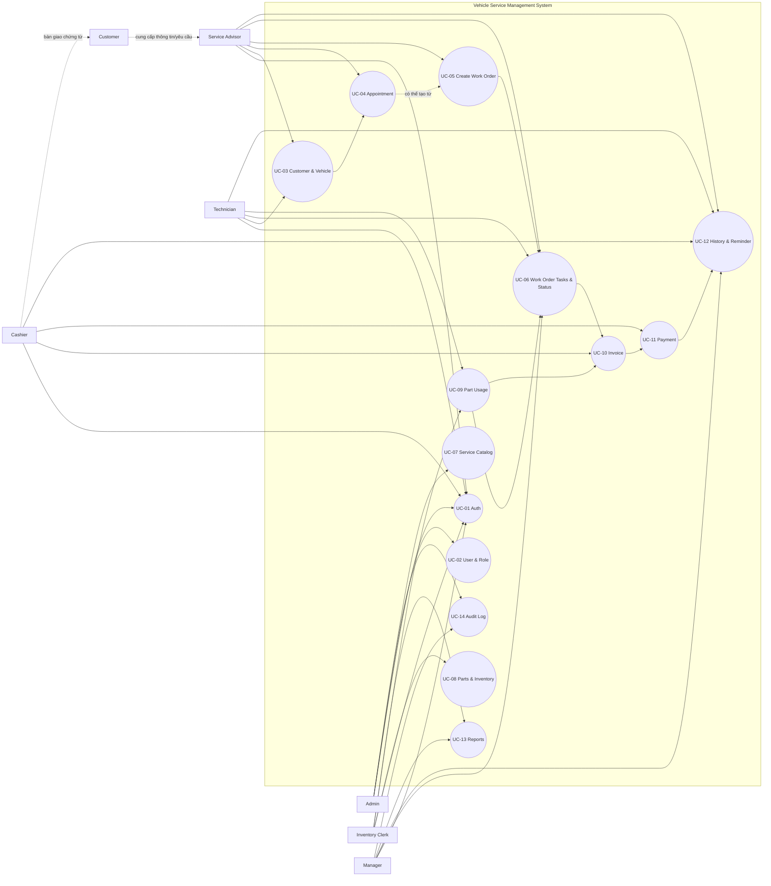

#### 2.1.5 Đặc tả use case trọng yếu
**UC-04 - Quản lý lịch hẹn dịch vụ**

| Thuộc tính | Nội dung |
|---|---|
| Actor chính | Service Advisor |
| Actor phụ | Customer, Manager |
| Mục tiêu | Ghi nhận lịch hẹn bảo dưỡng/sửa chữa để garage chủ động tiếp nhận và điều phối nguồn lực |
| Tiền điều kiện | Service Advisor đã đăng nhập; thông tin khách hàng và phương tiện đã có hoặc được tạo mới trong quá trình đặt lịch |
| Hậu điều kiện | Lịch hẹn được tạo/cập nhật/hủy với trạng thái rõ ràng; thông tin có thể dùng để tạo phiếu dịch vụ khi khách đến |
| Luồng chính | 1. Service Advisor tra cứu hoặc tạo hồ sơ khách hàng. 2. Service Advisor chọn phương tiện liên quan. 3. Service Advisor nhập thời gian hẹn, nhu cầu dịch vụ và ghi chú tiếp nhận. 4. Hệ thống kiểm tra dữ liệu bắt buộc và lưu lịch hẹn. 5. Hệ thống hiển thị lịch hẹn trong danh sách theo ngày/trạng thái. |
| Luồng ngoại lệ | Nếu thiếu thông tin khách hàng/phương tiện, hệ thống yêu cầu bổ sung trước khi lưu. Nếu lịch hẹn bị hủy, hệ thống ghi nhận lý do và không cho tạo phiếu dịch vụ trực tiếp từ lịch đã hủy. |
| Tiêu chí chấp nhận | Lịch hẹn có thể tạo, sửa, hủy và tra cứu; mỗi lịch hẹn liên kết được với khách hàng/phương tiện; lịch hẹn hợp lệ có thể chuyển thành phiếu dịch vụ. |

**UC-05 - Tạo phiếu dịch vụ**

| Thuộc tính | Nội dung |
|---|---|
| Actor chính | Service Advisor |
| Actor phụ | Customer, Technician |
| Mục tiêu | Khởi tạo work order làm trung tâm điều phối toàn bộ quá trình xử lý xe |
| Tiền điều kiện | Service Advisor đã đăng nhập; khách hàng và phương tiện đã được xác định; xe được tiếp nhận trực tiếp hoặc có lịch hẹn hợp lệ |
| Hậu điều kiện | Phiếu dịch vụ được tạo ở trạng thái tiếp nhận, có thông tin khách hàng, phương tiện, nhu cầu xử lý và danh sách hạng mục ban đầu |
| Luồng chính | 1. Service Advisor chọn lịch hẹn hoặc tạo phiếu tiếp nhận trực tiếp. 2. Hệ thống nạp thông tin khách hàng/phương tiện liên quan. 3. Service Advisor nhập triệu chứng, yêu cầu dịch vụ, ghi chú và hạng mục dự kiến. 4. Hệ thống tạo mã phiếu dịch vụ và trạng thái ban đầu. 5. Technician có thể xem phiếu để bắt đầu xử lý kỹ thuật. |
| Luồng ngoại lệ | Nếu phương tiện chưa tồn tại, Service Advisor phải tạo hồ sơ phương tiện trước. Nếu dữ liệu bắt buộc chưa đủ, hệ thống không cho tạo phiếu và hiển thị lỗi kiểm tra hợp lệ. |
| Tiêu chí chấp nhận | Phiếu dịch vụ được tạo từ lịch hẹn hoặc tiếp nhận trực tiếp; phiếu có trạng thái ban đầu; các vai trò được phân quyền có thể tra cứu phiếu sau khi tạo. |

**UC-06 - Quản lý hạng mục và trạng thái phiếu dịch vụ**

| Thuộc tính | Nội dung |
|---|---|
| Actor chính | Service Advisor, Technician |
| Actor phụ | Manager |
| Mục tiêu | Ghi nhận nội dung công việc, công sửa chữa và tiến độ xử lý xe theo các trạng thái nghiệp vụ thống nhất |
| Tiền điều kiện | Phiếu dịch vụ đã tồn tại; người dùng có quyền cập nhật trạng thái theo vai trò |
| Hậu điều kiện | Hạng mục công việc và trạng thái phiếu dịch vụ được cập nhật đúng luồng; lịch sử thao tác quan trọng được ghi nhận |
| Luồng chính | 1. Người dùng mở phiếu dịch vụ cần cập nhật. 2. Hệ thống hiển thị danh sách hạng mục, trạng thái hiện tại và trạng thái kế tiếp hợp lệ. 3. Người dùng thêm/cập nhật hạng mục công việc hoặc ghi chú kỹ thuật. 4. Người dùng chọn trạng thái mới nếu đủ điều kiện. 5. Hệ thống kiểm tra quyền, lưu thay đổi và cập nhật danh sách theo dõi vận hành. |
| Luồng ngoại lệ | Nếu thiếu xác nhận phụ tùng hoặc hạng mục công việc chưa hoàn tất, hệ thống có thể không cho chuyển sang hoàn tất. Nếu người dùng không có quyền chốt trạng thái cuối, hệ thống từ chối thao tác. |
| Tiêu chí chấp nhận | Hạng mục công việc có thể được ghi nhận/cập nhật; chỉ trạng thái hợp lệ được phép chọn; Technician cập nhật được trạng thái kỹ thuật; Manager/Admin có thể xem và kiểm tra lịch sử trạng thái. |

**UC-09 - Ghi nhận phụ tùng sử dụng cho phiếu dịch vụ**

| Thuộc tính | Nội dung |
|---|---|
| Actor chính | Technician, Inventory Clerk |
| Actor phụ | Service Advisor |
| Mục tiêu | Bảo đảm phụ tùng dùng trong quá trình sửa chữa được ghi nhận vào phiếu dịch vụ và phản ánh đúng tồn kho |
| Tiền điều kiện | Phiếu dịch vụ đang ở trạng thái xử lý; phụ tùng tồn tại trong danh mục; số lượng yêu cầu lớn hơn 0 |
| Hậu điều kiện | Phụ tùng được liên kết với phiếu dịch vụ; tồn kho được trừ theo giao dịch hợp lệ; dữ liệu sẵn sàng để tính hóa đơn |
| Luồng chính | 1. Technician hoặc Service Advisor ghi nhận nhu cầu sử dụng phụ tùng trên phiếu. 2. Inventory Clerk kiểm tra tồn kho và xác nhận xuất. 3. Hệ thống kiểm tra số lượng tồn khả dụng. 4. Hệ thống tạo giao dịch xuất kho và liên kết phụ tùng với phiếu dịch vụ. 5. Hệ thống cập nhật tồn kho còn lại. |
| Luồng ngoại lệ | Nếu tồn kho không đủ, hệ thống cảnh báo và không trừ tồn vượt số lượng khả dụng. Nếu phiếu dịch vụ đã chốt hóa đơn, hệ thống không cho thêm phụ tùng mới vào phiếu. |
| Tiêu chí chấp nhận | Mỗi phụ tùng dùng cho phiếu có số lượng, đơn giá snapshot và người xác nhận; tồn kho không âm; dữ liệu phụ tùng xuất hiện trong hóa đơn liên quan. |

**UC-10 - Lập hóa đơn từ phiếu dịch vụ**

| Thuộc tính | Nội dung |
|---|---|
| Actor chính | Cashier |
| Actor phụ | Service Advisor, Customer |
| Mục tiêu | Tạo hóa đơn chính xác từ dịch vụ và phụ tùng đã xác nhận trong phiếu dịch vụ |
| Tiền điều kiện | Phiếu dịch vụ đã có hạng mục tính tiền; các phụ tùng sử dụng đã được xác nhận; Cashier đã đăng nhập |
| Hậu điều kiện | Hóa đơn được tạo với snapshot đơn giá, tổng tiền và trạng thái thanh toán ban đầu |
| Luồng chính | 1. Cashier chọn phiếu dịch vụ cần lập hóa đơn. 2. Hệ thống tổng hợp hạng mục dịch vụ, công thợ và phụ tùng đã xác nhận. 3. Hệ thống tính tổng tiền theo đơn giá tại thời điểm lập hóa đơn. 4. Cashier kiểm tra thông tin khách hàng và thông tin xuất hóa đơn nếu là khách doanh nghiệp. 5. Cashier xác nhận tạo hóa đơn. |
| Luồng ngoại lệ | Nếu phiếu dịch vụ chưa đủ điều kiện lập hóa đơn, hệ thống cảnh báo nguyên nhân. Nếu hóa đơn đã tồn tại cho phiếu, hệ thống không tạo trùng hóa đơn đang hiệu lực. |
| Tiêu chí chấp nhận | Hóa đơn phản ánh đúng hạng mục đã xác nhận; đơn giá được snapshot; hóa đơn liên kết duy nhất với phiếu dịch vụ trong phạm vi nghiệp vụ chốt bill. |

**UC-11 - Ghi nhận thanh toán**

| Thuộc tính | Nội dung |
|---|---|
| Actor chính | Cashier |
| Actor phụ | Customer, Manager |
| Mục tiêu | Ghi nhận số tiền khách đã thanh toán và cập nhật trạng thái hóa đơn minh bạch |
| Tiền điều kiện | Hóa đơn đã được tạo; Cashier có quyền ghi nhận thanh toán |
| Hậu điều kiện | Giao dịch thanh toán được lưu; trạng thái hóa đơn chuyển thành chưa thanh toán, thanh toán một phần hoặc đã thanh toán tùy số tiền |
| Luồng chính | 1. Cashier mở hóa đơn cần thu tiền. 2. Hệ thống hiển thị tổng tiền, số đã thanh toán và số còn lại. 3. Cashier nhập số tiền, phương thức thanh toán và ghi chú nếu có. 4. Hệ thống kiểm tra số tiền hợp lệ. 5. Hệ thống lưu giao dịch thanh toán và cập nhật trạng thái hóa đơn. |
| Luồng ngoại lệ | Nếu số tiền không hợp lệ hoặc vượt quá chính sách cho phép, hệ thống từ chối ghi nhận. Nếu hóa đơn đã hủy/chốt ngoài phạm vi thanh toán, hệ thống không cho cập nhật. |
| Tiêu chí chấp nhận | Thanh toán được ghi nhận theo từng lần; trạng thái hóa đơn phản ánh đúng tổng số đã thu; dữ liệu có thể dùng cho báo cáo doanh thu. |

#### 2.1.6 Quan hệ truy vết giữa use case và yêu cầu chức năng
| FR | Use case đáp ứng | Ghi chú truy vết |
|---|---|---|
| FR-01 | UC-01 | Điều kiện truy cập cho toàn bộ vai trò nội bộ |
| FR-02 | UC-02 | Gắn với RBAC và quản trị tài khoản |
| FR-03, FR-04 | UC-03 | Bao gồm khách cá nhân/doanh nghiệp và thông tin xuất hóa đơn |
| FR-05 | UC-03 | Quản lý xe và ràng buộc biển số duy nhất |
| FR-06 | UC-04 | Quản lý lịch hẹn trước khi tạo work order |
| FR-07 | UC-05 | Tạo work order từ lịch hẹn hoặc tiếp nhận trực tiếp |
| FR-08 | UC-06 | Quản lý hạng mục công việc trong phiếu |
| FR-09 | UC-06 | Cập nhật trạng thái theo vòng đời xử lý |
| FR-10 | UC-07 | Danh mục dịch vụ nền |
| FR-11 | UC-08 | Danh mục phụ tùng nền |
| FR-12 | UC-08 | Giao dịch nhập/xuất/điều chỉnh kho |
| FR-13 | UC-09 | Phụ tùng sử dụng theo phiếu và trừ tồn |
| FR-14 | UC-10 | Lập hóa đơn từ phiếu dịch vụ |
| FR-15 | UC-11 | Ghi nhận thanh toán và trạng thái thanh toán |
| FR-16 | UC-12 | Tra cứu lịch sử theo khách hàng/phương tiện |
| FR-17 | UC-12 | Quản lý danh sách nhắc lịch |
| FR-18 | UC-13 | Báo cáo cơ bản cho vận hành |
| FR-19 | UC-14 | Nhật ký thao tác quan trọng |

#### 2.1.7 Kết luận use case
Nhóm 14 use case trên bao phủ đầy đủ 19 yêu cầu chức năng MVP nhưng được gom theo mục tiêu nghiệp vụ thay vì tách nhỏ theo từng FR. Cách tổ chức này phản ánh đúng luồng vận hành chính của garage: xác thực người dùng, quản lý hồ sơ nền, tiếp nhận lịch hẹn, tạo và xử lý phiếu dịch vụ, quản lý phụ tùng, lập hóa đơn, thanh toán, tra cứu lịch sử, nhắc lịch, báo cáo và truy vết. Các use case trọng yếu như tạo phiếu dịch vụ, quản lý hạng mục/trạng thái, ghi nhận phụ tùng, lập hóa đơn và thanh toán sẽ là cơ sở trực tiếp cho Process Modeling, Data Modeling, Sequence Diagram và kiểm thử nghiệm thu ở các phần sau.

### 2.2 Process Modeling
#### 2.2.1 Mục tiêu mô hình hóa quy trình
Process Modeling được sử dụng để mô tả cách các nghiệp vụ chính di chuyển qua nhiều vai trò trong garage, từ thời điểm khách hàng đặt lịch hoặc mang xe đến cho đến khi hoàn tất thanh toán và lưu lịch sử dịch vụ. Khác với use case tập trung vào mục tiêu tương tác, mô hình quy trình nhấn mạnh thứ tự công việc, điểm quyết định, trách nhiệm của từng bộ phận, dữ liệu được tạo/cập nhật và các rủi ro vận hành có thể phát sinh.

Trong phạm vi MVP, ba quy trình được chọn để mô hình hóa chi tiết là:
- Quy trình tiếp nhận xe: liên quan trực tiếp đến Service Advisor, Customer và dữ liệu khách hàng/phương tiện/lịch hẹn.
- Quy trình xử lý work order: là luồng nghiệp vụ lõi, có phối hợp giữa Service Advisor, Technician, Inventory Clerk và hệ thống.
- Quy trình lập hóa đơn/thanh toán: là điểm chốt doanh thu, liên quan đến Cashier, Customer, dữ liệu phiếu dịch vụ, phụ tùng và trạng thái thanh toán.

Ba quy trình này bao phủ các use case trọng yếu UC-03 đến UC-12 và là cơ sở để xác định entity, state transition, sequence diagram và kịch bản kiểm thử tích hợp ở các phần sau.

#### 2.2.2 Ký hiệu sử dụng trong sơ đồ quy trình
| Ký hiệu | Ý nghĩa |
|---|---|
| Nút bắt đầu/kết thúc | Điểm kích hoạt hoặc kết thúc của quy trình |
| Hành động | Công việc do actor hoặc hệ thống thực hiện |
| Điểm quyết định | Nhánh điều kiện nghiệp vụ cần kiểm tra trước khi đi tiếp |
| Swimlane | Nhóm trách nhiệm theo actor hoặc hệ thống |
| Mũi tên nét đứt | Quan hệ tham chiếu, thông báo hoặc dữ liệu hỗ trợ |

Các sơ đồ dưới đây dùng Mermaid flowchart để biểu diễn swimlane ở mức phân tích nghiệp vụ. Tên hành động được viết bằng động từ nhằm thể hiện rõ trách nhiệm xử lý.

#### 2.2.3 Quy trình tiếp nhận xe
**Mục đích:** Chuẩn hóa việc ghi nhận thông tin khách hàng, phương tiện, nhu cầu dịch vụ và chuyển đổi từ lịch hẹn sang phiếu dịch vụ khi xe vào garage. Quy trình này giảm nhập liệu lặp, hạn chế thiếu thông tin đầu vào cho kỹ thuật viên và bảo đảm mỗi xe được xử lý trên một phiếu dịch vụ rõ ràng.

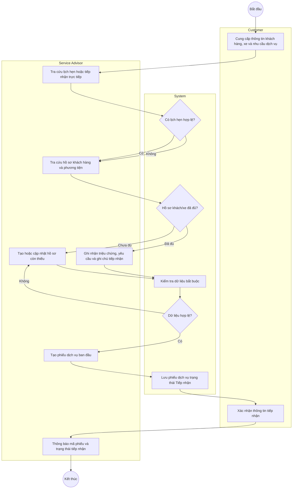

**Đặc điểm và chú thích quy trình**
| Nhóm phân tích | Nội dung |
|---|---|
| Use case liên quan | UC-03, UC-04, UC-05 |
| Dữ liệu đầu vào | Thông tin khách hàng, loại khách hàng, thông tin xuất hóa đơn doanh nghiệp nếu có, biển số xe, thông tin xe, lịch hẹn, triệu chứng/yêu cầu dịch vụ |
| Dữ liệu tạo/cập nhật | Customer, Vehicle, Appointment status, Work Order trạng thái `Tiếp nhận` |
| Quy tắc nghiệp vụ | Biển số phương tiện phải duy nhất; phiếu dịch vụ chỉ được tạo khi có khách hàng và phương tiện hợp lệ; lịch hẹn đã hủy không được chuyển trực tiếp thành phiếu dịch vụ |
| Điểm nghẽn/rủi ro | Thiếu thông tin xe hoặc thông tin xuất hóa đơn doanh nghiệp làm chậm bước lập hóa đơn về sau; nhập sai biển số có thể làm lệch lịch sử bảo dưỡng |
| Yêu cầu thời gian tham chiếu | Tra cứu hồ sơ khách hàng/phương tiện cần đáp ứng mục tiêu không quá 10 giây theo chỉ số thành công đã nêu ở Vision |

#### 2.2.4 Quy trình xử lý work order
**Mục đích:** Mô tả luồng xử lý kỹ thuật từ khi phiếu dịch vụ được tạo đến khi đủ điều kiện hoàn tất. Quy trình này có nhiều điểm phối hợp chéo giữa kỹ thuật viên và thủ kho, đặc biệt khi cần phụ tùng. Đây là quy trình lõi quyết định chất lượng dịch vụ, độ chính xác tồn kho và tính đúng của hóa đơn.

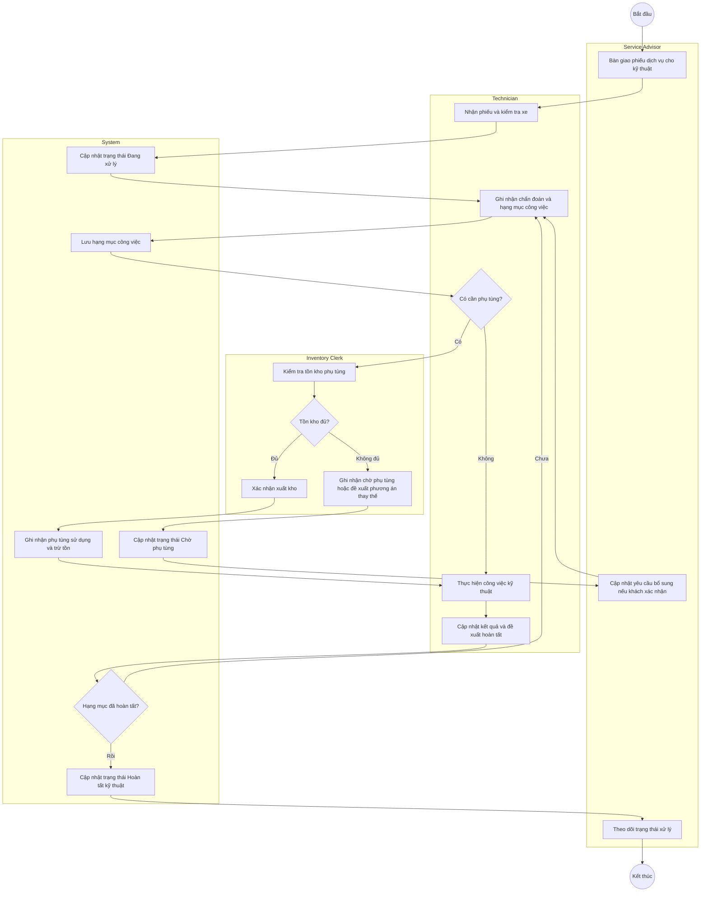

**Đặc điểm và chú thích quy trình**
| Nhóm phân tích | Nội dung |
|---|---|
| Use case liên quan | UC-06, UC-08, UC-09 |
| Dữ liệu đầu vào | Work Order, danh mục dịch vụ, danh mục phụ tùng, tồn kho khả dụng, ghi chú kỹ thuật |
| Dữ liệu tạo/cập nhật | Work Order Item, Part Usage, Inventory Transaction, Work Order Status |
| Quy tắc nghiệp vụ | Không được trừ tồn vượt số lượng khả dụng; phụ tùng đã xác nhận sử dụng phải xuất hiện trong dữ liệu lập hóa đơn; chỉ vai trò được phân quyền mới được cập nhật trạng thái tương ứng |
| Điểm nghẽn/rủi ro | Thiếu phụ tùng làm phiếu chuyển sang trạng thái chờ; cập nhật trạng thái không kịp thời làm quản lý khó theo dõi tiến độ; phụ tùng ghi nhận sai gây lệch tồn kho và hóa đơn |
| Yêu cầu thời gian tham chiếu | Cập nhật trạng thái và ghi nhận phụ tùng cần phản ánh gần thời gian thực để giảm độ trễ giữa kỹ thuật, kho và thu ngân |

#### 2.2.5 Quy trình lập hóa đơn và thanh toán
**Mục đích:** Mô tả cách hệ thống chuyển dữ liệu đã xác nhận từ phiếu dịch vụ thành hóa đơn và ghi nhận thanh toán. Quy trình này là điểm đối soát giữa dữ liệu kỹ thuật, phụ tùng, thông tin khách hàng và doanh thu, do đó cần kiểm soát chặt việc lập hóa đơn trùng, thiếu hạng mục hoặc sai trạng thái thanh toán.

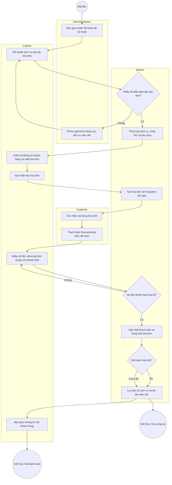

**Đặc điểm và chú thích quy trình**
| Nhóm phân tích | Nội dung |
|---|---|
| Use case liên quan | UC-10, UC-11, UC-12, UC-13 |
| Dữ liệu đầu vào | Phiếu dịch vụ đã hoàn tất kỹ thuật, hạng mục dịch vụ, phụ tùng đã xác nhận, thông tin khách hàng, thông tin xuất hóa đơn doanh nghiệp nếu có |
| Dữ liệu tạo/cập nhật | Invoice, Invoice Item, Payment, Payment Status, Maintenance History, dữ liệu báo cáo doanh thu |
| Quy tắc nghiệp vụ | Hóa đơn phải lấy snapshot đơn giá tại thời điểm chốt bill; không tạo trùng hóa đơn đang hiệu lực cho cùng phiếu dịch vụ; trạng thái thanh toán phản ánh đúng tổng số tiền đã thu |
| Điểm nghẽn/rủi ro | Phiếu dịch vụ thiếu phụ tùng hoặc hạng mục chưa xác nhận sẽ làm chậm lập hóa đơn; thông tin doanh nghiệp thiếu mã số thuế/địa chỉ gây lỗi chứng từ; ghi nhận thanh toán sai ảnh hưởng báo cáo doanh thu |
| Yêu cầu thời gian tham chiếu | Tổng hợp hóa đơn và cập nhật thanh toán cần đủ nhanh cho thao tác tại quầy, đồng thời đảm bảo tính nhất quán với dữ liệu phiếu dịch vụ và kho |

#### 2.2.6 Ghi chú xác thực quy trình
Các quy trình trên được xây dựng từ Vision, Stakeholder, System Context và Use Case đã chốt trong phạm vi MVP. Do dự án đang ở giai đoạn phân tích, bước xác thực thực tế với người dùng nghiệp vụ sẽ được thực hiện trong giai đoạn rà soát tiếp theo với các vai trò đại diện: Service Advisor, Technician, Inventory Clerk, Cashier và Manager. Nội dung cần xác nhận gồm tính đúng của trạng thái phiếu dịch vụ, điểm bàn giao giữa kỹ thuật và kho, điều kiện đủ để lập hóa đơn, cũng như các trường hợp ngoại lệ thường gặp như thiếu phụ tùng, khách bổ sung yêu cầu hoặc thanh toán một phần.

### 2.3 Data Modeling
#### 2.3.1 Mục tiêu mô hình hóa dữ liệu
Data Modeling nhằm xác định các khái niệm nghiệp vụ quan trọng mà Vehicle Service Management System cần quản lý, cùng quan hệ giữa chúng. Mô hình ở mục này là mô hình khái niệm, tập trung vào bản chất nghiệp vụ thay vì chi tiết triển khai vật lý như kiểu dữ liệu cụ thể, index hay cấu trúc bảng tối ưu.

Dữ liệu được rút ra từ các use case ở mục 2.1 và các quy trình ở mục 2.2, đặc biệt là ba luồng tiếp nhận xe, xử lý work order và lập hóa đơn/thanh toán. Mục tiêu là bảo đảm hệ thống có nền tảng dữ liệu đủ để hỗ trợ quản lý khách hàng, phương tiện, lịch hẹn, phiếu dịch vụ, phụ tùng, hóa đơn, thanh toán, lịch sử bảo dưỡng, nhắc lịch và truy vết thao tác.

#### 2.3.2 Danh mục entity khái niệm
| Entity | Định nghĩa | Loại | Thuộc tính chính mức khái niệm | Ví dụ |
|---|---|---|---|---|
| UserAccount | Tài khoản người dùng nội bộ của garage | Core | User ID, họ tên, email/tên đăng nhập, vai trò, trạng thái | Cố vấn dịch vụ, kỹ thuật viên, thu ngân |
| Customer | Khách hàng sử dụng dịch vụ garage | Core | Customer ID, tên, số điện thoại, loại khách hàng, thông tin xuất hóa đơn | Khách cá nhân, khách doanh nghiệp |
| Vehicle | Phương tiện thuộc khách hàng | Core | Vehicle ID, biển số, hãng xe, dòng xe, năm sản xuất | 51A-12345, Toyota Vios |
| Appointment | Lịch hẹn dịch vụ trước khi xe vào garage | Core | Appointment ID, thời gian hẹn, nhu cầu dịch vụ, trạng thái, ghi chú | Lịch thay dầu 9:00 |
| WorkOrder | Phiếu dịch vụ điều phối toàn bộ quá trình xử lý xe | Core | Work Order ID, mã phiếu, trạng thái, ngày tiếp nhận, ghi chú | WO-2026-0001 |
| WorkOrderItem | Hạng mục công việc/dịch vụ trong phiếu dịch vụ | Associative | Item ID, mô tả công việc, số lượng/công, đơn giá snapshot, trạng thái | Thay dầu máy, kiểm tra phanh |
| Service | Danh mục dịch vụ chuẩn của garage | Reference | Service ID, tên dịch vụ, giá chuẩn, trạng thái sử dụng | Thay dầu, cân chỉnh thước lái |
| Part | Danh mục phụ tùng và tồn kho hiện tại | Core/Reference | Part ID, mã phụ tùng, tên phụ tùng, đơn vị tính, tồn kho, giá chuẩn | Lọc dầu, bugi |
| InventoryTransaction | Giao dịch nhập, xuất hoặc điều chỉnh tồn kho | Core | Transaction ID, loại giao dịch, số lượng, thời điểm, lý do | Nhập kho, xuất theo phiếu |
| PartUsage | Phụ tùng đã sử dụng cho phiếu dịch vụ | Associative | Usage ID, số lượng, đơn giá snapshot, trạng thái xác nhận | 1 lọc dầu dùng cho WO-2026-0001 |
| Invoice | Hóa đơn được lập từ phiếu dịch vụ | Core | Invoice ID, mã hóa đơn, ngày lập, tổng tiền, trạng thái thanh toán | INV-2026-0001 |
| InvoiceLine | Dòng chi tiết hóa đơn | Associative | Line ID, loại dòng, mô tả, số lượng, đơn giá snapshot, thành tiền | Công thay dầu, lọc dầu |
| Payment | Giao dịch thanh toán cho hóa đơn | Core | Payment ID, số tiền, phương thức, thời điểm, ghi chú | Tiền mặt, chuyển khoản |
| MaintenanceReminder | Nhắc lịch bảo dưỡng định kỳ | Core | Reminder ID, ngày cần nhắc, nội dung nhắc, trạng thái nhắc | Nhắc thay dầu sau 5.000 km |
| AuditLog | Nhật ký thao tác nghiệp vụ quan trọng | Core | Audit ID, hành động, đối tượng tác động, thời điểm, người thực hiện | Tạo hóa đơn, đổi trạng thái phiếu |

#### 2.3.3 Conceptual ERD
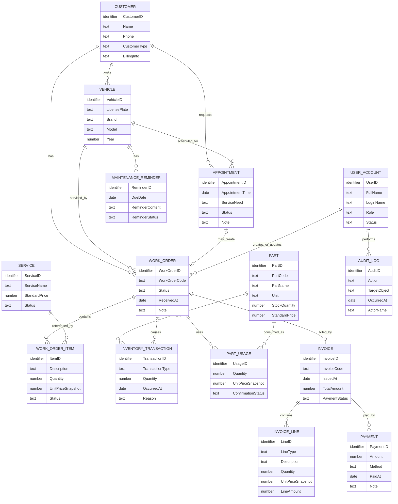

#### 2.3.4 Danh mục quan hệ chính
| Quan hệ | Cardinality | Ý nghĩa nghiệp vụ | Business rule |
|---|---|---|---|
| Customer - Vehicle | 1:N | Một khách hàng có thể sở hữu nhiều phương tiện; mỗi phương tiện thuộc một khách hàng tại thời điểm ghi nhận | BR-01 |
| Customer - Appointment | 1:N | Một khách hàng có thể có nhiều lịch hẹn dịch vụ | BR-02 |
| Vehicle - Appointment | 1:N | Một phương tiện có thể được đặt nhiều lịch hẹn theo thời gian | BR-02 |
| Appointment - WorkOrder | 0..1 : 0..1 | Một lịch hẹn hợp lệ có thể được chuyển thành một phiếu dịch vụ; tiếp nhận trực tiếp có thể không có lịch hẹn | BR-03 |
| Customer/Vehicle - WorkOrder | 1:N | Mỗi phiếu dịch vụ phải gắn với đúng một khách hàng và một phương tiện | BR-04 |
| WorkOrder - WorkOrderItem | 1:N | Một phiếu dịch vụ có thể chứa nhiều hạng mục công việc | BR-05 |
| Service - WorkOrderItem | 1:N | Một dịch vụ chuẩn có thể được tham chiếu bởi nhiều hạng mục công việc | BR-06 |
| WorkOrder - PartUsage | 1:N | Một phiếu dịch vụ có thể sử dụng nhiều loại phụ tùng | BR-07 |
| Part - PartUsage | 1:N | Một phụ tùng có thể xuất hiện trong nhiều lần sử dụng theo các phiếu khác nhau | BR-07 |
| Part - InventoryTransaction | 1:N | Mỗi giao dịch kho tác động đến một phụ tùng cụ thể | BR-08 |
| WorkOrder - Invoice | 1:0..1 | Một phiếu dịch vụ sau khi đủ điều kiện có thể lập tối đa một hóa đơn hiệu lực | BR-09 |
| Invoice - InvoiceLine | 1:N | Một hóa đơn gồm nhiều dòng chi tiết dịch vụ/phụ tùng | BR-10 |
| Invoice - Payment | 1:N | Một hóa đơn có thể có nhiều lần thanh toán | BR-11 |
| Vehicle - MaintenanceReminder | 1:N | Một phương tiện có thể có nhiều nhắc lịch bảo dưỡng theo thời gian | BR-12 |
| UserAccount - AuditLog | 1:N | Một người dùng nội bộ có thể tạo nhiều bản ghi audit log | BR-13 |

#### 2.3.5 Ràng buộc nghiệp vụ dữ liệu
| Mã rule | Loại | Nội dung rule | Entity/thuộc tính liên quan | Nguồn |
|---|---|---|---|---|
| BR-01 | Structural | Mỗi phương tiện phải thuộc một khách hàng; biển số phương tiện phải duy nhất trong hệ thống | Customer, Vehicle, LicensePlate | UC-03, quy trình tiếp nhận |
| BR-02 | Structural | Mỗi lịch hẹn phải gắn với một khách hàng và một phương tiện hợp lệ | Appointment, Customer, Vehicle | UC-04 |
| BR-03 | Procedural | Lịch hẹn đã hủy không được chuyển trực tiếp thành phiếu dịch vụ | Appointment, WorkOrder | UC-04, quy trình tiếp nhận |
| BR-04 | Structural | Mỗi phiếu dịch vụ phải có khách hàng, phương tiện, trạng thái và thời điểm tiếp nhận | WorkOrder, Customer, Vehicle | UC-05 |
| BR-05 | Procedural | Phiếu dịch vụ chỉ được chuyển sang hoàn tất kỹ thuật khi các hạng mục công việc bắt buộc đã được xử lý | WorkOrder, WorkOrderItem | UC-06, quy trình work order |
| BR-06 | Validation | Chỉ dịch vụ đang hoạt động mới được chọn làm hạng mục dịch vụ mới | Service, WorkOrderItem | UC-07 |
| BR-07 | Validation | Số lượng phụ tùng sử dụng phải lớn hơn 0 và không được làm tồn kho âm | Part, PartUsage, InventoryTransaction | UC-08, UC-09 |
| BR-08 | Procedural | Phụ tùng sử dụng cho phiếu dịch vụ phải tạo giao dịch xuất kho hoặc được xác nhận bởi vai trò có quyền | PartUsage, InventoryTransaction, UserAccount | UC-09 |
| BR-09 | Structural | Một phiếu dịch vụ chỉ có tối đa một hóa đơn hiệu lực tại thời điểm chốt bill | WorkOrder, Invoice | UC-10 |
| BR-10 | Derivation | Tổng tiền hóa đơn được tính từ tổng thành tiền các dòng hóa đơn | Invoice, InvoiceLine | UC-10 |
| BR-11 | Derivation | Trạng thái thanh toán của hóa đơn phụ thuộc vào tổng số tiền đã ghi nhận qua các giao dịch thanh toán | Invoice, Payment | UC-11 |
| BR-12 | Procedural | Lịch sử bảo dưỡng chỉ được ghi nhận từ phiếu dịch vụ đã có kết quả xử lý và dữ liệu hóa đơn/thanh toán liên quan | WorkOrder, Invoice, Vehicle | UC-12 |
| BR-13 | Procedural | Các thao tác quan trọng như tạo phiếu, đổi trạng thái, xuất phụ tùng, lập hóa đơn và ghi nhận thanh toán phải được ghi audit log | AuditLog, UserAccount | UC-14 |

#### 2.3.6 Giả định và câu hỏi mở
Mô hình dữ liệu hiện tại giả định garage vận hành một chi nhánh trong MVP, khách hàng có thể là cá nhân hoặc doanh nghiệp, và khách hàng chưa có tài khoản tự thao tác trên hệ thống. Thông tin vai trò người dùng được biểu diễn ở mức thuộc tính của UserAccount trong mô hình khái niệm; chi tiết RBAC sẽ được tách sâu hơn ở phần Security Design.

Một số điểm cần xác nhận thêm ở các bước sau gồm: cách xử lý trường hợp phương tiện đổi chủ, chính sách hủy hoặc điều chỉnh hóa đơn, mức chi tiết cần lưu cho lịch sử trạng thái phiếu dịch vụ, và quy tắc sinh nhắc lịch bảo dưỡng dựa trên thời gian, số km hoặc loại dịch vụ. Các chi tiết này chưa được cố định ở mô hình khái niệm để tránh khóa sớm vào thiết kế vật lý.

### 3.1 Functional Requirement
- [x] Chốt danh sách MVP FR-01..FR-19
#### 3.1.1 Mục tiêu đặc tả yêu cầu chức năng
Functional Requirement mô tả các hành vi bắt buộc mà hệ thống phải cung cấp để đáp ứng use case, quy trình và mô hình dữ liệu đã xác định. Mỗi yêu cầu được viết ở mức đủ rõ để phục vụ thiết kế, triển khai và kiểm thử, đồng thời vẫn tránh đi sâu vào quyết định kỹ thuật như API endpoint, cấu trúc bảng vật lý hoặc thư viện cụ thể.

Các yêu cầu dưới đây kế thừa danh sách MVP FR-01..FR-19 đã chốt. Mỗi yêu cầu bao gồm actor chính, điều kiện trước/sau, luồng xử lý chính, ngoại lệ tiêu biểu, acceptance criteria và truy vết đến use case/entity liên quan.

#### 3.1.2 Quy ước mức ưu tiên
| Mức ưu tiên | Ý nghĩa |
|---|---|
| Must | Bắt buộc có trong MVP để hoàn thành luồng nghiệp vụ chính |
| Should | Nên có trong MVP nếu không ảnh hưởng tiến độ lõi |
| Could | Có thể bổ sung sau khi các luồng lõi ổn định |

#### 3.1.3 Danh sách yêu cầu chức năng chi tiết
| FR | Tên yêu cầu | Actor chính | Priority | UC liên quan | Entity chính |
|---|---|---|---|---|---|
| FR-01 | Xác thực người dùng | Tất cả người dùng nội bộ | Must | UC-01 | UserAccount, AuditLog |
| FR-02 | Quản lý người dùng và phân quyền | Admin | Must | UC-02 | UserAccount, AuditLog |
| FR-03 | Quản lý khách hàng | Service Advisor | Must | UC-03 | Customer |
| FR-04 | Quản lý loại khách hàng và thông tin xuất hóa đơn | Service Advisor | Must | UC-03 | Customer, Invoice |
| FR-05 | Quản lý phương tiện | Service Advisor | Must | UC-03 | Vehicle, Customer |
| FR-06 | Quản lý lịch hẹn dịch vụ | Service Advisor | Must | UC-04 | Appointment |
| FR-07 | Tạo phiếu dịch vụ | Service Advisor | Must | UC-05 | WorkOrder |
| FR-08 | Quản lý hạng mục công việc | Service Advisor, Technician | Must | UC-06 | WorkOrderItem, Service |
| FR-09 | Quản lý trạng thái phiếu dịch vụ | Service Advisor, Technician, Manager | Must | UC-06 | WorkOrder, AuditLog |
| FR-10 | Quản lý danh mục dịch vụ | Admin | Should | UC-07 | Service |
| FR-11 | Quản lý danh mục phụ tùng | Inventory Clerk | Must | UC-08 | Part |
| FR-12 | Quản lý giao dịch kho | Inventory Clerk | Must | UC-08 | InventoryTransaction, Part |
| FR-13 | Ghi nhận phụ tùng sử dụng | Technician, Inventory Clerk | Must | UC-09 | PartUsage, InventoryTransaction |
| FR-14 | Lập hóa đơn từ phiếu dịch vụ | Cashier | Must | UC-10 | Invoice, InvoiceLine |
| FR-15 | Ghi nhận thanh toán | Cashier | Must | UC-11 | Payment, Invoice |
| FR-16 | Tra cứu lịch sử bảo dưỡng/sửa chữa | Người dùng nội bộ | Must | UC-12 | WorkOrder, Invoice, Vehicle |
| FR-17 | Nhắc lịch bảo dưỡng định kỳ | Service Advisor | Should | UC-12 | MaintenanceReminder |
| FR-18 | Báo cáo cơ bản | Manager | Must | UC-13 | Invoice, WorkOrder, Part, Service |
| FR-19 | Nhật ký thao tác nghiệp vụ | Manager, Admin | Must | UC-14 | AuditLog |

**FR-01 - Xác thực người dùng**

| Thành phần | Nội dung |
|---|---|
| Requirement statement | The system shall allow internal users to log in, log out, refresh session and change password using valid account credentials. |
| Actor chính | Tất cả người dùng nội bộ |
| Tiền điều kiện | Tài khoản đã tồn tại và đang hoạt động |
| Hậu điều kiện | Phiên đăng nhập hợp lệ được tạo hoặc kết thúc; thao tác quan trọng được ghi nhận khi cần |
| Luồng chính | 1. Người dùng nhập thông tin đăng nhập. 2. Hệ thống kiểm tra tài khoản và mật khẩu. 3. Hệ thống tạo phiên truy cập hợp lệ. 4. Người dùng có thể đăng xuất hoặc đổi mật khẩu theo quyền cá nhân. |
| Ngoại lệ | Từ chối đăng nhập khi thông tin sai, tài khoản bị khóa hoặc mật khẩu mới không đạt chính sách tối thiểu |
| Acceptance criteria | Given tài khoản hợp lệ, when người dùng đăng nhập đúng thông tin, then hệ thống cho phép truy cập theo vai trò. Given thông tin đăng nhập sai, when người dùng gửi yêu cầu, then hệ thống từ chối và không tạo phiên. |
| Business rule | BR-13 |

**FR-02 - Quản lý người dùng và phân quyền**

| Thành phần | Nội dung |
|---|---|
| Requirement statement | The system shall allow Admin to create, view, update, deactivate and assign roles to internal user accounts. |
| Actor chính | Admin |
| Tiền điều kiện | Admin đã đăng nhập và có quyền quản trị người dùng |
| Hậu điều kiện | Tài khoản người dùng và vai trò được cập nhật nhất quán |
| Luồng chính | 1. Admin mở danh sách người dùng. 2. Admin tạo hoặc cập nhật thông tin tài khoản. 3. Admin gán vai trò phù hợp. 4. Hệ thống lưu thay đổi và áp dụng quyền tương ứng. |
| Ngoại lệ | Không cho gán vai trò không tồn tại; không cho người không có quyền thay đổi quyền hệ thống |
| Acceptance criteria | Given Admin hợp lệ, when tạo tài khoản với dữ liệu bắt buộc, then hệ thống lưu tài khoản ở trạng thái hoạt động. Given người dùng không phải Admin, when truy cập chức năng phân quyền, then hệ thống từ chối thao tác. |
| Business rule | BR-13 |

**FR-03 - Quản lý khách hàng**

| Thành phần | Nội dung |
|---|---|
| Requirement statement | The system shall allow authorized users to create, view, update and search customer profiles. |
| Actor chính | Service Advisor |
| Tiền điều kiện | Người dùng đã đăng nhập và có quyền quản lý khách hàng |
| Hậu điều kiện | Hồ sơ khách hàng được lưu hoặc cập nhật để phục vụ lịch hẹn, phiếu dịch vụ và hóa đơn |
| Luồng chính | 1. Service Advisor nhập hoặc tìm kiếm thông tin khách hàng. 2. Hệ thống hiển thị kết quả phù hợp. 3. Service Advisor tạo mới hoặc cập nhật hồ sơ. 4. Hệ thống lưu dữ liệu khách hàng. |
| Ngoại lệ | Cảnh báo khi thiếu tên hoặc thông tin liên hệ chính; tránh tạo trùng hồ sơ rõ ràng theo số điện thoại nếu phát hiện được |
| Acceptance criteria | Given dữ liệu khách hàng hợp lệ, when Service Advisor lưu hồ sơ, then hệ thống tạo/cập nhật Customer. Given từ khóa tìm kiếm hợp lệ, when tìm kiếm, then hệ thống trả về danh sách khách hàng phù hợp. |
| Business rule | BR-01, BR-02 |

**FR-04 - Quản lý loại khách hàng và thông tin xuất hóa đơn**

| Thành phần | Nội dung |
|---|---|
| Requirement statement | The system shall support individual and corporate customer types and store corporate billing information when applicable. |
| Actor chính | Service Advisor, Cashier |
| Tiền điều kiện | Hồ sơ khách hàng tồn tại |
| Hậu điều kiện | Thông tin xuất hóa đơn được dùng khi lập hóa đơn cho khách doanh nghiệp |
| Luồng chính | 1. Người dùng chọn loại khách hàng. 2. Nếu là doanh nghiệp, người dùng nhập tên công ty, mã số thuế và địa chỉ xuất hóa đơn. 3. Hệ thống lưu thông tin vào hồ sơ khách hàng. |
| Ngoại lệ | Không cho lưu khách doanh nghiệp nếu thiếu thông tin xuất hóa đơn bắt buộc theo phạm vi nghiệp vụ |
| Acceptance criteria | Given khách hàng doanh nghiệp, when thiếu mã số thuế hoặc địa chỉ, then hệ thống yêu cầu bổ sung. Given thông tin doanh nghiệp đầy đủ, when lập hóa đơn, then hệ thống hiển thị thông tin xuất hóa đơn tương ứng. |
| Business rule | BR-10 |

**FR-05 - Quản lý phương tiện**

| Thành phần | Nội dung |
|---|---|
| Requirement statement | The system shall allow authorized users to create, view, update and search vehicle profiles with unique license plate. |
| Actor chính | Service Advisor |
| Tiền điều kiện | Khách hàng sở hữu phương tiện đã tồn tại hoặc được tạo trong quá trình tiếp nhận |
| Hậu điều kiện | Phương tiện được liên kết với khách hàng và có thể dùng trong lịch hẹn/phiếu dịch vụ |
| Luồng chính | 1. Service Advisor nhập biển số và thông tin xe. 2. Hệ thống kiểm tra trùng biển số. 3. Service Advisor liên kết xe với khách hàng. 4. Hệ thống lưu hồ sơ phương tiện. |
| Ngoại lệ | Từ chối tạo mới khi biển số đã tồn tại; yêu cầu chọn khách hàng sở hữu xe |
| Acceptance criteria | Given biển số chưa tồn tại, when lưu phương tiện, then hệ thống tạo Vehicle liên kết Customer. Given biển số đã tồn tại, when tạo mới, then hệ thống cảnh báo trùng và không tạo bản ghi mới. |
| Business rule | BR-01 |

**FR-06 - Quản lý lịch hẹn dịch vụ**

| Thành phần | Nội dung |
|---|---|
| Requirement statement | The system shall allow Service Advisor to create, view, update and cancel service appointments. |
| Actor chính | Service Advisor |
| Tiền điều kiện | Khách hàng và phương tiện hợp lệ đã được xác định |
| Hậu điều kiện | Lịch hẹn được lưu với trạng thái rõ ràng và có thể dùng để tạo phiếu dịch vụ khi hợp lệ |
| Luồng chính | 1. Service Advisor chọn khách hàng và xe. 2. Service Advisor nhập thời gian hẹn, nhu cầu dịch vụ và ghi chú. 3. Hệ thống lưu lịch hẹn. 4. Service Advisor có thể sửa hoặc hủy lịch khi cần. |
| Ngoại lệ | Lịch hẹn đã hủy không được chuyển trực tiếp thành phiếu dịch vụ |
| Acceptance criteria | Given hồ sơ khách/xe hợp lệ, when tạo lịch hẹn, then hệ thống lưu Appointment. Given lịch hẹn đã hủy, when tạo phiếu từ lịch đó, then hệ thống từ chối thao tác. |
| Business rule | BR-02, BR-03 |

**FR-07 - Tạo phiếu dịch vụ**

| Thành phần | Nội dung |
|---|---|
| Requirement statement | The system shall allow Service Advisor to create a work order from a valid appointment or direct vehicle reception. |
| Actor chính | Service Advisor |
| Tiền điều kiện | Khách hàng và phương tiện hợp lệ; lịch hẹn hợp lệ nếu tạo từ lịch hẹn |
| Hậu điều kiện | Phiếu dịch vụ được tạo ở trạng thái tiếp nhận |
| Luồng chính | 1. Service Advisor chọn lịch hẹn hoặc tiếp nhận trực tiếp. 2. Hệ thống nạp thông tin khách hàng/phương tiện. 3. Service Advisor nhập triệu chứng và yêu cầu dịch vụ. 4. Hệ thống tạo WorkOrder với mã phiếu và trạng thái ban đầu. |
| Ngoại lệ | Không tạo phiếu nếu thiếu khách hàng, phương tiện hoặc dữ liệu tiếp nhận bắt buộc |
| Acceptance criteria | Given dữ liệu tiếp nhận hợp lệ, when tạo phiếu, then hệ thống lưu WorkOrder trạng thái `Tiếp nhận`. Given thiếu phương tiện, when tạo phiếu, then hệ thống yêu cầu bổ sung Vehicle. |
| Business rule | BR-04 |

**FR-08 - Quản lý hạng mục công việc trong phiếu dịch vụ**

| Thành phần | Nội dung |
|---|---|
| Requirement statement | The system shall allow authorized users to add, view and update work order items for services, labor and repair tasks. |
| Actor chính | Service Advisor, Technician |
| Tiền điều kiện | Phiếu dịch vụ đã tồn tại và chưa chốt hóa đơn |
| Hậu điều kiện | Hạng mục công việc được ghi nhận để theo dõi xử lý và lập hóa đơn |
| Luồng chính | 1. Người dùng mở phiếu dịch vụ. 2. Người dùng thêm hoặc cập nhật hạng mục công việc. 3. Hệ thống lưu mô tả, số lượng/công và đơn giá snapshot nếu cần tính tiền. |
| Ngoại lệ | Không cho thêm hạng mục mới khi phiếu đã chốt hóa đơn |
| Acceptance criteria | Given phiếu chưa chốt hóa đơn, when thêm hạng mục hợp lệ, then hệ thống lưu WorkOrderItem. Given phiếu đã chốt hóa đơn, when thêm hạng mục, then hệ thống từ chối. |
| Business rule | BR-05, BR-06 |

**FR-09 - Quản lý trạng thái phiếu dịch vụ**

| Thành phần | Nội dung |
|---|---|
| Requirement statement | The system shall manage work order status transitions across reception, in progress, waiting for parts, completed and handed over states. |
| Actor chính | Service Advisor, Technician, Manager |
| Tiền điều kiện | Phiếu dịch vụ đã tồn tại; người dùng có quyền cập nhật trạng thái tương ứng |
| Hậu điều kiện | Trạng thái mới được lưu và thao tác quan trọng được ghi audit log |
| Luồng chính | 1. Người dùng mở phiếu dịch vụ. 2. Hệ thống hiển thị trạng thái hiện tại và trạng thái kế tiếp hợp lệ. 3. Người dùng chọn trạng thái mới. 4. Hệ thống kiểm tra điều kiện chuyển trạng thái. 5. Hệ thống lưu trạng thái mới. |
| Ngoại lệ | Không cho chuyển sang hoàn tất nếu hạng mục bắt buộc hoặc phụ tùng liên quan chưa xác nhận |
| Acceptance criteria | Given trạng thái kế tiếp hợp lệ, when người dùng có quyền cập nhật, then hệ thống lưu trạng thái mới. Given điều kiện hoàn tất chưa đạt, when chuyển sang hoàn tất, then hệ thống từ chối và giữ trạng thái cũ. |
| Business rule | BR-05, BR-13 |

**FR-10 - Quản lý danh mục dịch vụ**

| Thành phần | Nội dung |
|---|---|
| Requirement statement | The system shall allow authorized users to manage service catalog records including standard price and active status. |
| Actor chính | Admin |
| Tiền điều kiện | Người dùng có quyền quản lý danh mục dịch vụ |
| Hậu điều kiện | Dịch vụ chuẩn có thể được chọn khi tạo hạng mục công việc |
| Luồng chính | 1. Admin tạo hoặc cập nhật dịch vụ. 2. Admin nhập tên, giá chuẩn và trạng thái sử dụng. 3. Hệ thống lưu dịch vụ vào danh mục. |
| Ngoại lệ | Không cho chọn dịch vụ ngừng sử dụng cho hạng mục mới |
| Acceptance criteria | Given dịch vụ đang hoạt động, when tạo hạng mục công việc, then hệ thống cho phép chọn dịch vụ. Given dịch vụ ngừng sử dụng, when tạo hạng mục mới, then hệ thống không cho chọn. |
| Business rule | BR-06 |

**FR-11 - Quản lý danh mục phụ tùng**

| Thành phần | Nội dung |
|---|---|
| Requirement statement | The system shall allow authorized users to manage part catalog records including unit, standard price and current stock quantity. |
| Actor chính | Inventory Clerk |
| Tiền điều kiện | Người dùng có quyền quản lý phụ tùng |
| Hậu điều kiện | Phụ tùng có thể được tra cứu, xuất kho và ghi nhận vào phiếu dịch vụ |
| Luồng chính | 1. Inventory Clerk tạo hoặc cập nhật phụ tùng. 2. Hệ thống lưu mã, tên, đơn vị tính, giá chuẩn và tồn kho. 3. Người dùng có quyền có thể tra cứu phụ tùng. |
| Ngoại lệ | Cảnh báo khi mã phụ tùng bị trùng hoặc số lượng tồn không hợp lệ |
| Acceptance criteria | Given mã phụ tùng chưa tồn tại, when lưu phụ tùng, then hệ thống tạo Part. Given số lượng tồn âm, when lưu, then hệ thống từ chối. |
| Business rule | BR-07 |

**FR-12 - Quản lý giao dịch kho**

| Thành phần | Nội dung |
|---|---|
| Requirement statement | The system shall allow Inventory Clerk to record stock in, stock out and stock adjustment transactions. |
| Actor chính | Inventory Clerk |
| Tiền điều kiện | Phụ tùng tồn tại trong danh mục |
| Hậu điều kiện | Tồn kho phụ tùng được cập nhật theo giao dịch hợp lệ |
| Luồng chính | 1. Inventory Clerk chọn phụ tùng. 2. Inventory Clerk nhập loại giao dịch, số lượng và lý do. 3. Hệ thống kiểm tra số lượng. 4. Hệ thống lưu InventoryTransaction và cập nhật tồn kho. |
| Ngoại lệ | Không cho giao dịch xuất/điều chỉnh làm tồn kho âm |
| Acceptance criteria | Given giao dịch nhập hợp lệ, when lưu, then hệ thống tăng tồn kho. Given giao dịch xuất vượt tồn, when lưu, then hệ thống từ chối và giữ tồn kho hiện tại. |
| Business rule | BR-07, BR-08 |

**FR-13 - Ghi nhận phụ tùng sử dụng theo phiếu dịch vụ**

| Thành phần | Nội dung |
|---|---|
| Requirement statement | The system shall record parts used by a work order and decrease available stock after valid confirmation. |
| Actor chính | Technician, Inventory Clerk |
| Tiền điều kiện | Phiếu dịch vụ đang xử lý; phụ tùng tồn tại; số lượng yêu cầu hợp lệ |
| Hậu điều kiện | PartUsage và giao dịch xuất kho được ghi nhận; tồn kho được cập nhật |
| Luồng chính | 1. Technician ghi nhận nhu cầu sử dụng phụ tùng. 2. Inventory Clerk kiểm tra và xác nhận xuất. 3. Hệ thống kiểm tra tồn khả dụng. 4. Hệ thống lưu PartUsage và trừ tồn kho. |
| Ngoại lệ | Nếu không đủ tồn, phiếu có thể chuyển sang chờ phụ tùng và không trừ tồn vượt khả dụng |
| Acceptance criteria | Given tồn kho đủ, when xác nhận phụ tùng sử dụng, then hệ thống lưu PartUsage và tạo giao dịch xuất kho. Given tồn kho không đủ, when xác nhận, then hệ thống cảnh báo và không làm tồn kho âm. |
| Business rule | BR-07, BR-08 |

**FR-14 - Lập hóa đơn từ phiếu dịch vụ**

| Thành phần | Nội dung |
|---|---|
| Requirement statement | The system shall generate an invoice from an eligible work order using service and part price snapshots at billing time. |
| Actor chính | Cashier |
| Tiền điều kiện | Phiếu dịch vụ đủ điều kiện lập hóa đơn; hạng mục và phụ tùng đã được xác nhận |
| Hậu điều kiện | Hóa đơn và dòng chi tiết hóa đơn được tạo với tổng tiền ban đầu |
| Luồng chính | 1. Cashier chọn phiếu dịch vụ. 2. Hệ thống tổng hợp hạng mục dịch vụ, công thợ và phụ tùng. 3. Hệ thống tính tổng tiền. 4. Cashier xác nhận tạo hóa đơn. |
| Ngoại lệ | Không tạo hóa đơn nếu phiếu chưa đủ điều kiện hoặc đã có hóa đơn hiệu lực |
| Acceptance criteria | Given phiếu đủ điều kiện, when Cashier tạo hóa đơn, then hệ thống tạo Invoice và InvoiceLine. Given phiếu đã có hóa đơn hiệu lực, when tạo lại, then hệ thống từ chối tạo trùng. |
| Business rule | BR-09, BR-10 |

**FR-15 - Ghi nhận thanh toán hóa đơn**

| Thành phần | Nội dung |
|---|---|
| Requirement statement | The system shall record invoice payments and update payment status based on total paid amount. |
| Actor chính | Cashier |
| Tiền điều kiện | Hóa đơn đã tồn tại |
| Hậu điều kiện | Payment được lưu; trạng thái thanh toán của hóa đơn được cập nhật |
| Luồng chính | 1. Cashier mở hóa đơn. 2. Hệ thống hiển thị tổng tiền và số còn lại. 3. Cashier nhập số tiền và phương thức. 4. Hệ thống lưu Payment và cập nhật trạng thái hóa đơn. |
| Ngoại lệ | Không cho ghi nhận số tiền không hợp lệ; không cho thanh toán cho hóa đơn không còn hiệu lực |
| Acceptance criteria | Given số tiền thanh toán hợp lệ, when lưu thanh toán, then hệ thống tạo Payment. Given tổng đã thanh toán bằng tổng tiền, when lưu, then hệ thống cập nhật hóa đơn thành đã thanh toán. |
| Business rule | BR-11 |

**FR-16 - Tra cứu lịch sử bảo dưỡng/sửa chữa**

| Thành phần | Nội dung |
|---|---|
| Requirement statement | The system shall allow authorized users to search maintenance and repair history by customer or vehicle. |
| Actor chính | Người dùng nội bộ |
| Tiền điều kiện | Khách hàng hoặc phương tiện đã có dữ liệu dịch vụ |
| Hậu điều kiện | Người dùng xem được lịch sử phiếu dịch vụ, hạng mục, phụ tùng, hóa đơn liên quan theo quyền |
| Luồng chính | 1. Người dùng nhập khách hàng hoặc biển số xe. 2. Hệ thống tìm các phiếu dịch vụ liên quan. 3. Hệ thống hiển thị lịch sử theo thời gian. |
| Ngoại lệ | Nếu không có dữ liệu, hệ thống hiển thị trạng thái rỗng phù hợp |
| Acceptance criteria | Given xe có lịch sử dịch vụ, when tìm theo biển số, then hệ thống hiển thị các lần dịch vụ liên quan. Given không có lịch sử, when tìm kiếm, then hệ thống thông báo không có dữ liệu. |
| Business rule | BR-12 |

**FR-17 - Nhắc lịch bảo dưỡng định kỳ**

| Thành phần | Nội dung |
|---|---|
| Requirement statement | The system shall maintain a list of maintenance reminders and allow authorized users to update reminder status. |
| Actor chính | Service Advisor |
| Tiền điều kiện | Có phương tiện và dữ liệu lịch sử hoặc thông tin cần nhắc |
| Hậu điều kiện | Reminder được tạo/cập nhật với trạng thái đã nhắc hoặc chưa nhắc |
| Luồng chính | 1. Service Advisor xem danh sách cần nhắc. 2. Service Advisor ghi nhận kết quả liên hệ. 3. Hệ thống cập nhật trạng thái nhắc lịch. |
| Ngoại lệ | Không tạo nhắc lịch nếu thiếu phương tiện liên quan |
| Acceptance criteria | Given reminder tồn tại, when Service Advisor đánh dấu đã nhắc, then hệ thống cập nhật ReminderStatus. Given phương tiện không tồn tại, when tạo reminder, then hệ thống từ chối. |
| Business rule | BR-12 |

**FR-18 - Báo cáo cơ bản**

| Thành phần | Nội dung |
|---|---|
| Requirement statement | The system shall provide basic operational reports for revenue, work order count, low stock parts and top services or parts. |
| Actor chính | Manager |
| Tiền điều kiện | Có dữ liệu phiếu dịch vụ, hóa đơn, thanh toán hoặc tồn kho |
| Hậu điều kiện | Manager xem được số liệu tổng hợp theo phạm vi dữ liệu được chọn |
| Luồng chính | 1. Manager chọn loại báo cáo và khoảng thời gian nếu có. 2. Hệ thống tổng hợp dữ liệu liên quan. 3. Hệ thống hiển thị báo cáo cơ bản. |
| Ngoại lệ | Nếu không có dữ liệu trong phạm vi chọn, hệ thống hiển thị báo cáo rỗng thay vì lỗi |
| Acceptance criteria | Given có hóa đơn trong kỳ, when xem báo cáo doanh thu, then hệ thống hiển thị tổng doanh thu. Given phụ tùng dưới ngưỡng tồn thấp, when xem báo cáo kho, then hệ thống hiển thị danh sách tồn thấp. |
| Business rule | BR-10, BR-11 |

**FR-19 - Nhật ký thao tác nghiệp vụ quan trọng**

| Thành phần | Nội dung |
|---|---|
| Requirement statement | The system shall record and display audit logs for important business operations. |
| Actor chính | Manager, Admin |
| Tiền điều kiện | Có thao tác nghiệp vụ thuộc nhóm cần truy vết |
| Hậu điều kiện | AuditLog được lưu và có thể tra cứu theo quyền |
| Luồng chính | 1. Người dùng thực hiện thao tác quan trọng. 2. Hệ thống ghi hành động, đối tượng, thời điểm và người thực hiện. 3. Manager/Admin tra cứu nhật ký khi cần. |
| Ngoại lệ | Người dùng thường chỉ được xem giới hạn nhật ký liên quan đến thao tác của mình nếu được phân quyền |
| Acceptance criteria | Given thao tác tạo hóa đơn hoặc đổi trạng thái phiếu, when thao tác thành công, then hệ thống ghi AuditLog. Given Manager/Admin tra cứu nhật ký, when có dữ liệu phù hợp, then hệ thống hiển thị danh sách log. |
| Business rule | BR-13 |

#### 3.1.4 CRUD matrix theo entity chính
| Entity | Create | Read | Update | Delete/Deactivate |
|---|---|---|---|---|
| UserAccount | FR-02 | FR-02 | FR-02 | FR-02 (khóa/vô hiệu hóa) |
| Customer | FR-03, FR-04 | FR-03, FR-16 | FR-03, FR-04 | Không ưu tiên MVP; có thể vô hiệu hóa sau |
| Vehicle | FR-05 | FR-05, FR-16 | FR-05 | Không ưu tiên MVP; tránh mất lịch sử |
| Appointment | FR-06 | FR-06 | FR-06 | FR-06 (hủy lịch) |
| WorkOrder | FR-07 | FR-07, FR-09, FR-16 | FR-08, FR-09 | Không xóa khi đã phát sinh nghiệp vụ |
| WorkOrderItem | FR-08 | FR-08, FR-14, FR-16 | FR-08 | Không xóa sau khi chốt hóa đơn |
| Service | FR-10 | FR-08, FR-10 | FR-10 | FR-10 (ngừng sử dụng) |
| Part | FR-11 | FR-11, FR-13, FR-18 | FR-11, FR-12 | Không xóa nếu đã phát sinh kho |
| InventoryTransaction | FR-12, FR-13 | FR-12, FR-18 | Điều chỉnh bằng giao dịch mới | Không xóa |
| PartUsage | FR-13 | FR-13, FR-14, FR-16 | FR-13 trước khi chốt hóa đơn | Không xóa sau khi chốt hóa đơn |
| Invoice | FR-14 | FR-14, FR-15, FR-18 | FR-15 cập nhật trạng thái | Không xóa; xử lý hủy/điều chỉnh sau |
| InvoiceLine | FR-14 | FR-14, FR-18 | Theo hóa đơn trước khi chốt | Không xóa riêng lẻ sau chốt |
| Payment | FR-15 | FR-15, FR-18 | Điều chỉnh theo chính sách sau | Không xóa |
| MaintenanceReminder | FR-17 | FR-17 | FR-17 | Không ưu tiên MVP |
| AuditLog | FR-19 | FR-19 | Không cập nhật | Không xóa |

#### 3.1.5 Traceability tổng hợp
| Nhóm chức năng | FR | Use case | Entity chính | Ghi chú |
|---|---|---|---|---|
| Xác thực và phân quyền | FR-01, FR-02 | UC-01, UC-02 | UserAccount, AuditLog | Nền tảng truy cập cho mọi vai trò |
| Hồ sơ nền | FR-03, FR-04, FR-05 | UC-03 | Customer, Vehicle | Phục vụ tiếp nhận, lịch hẹn, hóa đơn và lịch sử |
| Tiếp nhận và lịch hẹn | FR-06, FR-07 | UC-04, UC-05 | Appointment, WorkOrder | Khởi đầu luồng dịch vụ |
| Xử lý kỹ thuật | FR-08, FR-09 | UC-06 | WorkOrder, WorkOrderItem | Theo dõi nội dung và trạng thái xử lý |
| Danh mục và kho | FR-10, FR-11, FR-12, FR-13 | UC-07, UC-08, UC-09 | Service, Part, InventoryTransaction, PartUsage | Liên kết kỹ thuật, kho và hóa đơn |
| Hóa đơn và thanh toán | FR-14, FR-15 | UC-10, UC-11 | Invoice, InvoiceLine, Payment | Chốt doanh thu và trạng thái thanh toán |
| Lịch sử, nhắc lịch, báo cáo, audit | FR-16, FR-17, FR-18, FR-19 | UC-12, UC-13, UC-14 | MaintenanceReminder, AuditLog và các entity nghiệp vụ | Phục vụ vận hành, chăm sóc khách hàng và kiểm soát |

### 3.2 Non Functional Requirement
#### 3.2.1 Mục tiêu đặc tả yêu cầu phi chức năng
Non-Functional Requirement (NFR) xác định các thuộc tính chất lượng mà Vehicle Service Management System phải đáp ứng, bao gồm hiệu năng, bảo mật, độ sẵn sàng, khả năng sử dụng và khả năng bảo trì. Khác với yêu cầu chức năng mô tả hành vi hệ thống làm gì, yêu cầu phi chức năng quy định hệ thống phải hoạt động tốt đến mức nào và theo những ràng buộc nào.

Các yêu cầu dưới đây được xây dựng dựa trên Vision (mục 1.1), System Context (mục 1.3), Process Modeling (mục 2.2), Data Modeling (mục 2.3) và Functional Requirements (mục 3.1) đã được chốt. Mỗi yêu cầu được trình bày với mã định danh NFR, phát biểu đo được, mức ưu tiên, lý do nghiệp vụ và phương pháp kiểm chứng.

#### 3.2.2 Quy ước mức ưu tiên và phân loại
| Mức ưu tiên | Ý nghĩa |
|---|---|
| High | Bắt buộc đáp ứng trước khi bàn giao MVP; ảnh hưởng trực tiếp đến tính đúng đắn và an toàn của hệ thống |
| Medium | Cần đạt trong phiên bản MVP; có thể điều chỉnh ngưỡng cụ thể nếu không ảnh hưởng luồng lõi |
| Low | Được xem xét sau khi luồng lõi ổn định; liên quan đến cải thiện trải nghiệm dài hạn |

| Nhóm NFR | Mã phạm vi | Nội dung bao phủ |
|---|---|---|
| Hiệu năng | NFR-P | Thời gian phản hồi, năng suất xử lý, tải đồng thời |
| Bảo mật | NFR-S | Xác thực, phân quyền, bảo vệ dữ liệu, kiểm toán |
| Độ sẵn sàng và độ tin cậy | NFR-A | Uptime, cửa sổ bảo trì, khôi phục lỗi |
| Khả năng sử dụng | NFR-U | Giao diện, hỗ trợ ngôn ngữ, thiết bị, đào tạo |
| Ràng buộc và bảo trì | NFR-C | Stack công nghệ, quy chuẩn phát triển, khả năng mở rộng |

#### 3.2.3 Yêu cầu hiệu năng (Performance)

**NFR-P01 - Thời gian phản hồi thao tác người dùng**

| Thuộc tính | Nội dung |
|---|---|
| Phát biểu yêu cầu | The system shall respond to user-initiated read operations (search, list, detail view) within 2 seconds for 95% of requests under normal load. |
| Mức ưu tiên | High |
| Lý do nghiệp vụ | Lễ tân và kỹ thuật viên thao tác liên tục trong ca làm việc; độ trễ cao làm gián đoạn quy trình tiếp nhận xe và cập nhật tiến độ. Mục tiêu 3 trong Vision xác định tra cứu hồ sơ không vượt quá 10 giây, NFR này đặt ngưỡng chặt hơn cho toàn bộ thao tác đọc. |
| Điều kiện tải chuẩn | Tối đa 20 người dùng đồng thời, bộ dữ liệu mẫu chuẩn cho MVP |
| Phương pháp kiểm chứng | Đo thời gian phản hồi bằng công cụ kiểm thử tải (k6 hoặc tương đương) với kịch bản tải chuẩn; xác nhận P95 không vượt ngưỡng 2 giây |
| Nguồn tham chiếu | Vision 1.1.4 Mục tiêu 3, Process Modeling 2.2 |

**NFR-P02 - Thời gian phản hồi thao tác ghi**

| Thuộc tính | Nội dung |
|---|---|
| Phát biểu yêu cầu | The system shall complete write operations (create, update, status transition) within 3 seconds for 95% of requests under normal load. |
| Mức ưu tiên | High |
| Lý do nghiệp vụ | Các thao tác ghi như tạo phiếu dịch vụ, cập nhật trạng thái và ghi nhận thanh toán xảy ra trong quy trình nghiệp vụ liên tục; độ trễ ghi kéo dài làm chậm bàn giao thông tin giữa lễ tân, kỹ thuật và thu ngân. |
| Điều kiện tải chuẩn | Tối đa 20 người dùng đồng thời, bao gồm giao dịch có transaction database |
| Phương pháp kiểm chứng | Đo thời gian xử lý từ khi gửi yêu cầu đến khi nhận phản hồi thành công; kiểm tra trong kịch bản luồng end-to-end |
| Nguồn tham chiếu | Process Modeling 2.2.3, 2.2.4, 2.2.5 |

**NFR-P03 - Tải người dùng đồng thời**

| Thuộc tính | Nội dung |
|---|---|
| Phát biểu yêu cầu | The system shall maintain response time targets (NFR-P01, NFR-P02) with up to 20 concurrent authenticated users without degradation. |
| Mức ưu tiên | Medium |
| Lý do nghiệp vụ | Garage có tối đa 6 vai trò nội bộ với tổng số nhân sự vận hành nhỏ trong một chi nhánh; ngưỡng 20 người dùng đồng thời bao phủ đủ kịch bản cao điểm của MVP. |
| Phương pháp kiểm chứng | Kịch bản kiểm thử đồng thời với 20 luồng giả lập theo các vai trò điển hình; đo thời gian phản hồi trung bình và P95 |
| Nguồn tham chiếu | Vision 1.1.5, Stakeholder 1.2 |

**NFR-P04 - Hiệu năng truy vấn lịch sử**

| Thuộc tính | Nội dung |
|---|---|
| Phát biểu yêu cầu | The system shall return vehicle maintenance history search results within 10 seconds for any registered vehicle in the standard test dataset. |
| Mức ưu tiên | High |
| Lý do nghiệp vụ | Yêu cầu này phản ánh trực tiếp chỉ số thành công tại Vision 1.1.4 Mục tiêu 3: thời gian tra cứu hồ sơ không vượt quá 10 giây. |
| Phương pháp kiểm chứng | Kiểm thử tra cứu lịch sử với bộ dữ liệu mẫu chuẩn; ghi nhận thời gian phản hồi và đối chiếu với ngưỡng 10 giây |
| Nguồn tham chiếu | Vision 1.1.4 Mục tiêu 3, FR-16 |

#### 3.2.4 Yêu cầu bảo mật (Security)

**NFR-S01 - Xác thực người dùng**

| Thuộc tính | Nội dung |
|---|---|
| Phát biểu yêu cầu | The system shall authenticate all internal users via username and password; passwords shall be hashed using bcrypt with minimum cost factor 12 and must contain at least 8 characters including uppercase, lowercase, digit and special character. |
| Mức ưu tiên | High |
| Lý do nghiệp vụ | Hệ thống quản lý dữ liệu nhạy cảm gồm thông tin khách hàng, hóa đơn và lịch sử dịch vụ; truy cập trái phép có thể gây thất thoát nghiệp vụ và vi phạm dữ liệu cá nhân. |
| Phương pháp kiểm chứng | Kiểm tra chính sách mật khẩu tại lớp validation; xác nhận bcrypt hash trong cơ sở dữ liệu; kiểm thử đăng nhập với mật khẩu không đạt chính sách |
| Nguồn tham chiếu | FR-01, report-agent-spec stack: JWT + bcrypt |

**NFR-S02 - Quản lý phiên và token**

| Thuộc tính | Nội dung |
|---|---|
| Phát biểu yêu cầu | The system shall issue JWT access tokens with maximum lifetime of 15 minutes and refresh tokens with maximum lifetime of 7 days; tokens shall be stored in HttpOnly cookies and invalidated on logout. |
| Mức ưu tiên | High |
| Lý do nghiệp vụ | Token ngắn hạn giảm thiểu rủi ro nếu token bị lộ; lưu trong HttpOnly cookie ngăn JavaScript đọc trực tiếp, hạn chế khai thác XSS. |
| Phương pháp kiểm chứng | Xác nhận thời gian hết hạn trong payload JWT; kiểm tra cookie attribute; kiểm thử sử dụng access token sau khi đăng xuất phải bị từ chối |
| Nguồn tham chiếu | FR-01, stack: cookie-parser |

**NFR-S03 - Phân quyền theo vai trò (RBAC)**

| Thuộc tính | Nội dung |
|---|---|
| Phát biểu yêu cầu | The system shall enforce role-based access control (RBAC) for all API endpoints; unauthorized role access shall receive HTTP 403 Forbidden response with no sensitive data exposed. |
| Mức ưu tiên | High |
| Lý do nghiệp vụ | Hệ thống có 6 vai trò với phạm vi trách nhiệm khác nhau; lộ dữ liệu hoặc thao tác sai vai trò gây sai lệch nghiệp vụ và vi phạm kiểm soát nội bộ. |
| Phương pháp kiểm chứng | Kiểm thử truy cập từng endpoint với các vai trò không được phép; xác nhận phản hồi 403 và không có dữ liệu nhạy cảm trong response body |
| Nguồn tham chiếu | FR-02, Role-Permission Matrix v1 |

**NFR-S04 - Bảo vệ truyền dữ liệu**

| Thuộc tính | Nội dung |
|---|---|
| Phát biểu yêu cầu | The system shall transmit all data over HTTPS (TLS 1.2 or higher); HTTP connections shall be rejected or redirected to HTTPS. |
| Mức ưu tiên | High |
| Lý do nghiệp vụ | Dữ liệu truyền qua mạng gồm thông tin khách hàng, thông tin xác thực và giao dịch tài chính; kênh không mã hóa tạo rủi ro nghe lén và giả mạo. |
| Phương pháp kiểm chứng | Xác nhận cấu hình TLS tại lớp triển khai; kiểm thử kết nối HTTP không được phép hoặc tự động chuyển hướng |
| Nguồn tham chiếu | System Context 1.3, stack: cors + helmet |

**NFR-S05 - Bảo vệ ứng dụng web**

| Thuộc tính | Nội dung |
|---|---|
| Phát biểu yêu cầu | The system shall apply HTTP security headers (via Helmet), CORS policy restricted to allowed origins, and rate limiting of maximum 100 requests per minute per IP for authentication endpoints. |
| Mức ưu tiên | High |
| Lý do nghiệp vụ | Header bảo mật ngăn clickjacking, MIME sniffing và XSS reflected; CORS hạn chế truy cập từ nguồn không xác thực; rate limiting bảo vệ endpoint đăng nhập khỏi brute force. |
| Phương pháp kiểm chứng | Kiểm tra response headers bằng công cụ như securityheaders.com; kiểm thử CORS từ origin không cho phép; kiểm thử rate limit với số request vượt ngưỡng |
| Nguồn tham chiếu | Stack: cors, helmet, rate-limit |

**NFR-S06 - Nhật ký kiểm toán**

| Thuộc tính | Nội dung |
|---|---|
| Phát biểu yêu cầu | The system shall create immutable audit log entries for all critical business operations including login, logout, work order state changes, invoice creation and payment recording; each entry shall contain actor ID, action, target entity ID and timestamp. |
| Mức ưu tiên | High |
| Lý do nghiệp vụ | Nhật ký kiểm toán là cơ chế kiểm soát nội bộ và truy vết; thiếu audit trail làm mất khả năng điều tra khi phát sinh sai lệch nghiệp vụ hoặc tranh chấp. |
| Phương pháp kiểm chứng | Kiểm tra bản ghi AuditLog sau các thao tác quan trọng; xác nhận không cho phép cập nhật hoặc xóa bản ghi audit |
| Nguồn tham chiếu | FR-19, Data Modeling entity AuditLog, BR-13 |

**NFR-S07 - Bảo vệ dữ liệu nhập**

| Thuộc tính | Nội dung |
|---|---|
| Phát biểu yêu cầu | The system shall validate and sanitize all user inputs using schema-based validation (Zod) before processing; invalid inputs shall return HTTP 400 Bad Request with descriptive validation error messages. |
| Mức ưu tiên | High |
| Lý do nghiệp vụ | Đầu vào không được kiểm tra tạo rủi ro SQL injection, XSS và lỗi nghiệp vụ do dữ liệu không hợp lệ; Zod cung cấp cơ chế validation tường minh tại lớp API. |
| Phương pháp kiểm chứng | Kiểm thử với payload không hợp lệ trên các endpoint; xác nhận phản hồi 400 với thông báo lỗi rõ ràng và không có stack trace lộ ra ngoài |
| Nguồn tham chiếu | Stack: Zod, OWASP Top 10 A03 Injection |

#### 3.2.5 Yêu cầu độ sẵn sàng và độ tin cậy (Availability & Reliability)

**NFR-A01 - Uptime trong giờ vận hành**

| Thuộc tính | Nội dung |
|---|---|
| Phát biểu yêu cầu | The system shall maintain 99% uptime during business hours (7:00–19:00, Monday–Saturday); planned downtime shall not occur during these hours. |
| Mức ưu tiên | Medium |
| Lý do nghiệp vụ | Garage vận hành liên tục trong khung giờ hành chính; gián đoạn dịch vụ làm hỏng luồng tiếp nhận xe và ghi nhận thanh toán, ảnh hưởng trực tiếp đến doanh thu và trải nghiệm khách hàng. |
| Phương pháp kiểm chứng | Theo dõi uptime trong kỳ kiểm thử tích hợp và demo; xác nhận không có gián đoạn có kế hoạch trong giờ vận hành |
| Nguồn tham chiếu | Vision 1.1.4 Mục tiêu 1, Process Modeling 2.2 |

**NFR-A02 - Xử lý lỗi và hồi phục**

| Thuộc tính | Nội dung |
|---|---|
| Phát biểu yêu cầu | The system shall handle unexpected errors gracefully; all unhandled exceptions shall return standardized error responses without exposing internal stack traces; critical operations shall use database transactions to ensure data consistency on failure. |
| Mức ưu tiên | High |
| Lý do nghiệp vụ | Lỗi không kiểm soát có thể để lại dữ liệu không nhất quán giữa các entity liên quan như WorkOrder, PartUsage và InventoryTransaction; lộ stack trace tạo rủi ro bảo mật. |
| Phương pháp kiểm chứng | Kiểm thử kịch bản lỗi có chủ đích; xác nhận rollback transaction khi lỗi giữa chừng; xác nhận response không chứa thông tin nội bộ hệ thống |
| Nguồn tham chiếu | FR-09, FR-13, FR-14, API convention error format |

**NFR-A03 - Toàn vẹn dữ liệu giao dịch**

| Thuộc tính | Nội dung |
|---|---|
| Phát biểu yêu cầu | The system shall guarantee data consistency across related entities using database transactions; partial write operations involving multiple entities shall be fully committed or fully rolled back. |
| Mức ưu tiên | High |
| Lý do nghiệp vụ | Các luồng như ghi nhận phụ tùng (PartUsage + InventoryTransaction) và lập hóa đơn (Invoice + InvoiceLine) liên quan nhiều entity; ghi một phần gây mất nhất quán số liệu hóa đơn và tồn kho. |
| Phương pháp kiểm chứng | Kiểm thử cắt kết nối hoặc ném lỗi giữa giao dịch nhiều bước; xác nhận không có bản ghi mồ côi hoặc số liệu sai lệch trong cơ sở dữ liệu |
| Nguồn tham chiếu | FR-13, FR-14, Data Modeling BR-07, BR-09 |

**NFR-A04 - Tỷ lệ lỗi chấp nhận được**

| Thuộc tính | Nội dung |
|---|---|
| Phát biểu yêu cầu | The system shall maintain an application error rate below 1% for all user-initiated operations during normal load in integration testing and demo scenarios. |
| Mức ưu tiên | Medium |
| Lý do nghiệp vụ | Tỷ lệ lỗi cao làm giảm độ tin cậy của hệ thống trong phiên demo cuối kỳ và trong vận hành thực tế, ảnh hưởng trực tiếp đến mục tiêu 1 và 2 trong Vision. |
| Phương pháp kiểm chứng | Đếm số lần lỗi 5xx trong tổng số request trong kịch bản kiểm thử tích hợp; đối chiếu với ngưỡng 1% |
| Nguồn tham chiếu | Vision 1.1.4 Mục tiêu 1 |

#### 3.2.6 Yêu cầu khả năng sử dụng (Usability)

**NFR-U01 - Hỗ trợ ngôn ngữ**

| Thuộc tính | Nội dung |
|---|---|
| Phát biểu yêu cầu | The system UI shall support Vietnamese as the primary language with English as secondary language; language switching shall be available from the UI without page reload. |
| Mức ưu tiên | Medium |
| Lý do nghiệp vụ | Người dùng vận hành tại garage là nhân sự Việt Nam; hỗ trợ song ngữ tăng tính linh hoạt và đáp ứng yêu cầu i18n đã chốt trong stack (i18next). |
| Phương pháp kiểm chứng | Kiểm tra hiển thị đúng nhãn theo ngôn ngữ đã chọn; kiểm thử chuyển đổi ngôn ngữ không tải lại trang |
| Nguồn tham chiếu | Stack: i18next (vi/en) |

**NFR-U02 - Hỗ trợ thiết bị và trình duyệt**

| Thuộc tính | Nội dung |
|---|---|
| Phát biểu yêu cầu | The system UI shall be functional and visually consistent on desktop (1920×1080, 1366×768) and tablet (1024×768) viewports; supported browsers are Chrome and Edge (latest stable version). |
| Mức ưu tiên | Medium |
| Lý do nghiệp vụ | Nhân sự nội bộ garage sử dụng máy tính bàn hoặc máy tính xách tay tại các bộ phận lễ tân, kỹ thuật và thu ngân; hỗ trợ tablet cho kỹ thuật viên thao tác tại khu vực sửa chữa. |
| Phương pháp kiểm chứng | Kiểm tra layout và chức năng trên Chrome và Edge với các độ phân giải xác định; xác nhận không có lỗi CSS hoặc chức năng bị vỡ |
| Nguồn tham chiếu | Stakeholder 1.2.6 Persona P1, P2, Stack: React + Vite |

**NFR-U03 - Thông báo lỗi người dùng**

| Thuộc tính | Nội dung |
|---|---|
| Phát biểu yêu cầu | The system shall display clear, actionable validation and error messages in Vietnamese; error messages shall describe what is wrong and guide the user to correct input. |
| Mức ưu tiên | Medium |
| Lý do nghiệp vụ | Người dùng có mức thành thạo công nghệ trung bình; thông báo lỗi mơ hồ làm chậm quá trình xử lý và tăng sai sót nhập liệu. |
| Phương pháp kiểm chứng | Kiểm tra thông báo lỗi khi gửi form không hợp lệ; đánh giá tính rõ ràng và định hướng hành động của thông báo |
| Nguồn tham chiếu | Stakeholder 1.2.6 Persona P1, P3, Stack: Formik + Yup |

**NFR-U04 - Thời gian làm quen hệ thống**

| Thuộc tính | Nội dung |
|---|---|
| Phát biểu yêu cầu | A new internal user with basic computer skills shall be able to complete core operations (reception, work order update, invoice) within 30 minutes of guided onboarding. |
| Mức ưu tiên | Low |
| Lý do nghiệp vụ | Thay thế nhân sự tại garage không hiếm gặp; thời gian làm quen ngắn giảm phụ thuộc vào đào tạo dài ngày và tăng khả năng chấp nhận hệ thống. |
| Phương pháp kiểm chứng | Đánh giá trong phiên demo nghiệm thu với người dùng thử không có kinh nghiệm trước với hệ thống |
| Nguồn tham chiếu | Stakeholder 1.2.6 Persona P1, P2 |

#### 3.2.7 Ràng buộc và khả năng bảo trì (Constraints & Maintainability)

**NFR-C01 - Ràng buộc công nghệ**

| Thuộc tính | Nội dung |
|---|---|
| Phát biểu yêu cầu | The system shall be implemented using the approved technology stack: NestJS + Prisma + PostgreSQL (backend), React 18 + Vite + TypeScript (frontend); no substitution of core components is permitted without explicit approval. |
| Mức ưu tiên | High |
| Lý do nghiệp vụ | Stack đã chốt là cơ sở đánh giá học thuật; thay đổi không có phê duyệt làm mất nhất quán giữa báo cáo thiết kế và mã nguồn triển khai. |
| Phương pháp kiểm chứng | Rà soát package.json backend và frontend; đối chiếu với stack đã chốt trong report-agent-spec |
| Nguồn tham chiếu | Vision 1.1.6, report-agent-spec mục 4 |

**NFR-C02 - Ràng buộc kiến trúc**

| Thuộc tính | Nội dung |
|---|---|
| Phát biểu yêu cầu | The backend shall follow Modular Monolith architecture with clear module boundaries; each module shall encapsulate its own domain logic, service layer and data access layer without direct cross-module database queries. |
| Mức ưu tiên | High |
| Lý do nghiệp vụ | Kiến trúc Modular Monolith là quyết định đã chốt cho phép phát triển nhanh trong phạm vi đồ án trong khi giữ khả năng tách module về sau nếu cần. |
| Phương pháp kiểm chứng | Rà soát cấu trúc thư mục và dependency giữa các module; xác nhận không có import chéo trực tiếp vào repository của module khác |
| Nguồn tham chiếu | Architecture: Modular Monolith, report-agent-spec mục 4 |

**NFR-C03 - Chuẩn ID và convention dữ liệu**

| Thuộc tính | Nội dung |
|---|---|
| Phát biểu yêu cầu | All primary keys and foreign keys shall use UUIDv7; API endpoints shall follow /api/v1 prefix and standardized error response format across all modules. |
| Mức ưu tiên | High |
| Lý do nghiệp vụ | UUIDv7 đảm bảo tính duy nhất, khả năng sắp xếp theo thời gian và không lộ thứ tự bản ghi; chuẩn API thống nhất giảm nhầm lẫn khi tích hợp frontend và debug. |
| Phương pháp kiểm chứng | Kiểm tra schema Prisma; xác nhận response từ mọi endpoint tuân theo format lỗi chuẩn |
| Nguồn tham chiếu | DB ID strategy: UUIDv7, API convention: /api/v1 |

**NFR-C04 - Khả năng bảo trì mã nguồn**

| Thuộc tính | Nội dung |
|---|---|
| Phát biểu yêu cầu | The codebase shall maintain minimum 60% unit test coverage for service layer business logic; critical business rules (BR-07, BR-09, BR-10, BR-11) shall have dedicated unit tests. |
| Mức ưu tiên | Medium |
| Lý do nghiệp vụ | Bảo trì mã nguồn sau triển khai đòi hỏi độ bao phủ kiểm thử đủ để phát hiện regression; các business rule về tồn kho, hóa đơn và thanh toán có rủi ro nghiệp vụ cao nhất nếu sai lệch. |
| Phương pháp kiểm chứng | Chạy coverage report tại lớp service backend; xác nhận test case riêng cho BR-07, BR-09, BR-10, BR-11 |
| Nguồn tham chiếu | FR-12, FR-13, FR-14, FR-15, Data Modeling BR-07..BR-11 |

**NFR-C05 - Phạm vi triển khai MVP**

| Thuộc tính | Nội dung |
|---|---|
| Phát biểu yêu cầu | The system shall support single-branch operation only in the MVP; multi-branch data isolation and cross-branch reporting are explicitly out of scope. |
| Mức ưu tiên | High |
| Lý do nghiệp vụ | Phạm vi một chi nhánh là ràng buộc đã chốt để kiểm soát độ phức tạp trong thời gian đồ án; đưa logic đa chi nhánh vào sớm sẽ làm tăng chi phí phát triển và kiểm thử vượt mức cho phép. |
| Phương pháp kiểm chứng | Rà soát schema dữ liệu và logic nghiệp vụ; xác nhận không có bảng hoặc logic phân tách chi nhánh trong phiên bản MVP |
| Nguồn tham chiếu | Vision 1.1.5, 1.1.7 |

#### 3.2.8 Tổng hợp danh sách NFR
| NFR ID | Tên ngắn | Nhóm | Ưu tiên |
|---|---|---|---|
| NFR-P01 | Thời gian phản hồi thao tác đọc | Hiệu năng | High |
| NFR-P02 | Thời gian phản hồi thao tác ghi | Hiệu năng | High |
| NFR-P03 | Tải người dùng đồng thời | Hiệu năng | Medium |
| NFR-P04 | Hiệu năng truy vấn lịch sử | Hiệu năng | High |
| NFR-S01 | Xác thực và chính sách mật khẩu | Bảo mật | High |
| NFR-S02 | Quản lý phiên và JWT | Bảo mật | High |
| NFR-S03 | Phân quyền RBAC | Bảo mật | High |
| NFR-S04 | Mã hóa truyền dữ liệu HTTPS | Bảo mật | High |
| NFR-S05 | Bảo vệ ứng dụng web | Bảo mật | High |
| NFR-S06 | Nhật ký kiểm toán | Bảo mật | High |
| NFR-S07 | Validation và sanitization đầu vào | Bảo mật | High |
| NFR-A01 | Uptime giờ vận hành | Độ sẵn sàng | Medium |
| NFR-A02 | Xử lý lỗi và hồi phục | Độ tin cậy | High |
| NFR-A03 | Toàn vẹn dữ liệu giao dịch | Độ tin cậy | High |
| NFR-A04 | Tỷ lệ lỗi chấp nhận được | Độ tin cậy | Medium |
| NFR-U01 | Hỗ trợ ngôn ngữ vi/en | Khả năng sử dụng | Medium |
| NFR-U02 | Hỗ trợ thiết bị và trình duyệt | Khả năng sử dụng | Medium |
| NFR-U03 | Thông báo lỗi rõ ràng | Khả năng sử dụng | Medium |
| NFR-U04 | Thời gian làm quen hệ thống | Khả năng sử dụng | Low |
| NFR-C01 | Ràng buộc công nghệ stack | Ràng buộc | High |
| NFR-C02 | Ràng buộc kiến trúc Modular Monolith | Ràng buộc | High |
| NFR-C03 | Chuẩn ID và API convention | Ràng buộc | High |
| NFR-C04 | Độ bao phủ kiểm thử | Bảo trì | Medium |
| NFR-C05 | Phạm vi một chi nhánh MVP | Ràng buộc | High |

#### 3.2.9 Quan hệ giữa NFR và quyết định kiến trúc
Các yêu cầu phi chức năng đã chốt có ảnh hưởng trực tiếp đến các quyết định kiến trúc và kỹ thuật được trình bày ở các phần sau. Cụ thể, NFR-S01 đến NFR-S07 là cơ sở cho Security Design (mục 5.4) và bao gồm đầy đủ các lớp phòng thủ theo OWASP Top 10 phù hợp với phạm vi ứng dụng web. NFR-C02 xác nhận tính đúng đắn của kiến trúc Modular Monolith trong Architecture (mục 4.3) và Component Design (mục 5.1). NFR-P01 đến NFR-P04 cung cấp ngưỡng hiệu năng để thiết kế database index và chiến lược truy vấn trong Database Architecture (mục 5.3) và Database Detail Design (mục 6.4). NFR-A03 là ràng buộc trực tiếp cho thiết kế service layer và transaction boundary trong Class Design (mục 6.1) và Sequence Diagram (mục 6.2).

### 3.3 UI Mockup
#### 3.3.1 Mục tiêu và quy ước wireframe
UI Mockup ở mục này là wireframe mức thấp (low-fidelity), tập trung vào bố cục, nội dung và luồng điều hướng. Mục tiêu là xác nhận rằng cấu trúc giao diện đáp ứng đầy đủ các use case, yêu cầu chức năng và đặc điểm của từng persona đã phân tích. Các wireframe không bao gồm màu sắc, font chữ, hình ảnh minh họa hay thành phần thiết kế trực quan chi tiết; những yếu tố này được dành cho bước High-Fidelity ở mục 6.3.

**Quy ước mô tả wireframe trong tài liệu:**
- Bố cục màn hình được biểu diễn dạng khối chú thích văn bản, mô tả vùng và thành phần theo thứ tự từ trên xuống dưới, trái sang phải.
- Ký hiệu `[Btn]` chỉ nút hành động; `[Input]` chỉ trường nhập liệu; `[Table]` chỉ danh sách dạng bảng; `[Card]` chỉ khối tóm tắt thông tin.
- Ghi chú annotation được đặt ngay sau thành phần liên quan, bắt đầu bằng `→`.

#### 3.3.2 Danh mục màn hình
| Mã màn hình | Tên màn hình | Loại | Role chính | UC hỗ trợ | FR liên quan | Ưu tiên |
|---|---|---|---|---|---|---|
| SCR-01 | Đăng nhập | Form | Tất cả | UC-01 | FR-01 | P1 |
| SCR-02 | Đổi mật khẩu | Form | Tất cả | UC-01 | FR-01 | P2 |
| SCR-03 | Danh sách người dùng | List | Admin | UC-02 | FR-02 | P1 |
| SCR-04 | Tạo/Sửa người dùng | Form | Admin | UC-02 | FR-02 | P1 |
| SCR-05 | Danh sách khách hàng | List | Service Advisor | UC-03 | FR-03, FR-04 | P1 |
| SCR-06 | Tạo/Sửa khách hàng | Form | Service Advisor | UC-03 | FR-03, FR-04 | P1 |
| SCR-07 | Danh sách phương tiện (theo khách) | List | Service Advisor | UC-03 | FR-05 | P1 |
| SCR-08 | Tạo/Sửa phương tiện | Form | Service Advisor | UC-03 | FR-05 | P1 |
| SCR-09 | Danh sách lịch hẹn | List | Service Advisor | UC-04 | FR-06 | P1 |
| SCR-10 | Tạo/Sửa lịch hẹn | Form | Service Advisor | UC-04 | FR-06 | P1 |
| SCR-11 | Danh sách phiếu dịch vụ | List | Service Advisor, Manager | UC-05, UC-06 | FR-07, FR-09 | P1 |
| SCR-12 | Tạo phiếu dịch vụ | Form | Service Advisor | UC-05 | FR-07 | P1 |
| SCR-13 | Chi tiết phiếu dịch vụ | Detail | Service Advisor, Technician, Manager | UC-06, UC-09 | FR-08, FR-09, FR-13 | P1 |
| SCR-14 | Danh mục dịch vụ | List | Admin | UC-07 | FR-10 | P2 |
| SCR-15 | Danh mục phụ tùng | List | Inventory Clerk | UC-08 | FR-11, FR-12 | P1 |
| SCR-16 | Tạo/Sửa phụ tùng | Form | Inventory Clerk | UC-08 | FR-11 | P1 |
| SCR-17 | Giao dịch kho | Form | Inventory Clerk | UC-08 | FR-12 | P1 |
| SCR-18 | Danh sách hóa đơn | List | Cashier | UC-10 | FR-14, FR-15 | P1 |
| SCR-19 | Chi tiết hóa đơn và thanh toán | Detail | Cashier | UC-10, UC-11 | FR-14, FR-15 | P1 |
| SCR-20 | Lịch sử bảo dưỡng / Nhắc lịch | List | Service Advisor | UC-12 | FR-16, FR-17 | P2 |
| SCR-21 | Dashboard báo cáo vận hành | Dashboard | Manager | UC-13 | FR-18 | P1 |
| SCR-22 | Nhật ký thao tác | List | Manager, Admin | UC-14 | FR-19 | P2 |

#### 3.3.3 Wireframe các màn hình trọng yếu

---

**SCR-01 — Đăng nhập**
```
┌──────────────────────────────────────────────────────┐
│  [Logo]  Vehicle Service Management System           │
├──────────────────────────────────────────────────────┤
│                                                      │
│          ┌────────────────────────────────┐          │
│          │  [Input] Tên đăng nhập         │          │
│          └────────────────────────────────┘          │
│          ┌────────────────────────────────┐          │
│          │  [Input] Mật khẩu (masked)     │          │
│          └────────────────────────────────┘          │
│                                                      │
│                    [Btn: Đăng nhập]                  │
│                                                      │
│          [Link: Quên mật khẩu / Liên hệ Admin]      │
│                                                      │
└──────────────────────────────────────────────────────┘
```
**Annotation:**
- → Tên đăng nhập và mật khẩu là bắt buộc; hiển thị lỗi inline nếu rỗng (FR-01).
- → Sau đăng nhập thành công, redirect theo role: Service Advisor → SCR-11; Manager → SCR-21; Cashier → SCR-18; Technician → SCR-11 (chế độ chỉ xem); Inventory Clerk → SCR-15; Admin → SCR-03.
- → Sau 5 lần sai, hiển thị thông báo tài khoản tạm khóa và không cho thử tiếp (NFR-S01).

---

**SCR-05 — Danh sách khách hàng**
```
┌──────────────────────────────────────────────────────────────┐
│  [Sidebar Nav]  │  Quản lý Khách hàng                        │
├─────────────────┼────────────────────────────────────────────┤
│  Dashboard      │  ┌──────────────────┐  [Btn: + Thêm mới]  │
│  Khách hàng  ◄  │  │[Input: Tìm kiếm] │                      │
│  Phương tiện    │  └──────────────────┘                      │
│  Lịch hẹn       │                                            │
│  Phiếu DV       │  [Table]                                   │
│  ...            │  │ Tên KH │ SĐT │ Loại KH │ Phương tiện │ │
│                 │  │ ...    │ ... │ Cá nhân │ 2 xe        │ │
│                 │  │ ...    │ ... │ DN      │ 1 xe        │ │
│                 │  [Phân trang]                              │
│                 │                                            │
│                 │  [Click vào dòng → SCR-06 xem/sửa]        │
└─────────────────┴────────────────────────────────────────────┘
```
**Annotation:**
- → Ô tìm kiếm tìm theo tên hoặc số điện thoại; kết quả cập nhật khi nhấn Enter hoặc sau 500ms debounce (NFR-P01).
- → Cột "Phương tiện" hiển thị số lượng xe liên kết; click → drill-down SCR-07.
- → Nút "+ Thêm mới" mở SCR-06 ở chế độ tạo mới.
- → Phân trang mặc định 20 dòng/trang (FR-03).

---

**SCR-06 — Tạo/Sửa khách hàng**
```
┌──────────────────────────────────────────────────────────────┐
│  Khách hàng > [Tạo mới / Tên KH]                            │
├──────────────────────────────────────────────────────────────┤
│  Thông tin cơ bản                                            │
│  [Input: Họ tên *]          [Input: Số điện thoại *]        │
│  [Input: Email]             [Select: Loại KH * (Cá nhân/DN)]│
│                                                              │
│  ── Thông tin xuất hóa đơn (hiện khi chọn Doanh nghiệp) ──  │
│  [Input: Tên công ty *]     [Input: Mã số thuế *]           │
│  [Input: Địa chỉ xuất HĐ *]                                 │
│                                                              │
│  Phương tiện liên kết                                        │
│  [Table: Biển số │ Hãng xe │ Dòng xe │ Năm]                 │
│  [Btn: + Thêm phương tiện → SCR-08]                         │
│                                                              │
│  [Btn: Lưu]   [Btn: Hủy → SCR-05]                          │
└──────────────────────────────────────────────────────────────┘
```
**Annotation:**
- → Trường có dấu `*` là bắt buộc; hiển thị lỗi inline khi blur (NFR-U03).
- → Khối "Thông tin xuất hóa đơn" chỉ hiển thị khi chọn loại Doanh nghiệp; ẩn đi khi đổi về Cá nhân (FR-04).
- → Nút "Lưu" bị disable nếu còn trường bắt buộc rỗng.
- → Nếu là sửa, hiển thị thêm tab "Lịch sử phiếu dịch vụ" và "Nhắc lịch bảo dưỡng" (FR-16, FR-17).

---

**SCR-12 — Tạo phiếu dịch vụ**
```
┌──────────────────────────────────────────────────────────────┐
│  Phiếu dịch vụ > Tạo mới                                    │
├──────────────────────────────────────────────────────────────┤
│  Nguồn tiếp nhận: [Radio: Lịch hẹn | Tiếp nhận trực tiếp]  │
│                                                              │
│  [Select: Lịch hẹn *] (nếu chọn từ lịch hẹn)               │
│  → tự động nạp thông tin KH, xe, ghi chú từ lịch hẹn        │
│                                                              │
│  Thông tin khách hàng và phương tiện                         │
│  [Search/Select: Khách hàng *]   [Select: Phương tiện *]    │
│  → Biển số: [auto-fill]  Hãng/Dòng: [auto-fill]            │
│                                                              │
│  Thông tin tiếp nhận                                         │
│  [Textarea: Triệu chứng / yêu cầu dịch vụ *]               │
│  [Textarea: Ghi chú tiếp nhận]                              │
│  [Input: Km hiện tại của xe]                                │
│                                                              │
│  [Btn: Tạo phiếu]   [Btn: Hủy → SCR-11]                    │
└──────────────────────────────────────────────────────────────┘
```
**Annotation:**
- → Khi chọn lịch hẹn: hệ thống nạp tự động KH, xe, ghi chú; người dùng chỉ cần xác nhận và bổ sung (FR-07, BR-03).
- → Nếu KH chưa có trong hệ thống, Service Advisor click "Tạo KH mới" → mở SCR-06 dạng modal.
- → Sau khi tạo thành công: redirect đến SCR-13 chi tiết phiếu vừa tạo.

---

**SCR-13 — Chi tiết phiếu dịch vụ**
```
┌──────────────────────────────────────────────────────────────┐
│  Phiếu dịch vụ: WO-2026-0001  │  Trạng thái: [Badge: Đang xử lý] │
├──────────────────────────────────────────────────────────────┤
│  KH: Nguyễn Văn A │ ĐT: 0901... │ Xe: 51A-12345 │ Toyota Vios │
│  Ngày tiếp nhận: 14/06/2026 │ KM: 45.000                    │
├──────────────────────────────────────────────────────────────┤
│  Tab: [Hạng mục] [Phụ tùng] [Lịch sử trạng thái]           │
│                                                              │
│  ── Tab Hạng mục ──                                          │
│  [Table: # │ Mô tả công việc │ Số lượng │ Đơn giá │ Trạng thái] │
│  [Btn: + Thêm hạng mục] (Advisor/Technician)                │
│                                                              │
│  ── Tab Phụ tùng ──                                          │
│  [Table: # │ Mã PT │ Tên phụ tùng │ SL │ Đơn giá │ Xác nhận] │
│  [Btn: + Ghi nhận phụ tùng] (Technician/Inventory Clerk)    │
│                                                              │
│  ── Cập nhật trạng thái ──                                   │
│  Trạng thái hiện tại: Đang xử lý                            │
│  [Select: Trạng thái tiếp theo (danh sách hợp lệ)]          │
│  [Btn: Cập nhật trạng thái]                                 │
│                                                              │
│  [Btn: Lập hóa đơn] (chỉ Cashier, khi đủ điều kiện)        │
└──────────────────────────────────────────────────────────────┘
```
**Annotation:**
- → Badge trạng thái đổi màu theo trạng thái: Tiếp nhận (xám), Đang xử lý (xanh dương), Chờ phụ tùng (vàng), Hoàn tất kỹ thuật (xanh lá), Bàn giao (tím) (FR-09).
- → Select trạng thái tiếp theo chỉ hiển thị các trạng thái hợp lệ theo state machine; không hiển thị tùy chọn bất hợp lệ (BR-05).
- → Nút "Lập hóa đơn" chỉ hiển thị với Cashier khi phiếu ở trạng thái Hoàn tất kỹ thuật và chưa có hóa đơn hiệu lực (FR-14, BR-09).
- → Tab "Lịch sử trạng thái" hiển thị bảng ghi: thời điểm, từ trạng thái nào, sang trạng thái nào, người thực hiện (FR-19).

---

**SCR-15 — Danh mục phụ tùng**
```
┌──────────────────────────────────────────────────────────────┐
│  [Sidebar Nav]  │  Danh mục Phụ tùng                        │
├─────────────────┼────────────────────────────────────────────┤
│  Phụ tùng    ◄  │  [Input: Tìm theo mã/tên]  [Btn: + Thêm] │
│  Giao dịch kho  │                                            │
│  ...            │  [Table]                                   │
│                 │  │Mã PT │ Tên │ ĐVT │ Tồn kho │ Giá chuẩn│ │
│                 │  │PT001 │ ... │ Cái │ 45     │ 120,000  │ │
│                 │  │PT002 │ ... │ Hộp │ 3  ⚠  │ 85,000   │ │
│                 │  (tồn ⚠ = dưới ngưỡng cảnh báo)          │
│                 │                                            │
│                 │  [Btn: Nhập kho] [Btn: Điều chỉnh tồn]   │
│                 │  [Phân trang]                              │
└─────────────────┴────────────────────────────────────────────┘
```
**Annotation:**
- → Icon ⚠ hiển thị khi tồn kho dưới ngưỡng cảnh báo; màu đỏ/vàng tùy mức độ (FR-18, NFR-U03).
- → Nút "Nhập kho" mở SCR-17 với loại giao dịch mặc định là Nhập.
- → Click vào dòng → mở SCR-16 xem/sửa thông tin phụ tùng.
- → "Điều chỉnh tồn" mở SCR-17 với loại giao dịch là Điều chỉnh (FR-12).

---

**SCR-19 — Chi tiết hóa đơn và thanh toán**
```
┌──────────────────────────────────────────────────────────────┐
│  Hóa đơn: INV-2026-0001  │  [Badge: Chưa thanh toán]       │
├──────────────────────────────────────────────────────────────┤
│  KH: Nguyễn Văn A │ Phiếu DV: WO-2026-0001                 │
│  Ngày lập: 14/06/2026                                        │
│                                                              │
│  Chi tiết hóa đơn                                           │
│  [Table: Loại │ Mô tả │ SL │ Đơn giá │ Thành tiền]         │
│  │ Dịch vụ │ Thay dầu máy    │ 1 │ 150,000 │ 150,000 │     │
│  │ Công thợ│ Công thay dầu   │ 1 │  50,000 │  50,000 │     │
│  │ Phụ tùng│ Lọc dầu PT001  │ 1 │ 120,000 │ 120,000 │     │
│  ─────────────────────────────────────────────────────────  │
│                              Tổng cộng: 320,000 VNĐ         │
│                                                              │
│  Lịch sử thanh toán                                         │
│  [Table: Ngày │ Số tiền │ Phương thức │ Ghi chú]            │
│                                                              │
│  ── Ghi nhận thanh toán ──                                   │
│  [Input: Số tiền *]  [Select: Phương thức *]  [Input: Ghi chú] │
│  Còn lại: 320,000 VNĐ                                      │
│  [Btn: Xác nhận thanh toán]                                 │
└──────────────────────────────────────────────────────────────┘
```
**Annotation:**
- → Đơn giá trong bảng là snapshot tại thời điểm lập hóa đơn, không thay đổi dù giá danh mục cập nhật sau đó (BR-09, BR-10).
- → Nhãn "Còn lại" cập nhật tự động sau mỗi lần ghi nhận thanh toán (FR-15).
- → Badge trạng thái: Chưa thanh toán (đỏ), Thanh toán một phần (vàng), Đã thanh toán (xanh lá).
- → Nếu hóa đơn đã thanh toán đủ, ẩn form thanh toán và hiển thị thông báo "Đã thanh toán đầy đủ".

---

**SCR-21 — Dashboard báo cáo vận hành (Manager)**
```
┌──────────────────────────────────────────────────────────────┐
│  Dashboard Vận hành  │  [Select: Khoảng thời gian]          │
├──────────────────────────────────────────────────────────────┤
│  ┌──────────────┐ ┌──────────────┐ ┌──────────────────────┐ │
│  │ [Card]       │ │ [Card]       │ │ [Card]               │ │
│  │ Doanh thu    │ │ Phiếu DV     │ │ Tồn kho cảnh báo     │ │
│  │ kỳ này       │ │ theo trạng   │ │ [Danh sách PT ⚠]     │ │
│  │ 15,200,000₫  │ │ thái         │ │ 3 mặt hàng           │ │
│  │ +12% so kỳ   │ │ Mở: 8       │ └──────────────────────┘ │
│  └──────────────┘ │ Chờ PT: 2   │                          │
│                   │ Hoàn tất: 15│ ┌──────────────────────┐ │
│  ┌──────────────┐ └──────────────┘ │ [Card]               │ │
│  │ [Chart]      │                  │ Top dịch vụ kỳ này   │ │
│  │ Doanh thu    │ ┌──────────────┐ │ 1. Thay dầu máy      │ │
│  │ theo ngày    │ │ [Card]       │ │ 2. Cân chỉnh thước   │ │
│  │ [Line chart] │ │ Phiếu DV mới │ └──────────────────────┘ │
│  └──────────────┘ │ hôm nay: 6  │                          │
│                   └──────────────┘                          │
└──────────────────────────────────────────────────────────────┘
```
**Annotation:**
- → Select khoảng thời gian: Hôm nay / Tuần này / Tháng này / Tùy chỉnh (FR-18).
- → Card doanh thu hiển thị tổng tiền từ hóa đơn đã thanh toán (đủ hoặc một phần) trong kỳ; so sánh % so kỳ trước.
- → Card tồn kho cảnh báo liệt kê các phụ tùng dưới ngưỡng tối thiểu; click → điều hướng SCR-15.
- → Biểu đồ doanh thu theo ngày sử dụng Recharts; tương tác khi hover hiển thị tooltip chi tiết (stack: Recharts).

---

#### 3.3.4 Sơ đồ điều hướng tổng quan
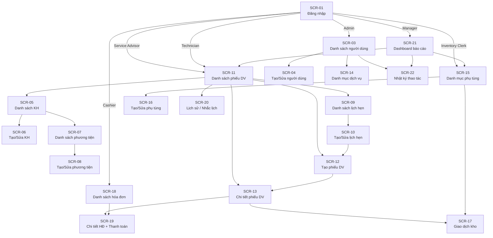

#### 3.3.5 Ma trận điều hướng theo vai trò
| Màn hình | Admin | Service Advisor | Technician | Inventory Clerk | Cashier | Manager |
|---|---|---|---|---|---|---|
| SCR-01 Đăng nhập | ✓ | ✓ | ✓ | ✓ | ✓ | ✓ |
| SCR-03 Người dùng | R/W | — | — | — | — | R |
| SCR-05 KH | R | R/W | R | — | R | R |
| SCR-11 Phiếu DV | R | R/W | R | R | R | R |
| SCR-13 Chi tiết phiếu | R | R/W | R/W* | R/W* | R | R |
| SCR-15 Phụ tùng | R | R | R | R/W | R | R |
| SCR-18 Hóa đơn | R | R | — | — | R/W | R |
| SCR-21 Dashboard | — | — | — | — | — | R/W |
| SCR-22 Nhật ký | R/W | — | — | — | — | R |

Chú thích: R = Chỉ đọc; R/W = Đọc và ghi; R/W* = Ghi có giới hạn theo chức năng vai trò; — = Không truy cập.

#### 3.3.6 Mẫu UI pattern chung
Các màn hình trong hệ thống dùng chung bộ pattern nhất quán nhằm giảm thời gian làm quen cho người dùng mới và bảo đảm tính nhất quán trải nghiệm (NFR-U04):

| Pattern | Mô tả | Áp dụng tại |
|---|---|---|
| Sidebar navigation | Menu dọc bên trái với mục đang chọn được highlight; thu gọn được trên tablet | Tất cả màn hình sau đăng nhập |
| List + Search | Danh sách dạng bảng kèm ô tìm kiếm ở trên và phân trang ở dưới | SCR-03, SCR-05, SCR-09, SCR-11, SCR-15, SCR-18, SCR-22 |
| Form với validation inline | Lỗi hiển thị ngay dưới trường khi blur; nút Lưu bị disable khi còn lỗi | SCR-04, SCR-06, SCR-08, SCR-10, SCR-12, SCR-16 |
| Badge trạng thái | Thẻ màu thể hiện trạng thái nghiệp vụ (phiếu DV, hóa đơn) | SCR-11, SCR-13, SCR-18, SCR-19 |
| Tab nội dung | Chia thông tin phức tạp thành các tab trong cùng trang | SCR-13, SCR-06 (chế độ sửa) |
| Confirmation dialog | Xác nhận trước các hành động không thể hoàn tác: xóa, đổi trạng thái cuối | Cập nhật trạng thái, hủy lịch hẹn |
| Toast notification | Thông báo ngắn xuất hiện góc trên phải sau thao tác thành công hoặc lỗi | Toàn hệ thống |

#### 3.3.7 Lưu ý cho giai đoạn High-Fidelity
Wireframe tại mục 3.3 là cơ sở để xây dựng giao diện High-Fidelity ở mục 6.3. Các màn hình được ưu tiên hoàn thiện trực quan trước bao gồm SCR-13 (Chi tiết phiếu dịch vụ), SCR-19 (Hóa đơn và thanh toán) và SCR-21 (Dashboard báo cáo) do đây là ba màn hình thể hiện rõ nhất giá trị nghiệp vụ của hệ thống và khả năng bị hỏi trong phiên demo. Bộ UI component (PrimeReact + Tailwind) sẽ là nền tảng để triển khai các pattern đã định nghĩa tại mục 3.3.6.

### 4.1 Drivers
#### 4.1.1 Mục tiêu xác định architectural drivers
Architectural Drivers là tập hợp các yêu cầu và ràng buộc có tác động trực tiếp đến các quyết định kiến trúc hệ thống. Không phải mọi yêu cầu chức năng hay phi chức năng đều ảnh hưởng đến kiến trúc; mục này tách ra những yếu tố định hình cách tổ chức hệ thống, lựa chọn công nghệ và đánh đổi thiết kế.

Nguồn đầu vào cho mục này bao gồm Vision (1.1), System Context (1.3), Functional Requirements (3.1) và Non-Functional Requirements (3.2). Kết quả là danh sách drivers được xếp hạng ưu tiên, làm cơ sở cho Tech Choice (4.2) và Architecture Pattern (4.3).

#### 4.1.2 Yêu cầu chức năng có ý nghĩa kiến trúc
Không phải toàn bộ FR-01..FR-19 đều ảnh hưởng trực tiếp đến kiến trúc. Các yêu cầu dưới đây được xác định là kiến trúc trọng yếu vì chúng đặt ra ràng buộc về tổ chức module, cơ chế giao tiếp hoặc mô hình dữ liệu.

| Mã yêu cầu | Nội dung tóm tắt | Ý nghĩa kiến trúc |
|---|---|---|
| FR-01 | Xác thực người dùng với JWT, session management | Cần lớp Auth middleware xuyên suốt; token lifecycle ảnh hưởng API gateway pattern |
| FR-02 | RBAC với 6 vai trò | Cần cơ chế guard/decorator tập trung tại lớp controller; không thể dùng logic phân quyền rải rác |
| FR-07 + FR-08 + FR-09 | Work order là trung tâm điều phối, liên kết nhiều entity và có state machine | Yêu cầu module WorkOrder độc lập với transaction phức tạp; state machine cần tách rõ ở service layer |
| FR-13 | Ghi nhận phụ tùng sử dụng phải đồng bộ với InventoryTransaction | Yêu cầu atomic write trên nhiều bảng; không được tách thành 2 request riêng lẻ |
| FR-14 + FR-15 | Lập hóa đơn snapshot đơn giá + thanh toán nhiều lần | Cần immutable invoice pattern; tách Invoice entity khỏi danh mục giá |
| FR-18 | Báo cáo doanh thu, tồn kho cảnh báo theo kỳ | Các query tổng hợp cần index phù hợp; không nên tính toán tại runtime không có cache |
| FR-19 | Audit log bất biến cho mọi thao tác trọng yếu | Cần interceptor/middleware cấp framework; không để từng service tự ghi log theo cách riêng |

#### 4.1.3 Yêu cầu phi chức năng có ý nghĩa kiến trúc
| NFR | Mục tiêu đo được | Ý nghĩa kiến trúc | Mức độ ưu tiên |
|---|---|---|---|
| NFR-S01..S07 (Bảo mật toàn diện) | JWT 15 phút, bcrypt ≥ cost 12, RBAC tường minh, HTTPS, Helmet + rate-limit, Zod validation | Bắt buộc có lớp security middleware riêng biệt trước controller; không inline vào business logic | Critical |
| NFR-A03 (Toàn vẹn giao dịch) | Mọi write liên quan nhiều entity phải commit hoặc rollback toàn bộ | Yêu cầu dùng Prisma transaction cho các luồng phức tạp (phụ tùng, hóa đơn) | Critical |
| NFR-P01 + NFR-P04 (Hiệu năng đọc) | P95 ≤ 2 giây, tra cứu lịch sử ≤ 10 giây | Database index phải thiết kế theo query pattern thực tế; tránh N+1 query trong API | High |
| NFR-P02 (Hiệu năng ghi) | P95 ≤ 3 giây cho thao tác ghi | Transaction phải ngắn gọn; không đặt I/O không cần thiết trong transaction scope | High |
| NFR-C02 (Modular Monolith) | Module boundary rõ ràng, không cross-module DB query | Tổ chức thư mục và dependency injection theo module; interface giữa các module qua service layer | Critical |
| NFR-S06 (Audit log bất biến) | Ghi log sau mọi thao tác trọng yếu; không cho phép xóa/sửa | Cần NestJS interceptor hoặc decorator pattern; AuditLog là append-only | High |
| NFR-U01 (i18n vi/en) | Chuyển ngôn ngữ không reload trang | Frontend sử dụng i18next với lazy loading namespace; không hardcode string trong component | Medium |

#### 4.1.4 Ràng buộc kiến trúc
| Mã | Ràng buộc | Loại | Mức linh hoạt | Tác động | Nguồn |
|---|---|---|---|---|---|
| CON-01 | Hệ thống triển khai dưới dạng Modular Monolith | Kiến trúc | Cứng — đã chốt | Quyết định cấu trúc module, đóng gói domain, không dùng microservice | Vision 1.1.6, NFR-C02 |
| CON-02 | Backend: Node.js + NestJS + Prisma + PostgreSQL | Công nghệ | Cứng — đã chốt | Toàn bộ thiết kế server-side phụ thuộc NestJS pattern (module, guard, interceptor) | report-agent-spec mục 4 |
| CON-03 | Frontend: React 18 + Vite + TypeScript + PrimeReact + Tailwind | Công nghệ | Cứng — đã chốt | UI component phải tương thích PrimeReact; build tool là Vite | report-agent-spec mục 4 |
| CON-04 | State management: Redux Toolkit + Redux Saga | Công nghệ | Cứng — đã chốt | Side-effect async phải qua Saga; không dùng thunk hay React Query cho luồng chính | report-agent-spec mục 4 |
| CON-05 | ID chiến lược: UUIDv7 cho mọi PK/FK | Dữ liệu | Cứng — đã chốt | Schema Prisma và migration phải đồng nhất UUIDv7; ảnh hưởng index strategy | NFR-C03 |
| CON-06 | API convention: /api/v1 với chuẩn error format thống nhất | API | Cứng — đã chốt | Global exception filter bắt buộc; format lỗi chuẩn áp dụng cho mọi module | NFR-C03 |
| CON-07 | Phạm vi MVP: một chi nhánh, không đa chi nhánh | Nghiệp vụ | Cứng — đã chốt | Không cần tenant isolation; schema và logic đơn giản hơn nhưng phải thiết kế không chặn mở rộng | Vision 1.1.5, NFR-C05 |
| CON-08 | Thời gian phát triển giới hạn trong học kỳ | Vận hành | Cứng | Ưu tiên giải pháp đơn giản, có thể bàn giao; không over-engineer | Vision 1.1.6 |
| CON-09 | Nguồn lực nhỏ (nhóm nhỏ / cá nhân) | Vận hành | Cứng | Không dùng công nghệ đòi hỏi vận hành phức tạp (Kafka, Redis cluster, service mesh) | Vision 1.1.6 |
| CON-10 | Không tích hợp cổng thanh toán, ERP, hóa đơn điện tử ở MVP | Tích hợp | Cứng trong MVP | Không cần API adapter, message queue hay async integration trong phiên bản đầu | Vision 1.1.5 |

#### 4.1.5 Ma trận drivers theo mức ưu tiên
| Hạng | Driver | Loại | Mức | Lý do ưu tiên cao |
|---|---|---|---|---|
| 1 | RBAC tường minh + JWT lifecycle (FR-02, NFR-S01, NFR-S02, NFR-S03) | Bảo mật | Critical | Mọi endpoint đều phụ thuộc; lỗi bảo mật không thể patch sau demo |
| 2 | Toàn vẹn giao dịch nhiều entity (NFR-A03, FR-13, FR-14) | Độ tin cậy | Critical | Dữ liệu sai lệch giữa tồn kho và hóa đơn là lỗi nghiệp vụ nghiêm trọng |
| 3 | Modular Monolith với module boundary rõ (CON-01, NFR-C02) | Kiến trúc | Critical | Quyết định này định hình toàn bộ cấu trúc codebase |
| 4 | Work order state machine (FR-07, FR-08, FR-09) | Chức năng | High | Luồng nghiệp vụ lõi; sai logic state transition ảnh hưởng toàn bộ downstream |
| 5 | Audit log bất biến (FR-19, NFR-S06) | Bảo mật/Trace | High | Yêu cầu thiết kế interceptor sớm; không thể retrofit sau |
| 6 | Hiệu năng đọc P95 ≤ 2s (NFR-P01, NFR-P04) | Hiệu năng | High | Ảnh hưởng trực tiếp UX của Service Advisor và Manager |
| 7 | Immutable invoice snapshot (FR-14, BR-09, BR-10) | Dữ liệu | High | Hóa đơn thay đổi sau khi chốt là lỗi kế toán nghiêm trọng |
| 8 | Validation tập trung bằng Zod (NFR-S07) | Bảo mật | High | Cần áp dụng toàn bộ API từ đầu; không patch từng endpoint sau |
| 9 | UUIDv7 cho mọi PK/FK (CON-05) | Dữ liệu | High | Ảnh hưởng schema, migration và index từ bước đầu |
| 10 | Stack cố định: NestJS + Prisma + React + Vite (CON-02, CON-03) | Ràng buộc | High | Quyết định mọi library và pattern phát triển |
| 11 | API convention /api/v1 + error format (CON-06) | API | Medium | Cần Global Exception Filter từ sớm để nhất quán |
| 12 | i18n vi/en không reload (NFR-U01) | UX | Medium | Ảnh hưởng thiết kế component string ngay từ đầu |

#### 4.1.6 Đánh đổi kiến trúc chính (Trade-offs)
**Trade-off 1: Modular Monolith vs. Microservices**
Hệ thống có thể được xây dựng theo microservices để tăng khả năng scale từng service độc lập. Tuy nhiên, với ràng buộc thời gian học kỳ, nguồn lực nhỏ và phạm vi MVP một chi nhánh (CON-08, CON-09), microservices tạo ra overhead vận hành không tương xứng với lợi ích. Modular Monolith được chọn vì cho phép phát triển nhanh trong khi vẫn duy trì ranh giới module rõ ràng — nền tảng để tách service sau này nếu cần.

**Trade-off 2: Đơn giản hóa vs. Khả năng mở rộng**
Thiết kế không tích hợp đa chi nhánh (CON-07) làm đơn giản schema đáng kể. Tuy nhiên, các entity như WorkOrder, Invoice và AuditLog cần thiết kế không hardcode giả định một chi nhánh để không cản trở mở rộng. Phương án giải quyết là để các entity có trường định danh nghiệp vụ nhưng không bắt buộc foreign key chi nhánh trong MVP.

**Trade-off 3: Redux Saga vs. React Query**
Redux Saga có độ phức tạp setup cao hơn React Query cho data fetching thông thường. Tuy nhiên, stack đã chốt (CON-04) và Redux Saga phù hợp hơn khi luồng tương tác có nhiều bước tuần tự và side-effect phức tạp như tạo phiếu dịch vụ, ghi nhận phụ tùng và thanh toán. Quyết định này được giữ nguyên theo stack đã chốt.

#### 4.1.7 Giả định và câu hỏi mở
- **Giả định:** Hệ thống triển khai trên môi trường server đơn hoặc Docker cơ bản; không cần load balancer hay container orchestration trong MVP.
- **Giả định:** PostgreSQL phiên bản 14+ được sử dụng; các tính năng như UUID generation, JSONB và window function đều khả dụng.
- **Câu hỏi mở:** Ngưỡng tồn kho cảnh báo (low-stock threshold) do người dùng cấu hình hay cố định trong hệ thống? Điều này ảnh hưởng đến thiết kế bảng Part và logic báo cáo.
- **Câu hỏi mở:** Audit log cần lưu full payload thay đổi (before/after) hay chỉ loại hành động và ID đối tượng? Quyết định này ảnh hưởng đến kích thước bảng AuditLog và cấu trúc ghi.

### 4.2 Tech Choice
#### 4.2.1 Mục tiêu lựa chọn công nghệ
Mục này trình bày lý do chọn từng thành phần trong technology stack của Vehicle Service Management System, kết nối trực tiếp với các architectural driver đã xác định ở mục 4.1. Stack được chốt trước giai đoạn phân tích chi tiết nhằm đảm bảo nhất quán giữa thiết kế và triển khai. Không có thành phần nào được thay đổi trong phạm vi đồ án nếu chưa có phê duyệt lại từ nguồn đề tài.

#### 4.2.2 Tổng quan technology stack
```
┌─────────────────────────────────────────────────────────────┐
│                      PRESENTATION LAYER                     │
│   React 18 + TypeScript │ Vite │ React Router v6           │
│   PrimeReact + Tailwind │ Formik + Yup │ i18next           │
│   Redux Toolkit + Redux Saga │ Axios │ Recharts            │
├─────────────────────────────────────────────────────────────┤
│                      APPLICATION LAYER                      │
│   Node.js │ NestJS (Modular Monolith)                       │
│   Prisma ORM │ Zod │ JWT + bcrypt                          │
│   cookie-parser │ cors │ helmet │ rate-limit               │
├─────────────────────────────────────────────────────────────┤
│                        DATA LAYER                           │
│             PostgreSQL 16 │ UUIDv7 PK/FK strategy          │
├─────────────────────────────────────────────────────────────┤
│                    DEVELOPMENT TOOLING                      │
│     TypeScript (full-stack) │ ESLint │ Prettier            │
│          Jest (unit test) │ Docker (dev env)               │
└─────────────────────────────────────────────────────────────┘
```

#### 4.2.3 Quyết định công nghệ backend

**Node.js + NestJS**

| Tiêu chí đánh giá | Lý do chọn NestJS | Driver tham chiếu |
|---|---|---|
| Cấu trúc Modular Monolith | NestJS có hệ thống Module/Controller/Service/Provider cấu trúc rõ ràng, phù hợp để tổ chức theo domain mà không cần microservices | CON-01, NFR-C02 |
| RBAC + Middleware | Guard, Interceptor, Decorator là first-class citizen trong NestJS; triển khai RBAC tập trung mà không rải logic phân quyền vào từng controller | FR-02, NFR-S03 |
| Audit log interceptor | NestJS Interceptor có thể bọc toàn bộ request/response pipeline để ghi AuditLog nhất quán | FR-19, NFR-S06 |
| Validation tập trung | Tích hợp sẵn ValidationPipe với Zod hoặc class-validator; áp dụng tại entry point trước khi vào business logic | NFR-S07 |
| TypeScript native | NestJS được viết bằng TypeScript; toàn bộ codebase type-safe end-to-end | CON-02 |
| Ecosystem và tài liệu | Tài liệu đầy đủ, cộng đồng lớn, nhiều module chính thức (JWT, config, testing) | CON-08 |

**Prisma ORM**

| Tiêu chí đánh giá | Lý do chọn Prisma | Driver tham chiếu |
|---|---|---|
| Type-safe database access | Schema Prisma sinh TypeScript types tự động; loại bỏ lỗi query type mismatch khi compile | CON-02, NFR-A03 |
| Migration quản lý schema | Prisma Migrate tạo SQL migration từ schema file; dễ review, rollback và kiểm toán thay đổi | CON-08 |
| Transaction API | `prisma.$transaction()` đảm bảo atomic write trên nhiều bảng; phù hợp luồng ghi nhận phụ tùng và lập hóa đơn | NFR-A03, FR-13, FR-14 |
| UUIDv7 support | Prisma hỗ trợ custom ID type; UUIDv7 có thể cấu hình qua default value generator | CON-05 |
| Tránh N+1 | Prisma select/include pattern cho phép eager load quan hệ trong một query; kiểm soát N+1 ở lớp service | NFR-P01 |

**PostgreSQL**

| Tiêu chí đánh giá | Lý do chọn PostgreSQL | Driver tham chiếu |
|---|---|---|
| ACID transactions | Full ACID compliance đảm bảo toàn vẹn dữ liệu cho các luồng multi-entity | NFR-A03, BR-07..BR-11 |
| Relational model phù hợp | Dữ liệu garage có cấu trúc quan hệ rõ ràng (Customer-Vehicle-WorkOrder-Invoice); relational model tự nhiên hơn NoSQL | Data Modeling 2.3 |
| Window functions + CTEs | Hỗ trợ query tổng hợp phức tạp cho báo cáo doanh thu và thống kê phụ tùng | FR-18 |
| Index strategy | B-tree, partial index và composite index đủ để đáp ứng NFR-P01 P95 ≤ 2 giây | NFR-P01, NFR-P04 |
| UUID native | PostgreSQL có kiểu uuid native; phù hợp UUIDv7 strategy | CON-05 |

**Zod**

Zod được chọn để validation schema tại API boundary vì cung cấp TypeScript-first schema inference — kiểu dữ liệu được suy ra tự động từ schema, không cần khai báo type riêng. Điều này giảm duplicated type definitions và đảm bảo validation logic luôn đồng bộ với TypeScript types. So với `class-validator`, Zod hoạt động tốt hơn với plain objects và functional style phù hợp hơn với service layer của NestJS.

#### 4.2.4 Quyết định công nghệ frontend

**React 18 + TypeScript + Vite**

| Thành phần | Lý do chọn | Driver tham chiếu |
|---|---|---|
| React 18 | Component-based UI, large ecosystem, team familiarity; Concurrent features hỗ trợ UX tốt hơn khi load dữ liệu | CON-03 |
| TypeScript | Type safety end-to-end từ API response đến component props; giảm lỗi runtime ở lớp UI | CON-03, CON-02 |
| Vite | Build tool nhanh với HMR tức thì trong dev; tree-shaking tốt cho production bundle | CON-03, CON-08 |
| React Router v6 | Routing khai báo với nested routes; hỗ trợ layout per-role dễ triển khai | SCR navigation 3.3.4 |

**Redux Toolkit + Redux Saga**

Redux Toolkit giảm boilerplate của Redux thuần bằng `createSlice` và `createAsyncThunk`. Redux Saga được chọn thay vì Redux Thunk hoặc React Query vì các luồng nghiệp vụ của garage có nhiều bước tuần tự với side-effect phức tạp — ví dụ tạo phiếu dịch vụ cần: (1) kiểm tra khách hàng, (2) tạo phiếu, (3) cập nhật danh sách lịch hẹn, (4) redirect. Saga worker pattern mô tả luồng này rõ ràng và dễ test hơn thunk chain.

**PrimeReact + Tailwind CSS**

PrimeReact cung cấp bộ component UI đầy đủ cho ứng dụng dữ liệu: DataTable, Calendar, Dropdown, Dialog, Toast — những component cốt lõi cho các màn hình danh sách, form và dashboard. Tailwind CSS được dùng để tùy chỉnh layout và spacing mà không viết custom CSS riêng. Hai thư viện này không xung đột vì PrimeReact dùng class riêng của nó còn Tailwind áp dụng cho layout bên ngoài component.

**Formik + Yup**

Formik quản lý trạng thái form, touched/dirty state và submission handling. Yup cung cấp schema validation tương tự Zod cho phía client — schema validation được viết một lần và tái sử dụng cho cả validate onBlur và onSubmit. Đây là cặp đôi phổ biến nhất cho form-heavy applications trong hệ sinh thái React, phù hợp với các màn hình nhập liệu phức tạp như tạo phiếu dịch vụ và lập hóa đơn (NFR-U03).

**i18next**

i18next với `react-i18next` cho phép tách toàn bộ string UI ra file JSON namespace theo ngôn ngữ. Language switching không cần reload nhờ `changeLanguage()` API. Namespace lazy loading giảm bundle size ban đầu. Đây là giải pháp i18n de-facto cho React, đáp ứng NFR-U01.

**Recharts**

Recharts là thư viện chart dựa trên D3 cho React với API declarative. Phù hợp để render LineChart doanh thu theo ngày, BarChart dịch vụ nổi bật và các biểu đồ đơn giản trên Dashboard Manager (SCR-21, FR-18). Không cần thư viện nặng hơn như ECharts vì Dashboard MVP chỉ cần 2–3 loại chart cơ bản.

#### 4.2.5 Quyết định bảo mật

| Thành phần | Lý do chọn | Driver tham chiếu |
|---|---|---|
| JWT (access token 15 phút) | Stateless authentication, dễ kiểm tra ở lớp middleware; thời gian sống ngắn giảm rủi ro token bị lộ | NFR-S02 |
| JWT (refresh token 7 ngày) | Cho phép session kéo dài mà không yêu cầu đăng nhập lại liên tục; lưu trong HttpOnly cookie tránh XSS | NFR-S02 |
| bcrypt cost 12 | Đủ chậm để chống brute-force nhưng không quá nặng cho server nhỏ; chuẩn phổ biến được OWASP khuyến nghị | NFR-S01 |
| Helmet | Middleware thiết lập HTTP security headers tự động (X-Frame-Options, CSP, HSTS...); một dòng cấu hình bảo vệ nhiều vector | NFR-S05 |
| cors | Giới hạn origin được phép gọi API; ngăn cross-site request từ domain không được phép | NFR-S05 |
| rate-limit | Giới hạn 100 request/phút cho endpoint auth; chống brute-force đăng nhập | NFR-S05 |

#### 4.2.6 Ma trận so sánh các quyết định chính
**Backend framework — NestJS vs. Express thuần**

| Tiêu chí | NestJS | Express thuần |
|---|---|---|
| Modular architecture | Built-in Module system | Tự cấu trúc thủ công |
| Dependency injection | Built-in IoC container | Cần thêm thư viện (tsyringe, awilix) |
| Guard/Interceptor | First-class | Middleware thủ công |
| TypeScript support | Native | Cần config thêm |
| Learning curve | Cao hơn | Thấp hơn |
| Phù hợp driver CON-01 | Cao | Trung bình |
| **Kết quả** | **Chọn** | Không chọn |

**ORM — Prisma vs. TypeORM**

| Tiêu chí | Prisma | TypeORM |
|---|---|---|
| Type safety | Schema-first, type auto-generated | Decorator-based, có thể loose |
| Migration UX | Prisma Migrate rõ ràng | TypeORM migration phức tạp hơn |
| Transaction API | `$transaction()` tường minh | QueryRunner hoặc transaction callback |
| N+1 control | Explicit include/select | Cần cẩn thận với eager/lazy |
| Phù hợp NFR-A03 | Cao | Trung bình |
| **Kết quả** | **Chọn** | Không chọn |

**Database — PostgreSQL vs. MySQL**

| Tiêu chí | PostgreSQL | MySQL |
|---|---|---|
| ACID full compliance | Có | Có (InnoDB) |
| Advanced query (CTE, Window fn) | Có | Giới hạn hơn |
| UUID native type | Có | Varchar hoặc BINARY |
| JSON/JSONB | Tốt | Có nhưng kém hơn |
| Ecosystem + Prisma support | Tốt | Tốt |
| **Kết quả** | **Chọn** | Không chọn |

#### 4.2.7 Truy vết công nghệ → architectural driver
| Công nghệ | Driver/Ràng buộc chính |
|---|---|
| NestJS | CON-01 (Modular Monolith), CON-02, FR-02 (RBAC), FR-19 (Audit) |
| Prisma | CON-02, CON-05 (UUIDv7), NFR-A03 (transaction), NFR-P01 (N+1) |
| PostgreSQL | NFR-A03, FR-18 (báo cáo), Data Modeling 2.3 |
| Zod | NFR-S07 (validation), CON-06 (error format) |
| JWT + bcrypt | NFR-S01, NFR-S02 |
| Helmet + cors + rate-limit | NFR-S05 |
| React 18 + TypeScript | CON-03, NFR-U02 |
| Vite | CON-03, CON-08 (phát triển nhanh) |
| Redux Toolkit + Saga | CON-04, FR-07..FR-09 (luồng phức tạp) |
| PrimeReact + Tailwind | CON-03, NFR-U02, NFR-U03 |
| Formik + Yup | NFR-U03, SCR wireframes 3.3 |
| i18next | NFR-U01 |
| Recharts | FR-18, SCR-21 |

#### 4.2.8 Rủi ro công nghệ và phương án giảm thiểu
| Rủi ro | Mức độ | Phương án giảm thiểu |
|---|---|---|
| Redux Saga có learning curve cao | Medium | Áp dụng cho luồng phức tạp; dùng RTK Query cho read-only data fetch đơn giản nếu cần |
| Prisma chưa hỗ trợ tất cả PostgreSQL feature (stored procedure, trigger) | Low | Audit trigger và complex aggregate có thể dùng Prisma `$queryRaw` khi cần |
| PrimeReact styling xung đột với Tailwind | Low | Sử dụng Tailwind chỉ cho layout wrapper; không ghi đè PrimeReact internal classes |
| UUIDv7 chưa có standard generator trong Node.js core | Low | Dùng thư viện `uuidv7` hoặc generate bằng PostgreSQL extension `pg_uuidv7` |
| bcrypt cost 12 làm chậm login nếu server yếu | Low | Benchmark thực tế; giảm xuống cost 10 nếu cần với môi trường dev/test |

### 4.3 Architecture
#### 4.3.1 Lựa chọn architectural pattern
Vehicle Service Management System áp dụng kiến trúc **Modular Monolith**, triển khai toàn bộ backend trong một process duy nhất nhưng được tổ chức thành các module độc lập theo domain nghiệp vụ với ranh giới trách nhiệm rõ ràng.

**Lý do chọn Modular Monolith:**

| Tiêu chí | Modular Monolith | Microservices |
|---|---|---|
| Phù hợp quy mô nhóm nhỏ/cá nhân | Cao — triển khai và vận hành đơn giản | Thấp — operational overhead lớn |
| Thời gian phát triển trong học kỳ | Nhanh — không cần API gateway, service discovery | Chậm — cần infrastructure phức tạp |
| Transaction nhiều entity | Dễ — trong cùng process, Prisma transaction | Khó — cần distributed transaction (2PC, Saga) |
| Module boundary rõ ràng | Có thể đạt bằng NestJS Module | Native per service |
| Khả năng mở rộng tương lai | Mở rộng dần — tách module thành service khi cần | Có ngay nhưng phức tạp hiện tại |
| Phù hợp driver CON-01, CON-08, CON-09 | Cao | Thấp |

**Các pattern bị loại bỏ:**
- **Microservices:** Overhead vận hành (service discovery, distributed tracing, container orchestration) vượt quá lợi ích với đề tài MVP một chi nhánh và nguồn lực nhỏ.
- **Layered Monolith thuần (Big Ball of Mud):** Thiếu ranh giới module, khó mở rộng và kiểm thử khi hệ thống lớn dần.
- **Event-driven architecture:** Phức tạp không cần thiết khi không có yêu cầu eventual consistency hay decoupled async processing ở MVP.

#### 4.3.2 Kiến trúc logic (Logical Architecture)
Hệ thống được chia thành ba tầng logic chính, mỗi tầng có trách nhiệm riêng biệt:

```
┌─────────────────────────────────────────────────────────────────┐
│                     PRESENTATION TIER                           │
│                                                                 │
│   ┌─────────────────────────────────────────────────────────┐  │
│   │              React SPA (Browser)                        │  │
│   │  Pages / Views │ Redux Store │ Saga Middleware          │  │
│   │  PrimeReact Components │ Formik Forms │ i18n            │  │
│   └──────────────────────────┬──────────────────────────────┘  │
│                              │ HTTPS / REST /api/v1            │
└──────────────────────────────┼──────────────────────────────────┘
                               │
┌──────────────────────────────┼──────────────────────────────────┐
│                    APPLICATION TIER                             │
│                               │                                │
│   ┌───────────────────────────▼─────────────────────────────┐  │
│   │              NestJS Application                         │  │
│   │                                                         │  │
│   │  ┌──────────────┐  Global Middleware Layer              │  │
│   │  │  Auth Guard  │  JWT Validation │ RBAC Guard          │  │
│   │  │  Rate Limit  │  Helmet │ CORS │ Zod ValidationPipe  │  │
│   │  │  Audit Interceptor │ Global Exception Filter        │  │
│   │  └──────────────┘                                       │  │
│   │                                                         │  │
│   │  ┌──────────┐ ┌──────────┐ ┌──────────┐ ┌──────────┐  │  │
│   │  │  Auth    │ │ Customer │ │ WorkOrder│ │Inventory │  │  │
│   │  │  Module  │ │ Module   │ │  Module  │ │ Module   │  │  │
│   │  └──────────┘ └──────────┘ └──────────┘ └──────────┘  │  │
│   │  ┌──────────┐ ┌──────────┐ ┌──────────┐ ┌──────────┐  │  │
│   │  │ Invoice  │ │ Report   │ │ Reminder │ │  Audit   │  │  │
│   │  │  Module  │ │  Module  │ │  Module  │ │  Module  │  │  │
│   │  └──────────┘ └──────────┘ └──────────┘ └──────────┘  │  │
│   │                                                         │  │
│   │              Prisma Client (shared)                     │  │
│   └─────────────────────────────────────────────────────────┘  │
│                                                                 │
└──────────────────────────────┬──────────────────────────────────┘
                               │ Prisma SQL
┌──────────────────────────────┼──────────────────────────────────┐
│                       DATA TIER                                 │
│                               │                                │
│           ┌───────────────────▼──────────────────┐            │
│           │        PostgreSQL 16                  │            │
│           │   UUIDv7 PK/FK │ ACID Transactions   │            │
│           │   Index Strategy │ Audit Log table    │            │
│           └──────────────────────────────────────┘            │
└─────────────────────────────────────────────────────────────────┘
```

#### 4.3.3 Cấu trúc module backend (NestJS)
Mỗi module NestJS bao gồm: Controller (HTTP handler), Service (business logic), Repository pattern qua Prisma, và DTOs/schemas Zod. Module giao tiếp với nhau qua Service injection, không truy cập trực tiếp database của module khác.

| Module | Trách nhiệm | Entity sở hữu | Phụ thuộc vào |
|---|---|---|---|
| **AuthModule** | Đăng nhập, JWT issue/refresh, đổi mật khẩu | UserAccount (phối hợp) | UserModule |
| **UserModule** | CRUD tài khoản, phân quyền RBAC | UserAccount | — |
| **CustomerModule** | CRUD khách hàng, phương tiện | Customer, Vehicle | — |
| **AppointmentModule** | CRUD lịch hẹn | Appointment | CustomerModule |
| **WorkOrderModule** | Tạo phiếu DV, quản lý hạng mục, state machine | WorkOrder, WorkOrderItem | CustomerModule, ServiceCatalogModule |
| **ServiceCatalogModule** | CRUD danh mục dịch vụ | Service | — |
| **InventoryModule** | CRUD phụ tùng, giao dịch kho, part usage | Part, InventoryTransaction, PartUsage | WorkOrderModule |
| **InvoiceModule** | Lập hóa đơn, ghi nhận thanh toán | Invoice, InvoiceLine, Payment | WorkOrderModule, InventoryModule |
| **ReminderModule** | Nhắc lịch bảo dưỡng | MaintenanceReminder | CustomerModule |
| **ReportModule** | Báo cáo vận hành (read-only aggregation) | — (cross-module query) | Tất cả module liên quan |
| **AuditModule** | Ghi audit log bất biến | AuditLog | — (interceptor inject) |

#### 4.3.4 Kiến trúc internal mỗi module
Mỗi module tuân theo kiến trúc phân lớp nội bộ nhất quán:

```
Module (vd: WorkOrderModule)
├── work-order.module.ts        ← NestJS module definition, imports, providers
├── work-order.controller.ts    ← HTTP routes, guards, DTOs in/out
├── work-order.service.ts       ← Business logic, state machine, transaction
├── work-order.repository.ts    ← Prisma queries, data access abstraction
├── dto/
│   ├── create-work-order.dto.ts  ← Zod schema + inferred TypeScript type
│   └── update-status.dto.ts
└── work-order.types.ts         ← Shared types, enums, constants
```

**Nguyên tắc dependency:**
- Controller chỉ gọi Service, không gọi Repository trực tiếp.
- Service chứa toàn bộ business logic và orchestration; gọi Repository và Service khác module nếu cần.
- Repository chỉ chứa Prisma query, không có logic nghiệp vụ.
- Module A không import Repository của Module B; phải gọi qua Service của B.

#### 4.3.5 Global middleware và cross-cutting concerns
Các concern xuyên suốt được xử lý tập trung tại Application Bootstrap, trước khi request đến Controller:

```
Request → [Rate Limiter] → [Helmet Headers] → [CORS Check]
        → [Auth Guard: JWT validate]
        → [RBAC Guard: role check]
        → [Zod ValidationPipe: body/param/query validate]
        → Controller → Service → Repository
        → [Audit Interceptor: ghi AuditLog nếu cần]
        → [Global Exception Filter: format lỗi chuẩn]
        → Response
```

| Concern | Cơ chế NestJS | Áp dụng |
|---|---|---|
| JWT validation | `JwtAuthGuard` (APP_GUARD global) | Mọi route, trừ `/auth/login` |
| RBAC | `RolesGuard` + `@Roles()` decorator | Tất cả controller method |
| Input validation | `ZodValidationPipe` (APP_PIPE global) | Mọi request với body/param |
| Audit logging | `AuditInterceptor` (APP_INTERCEPTOR) | Route có `@Audit()` decorator |
| Error format | `GlobalExceptionFilter` (APP_FILTER) | Toàn bộ unhandled exception |
| Security headers | `helmet()` middleware | Mọi response |
| Rate limiting | `throttle()` middleware | `/auth/*` endpoints |

#### 4.3.6 Kiến trúc frontend (React SPA)
Frontend là Single Page Application, giao tiếp với backend qua REST API. Cấu trúc thư mục phản ánh phân lớp rõ ràng:

```
src/
├── app/                    ← Redux store, root reducer, saga root
├── features/               ← Feature slices (mỗi feature = 1 thư mục)
│   ├── auth/               ← slice, saga, selectors
│   ├── customers/
│   ├── workOrders/
│   ├── inventory/
│   ├── invoices/
│   └── reports/
├── pages/                  ← Route-level components (lazy loaded)
├── components/             ← Shared UI components
├── services/               ← Axios API call functions (per module)
├── hooks/                  ← Custom React hooks
├── i18n/                   ← Translation namespaces (vi, en)
├── types/                  ← Shared TypeScript types
└── utils/                  ← Helper functions
```

**Luồng dữ liệu Redux Saga:**
```
User Action → Dispatch Action → Saga watches → Axios API call
           → Success: dispatch success action → Redux store update → Component re-render
           → Failure: dispatch error action → Toast notification
```

#### 4.3.7 Sơ đồ kiến trúc tổng quan
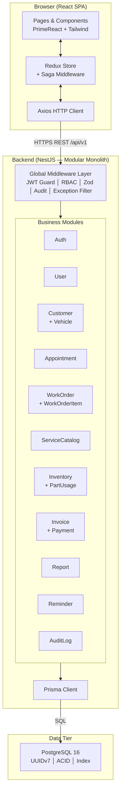

#### 4.3.8 Điểm tích hợp bên ngoài
Tại phiên bản MVP, hệ thống không tích hợp bắt buộc với service bên ngoài. Các điểm tích hợp tương lai được thiết kế theo hướng mở rộng không phá vỡ:

| Điểm tích hợp | Trạng thái MVP | Phương án mở rộng |
|---|---|---|
| Email/SMS nhắc lịch | Chưa tích hợp; ReminderModule chỉ quản lý data | Thêm NotificationModule gọi SendGrid/SMTP qua service interface |
| Cổng thanh toán | Ngoài phạm vi | InvoiceModule đã tách Payment entity sẵn sàng liên kết |
| ERP / Kế toán | Ngoài phạm vi | Export API endpoint theo định dạng chuẩn khi cần |
| Hóa đơn điện tử | Ngoài phạm vi | InvoiceLine data model đủ thông tin để map sang chuẩn ETAX |

#### 4.3.9 Architecture Decision Records (ADRs)

**ADR-01 — Chọn Modular Monolith thay vì Microservices**

| Thuộc tính | Nội dung |
|---|---|
| Trạng thái | Accepted |
| Bối cảnh | Hệ thống garage MVP một chi nhánh, nguồn lực nhỏ, thời gian học kỳ giới hạn (CON-08, CON-09). Cần lựa chọn giữa Modular Monolith và Microservices |
| Vấn đề | Microservices cung cấp độc lập cao nhưng đòi hỏi service mesh, distributed tracing, API gateway và operational complexity không tương xứng với quy mô hiện tại |
| Các phương án | (1) Modular Monolith — đơn giản, transaction dễ; (2) Microservices — scale độc lập nhưng phức tạp; (3) Big Monolith — không có ranh giới module |
| Quyết định | Chọn Modular Monolith với NestJS Module system. Module boundary rõ ràng đủ để hỗ trợ tách service sau này nếu cần |
| Hệ quả | Transaction nhiều entity đơn giản hơn. Trade-off: tất cả module deploy cùng nhau; cần kỷ luật tránh module coupling ngầm |

---

**ADR-02 — Tập trung cross-cutting concerns tại Global Middleware Layer**

| Thuộc tính | Nội dung |
|---|---|
| Trạng thái | Accepted |
| Bối cảnh | RBAC, JWT validation, audit logging và input validation cần áp dụng nhất quán cho toàn bộ API (NFR-S03, NFR-S06, NFR-S07) |
| Vấn đề | Nếu để từng controller/service tự xử lý, logic bảo mật sẽ rải rác và dễ bị bỏ sót |
| Các phương án | (1) Global Guard/Interceptor/Pipe — nhất quán, tập trung; (2) Per-controller decorator — linh hoạt nhưng dễ quên; (3) Middleware chain thủ công |
| Quyết định | Dùng NestJS APP_GUARD, APP_PIPE, APP_INTERCEPTOR, APP_FILTER để áp dụng toàn cục; dùng decorator `@Public()`, `@Roles()`, `@Audit()` để customize per-route |
| Hệ quả | Bảo mật không bị bỏ sót. Trade-off: cần hiểu thứ tự thực thi middleware chain để debug khi có lỗi |

---

**ADR-03 — Dùng Prisma transaction cho atomic write trên nhiều entity**

| Thuộc tính | Nội dung |
|---|---|
| Trạng thái | Accepted |
| Bối cảnh | Các luồng như ghi nhận phụ tùng (PartUsage + InventoryTransaction) và lập hóa đơn (Invoice + InvoiceLine) cần atomic write (NFR-A03) |
| Vấn đề | Ghi tuần tự nhiều entity không trong transaction có thể để lại trạng thái không nhất quán nếu lỗi giữa chừng |
| Các phương án | (1) Prisma `$transaction()` — atomic, rollback tự động; (2) Ghi tuần tự + compensating transaction thủ công; (3) Application-level saga pattern |
| Quyết định | Dùng `prisma.$transaction()` cho mọi operation liên quan nhiều entity trọng yếu (FR-13, FR-14) |
| Hệ quả | Toàn vẹn dữ liệu đảm bảo. Trade-off: transaction dài làm giảm throughput; cần giữ transaction scope ngắn nhất có thể |

---

**ADR-04 — Tách AuditLog thành append-only entity, không cho cập nhật/xóa**

| Thuộc tính | Nội dung |
|---|---|
| Trạng thái | Accepted |
| Bối cảnh | FR-19 yêu cầu audit log bất biến cho các thao tác trọng yếu; NFR-S06 chỉ rõ không cho phép xóa hoặc sửa bản ghi audit |
| Vấn đề | Nếu audit log có thể bị xóa/sửa, tính truy vết mất ý nghĩa; cần cơ chế enforcement cấp ứng dụng |
| Các phương án | (1) Application-level append-only (no UPDATE/DELETE route) + DB constraint; (2) PostgreSQL row security policy; (3) Separate write-once store |
| Quyết định | AuditModule chỉ expose create; không có update/delete route; Prisma schema không có method delete cho AuditLog; xem xét DB trigger ngăn DELETE ở production |
| Hệ quả | Truy vết đáng tin cậy. Trade-off: bảng AuditLog tăng trưởng liên tục, cần chiến lược archiving dài hạn |

### 5.1 Component
#### 5.1.1 Mục tiêu thiết kế component
Component Design chi tiết hóa kiến trúc hệ thống đã xác định ở mục 4.3 thành các thành phần cụ thể với trách nhiệm rõ ràng, giao diện công khai và quan hệ phụ thuộc tường minh. Kết quả của mục này là cơ sở trực tiếp để triển khai từng module backend và từng feature trên frontend.

#### 5.1.2 Phân rã component backend theo module

**Module: AuthModule**
| Component | Lớp | Trách nhiệm | Interface chính | Phụ thuộc |
|---|---|---|---|---|
| `AuthController` | Controller | Xử lý HTTP cho `/auth/login`, `/auth/logout`, `/auth/refresh`, `/auth/change-password` | `POST /auth/login`, `POST /auth/logout`, `POST /auth/refresh`, `PATCH /auth/change-password` | AuthService |
| `AuthService` | Service | Xác thực thông tin đăng nhập, phát hành JWT, refresh token, đổi mật khẩu | `login()`, `logout()`, `refreshToken()`, `changePassword()` | UserService, JwtService, BcryptHelper |
| `JwtStrategy` | Infrastructure | Validate JWT từ cookie, inject user context vào request | `validate(payload)` | Passport.js, JwtService |
| `JwtAuthGuard` | Guard | Kiểm tra JWT hợp lệ cho mọi route protected | `canActivate()` | JwtStrategy |
| `RolesGuard` | Guard | Kiểm tra role của user so với `@Roles()` decorator | `canActivate()` | Reflector, UserContext |

---

**Module: UserModule**
| Component | Lớp | Trách nhiệm | Interface chính | Phụ thuộc |
|---|---|---|---|---|
| `UserController` | Controller | CRUD tài khoản nội bộ | `GET /users`, `POST /users`, `PATCH /users/:id`, `DELETE /users/:id` | UserService |
| `UserService` | Service | Business logic tài khoản, gán role, khóa/mở tài khoản | `findAll()`, `create()`, `update()`, `deactivate()`, `findById()` | UserRepository |
| `UserRepository` | Repository | Prisma query cho UserAccount | `findById()`, `findByLogin()`, `create()`, `update()` | Prisma |

---

**Module: CustomerModule**
| Component | Lớp | Trách nhiệm | Interface chính | Phụ thuộc |
|---|---|---|---|---|
| `CustomerController` | Controller | CRUD khách hàng | `GET /customers`, `POST /customers`, `PATCH /customers/:id` | CustomerService |
| `CustomerService` | Service | Logic tạo/cập nhật khách hàng, phân loại cá nhân/doanh nghiệp | `findAll()`, `search()`, `create()`, `update()` | CustomerRepository |
| `CustomerRepository` | Repository | Prisma query Customer | — | Prisma |
| `VehicleController` | Controller | CRUD phương tiện | `GET /customers/:id/vehicles`, `POST /vehicles`, `PATCH /vehicles/:id` | VehicleService |
| `VehicleService` | Service | Logic phương tiện, kiểm tra biển số duy nhất | `create()`, `findByCustomer()`, `update()` | VehicleRepository |
| `VehicleRepository` | Repository | Prisma query Vehicle | — | Prisma |

---

**Module: AppointmentModule**
| Component | Lớp | Trách nhiệm | Interface chính | Phụ thuộc |
|---|---|---|---|---|
| `AppointmentController` | Controller | CRUD lịch hẹn | `GET /appointments`, `POST /appointments`, `PATCH /appointments/:id` | AppointmentService |
| `AppointmentService` | Service | Tạo/sửa/hủy lịch hẹn, kiểm tra trạng thái trước khi tạo phiếu DV | `create()`, `update()`, `cancel()`, `findById()` | AppointmentRepository, CustomerService |
| `AppointmentRepository` | Repository | Prisma query Appointment | — | Prisma |

---

**Module: WorkOrderModule** *(module phức tạp nhất — cốt lõi nghiệp vụ)*
| Component | Lớp | Trách nhiệm | Interface chính | Phụ thuộc |
|---|---|---|---|---|
| `WorkOrderController` | Controller | Tạo phiếu, tra cứu danh sách/chi tiết, cập nhật trạng thái | `GET /work-orders`, `POST /work-orders`, `GET /work-orders/:id`, `PATCH /work-orders/:id/status` | WorkOrderService |
| `WorkOrderService` | Service | Tạo phiếu từ lịch hẹn/trực tiếp, điều phối state machine | `create()`, `findAll()`, `findById()`, `updateStatus()` | WorkOrderRepository, AppointmentService, WorkOrderStateMachine |
| `WorkOrderStateMachine` | Domain Service | Kiểm tra chuyển trạng thái hợp lệ, điều kiện tiền quyết | `canTransition()`, `getValidNextStates()`, `transition()` | WorkOrderRepository |
| `WorkOrderItemController` | Controller | CRUD hạng mục công việc | `POST /work-orders/:id/items`, `PATCH /work-orders/:id/items/:itemId` | WorkOrderItemService |
| `WorkOrderItemService` | Service | Thêm/cập nhật hạng mục, kiểm tra phiếu chưa chốt HĐ | `addItem()`, `updateItem()` | WorkOrderItemRepository, WorkOrderService |
| `WorkOrderRepository` | Repository | Prisma query WorkOrder với eager load | — | Prisma |
| `WorkOrderItemRepository` | Repository | Prisma query WorkOrderItem | — | Prisma |

---

**Module: InventoryModule**
| Component | Lớp | Trách nhiệm | Interface chính | Phụ thuộc |
|---|---|---|---|---|
| `PartController` | Controller | CRUD phụ tùng, tra cứu tồn kho | `GET /parts`, `POST /parts`, `PATCH /parts/:id` | PartService |
| `PartService` | Service | Tạo/cập nhật phụ tùng, kiểm tra mã trùng | `findAll()`, `create()`, `update()`, `findById()` | PartRepository |
| `PartRepository` | Repository | Prisma query Part | — | Prisma |
| `InventoryTransactionController` | Controller | Ghi giao dịch nhập/xuất/điều chỉnh kho | `POST /inventory-transactions` | InventoryTransactionService |
| `InventoryTransactionService` | Service | Validate số lượng, cập nhật tồn kho trong transaction | `recordTransaction()` | InventoryTransactionRepository, PartRepository |
| `PartUsageController` | Controller | Ghi nhận phụ tùng sử dụng cho phiếu DV | `POST /work-orders/:id/part-usages`, `PATCH /work-orders/:id/part-usages/:usageId` | PartUsageService |
| `PartUsageService` | Service | Liên kết phụ tùng với phiếu, trừ tồn kho trong Prisma transaction | `recordUsage()`, `confirmUsage()` | PartUsageRepository, InventoryTransactionService, WorkOrderService |
| `InventoryTransactionRepository` | Repository | Prisma query InventoryTransaction | — | Prisma |
| `PartUsageRepository` | Repository | Prisma query PartUsage | — | Prisma |

---

**Module: InvoiceModule**
| Component | Lớp | Trách nhiệm | Interface chính | Phụ thuộc |
|---|---|---|---|---|
| `InvoiceController` | Controller | Lập hóa đơn, tra cứu | `GET /invoices`, `POST /invoices`, `GET /invoices/:id` | InvoiceService |
| `InvoiceService` | Service | Tổng hợp hạng mục/phụ tùng, snapshot đơn giá, tạo Invoice trong transaction | `createFromWorkOrder()`, `findAll()`, `findById()` | InvoiceRepository, WorkOrderService, PartUsageService |
| `PaymentController` | Controller | Ghi nhận thanh toán | `POST /invoices/:id/payments` | PaymentService |
| `PaymentService` | Service | Kiểm tra số tiền, cập nhật trạng thái hóa đơn | `recordPayment()` | PaymentRepository, InvoiceRepository |
| `InvoiceRepository` | Repository | Prisma query Invoice + InvoiceLine | — | Prisma |
| `PaymentRepository` | Repository | Prisma query Payment | — | Prisma |

---

**Module: ServiceCatalogModule**
| Component | Lớp | Trách nhiệm | Interface chính | Phụ thuộc |
|---|---|---|---|---|
| `ServiceCatalogController` | Controller | CRUD danh mục dịch vụ | `GET /services`, `POST /services`, `PATCH /services/:id` | ServiceCatalogService |
| `ServiceCatalogService` | Service | Tạo/vô hiệu hóa dịch vụ, kiểm tra dịch vụ active | `findAll()`, `create()`, `update()`, `findActiveById()` | ServiceCatalogRepository |
| `ServiceCatalogRepository` | Repository | Prisma query Service | — | Prisma |

---

**Module: ReportModule**
| Component | Lớp | Trách nhiệm | Interface chính | Phụ thuộc |
|---|---|---|---|---|
| `ReportController` | Controller | Trả về dữ liệu báo cáo theo loại và kỳ | `GET /reports/revenue`, `GET /reports/work-orders`, `GET /reports/low-stock` | ReportService |
| `ReportService` | Service | Tổng hợp dữ liệu cross-module bằng Prisma aggregation | `getRevenueReport()`, `getWorkOrderSummary()`, `getLowStockAlert()` | Prisma (direct aggregate) |

---

**Module: AuditModule**
| Component | Lớp | Trách nhiệm | Interface chính | Phụ thuộc |
|---|---|---|---|---|
| `AuditController` | Controller | Tra cứu nhật ký | `GET /audit-logs` | AuditService |
| `AuditService` | Service | Ghi audit log, tra cứu theo filter | `log()`, `findAll()` | AuditRepository |
| `AuditInterceptor` | Interceptor | Tự động ghi log sau các request có decorator `@Audit()` | `intercept()` | AuditService, Reflector |
| `AuditRepository` | Repository | Prisma query AuditLog (append-only) | `create()`, `findAll()` | Prisma |

---

**Module: ReminderModule**
| Component | Lớp | Trách nhiệm | Interface chính | Phụ thuộc |
|---|---|---|---|---|
| `ReminderController` | Controller | CRUD nhắc lịch, cập nhật trạng thái đã nhắc | `GET /reminders`, `POST /reminders`, `PATCH /reminders/:id` | ReminderService |
| `ReminderService` | Service | Tạo/cập nhật nhắc lịch, lọc danh sách cần nhắc | `create()`, `markNotified()`, `findDue()` | ReminderRepository |
| `ReminderRepository` | Repository | Prisma query MaintenanceReminder | — | Prisma |

#### 5.1.3 Phân rã component frontend theo feature

| Feature Module | Component chính | Trách nhiệm | Redux Slice | Saga |
|---|---|---|---|---|
| **auth** | `LoginPage`, `ChangePasswordPage` | Xử lý đăng nhập, đổi mật khẩu | `authSlice` | `authSaga` |
| **users** | `UserListPage`, `UserFormPage` | CRUD tài khoản (Admin only) | `userSlice` | `userSaga` |
| **customers** | `CustomerListPage`, `CustomerFormPage`, `VehicleListPage`, `VehicleFormPage` | CRUD KH và phương tiện | `customerSlice`, `vehicleSlice` | `customerSaga` |
| **appointments** | `AppointmentListPage`, `AppointmentFormPage` | CRUD lịch hẹn | `appointmentSlice` | `appointmentSaga` |
| **workOrders** | `WorkOrderListPage`, `WorkOrderCreatePage`, `WorkOrderDetailPage`, `WorkOrderItemPanel`, `PartUsagePanel`, `StatusUpdatePanel` | Luồng xử lý phiếu DV end-to-end | `workOrderSlice` | `workOrderSaga` |
| **inventory** | `PartListPage`, `PartFormPage`, `InventoryTransactionForm` | Quản lý phụ tùng và kho | `inventorySlice` | `inventorySaga` |
| **invoices** | `InvoiceListPage`, `InvoiceDetailPage`, `PaymentPanel` | Lập HĐ và ghi nhận thanh toán | `invoiceSlice` | `invoiceSaga` |
| **reports** | `ReportDashboardPage`, `RevenueChart`, `WorkOrderSummaryCard`, `LowStockAlert` | Dashboard vận hành | `reportSlice` | `reportSaga` |
| **reminders** | `ReminderListPage` | Danh sách nhắc lịch bảo dưỡng | `reminderSlice` | `reminderSaga` |
| **audit** | `AuditLogPage` | Tra cứu nhật ký thao tác | `auditSlice` | `auditSaga` |

**Shared components (dùng lại toàn app):**
| Component | Trách nhiệm |
|---|---|
| `AppLayout` | Sidebar nav, header, breadcrumb, auth-protected layout |
| `ProtectedRoute` | Kiểm tra auth và role trước khi render page |
| `DataTable` | Bọc PrimeReact DataTable với pagination, sort, search chuẩn |
| `FormField` | Bọc PrimeReact input + Formik field + Yup error display |
| `StatusBadge` | Badge màu theo trạng thái WorkOrder/Invoice |
| `ConfirmDialog` | Dialog xác nhận hành động không thể hoàn tác |
| `ToastService` | Wrapper PrimeReact Toast cho global notification |
| `LoadingSpinner` | Overlay loading cho async operation |
| `ErrorBoundary` | Bắt React render error, hiển thị fallback UI |
| `LanguageSwitcher` | Chuyển ngôn ngữ vi/en qua i18next |

#### 5.1.4 Sơ đồ component và quan hệ phụ thuộc backend
```mermaid
flowchart TD
    subgraph Global["Global Layer"]
        JwtGuard["JwtAuthGuard"]
        RolesGuard["RolesGuard"]
        ZodPipe["ZodValidationPipe"]
        AuditIntc["AuditInterceptor"]
        ExFilter["GlobalExceptionFilter"]
    end

    subgraph Auth["AuthModule"]
        AuthCtrl["AuthController"] --> AuthSvc["AuthService"]
        AuthSvc --> UserSvc
        AuthSvc --> JwtSvc["JwtService"]
    end

    subgraph User["UserModule"]
        UserCtrl["UserController"] --> UserSvc["UserService"]
        UserSvc --> UserRepo["UserRepository"]
    end

    subgraph Customer["CustomerModule"]
        CustCtrl["CustomerController"] --> CustSvc["CustomerService"]
        VehCtrl["VehicleController"] --> VehSvc["VehicleService"]
        CustSvc --> CustRepo["CustomerRepository"]
        VehSvc --> VehRepo["VehicleRepository"]
    end

    subgraph WO["WorkOrderModule"]
        WOCtrl["WorkOrderController"] --> WOSvc["WorkOrderService"]
        WOSvc --> WOStateMachine["WorkOrderStateMachine"]
        WOSvc --> WORepo["WorkOrderRepository"]
        WOItemCtrl["WorkOrderItemController"] --> WOItemSvc["WorkOrderItemService"]
        WOItemSvc --> WOItemRepo["WorkOrderItemRepository"]
        WOSvc --> CustSvc
    end

    subgraph Inventory["InventoryModule"]
        PartCtrl["PartController"] --> PartSvc["PartService"]
        PartSvc --> PartRepo["PartRepository"]
        InvTxCtrl["InvTransactionController"] --> InvTxSvc["InvTransactionService"]
        InvTxSvc --> InvTxRepo["InvTransactionRepository"]
        PartUsageCtrl["PartUsageController"] --> PartUsageSvc["PartUsageService"]
        PartUsageSvc --> InvTxSvc
        PartUsageSvc --> WOSvc
    end

    subgraph Invoice["InvoiceModule"]
        InvCtrl["InvoiceController"] --> InvSvc["InvoiceService"]
        InvSvc --> InvRepo["InvoiceRepository"]
        InvSvc --> WOSvc
        PayCtrl["PaymentController"] --> PaySvc["PaymentService"]
        PaySvc --> PayRepo["PaymentRepository"]
        PaySvc --> InvRepo
    end

    subgraph Report["ReportModule"]
        RptCtrl["ReportController"] --> RptSvc["ReportService"]
    end

    subgraph AuditMod["AuditModule"]
        AuditCtrl["AuditController"] --> AuditSvc["AuditService"]
        AuditSvc --> AuditRepo["AuditRepository"]
        AuditIntc --> AuditSvc
    end

    DB[("PostgreSQL\nvia Prisma")]
    UserRepo & CustRepo & VehRepo & WORepo --> DB
    WOItemRepo & PartRepo & InvTxRepo & PartUsageRepo --> DB
    InvRepo & PayRepo & AuditRepo --> DB
    RptSvc --> DB
```

#### 5.1.5 Ma trận trách nhiệm component — FR coverage

| Component / Service | FR-01 | FR-02 | FR-03 | FR-04 | FR-05 | FR-06 | FR-07 | FR-08 | FR-09 | FR-10 | FR-11 | FR-12 | FR-13 | FR-14 | FR-15 | FR-16 | FR-17 | FR-18 | FR-19 |
|---|---|---|---|---|---|---|---|---|---|---|---|---|---|---|---|---|---|---|---|
| AuthService | P | | | | | | | | | | | | | | | | | | S |
| UserService | | P | | | | | | | | | | | | | | | | | S |
| CustomerService | | | P | P | | | | | | | | | | | | S | | | |
| VehicleService | | | | | P | | | | | | | | | | | S | | | |
| AppointmentService | | | | | | P | | | | | | | | | | | | | |
| WorkOrderService | | | | | | S | P | | S | | | | | | | | | | S |
| WorkOrderStateMachine | | | | | | | | | P | | | | | | | | | | |
| WorkOrderItemService | | | | | | | | P | S | | | | | | | | | | |
| ServiceCatalogService | | | | | | | | S | | P | | | | | | | | | |
| PartService | | | | | | | | | | | P | | | | | | | | |
| InventoryTransactionService | | | | | | | | | | | | P | S | | | | | | |
| PartUsageService | | | | | | | | | | | | S | P | S | | | | | |
| InvoiceService | | | | S | | | | | | | | | S | P | | | | | S |
| PaymentService | | | | | | | | | | | | | | S | P | | | | |
| ReportService | | | | | | | | | | | | | | | | S | | P | |
| ReminderService | | | | | | | | | | | | | | | | S | P | | |
| AuditService | | | | | | | | | | | | | | | | | | | P |

Chú thích: P = Primary (chịu trách nhiệm chính); S = Supporting (hỗ trợ hoặc liên quan).

#### 5.1.6 Phân tích độ phức tạp component
| Component Service | Số FR chịu trách nhiệm | Mức phức tạp | Lưu ý |
|---|---|---|---|
| WorkOrderService + StateMachine | FR-07, FR-08, FR-09 + state logic | Cao | Cần unit test kỹ state machine; nhiều điều kiện biên |
| PartUsageService | FR-12, FR-13, FR-14 liên kết | Cao | Prisma transaction phức tạp; cần kiểm thử edge case tồn kho âm |
| InvoiceService | FR-14, FR-15, snapshot logic | Cao | Snapshot đơn giá + toàn vẹn dữ liệu với WorkOrder |
| AuthService | FR-01, token lifecycle | Trung bình | Cần test refresh token và revoke trên logout |
| ReportService | FR-18 với cross-module aggregate | Trung bình | Cần index phù hợp; tránh full table scan |
| CustomerService + VehicleService | FR-03, FR-04, FR-05 | Thấp-Trung bình | Logic đơn giản nhưng nhiều validation rule |
| AuditService + Interceptor | FR-19 | Thấp | Logic đơn giản nhưng coverage bắt buộc rộng |

### 5.2 API Design

#### 5.2.1 Tổng quan API
Hệ thống Vehicle Service Management cung cấp RESTful API phục vụ duy nhất một client là React SPA chạy cùng origin. Mọi endpoint đều tuân theo prefix `/api/v1`, sử dụng JSON, và yêu cầu xác thực JWT qua HTTP-only cookie (ngoại trừ `POST /api/v1/auth/login`).

| Thuộc tính | Giá trị |
|---|---|
| Base URL | `http://localhost:3000/api/v1` (dev) / `https://<domain>/api/v1` (prod) |
| Giao thức | HTTPS (prod), HTTP (dev) |
| Format | JSON (`Content-Type: application/json`) |
| Xác thực | JWT lưu trong HTTP-only cookie `access_token` |
| Versioning | URL-based (`/v1/`). Khi breaking change → `/v2/` song song |
| Rate limiting | 100 req/phút/IP (login: 10 req/phút/IP) |
| CORS | Cho phép `http://localhost:5173` (dev); origin frontend (prod) |

#### 5.2.2 Xác thực và phân quyền

**Cơ chế xác thực:**
- Sau khi đăng nhập thành công, server set hai HTTP-only cookie: `access_token` (JWT, TTL 15 phút) và `refresh_token` (opaque token, TTL 7 ngày).
- Mọi request tiếp theo tự động gửi cookie; server validate JWT qua `JwtAuthGuard`.
- Khi `access_token` hết hạn, client gọi `POST /auth/refresh` để nhận token mới.
- `POST /auth/logout` xoá cookie và vô hiệu hóa refresh token trong DB.

**Header bắt buộc:**
```
Content-Type: application/json
Cookie: access_token=<jwt>; refresh_token=<opaque>   (tự động)
```

**Permission model:** Mỗi route được bảo vệ bởi `@Roles(...)` decorator. Bảng sau tóm tắt role-endpoint:

| Role | Nhóm endpoint được phép |
|---|---|
| Admin | Tất cả |
| Service Advisor | customers, vehicles, appointments, work-orders (create/update), work-order-items, part-usages |
| Technician | work-orders (read/update status), work-order-items (update), part-usages |
| Inventory Clerk | parts (CRUD), inventory-transactions, part-usages (confirm) |
| Cashier | invoices, payments |
| Manager | reports, reminders, audit-logs (read-only), tất cả read |

#### 5.2.3 Định dạng phản hồi chuẩn

**Thành công:**
```json
{
  "data": { ... },
  "meta": { "page": 1, "limit": 20, "total": 153 }
}
```
`meta` chỉ có trong response danh sách (list). Response đơn lẻ chỉ có `data`.

**Lỗi:**
```json
{
  "error": {
    "code": "VALIDATION_FAILED",
    "message": "Dữ liệu đầu vào không hợp lệ",
    "details": [
      { "field": "phone", "message": "Số điện thoại không đúng định dạng" }
    ],
    "timestamp": "2026-06-14T08:30:00.000Z",
    "requestId": "req-uuid"
  }
}
```

**Bảng HTTP status code:**
| Code | Ý nghĩa | Ví dụ |
|---|---|---|
| 200 | OK — truy vấn/cập nhật thành công | GET, PATCH |
| 201 | Created — tạo tài nguyên thành công | POST |
| 204 | No Content — xóa thành công | DELETE |
| 400 | Bad Request — validation thất bại | Zod error |
| 401 | Unauthorized — chưa đăng nhập / token hết hạn | Missing cookie |
| 403 | Forbidden — không đủ quyền | Wrong role |
| 404 | Not Found — tài nguyên không tồn tại | ID sai |
| 409 | Conflict — vi phạm unique constraint | Biển số trùng |
| 422 | Unprocessable Entity — lỗi business rule | Tồn kho âm |
| 429 | Too Many Requests — vượt rate limit | Brute force login |
| 500 | Internal Server Error — lỗi server không mong đợi | — |

**Catalog error code:**
| Code | Mô tả |
|---|---|
| `VALIDATION_FAILED` | Dữ liệu request không đúng schema Zod |
| `UNAUTHORIZED` | Token không hợp lệ hoặc hết hạn |
| `FORBIDDEN` | Role không được phép thực hiện hành động |
| `NOT_FOUND` | Tài nguyên không tồn tại với ID đã cho |
| `CONFLICT` | Vi phạm ràng buộc unique (biển số, login name) |
| `INVALID_STATE_TRANSITION` | Chuyển trạng thái phiếu DV không hợp lệ |
| `INSUFFICIENT_STOCK` | Số lượng phụ tùng yêu cầu vượt tồn kho |
| `WORK_ORDER_LOCKED` | Phiếu DV đã chốt HĐ, không cho phép sửa |
| `INVOICE_ALREADY_PAID` | Hóa đơn đã thanh toán |
| `RATE_LIMIT_EXCEEDED` | Vượt giới hạn số lượng request |
| `INTERNAL_ERROR` | Lỗi nội bộ server |

#### 5.2.4 Đặc tả endpoint theo module

##### Module: Auth — `/api/v1/auth`
| Method | Endpoint | Mô tả | Auth |
|---|---|---|---|
| POST | `/auth/login` | Đăng nhập, set HTTP-only cookie | Không |
| POST | `/auth/logout` | Đăng xuất, xóa cookie, revoke token | Có |
| POST | `/auth/refresh` | Lấy access token mới từ refresh token cookie | Có (refresh) |
| PATCH | `/auth/change-password` | Đổi mật khẩu (cần xác nhận mật khẩu cũ) | Có |

**POST /auth/login**
```
Request body:
{ "loginName": "string", "password": "string" }

Response 200:
{ "data": { "userId": "uuid", "fullName": "string", "role": "ServiceAdvisor" } }
Set-Cookie: access_token=<jwt>; HttpOnly; Secure; SameSite=Strict; Max-Age=900
Set-Cookie: refresh_token=<opaque>; HttpOnly; Secure; SameSite=Strict; Max-Age=604800

Response 401: { "error": { "code": "UNAUTHORIZED", "message": "Sai tên đăng nhập hoặc mật khẩu" } }
Response 429: { "error": { "code": "RATE_LIMIT_EXCEEDED", "message": "Thử lại sau 60 giây" } }
```

**POST /auth/refresh**
```
Request: Cookie: refresh_token=<opaque> (tự động)

Response 200:
Set-Cookie: access_token=<new_jwt>; HttpOnly; ...
{ "data": { "ok": true } }

Response 401: { "error": { "code": "UNAUTHORIZED", "message": "Refresh token hết hạn hoặc đã bị thu hồi" } }
```

##### Module: Users — `/api/v1/users`
| Method | Endpoint | Mô tả | Role |
|---|---|---|---|
| GET | `/users` | Danh sách tài khoản (phân trang) | Admin |
| POST | `/users` | Tạo tài khoản mới | Admin |
| GET | `/users/:id` | Chi tiết tài khoản | Admin |
| PATCH | `/users/:id` | Cập nhật thông tin, gán role | Admin |
| DELETE | `/users/:id` | Vô hiệu hóa tài khoản (soft-delete) | Admin |

**GET /users?page=1&limit=20&role=Technician**
```
Response 200:
{
  "data": [
    { "id": "uuid", "loginName": "tuan.nguyen", "fullName": "Nguyễn Tuấn", "role": "Technician", "isActive": true }
  ],
  "meta": { "page": 1, "limit": 20, "total": 5 }
}
```

**POST /users**
```
Request body:
{ "loginName": "string", "password": "string", "fullName": "string", "role": "Technician|Cashier|..." }

Response 201:
{ "data": { "id": "uuid", "loginName": "...", "fullName": "...", "role": "...", "isActive": true } }
Response 409: { "error": { "code": "CONFLICT", "message": "Tên đăng nhập đã tồn tại" } }
```

##### Module: Customers — `/api/v1/customers`
| Method | Endpoint | Mô tả | Role |
|---|---|---|---|
| GET | `/customers` | Danh sách khách hàng (search, phân trang) | SA, Manager |
| POST | `/customers` | Tạo khách hàng mới | SA |
| GET | `/customers/:id` | Chi tiết khách hàng + danh sách phương tiện | SA, Manager |
| PATCH | `/customers/:id` | Cập nhật thông tin KH | SA |
| GET | `/customers/:id/vehicles` | Danh sách phương tiện của KH | SA, Tech |
| POST | `/vehicles` | Tạo phương tiện cho KH | SA |
| PATCH | `/vehicles/:id` | Cập nhật phương tiện | SA |

**GET /customers?search=Nguyen&page=1&limit=20&type=individual**
```
Response 200:
{
  "data": [
    {
      "id": "uuid", "fullName": "Nguyễn Văn A", "phone": "0901234567",
      "type": "individual", "email": "a@example.com", "createdAt": "2026-01-01T00:00:00Z"
    }
  ],
  "meta": { "page": 1, "limit": 20, "total": 42 }
}
```

**POST /vehicles**
```
Request body:
{ "customerId": "uuid", "licensePlate": "string", "brand": "string", "model": "string", "year": 2022, "color": "string", "vin": "string|null" }

Response 201:
{ "data": { "id": "uuid", "licensePlate": "51F-12345", "brand": "Toyota", ... } }
Response 409: { "error": { "code": "CONFLICT", "message": "Biển số đã tồn tại trong hệ thống" } }
```

##### Module: Appointments — `/api/v1/appointments`
| Method | Endpoint | Mô tả | Role |
|---|---|---|---|
| GET | `/appointments` | Danh sách lịch hẹn (filter theo date, status) | SA, Manager |
| POST | `/appointments` | Tạo lịch hẹn | SA |
| GET | `/appointments/:id` | Chi tiết lịch hẹn | SA |
| PATCH | `/appointments/:id` | Cập nhật / hủy lịch hẹn | SA |

**POST /appointments**
```
Request body:
{
  "vehicleId": "uuid",
  "scheduledAt": "2026-06-20T09:00:00Z",
  "note": "string|null"
}

Response 201:
{ "data": { "id": "uuid", "vehicleId": "...", "scheduledAt": "...", "status": "Scheduled", "note": null } }
```

##### Module: Work Orders — `/api/v1/work-orders`
| Method | Endpoint | Mô tả | Role |
|---|---|---|---|
| GET | `/work-orders` | Danh sách phiếu DV (filter theo status, ngày) | SA, Tech, Manager |
| POST | `/work-orders` | Tạo phiếu DV từ lịch hẹn hoặc trực tiếp | SA |
| GET | `/work-orders/:id` | Chi tiết phiếu + hạng mục + phụ tùng | SA, Tech, Manager |
| PATCH | `/work-orders/:id/status` | Chuyển trạng thái phiếu | SA, Tech |
| POST | `/work-orders/:id/items` | Thêm hạng mục dịch vụ | SA |
| PATCH | `/work-orders/:id/items/:itemId` | Cập nhật hạng mục | SA |
| POST | `/work-orders/:id/part-usages` | Ghi nhận phụ tùng sử dụng | Tech, InvClerk |
| PATCH | `/work-orders/:id/part-usages/:usageId` | Xác nhận/điều chỉnh phụ tùng | InvClerk |

**POST /work-orders**
```
Request body:
{
  "appointmentId": "uuid|null",
  "vehicleId": "uuid",
  "odometer": 45000,
  "note": "string|null"
}

Response 201:
{
  "data": {
    "id": "uuid", "code": "WO-20260614-001", "vehicleId": "...",
    "status": "Received", "odometer": 45000, "createdAt": "2026-06-14T08:00:00Z"
  }
}
```

**PATCH /work-orders/:id/status**
```
Request body:
{ "status": "Diagnosing|Repairing|WaitingParts|ReadyForDelivery|Delivered|Cancelled", "note": "string|null" }

Response 200:
{ "data": { "id": "uuid", "status": "Repairing", "updatedAt": "..." } }
Response 422: { "error": { "code": "INVALID_STATE_TRANSITION", "message": "Không thể chuyển từ Received sang Delivered" } }
```

**POST /work-orders/:id/items**
```
Request body:
{ "serviceId": "uuid", "quantity": 1, "unitPrice": 150000, "technicianId": "uuid|null" }

Response 201:
{ "data": { "id": "uuid", "serviceId": "...", "serviceName": "Thay dầu máy", "quantity": 1, "unitPrice": 150000 } }
Response 422: { "error": { "code": "WORK_ORDER_LOCKED", "message": "Phiếu đã chốt hóa đơn, không thể thêm hạng mục" } }
```

**POST /work-orders/:id/part-usages**
```
Request body:
{ "partId": "uuid", "quantityUsed": 2, "unitPrice": 80000 }

Response 201:
{ "data": { "id": "uuid", "partId": "...", "partName": "Dầu động cơ 1L", "quantityUsed": 2, "unitPrice": 80000 } }
Response 422: { "error": { "code": "INSUFFICIENT_STOCK", "message": "Tồn kho không đủ (yêu cầu: 2, hiện có: 1)" } }
```

##### Module: Service Catalog — `/api/v1/services`
| Method | Endpoint | Mô tả | Role |
|---|---|---|---|
| GET | `/services` | Danh sách dịch vụ (active/all) | SA, Tech, Manager |
| POST | `/services` | Tạo dịch vụ mới | Admin, Manager |
| PATCH | `/services/:id` | Cập nhật / vô hiệu hóa dịch vụ | Admin, Manager |

##### Module: Inventory — `/api/v1/parts`, `/api/v1/inventory-transactions`
| Method | Endpoint | Mô tả | Role |
|---|---|---|---|
| GET | `/parts` | Danh sách phụ tùng + tồn kho (filter theo low-stock) | SA, Tech, InvClerk, Manager |
| POST | `/parts` | Tạo phụ tùng mới | InvClerk |
| PATCH | `/parts/:id` | Cập nhật thông tin phụ tùng | InvClerk |
| POST | `/inventory-transactions` | Ghi giao dịch nhập/xuất/điều chỉnh | InvClerk |
| GET | `/inventory-transactions` | Lịch sử giao dịch kho (filter theo partId, type) | InvClerk, Manager |

**POST /inventory-transactions**
```
Request body:
{ "partId": "uuid", "type": "Import|Export|Adjustment", "quantity": 50, "note": "Nhập hàng từ NCC Minh Khoa" }

Response 201:
{
  "data": {
    "id": "uuid", "partId": "...", "type": "Import",
    "quantity": 50, "stockBefore": 10, "stockAfter": 60, "createdAt": "..."
  }
}
```

##### Module: Invoices — `/api/v1/invoices`
| Method | Endpoint | Mô tả | Role |
|---|---|---|---|
| GET | `/invoices` | Danh sách hóa đơn (filter theo status, date) | Cashier, Manager |
| POST | `/invoices` | Tạo hóa đơn từ phiếu DV | Cashier |
| GET | `/invoices/:id` | Chi tiết hóa đơn + dòng hóa đơn | Cashier, Manager |
| POST | `/invoices/:id/payments` | Ghi nhận thanh toán | Cashier |

**POST /invoices**
```
Request body:
{ "workOrderId": "uuid" }

Response 201:
{
  "data": {
    "id": "uuid", "code": "INV-20260614-001", "workOrderId": "...",
    "totalAmount": 850000, "status": "Unpaid",
    "lines": [
      { "type": "service", "description": "Thay dầu máy", "quantity": 1, "unitPrice": 150000, "amount": 150000 },
      { "type": "part", "description": "Dầu động cơ 1L", "quantity": 2, "unitPrice": 80000, "amount": 160000 }
    ]
  }
}
Response 409: { "error": { "code": "CONFLICT", "message": "Phiếu DV này đã có hóa đơn" } }
```

**POST /invoices/:id/payments**
```
Request body:
{ "amount": 850000, "method": "Cash|BankTransfer|Card", "note": "string|null" }

Response 200:
{ "data": { "invoiceId": "uuid", "paymentId": "uuid", "status": "Paid", "paidAt": "..." } }
Response 422: { "error": { "code": "INVOICE_ALREADY_PAID", "message": "Hóa đơn này đã được thanh toán" } }
```

##### Module: Reports — `/api/v1/reports`
| Method | Endpoint | Mô tả | Role |
|---|---|---|---|
| GET | `/reports/revenue` | Doanh thu theo kỳ (ngày/tuần/tháng) | Manager |
| GET | `/reports/work-orders` | Tổng hợp phiếu DV theo trạng thái và kỳ | Manager |
| GET | `/reports/low-stock` | Danh sách phụ tùng sắp hết hàng | Manager, InvClerk |

**GET /reports/revenue?from=2026-06-01&to=2026-06-30&groupBy=day**
```
Response 200:
{
  "data": {
    "from": "2026-06-01", "to": "2026-06-30",
    "totalRevenue": 15200000,
    "series": [
      { "date": "2026-06-01", "revenue": 450000, "invoiceCount": 3 },
      { "date": "2026-06-02", "revenue": 820000, "invoiceCount": 5 }
    ]
  }
}
```

##### Module: Reminders — `/api/v1/reminders`
| Method | Endpoint | Mô tả | Role |
|---|---|---|---|
| GET | `/reminders` | Danh sách nhắc lịch (filter theo due, status) | Manager, SA |
| POST | `/reminders` | Tạo nhắc lịch bảo dưỡng | SA |
| PATCH | `/reminders/:id` | Cập nhật / đánh dấu đã nhắc | SA, Manager |

##### Module: Audit Logs — `/api/v1/audit-logs`
| Method | Endpoint | Mô tả | Role |
|---|---|---|---|
| GET | `/audit-logs` | Tra cứu nhật ký (filter theo user, action, date) | Admin, Manager |

**GET /audit-logs?userId=uuid&action=INVOICE_CREATED&from=2026-06-01&page=1&limit=50**
```
Response 200:
{
  "data": [
    {
      "id": "uuid", "userId": "...", "userName": "Nguyễn Thu Thảo",
      "action": "INVOICE_CREATED", "targetId": "uuid", "targetType": "Invoice",
      "detail": "Tạo hóa đơn INV-20260614-001 tổng 850.000đ",
      "createdAt": "2026-06-14T09:15:00Z"
    }
  ],
  "meta": { "page": 1, "limit": 50, "total": 12 }
}
```

#### 5.2.5 Pagination và Filtering chuẩn
Mọi endpoint trả về danh sách đều hỗ trợ query parameter chuẩn:

| Parameter | Mặc định | Mô tả |
|---|---|---|
| `page` | 1 | Số trang (1-based) |
| `limit` | 20 | Số bản ghi mỗi trang (tối đa 100) |
| `search` | — | Full-text search trên các trường chính (tên, mã, ...) |
| `from` | — | Filter từ ngày (ISO 8601: `2026-06-01`) |
| `to` | — | Filter đến ngày (ISO 8601) |
| `sortBy` | `createdAt` | Trường sắp xếp |
| `sortOrder` | `desc` | `asc` hoặc `desc` |

#### 5.2.6 Versioning và backward compatibility
- **Chiến lược:** URL versioning — `/api/v1/`, `/api/v2/` khi breaking change.
- **Breaking change** bao gồm: xóa field bắt buộc trong request, đổi tên field, thay đổi kiểu dữ liệu, xóa endpoint.
- **Non-breaking change** (được phép trong v1): thêm field tùy chọn trong response, thêm endpoint mới, nới lỏng validation.
- Trong phạm vi MVP, chỉ duy trì `v1`. `v2` sẽ được tạo khi có yêu cầu tích hợp hệ thống bên ngoài (kế toán, ERP).

### 5.3 Database Architecture

#### 5.3.1 Nền tảng cơ sở dữ liệu
| Thuộc tính | Giá trị |
|---|---|
| Hệ quản trị CSDL | PostgreSQL 16 |
| Encoding | UTF-8 |
| Collation | `vi_VN.UTF-8` (fallback `en_US.UTF-8`) |
| ORM / Query builder | Prisma 5.x |
| Connection pool | Prisma Connection Pool, max 10 connections |
| Backup | pg_dump daily, WAL archiving liên tục |

#### 5.3.2 Quy ước đặt tên
| Đối tượng | Quy tắc | Ví dụ |
|---|---|---|
| Bảng | `snake_case`, số nhiều | `work_orders`, `invoice_lines` |
| Cột | `snake_case` | `created_at`, `license_plate` |
| Primary Key | `id` (UUID, cột đầu tiên) | `id UUID PRIMARY KEY` |
| Foreign Key | `<bảng_cha_singular>_id` | `customer_id`, `work_order_id` |
| Index | `idx_<bảng>_<cột(s)>` | `idx_work_orders_status` |
| Unique Constraint | `uq_<bảng>_<cột>` | `uq_vehicles_license_plate` |
| Enum type | `PascalCase` | `WorkOrderStatus`, `PaymentMethod` |

#### 5.3.3 Chiến lược Primary Key — UUIDv7
Toàn bộ bảng sử dụng **UUIDv7** làm primary key:
- **Lý do chọn UUIDv7 thay vì BIGSERIAL:** UUIDv7 là time-ordered (monotonically increasing theo thời gian) nên không phân mảnh B-tree index nặng như UUIDv4. Đồng thời không lộ sequence (bảo mật hơn BIGSERIAL), và dễ generate phía client nếu cần.
- **Sinh UUIDv7:** Sử dụng extension `pg_uuidv7` trên PostgreSQL hoặc sinh từ NestJS qua thư viện `uuidv7` npm package trước khi insert.
- **Kiểu lưu trữ:** `UUID` native PostgreSQL (16 bytes), không lưu dạng `VARCHAR(36)`.

#### 5.3.4 Sơ đồ ERD vật lý (Physical ERD)

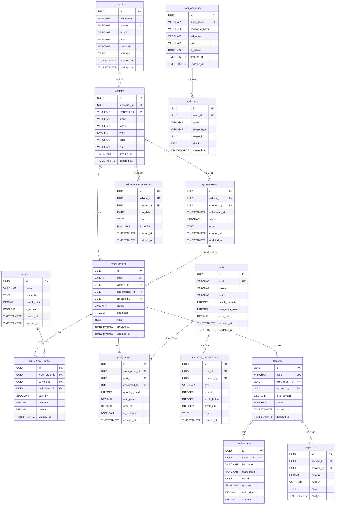

#### 5.3.5 Đặc tả bảng và quan hệ khóa ngoại

**Bảng `user_accounts`** — Module: UserModule
| Cột | Kiểu | Nullable | Mặc định | Ghi chú |
|---|---|---|---|---|
| `id` | UUID | NOT NULL | uuidv7() | PK |
| `login_name` | VARCHAR(50) | NOT NULL | — | UK `uq_user_accounts_login_name` |
| `password_hash` | VARCHAR(100) | NOT NULL | — | bcrypt hash, cost 12 |
| `full_name` | VARCHAR(100) | NOT NULL | — | |
| `role` | VARCHAR(30) | NOT NULL | — | Enum: Admin/ServiceAdvisor/Technician/InventoryClerk/Cashier/Manager |
| `is_active` | BOOLEAN | NOT NULL | TRUE | Soft-disable |
| `created_at` | TIMESTAMPTZ | NOT NULL | NOW() | |
| `updated_at` | TIMESTAMPTZ | NOT NULL | NOW() | |

---

**Bảng `customers`** — Module: CustomerModule
| Cột | Kiểu | Nullable | Mặc định | Ghi chú |
|---|---|---|---|---|
| `id` | UUID | NOT NULL | uuidv7() | PK |
| `full_name` | VARCHAR(100) | NOT NULL | — | |
| `phone` | VARCHAR(20) | NOT NULL | — | UK `uq_customers_phone` |
| `email` | VARCHAR(150) | NULL | — | |
| `type` | VARCHAR(20) | NOT NULL | `'individual'` | `individual` / `business` |
| `tax_code` | VARCHAR(20) | NULL | — | Chỉ khi type=business |
| `address` | TEXT | NULL | — | |
| `created_at` | TIMESTAMPTZ | NOT NULL | NOW() | |
| `updated_at` | TIMESTAMPTZ | NOT NULL | NOW() | |

---

**Bảng `vehicles`** — Module: CustomerModule
| Cột | Kiểu | Nullable | Mặc định | Ghi chú |
|---|---|---|---|---|
| `id` | UUID | NOT NULL | uuidv7() | PK |
| `customer_id` | UUID | NOT NULL | — | FK → `customers(id)` ON DELETE RESTRICT |
| `license_plate` | VARCHAR(20) | NOT NULL | — | UK `uq_vehicles_license_plate` |
| `brand` | VARCHAR(50) | NOT NULL | — | |
| `model` | VARCHAR(50) | NOT NULL | — | |
| `year` | SMALLINT | NULL | — | |
| `color` | VARCHAR(30) | NULL | — | |
| `vin` | VARCHAR(17) | NULL | — | Vehicle Identification Number |
| `created_at` | TIMESTAMPTZ | NOT NULL | NOW() | |
| `updated_at` | TIMESTAMPTZ | NOT NULL | NOW() | |

---

**Bảng `appointments`** — Module: AppointmentModule
| Cột | Kiểu | Nullable | Mặc định | Ghi chú |
|---|---|---|---|---|
| `id` | UUID | NOT NULL | uuidv7() | PK |
| `vehicle_id` | UUID | NOT NULL | — | FK → `vehicles(id)` ON DELETE RESTRICT |
| `created_by` | UUID | NOT NULL | — | FK → `user_accounts(id)` ON DELETE RESTRICT |
| `scheduled_at` | TIMESTAMPTZ | NOT NULL | — | |
| `status` | VARCHAR(20) | NOT NULL | `'Scheduled'` | Scheduled / Arrived / Cancelled |
| `note` | TEXT | NULL | — | |
| `created_at` | TIMESTAMPTZ | NOT NULL | NOW() | |
| `updated_at` | TIMESTAMPTZ | NOT NULL | NOW() | |

---

**Bảng `work_orders`** — Module: WorkOrderModule
| Cột | Kiểu | Nullable | Mặc định | Ghi chú |
|---|---|---|---|---|
| `id` | UUID | NOT NULL | uuidv7() | PK |
| `code` | VARCHAR(30) | NOT NULL | — | UK `uq_work_orders_code`, vd: `WO-20260614-001` |
| `vehicle_id` | UUID | NOT NULL | — | FK → `vehicles(id)` ON DELETE RESTRICT |
| `appointment_id` | UUID | NULL | — | FK → `appointments(id)` ON DELETE SET NULL |
| `created_by` | UUID | NOT NULL | — | FK → `user_accounts(id)` ON DELETE RESTRICT |
| `status` | VARCHAR(25) | NOT NULL | `'Received'` | State machine: xem 5.3.7 |
| `odometer` | INTEGER | NULL | — | km khi tiếp nhận |
| `note` | TEXT | NULL | — | |
| `created_at` | TIMESTAMPTZ | NOT NULL | NOW() | |
| `updated_at` | TIMESTAMPTZ | NOT NULL | NOW() | |

---

**Bảng `work_order_items`** — Module: WorkOrderModule
| Cột | Kiểu | Nullable | Mặc định | Ghi chú |
|---|---|---|---|---|
| `id` | UUID | NOT NULL | uuidv7() | PK |
| `work_order_id` | UUID | NOT NULL | — | FK → `work_orders(id)` ON DELETE CASCADE |
| `service_id` | UUID | NOT NULL | — | FK → `services(id)` ON DELETE RESTRICT |
| `technician_id` | UUID | NULL | — | FK → `user_accounts(id)` ON DELETE SET NULL |
| `quantity` | SMALLINT | NOT NULL | 1 | |
| `unit_price` | DECIMAL(12,0) | NOT NULL | — | Snapshot tại thời điểm ghi nhận |
| `amount` | DECIMAL(12,0) | NOT NULL | — | quantity × unit_price |
| `created_at` | TIMESTAMPTZ | NOT NULL | NOW() | |

---

**Bảng `services`** — Module: ServiceCatalogModule
| Cột | Kiểu | Nullable | Mặc định | Ghi chú |
|---|---|---|---|---|
| `id` | UUID | NOT NULL | uuidv7() | PK |
| `name` | VARCHAR(150) | NOT NULL | — | |
| `description` | TEXT | NULL | — | |
| `default_price` | DECIMAL(12,0) | NOT NULL | — | Đơn vị: VND, không lưu phần thập phân |
| `is_active` | BOOLEAN | NOT NULL | TRUE | |
| `created_at` | TIMESTAMPTZ | NOT NULL | NOW() | |
| `updated_at` | TIMESTAMPTZ | NOT NULL | NOW() | |

---

**Bảng `parts`** — Module: InventoryModule
| Cột | Kiểu | Nullable | Mặc định | Ghi chú |
|---|---|---|---|---|
| `id` | UUID | NOT NULL | uuidv7() | PK |
| `code` | VARCHAR(30) | NOT NULL | — | UK `uq_parts_code` |
| `name` | VARCHAR(150) | NOT NULL | — | |
| `unit` | VARCHAR(20) | NOT NULL | — | `cái`, `lít`, `bộ`, ... |
| `stock_quantity` | INTEGER | NOT NULL | 0 | Tồn kho hiện tại, CHECK ≥ 0 |
| `min_stock_level` | INTEGER | NOT NULL | 0 | Ngưỡng cảnh báo |
| `cost_price` | DECIMAL(12,0) | NOT NULL | — | Giá nhập |
| `created_at` | TIMESTAMPTZ | NOT NULL | NOW() | |
| `updated_at` | TIMESTAMPTZ | NOT NULL | NOW() | |

---

**Bảng `part_usages`** — Module: InventoryModule
| Cột | Kiểu | Nullable | Mặc định | Ghi chú |
|---|---|---|---|---|
| `id` | UUID | NOT NULL | uuidv7() | PK |
| `work_order_id` | UUID | NOT NULL | — | FK → `work_orders(id)` ON DELETE CASCADE |
| `part_id` | UUID | NOT NULL | — | FK → `parts(id)` ON DELETE RESTRICT |
| `confirmed_by` | UUID | NULL | — | FK → `user_accounts(id)` ON DELETE SET NULL |
| `quantity_used` | INTEGER | NOT NULL | — | CHECK > 0 |
| `unit_price` | DECIMAL(12,0) | NOT NULL | — | Snapshot |
| `amount` | DECIMAL(12,0) | NOT NULL | — | quantity_used × unit_price |
| `is_confirmed` | BOOLEAN | NOT NULL | FALSE | |
| `created_at` | TIMESTAMPTZ | NOT NULL | NOW() | |

---

**Bảng `inventory_transactions`** — Module: InventoryModule
| Cột | Kiểu | Nullable | Mặc định | Ghi chú |
|---|---|---|---|---|
| `id` | UUID | NOT NULL | uuidv7() | PK |
| `part_id` | UUID | NOT NULL | — | FK → `parts(id)` ON DELETE RESTRICT |
| `created_by` | UUID | NOT NULL | — | FK → `user_accounts(id)` ON DELETE RESTRICT |
| `type` | VARCHAR(15) | NOT NULL | — | `Import` / `Export` / `Adjustment` |
| `quantity` | INTEGER | NOT NULL | — | Số lượng thay đổi (dương/âm) |
| `stock_before` | INTEGER | NOT NULL | — | Snapshot tồn kho trước |
| `stock_after` | INTEGER | NOT NULL | — | Snapshot tồn kho sau |
| `note` | TEXT | NULL | — | |
| `created_at` | TIMESTAMPTZ | NOT NULL | NOW() | Immutable — không cho UPDATE/DELETE |

---

**Bảng `invoices`** — Module: InvoiceModule
| Cột | Kiểu | Nullable | Mặc định | Ghi chú |
|---|---|---|---|---|
| `id` | UUID | NOT NULL | uuidv7() | PK |
| `code` | VARCHAR(30) | NOT NULL | — | UK `uq_invoices_code` |
| `work_order_id` | UUID | NOT NULL | — | FK → `work_orders(id)` ON DELETE RESTRICT; UK (1 phiếu → 1 HĐ) |
| `created_by` | UUID | NOT NULL | — | FK → `user_accounts(id)` ON DELETE RESTRICT |
| `total_amount` | DECIMAL(14,0) | NOT NULL | — | Tổng tiền tại thời điểm lập |
| `status` | VARCHAR(15) | NOT NULL | `'Unpaid'` | `Unpaid` / `Paid` |
| `created_at` | TIMESTAMPTZ | NOT NULL | NOW() | |
| `updated_at` | TIMESTAMPTZ | NOT NULL | NOW() | |

---

**Bảng `invoice_lines`** — Module: InvoiceModule
| Cột | Kiểu | Nullable | Mặc định | Ghi chú |
|---|---|---|---|---|
| `id` | UUID | NOT NULL | uuidv7() | PK |
| `invoice_id` | UUID | NOT NULL | — | FK → `invoices(id)` ON DELETE CASCADE |
| `line_type` | VARCHAR(10) | NOT NULL | — | `service` / `part` |
| `description` | VARCHAR(200) | NOT NULL | — | Tên dịch vụ/phụ tùng tại thời điểm lập (snapshot) |
| `ref_id` | UUID | NULL | — | ID work_order_item hoặc part_usage (tham chiếu mềm) |
| `quantity` | SMALLINT | NOT NULL | — | |
| `unit_price` | DECIMAL(12,0) | NOT NULL | — | |
| `amount` | DECIMAL(12,0) | NOT NULL | — | |

---

**Bảng `payments`** — Module: InvoiceModule
| Cột | Kiểu | Nullable | Mặc định | Ghi chú |
|---|---|---|---|---|
| `id` | UUID | NOT NULL | uuidv7() | PK |
| `invoice_id` | UUID | NOT NULL | — | FK → `invoices(id)` ON DELETE RESTRICT |
| `created_by` | UUID | NOT NULL | — | FK → `user_accounts(id)` ON DELETE RESTRICT |
| `amount` | DECIMAL(14,0) | NOT NULL | — | |
| `method` | VARCHAR(15) | NOT NULL | — | `Cash` / `BankTransfer` / `Card` |
| `note` | TEXT | NULL | — | |
| `paid_at` | TIMESTAMPTZ | NOT NULL | NOW() | |

---

**Bảng `maintenance_reminders`** — Module: ReminderModule
| Cột | Kiểu | Nullable | Mặc định | Ghi chú |
|---|---|---|---|---|
| `id` | UUID | NOT NULL | uuidv7() | PK |
| `vehicle_id` | UUID | NOT NULL | — | FK → `vehicles(id)` ON DELETE CASCADE |
| `created_by` | UUID | NOT NULL | — | FK → `user_accounts(id)` ON DELETE RESTRICT |
| `due_date` | DATE | NOT NULL | — | |
| `note` | TEXT | NULL | — | |
| `is_notified` | BOOLEAN | NOT NULL | FALSE | |
| `created_at` | TIMESTAMPTZ | NOT NULL | NOW() | |
| `updated_at` | TIMESTAMPTZ | NOT NULL | NOW() | |

---

**Bảng `audit_logs`** — Module: AuditModule
| Cột | Kiểu | Nullable | Mặc định | Ghi chú |
|---|---|---|---|---|
| `id` | UUID | NOT NULL | uuidv7() | PK |
| `user_id` | UUID | NULL | — | FK → `user_accounts(id)` ON DELETE SET NULL |
| `action` | VARCHAR(50) | NOT NULL | — | Vd: `INVOICE_CREATED`, `STATUS_CHANGED` |
| `target_type` | VARCHAR(30) | NULL | — | Vd: `Invoice`, `WorkOrder` |
| `target_id` | UUID | NULL | — | ID bản ghi bị tác động |
| `detail` | TEXT | NULL | — | Mô tả chi tiết hành động |
| `created_at` | TIMESTAMPTZ | NOT NULL | NOW() | Immutable — append-only |

#### 5.3.6 Chiến lược index

**Nguyên tắc:** Chỉ tạo index khi có query pattern thực tế. Tránh over-index làm chậm INSERT/UPDATE.

| Index | Bảng | Cột | Loại | Lý do |
|---|---|---|---|---|
| `uq_user_accounts_login_name` | `user_accounts` | `login_name` | UNIQUE | Tra cứu đăng nhập |
| `uq_vehicles_license_plate` | `vehicles` | `license_plate` | UNIQUE | Kiểm tra trùng biển số |
| `uq_customers_phone` | `customers` | `phone` | UNIQUE | Kiểm tra trùng SĐT |
| `uq_parts_code` | `parts` | `code` | UNIQUE | Kiểm tra trùng mã phụ tùng |
| `uq_work_orders_code` | `work_orders` | `code` | UNIQUE | Mã phiếu duy nhất |
| `uq_invoices_work_order` | `invoices` | `work_order_id` | UNIQUE | 1 phiếu DV → 1 HĐ |
| `idx_work_orders_status` | `work_orders` | `status` | BTREE | Lọc phiếu theo trạng thái |
| `idx_work_orders_created_at` | `work_orders` | `created_at` | BTREE | Báo cáo theo kỳ |
| `idx_work_orders_vehicle_id` | `work_orders` | `vehicle_id` | BTREE | Lịch sử sửa chữa xe |
| `idx_invoices_status_created` | `invoices` | `(status, created_at)` | BTREE composite | Lọc HĐ chưa thanh toán theo ngày |
| `idx_part_usages_work_order` | `part_usages` | `work_order_id` | BTREE | JOIN khi tạo HĐ |
| `idx_inventory_transactions_part` | `inventory_transactions` | `(part_id, created_at)` | BTREE composite | Lịch sử giao dịch phụ tùng |
| `idx_parts_low_stock` | `parts` | `stock_quantity` | BTREE (partial) | `WHERE stock_quantity <= min_stock_level` |
| `idx_audit_logs_user_created` | `audit_logs` | `(user_id, created_at)` | BTREE composite | Tra cứu nhật ký theo user/ngày |
| `idx_maintenance_reminders_due` | `maintenance_reminders` | `(due_date, is_notified)` | BTREE composite | Lọc nhắc chưa gửi |
| `idx_appointments_scheduled` | `appointments` | `(scheduled_at, status)` | BTREE composite | Xem lịch theo ngày |

#### 5.3.7 State machine WorkOrder — ràng buộc dữ liệu

Cột `status` của bảng `work_orders` tuân theo state machine sau. Ràng buộc chuyển trạng thái được enforce ở tầng application (WorkOrderStateMachine), không dùng trigger DB để dễ test:

```
Received → Diagnosing → Repairing → WaitingParts → Repairing  (vòng lặp)
Repairing → ReadyForDelivery → Delivered
Received / Diagnosing / Repairing / WaitingParts / ReadyForDelivery → Cancelled
```

**Điều kiện bổ sung:**
- Không thể chuyển sang `Delivered` nếu chưa tồn tại `invoice` cho phiếu với `status = 'Paid'`.
- Không thể thêm `work_order_items` hoặc `part_usages` khi `status` là `Delivered` hoặc `Cancelled`.

#### 5.3.8 Phân quyền data access theo module

Hệ thống sử dụng single schema `public` (phù hợp Modular Monolith). Phân quyền data access được enforce ở tầng application (Repository pattern) — không phải PostgreSQL GRANT:

| Module | Bảng sở hữu (write) | Bảng đọc thêm (read-only) |
|---|---|---|
| AuthModule | — | `user_accounts` |
| UserModule | `user_accounts` | — |
| CustomerModule | `customers`, `vehicles` | — |
| AppointmentModule | `appointments` | `vehicles`, `user_accounts` |
| WorkOrderModule | `work_orders`, `work_order_items` | `vehicles`, `appointments`, `services`, `user_accounts` |
| InventoryModule | `parts`, `part_usages`, `inventory_transactions` | `work_orders` |
| ServiceCatalogModule | `services` | — |
| InvoiceModule | `invoices`, `invoice_lines`, `payments` | `work_orders`, `work_order_items`, `part_usages` |
| ReportModule | — | `invoices`, `payments`, `work_orders`, `parts` |
| ReminderModule | `maintenance_reminders` | `vehicles` |
| AuditModule | `audit_logs` | `user_accounts` |

#### 5.3.9 Ước tính khối lượng dữ liệu (MVP — 1 năm vận hành)
| Bảng | Ước tính số bản ghi/năm | Ghi chú |
|---|---|---|
| `work_orders` | ~3.000 | ~250 xe/tháng |
| `work_order_items` | ~9.000 | ~3 hạng mục/phiếu |
| `part_usages` | ~6.000 | ~2 phụ tùng/phiếu |
| `inventory_transactions` | ~2.400 | ~200 giao dịch/tháng |
| `invoices` / `invoice_lines` | ~3.000 / ~18.000 | 1:1 với work_orders |
| `payments` | ~3.000 | 1:1 với invoices (MVP) |
| `audit_logs` | ~50.000 | ~4.000 action/tháng |
| `customers` / `vehicles` | ~500 / ~600 | Tích lũy |

Tất cả bảng ở quy mô này không cần partitioning. Nếu mở rộng sau 3 năm, xem xét range partition `work_orders` và `audit_logs` theo `created_at` (monthly).

### 5.4 Security Design

#### 5.4.1 Tổng quan bảo mật và mô hình mối đe dọa

**Mục tiêu bảo mật** (bám theo NFR nhóm S — Security từ mục 3.2):
- **Xác thực:** Chỉ người dùng hợp lệ với thông tin đăng nhập đúng mới truy cập được hệ thống.
- **Phân quyền:** Mỗi vai trò chỉ thực hiện đúng tập thao tác được cấp phép; không có leo thang đặc quyền ngang hàng.
- **Toàn vẹn dữ liệu:** Dữ liệu nghiệp vụ quan trọng (hóa đơn, tồn kho) không bị sửa đổi trái phép.
- **Bảo mật truyền tải:** Mọi giao tiếp client–server đều mã hóa qua HTTPS/TLS.
- **Kiểm toán:** Mọi thao tác nhạy cảm đều được ghi nhật ký không thể xóa/sửa.

**Mối đe dọa chính** (phân tích STRIDE rút gọn):
| Mối đe dọa | Kịch bản | Biện pháp đối phó |
|---|---|---|
| Spoofing | Giả mạo danh tính người dùng | JWT + bcrypt; rate-limit login |
| Tampering | Sửa dữ liệu hóa đơn, tồn kho | FK constraints + Prisma transaction; Audit log |
| Information Disclosure | Lộ thông tin khách hàng qua API | RBAC; HTTPS; không log dữ liệu nhạy cảm |
| Denial of Service | Tấn công brute-force / flood | Rate limiting (helmet + express-rate-limit) |
| Elevation of Privilege | Người dùng thường truy cập route Admin | RolesGuard + @Roles() decorator; kiểm tra server-side |
| Injection | SQL Injection, XSS | Prisma parameterized query; Zod validation; Helmet CSP |

#### 5.4.2 Thiết kế xác thực (Authentication)

**Cơ chế:** JWT (JSON Web Token) lưu trong HTTP-only cookie, kết hợp Refresh Token opaque lưu DB.

**Luồng đăng nhập:**
```
1. Client POST /auth/login { loginName, password }
2. Server: tìm user theo loginName (UserRepository)
3. Server: so sánh password với bcrypt.compare(password, hash) — cost factor 12
4. Nếu hợp lệ:
   a. Tạo access_token (JWT, TTL 15 phút, payload: { sub: userId, role })
   b. Tạo refresh_token (opaque UUID, lưu vào DB với TTL 7 ngày)
   c. Set-Cookie: access_token=<jwt>; HttpOnly; Secure; SameSite=Strict
   d. Set-Cookie: refresh_token=<opaque>; HttpOnly; Secure; SameSite=Strict
5. Response: { userId, fullName, role }
```

**Luồng refresh token:**
```
1. Client POST /auth/refresh (cookie refresh_token tự động đính kèm)
2. Server: tìm refresh_token trong DB, kiểm tra chưa hết hạn và chưa thu hồi
3. Nếu hợp lệ: phát access_token mới, rotate refresh_token (thu hồi cũ, tạo mới)
4. Set-Cookie: access_token=<new_jwt>; ...
```

**Luồng đăng xuất:**
```
1. Client POST /auth/logout
2. Server: thu hồi refresh_token trong DB (set revoked=true)
3. Server: Clear-Cookie: access_token; Clear-Cookie: refresh_token
```

**Cấu hình JWT:**
| Thuộc tính | Giá trị |
|---|---|
| Algorithm | HS256 (HMAC-SHA256) |
| Secret | `JWT_SECRET` từ biến môi trường (≥ 32 ký tự ngẫu nhiên) |
| Access token TTL | 900 giây (15 phút) |
| Refresh token TTL | 604800 giây (7 ngày) |
| Payload | `{ sub, role, iat, exp }` — không chứa thông tin nhạy cảm |

**Chính sách mật khẩu:**
| Quy tắc | Giá trị |
|---|---|
| Độ dài tối thiểu | 8 ký tự |
| Yêu cầu | Tối thiểu 1 chữ hoa, 1 chữ số |
| Hashing | bcrypt, cost factor 12 |
| Lưu trữ | Chỉ lưu hash, không bao giờ lưu plaintext |
| Đổi mật khẩu | Yêu cầu xác nhận mật khẩu cũ qua `PATCH /auth/change-password` |

#### 5.4.3 Thiết kế phân quyền (Authorization — RBAC)

**Mô hình:** Role-Based Access Control (RBAC) thuần túy — mỗi user có đúng 1 role, mỗi route được bảo vệ bởi decorator `@Roles(Role.ServiceAdvisor, ...)`.

**Luồng enforce phân quyền tại server:**
```
HTTP Request
    → JwtAuthGuard (validate JWT, inject user context)
    → RolesGuard (so sánh user.role với @Roles() metadata)
    → Controller handler
```

**Ma trận quyền chi tiết (Role × Action):**

| Resource | Admin | Service Advisor | Technician | Inventory Clerk | Cashier | Manager |
|---|---|---|---|---|---|---|
| User CRUD | ✔ | — | — | — | — | — |
| Customer read | ✔ | ✔ | — | — | — | ✔ |
| Customer write | ✔ | ✔ | — | — | — | — |
| Vehicle read | ✔ | ✔ | ✔ | — | — | ✔ |
| Vehicle write | ✔ | ✔ | — | — | — | — |
| Appointment CRUD | ✔ | ✔ | — | — | — | ✔ (read) |
| WorkOrder create | ✔ | ✔ | — | — | — | — |
| WorkOrder read | ✔ | ✔ | ✔ | — | — | ✔ |
| WorkOrder status update | ✔ | ✔ | ✔ | — | — | — |
| WorkOrderItem write | ✔ | ✔ | ✔ | — | — | — |
| Service Catalog CRUD | ✔ | — | — | — | — | ✔ |
| Parts read | ✔ | ✔ | ✔ | ✔ | — | ✔ |
| Parts write | ✔ | — | — | ✔ | — | — |
| PartUsage write | ✔ | ✔ | ✔ | ✔ | — | — |
| InventoryTransaction | ✔ | — | — | ✔ | — | ✔ (read) |
| Invoice create | ✔ | — | — | — | ✔ | — |
| Invoice read | ✔ | — | — | — | ✔ | ✔ |
| Payment write | ✔ | — | — | — | ✔ | — |
| Reports | ✔ | — | — | — | — | ✔ |
| Reminders | ✔ | ✔ | — | — | — | ✔ |
| Audit Logs read | ✔ | — | — | — | — | ✔ |

**Điểm enforce:**
- `JwtAuthGuard` — global, áp dụng cho mọi route trừ `POST /auth/login`.
- `RolesGuard` — áp dụng khi route có decorator `@Roles(...)`.
- Không có client-side enforcement — frontend ẩn menu là UX, không phải security.

#### 5.4.4 Bảo vệ dữ liệu và mã hóa

**Mã hóa truyền tải:**
- **HTTPS/TLS 1.3** bắt buộc trên môi trường production.
- HSTS header (`Strict-Transport-Security: max-age=31536000; includeSubDomains`) do `helmet` cấu hình.
- Môi trường dev có thể dùng HTTP; staging/prod bắt buộc HTTPS với certificate hợp lệ.

**Mã hóa lưu trữ:**
- Mật khẩu: bcrypt hash (cost 12) — không lưu plaintext.
- Refresh token: lưu dạng opaque UUID trong DB — không cần mã hóa thêm (không chứa claim).
- Dữ liệu khách hàng (số điện thoại, địa chỉ): lưu plaintext trong DB; DB server đặt trong mạng nội bộ, không expose ra ngoài.
- Backup: pg_dump + lưu trữ có mã hóa filesystem (AES-256) trên server backup.

**Dữ liệu nhạy cảm — quy tắc không log:**
| Dữ liệu | Quy tắc |
|---|---|
| Mật khẩu / password_hash | Không bao giờ log, không trả về trong response |
| JWT access_token | Không log; truyền qua cookie HttpOnly |
| Refresh token | Không log; chỉ lưu hash hoặc UUID trong DB |
| Thông tin KH (phone, email) | Log ở mức INFO là chấp nhận; không log ở ERROR stack trace |

**Phân loại dữ liệu:**
| Loại | Ví dụ | Cách bảo vệ |
|---|---|---|
| Bí mật (Secret) | password_hash, JWT secret | bcrypt; env var; không expose |
| Nhạy cảm (Sensitive) | Thông tin KH, số điện thoại | HTTPS; RBAC; không expose qua sai role |
| Nghiệp vụ (Business) | Hóa đơn, phiếu DV, tồn kho | RBAC; Prisma transaction; audit log |
| Công khai nội bộ (Internal) | Danh mục dịch vụ, phụ tùng | HTTPS; xác thực JWT |

#### 5.4.5 Kiểm soát bảo mật và phòng chống tấn công

**Input Validation — Zod schema:**
- Tất cả request body/query param được validate qua `ZodValidationPipe` (global) trước khi vào Controller handler.
- Prisma sử dụng parameterized query — loại trừ SQL Injection.
- Không có string interpolation trong câu query.

**XSS Prevention:**
- Dữ liệu từ user không được render trực tiếp thành HTML (React escapes by default).
- `helmet` thiết lập `Content-Security-Policy: default-src 'self'` để chặn inline script.

**CSRF Protection:**
- Cookie `SameSite=Strict` ngăn cross-site request gửi cookie.
- API chỉ chấp nhận `Content-Type: application/json` — form-based CSRF không áp dụng.

**Security Headers (helmet):**
| Header | Giá trị | Mục đích |
|---|---|---|
| `Content-Security-Policy` | `default-src 'self'` | Chặn XSS inline |
| `X-Frame-Options` | `DENY` | Chặn clickjacking |
| `X-Content-Type-Options` | `nosniff` | Chặn MIME sniffing |
| `Strict-Transport-Security` | `max-age=31536000` | Bắt buộc HTTPS |
| `X-XSS-Protection` | `0` (disable legacy) | Không dùng IE XSS filter cũ |
| `Referrer-Policy` | `no-referrer` | Không lộ URL khi redirect |

**Rate Limiting (`express-rate-limit`):**
| Endpoint | Giới hạn | Window | Hành động khi vượt |
|---|---|---|---|
| `POST /auth/login` | 10 request | 1 phút / IP | 429 + `Retry-After` header |
| Tất cả endpoint khác | 100 request | 1 phút / IP | 429 |
| `GET /reports/*` | 30 request | 1 phút / IP | 429 (query nặng) |

**CORS (`cors` middleware):**
```
origin: ['http://localhost:5173']   (dev)
        ['https://<frontend-domain>']   (prod)
credentials: true   (cần thiết để gửi cookie)
methods: ['GET', 'POST', 'PATCH', 'DELETE']
```

#### 5.4.6 Chính sách Audit Log

**Sự kiện bắt buộc ghi log:**
| Nhóm | Sự kiện | Action code |
|---|---|---|
| Auth | Đăng nhập thành công | `LOGIN_SUCCESS` |
| Auth | Đăng nhập thất bại | `LOGIN_FAILED` |
| Auth | Đăng xuất | `LOGOUT` |
| Auth | Đổi mật khẩu | `PASSWORD_CHANGED` |
| User | Tạo / vô hiệu hóa tài khoản | `USER_CREATED`, `USER_DEACTIVATED` |
| WorkOrder | Tạo phiếu DV | `WORK_ORDER_CREATED` |
| WorkOrder | Chuyển trạng thái | `WORK_ORDER_STATUS_CHANGED` |
| WorkOrder | Thêm hạng mục | `WORK_ORDER_ITEM_ADDED` |
| Inventory | Giao dịch nhập/xuất/điều chỉnh kho | `INVENTORY_TRANSACTION_RECORDED` |
| Invoice | Tạo hóa đơn | `INVOICE_CREATED` |
| Invoice | Ghi nhận thanh toán | `PAYMENT_RECORDED` |
| PartUsage | Xác nhận phụ tùng sử dụng | `PART_USAGE_CONFIRMED` |

**Cơ chế ghi log:**
- `AuditInterceptor` (NestJS Interceptor) tự động ghi sau khi response thành công với decorator `@Audit(action)`.
- Bảng `audit_logs` là **append-only**: không có endpoint DELETE/UPDATE; không có ON DELETE CASCADE từ bảng khác tới `audit_logs`.
- `user_id` FK dùng `ON DELETE SET NULL` để giữ log ngay khi tài khoản bị vô hiệu hóa.

**Lưu trữ và bảo vệ:**
| Thuộc tính | Giá trị |
|---|---|
| Thời gian lưu trữ | Tối thiểu 2 năm (MVP); không tự động xóa |
| Quyền truy cập | Admin và Manager (read-only via API) |
| Chỉnh sửa / xóa | Không cho phép qua bất kỳ API nào |
| Backup | Bao gồm trong pg_dump hàng ngày |

#### 5.4.7 Quản lý bí mật (Secrets Management)

| Bí mật | Lưu ở đâu | Cách truy cập |
|---|---|---|
| `JWT_SECRET` | Biến môi trường (`.env`, không commit) | `process.env.JWT_SECRET` |
| `DATABASE_URL` | Biến môi trường | `process.env.DATABASE_URL` |
| `COOKIE_SECRET` (nếu dùng signed cookie) | Biến môi trường | `process.env.COOKIE_SECRET` |
| Refresh token DB value | PostgreSQL `refresh_tokens` table | Prisma query; so sánh exact match |

**Quy tắc:**
- File `.env` không được commit vào Git (`.gitignore`).
- `.env.example` chứa key nhưng không có value thật.
- Trên production: inject qua CI/CD secret manager (GitHub Actions Secrets, Doppler, hoặc tương đương).
- Không hardcode secret trong source code — nếu phát hiện → rotate ngay lập tức.

#### 5.4.8 Giám sát bảo mật và phản ứng sự cố

**Ngưỡng cảnh báo:**
| Điều kiện | Ngưỡng | Hành động |
|---|---|---|
| `LOGIN_FAILED` liên tiếp từ 1 IP | > 5 lần / phút | Rate-limit tự động (429); log tập trung |
| `LOGIN_FAILED` cùng 1 user | > 10 lần / 15 phút | Tạm khóa account 15 phút (logic ở AuthService) |
| Truy cập route không có quyền (403) | > 20 lần / phút / IP | Log; xem xét block IP |
| Query báo cáo timeout | > 5 giây | Log slow query; alert dev |

**Phản ứng sự cố (Incident Response):**
1. **Phát hiện:** Kiểm tra `audit_logs` + log server (`winston` hoặc `pino`).
2. **Cô lập:** Vô hiệu hóa tài khoản bị compromise qua `PATCH /users/:id` (`is_active=false`); thu hồi tất cả refresh token của user đó.
3. **Khôi phục:** Restore từ backup pg_dump nếu dữ liệu bị sửa trái phép.
4. **Phân tích:** Truy vết `audit_logs` từ `target_id` / `user_id` / thời gian sự cố.
5. **Báo cáo:** Ghi biên bản sự cố, đánh giá thiệt hại, cập nhật chính sách nếu cần.

### 6.1 Class Design

#### 6.1.1 Tổ chức class theo package

Mỗi NestJS module tương ứng với một package/namespace chứa 4 tầng class cố định:

```
src/
├── modules/
│   ├── auth/
│   │   ├── auth.controller.ts          <<controller>>
│   │   ├── auth.service.ts             <<service>>
│   │   ├── strategies/jwt.strategy.ts  <<infrastructure>>
│   │   ├── guards/jwt-auth.guard.ts    <<guard>>
│   │   ├── guards/roles.guard.ts       <<guard>>
│   │   └── dto/                        <<dto>>
│   ├── work-order/
│   │   ├── work-order.controller.ts
│   │   ├── work-order.service.ts
│   │   ├── work-order-state-machine.ts <<domain service>>
│   │   ├── work-order.repository.ts    <<repository>>
│   │   └── dto/
│   └── ... (các module tương tự)
├── common/
│   ├── decorators/                     Roles, Audit
│   ├── filters/global-exception.filter.ts
│   ├── interceptors/audit.interceptor.ts
│   ├── pipes/zod-validation.pipe.ts
│   └── types/                          Enums, shared types
└── prisma/
    └── prisma.service.ts               <<infrastructure>>
```

#### 6.1.2 Class diagram — Module WorkOrder (module cốt lõi)

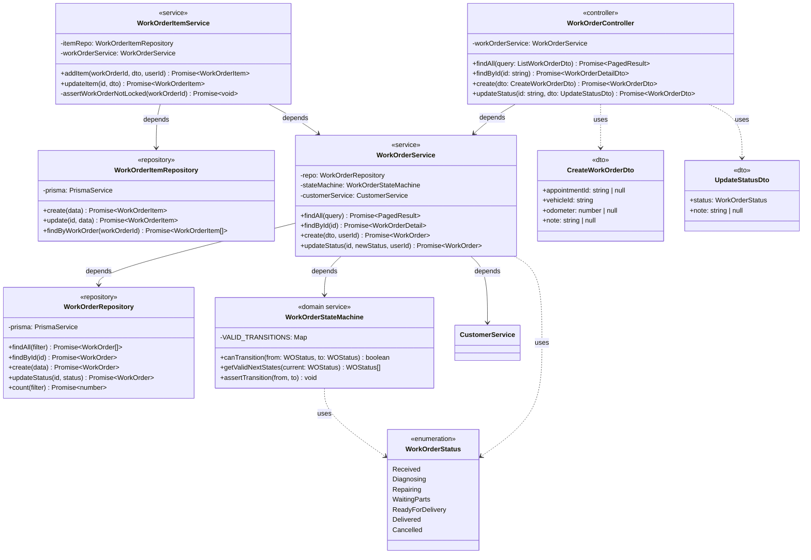

#### 6.1.3 Class diagram — Module Inventory (phức tạp thứ hai)

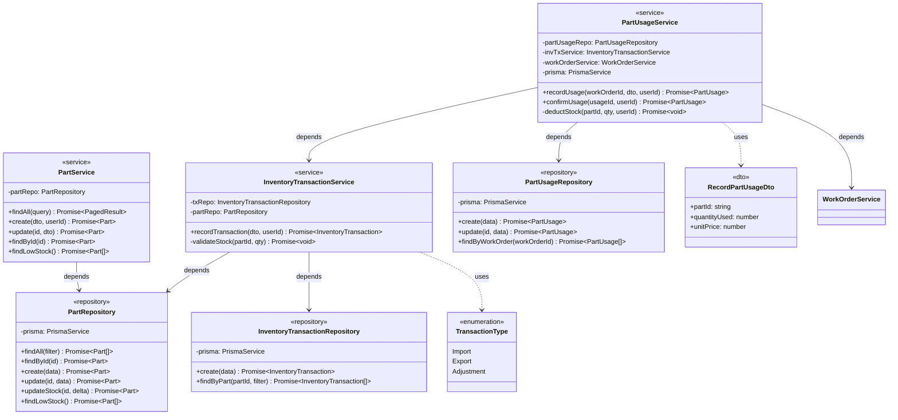

#### 6.1.4 Class diagram — Module Auth & User

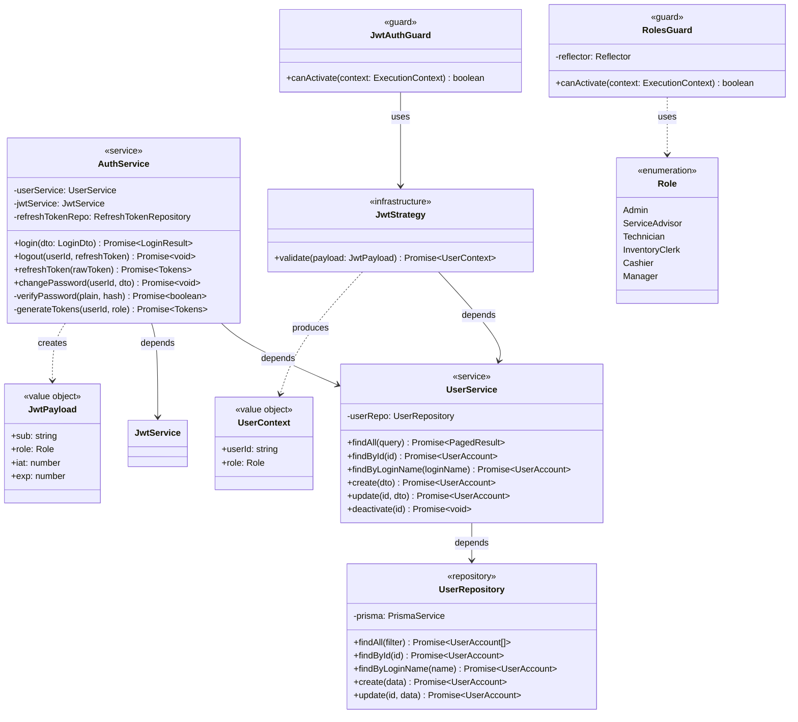

#### 6.1.5 Class diagram — Module Invoice

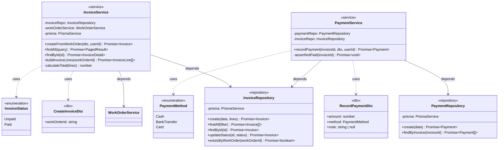

#### 6.1.6 Design patterns áp dụng

| Pattern | Vấn đề giải quyết | Class liên quan |
|---|---|---|
| **Repository** | Tách biệt business logic với data access; dễ mock trong test | Tất cả `*Repository` — `WorkOrderRepository`, `PartRepository`, ... |
| **Strategy** (qua state machine) | Kiểm soát chuyển trạng thái phiếu DV linh hoạt, tách khỏi Service | `WorkOrderStateMachine` — `canTransition()`, `assertTransition()` |
| **Dependency Injection** | Giảm coupling, dễ test; NestJS DI container quản lý | Tất cả constructor injection: `WorkOrderService(repo, stateMachine, customerService)` |
| **DTO pattern** | Tách contract API khỏi entity domain; validation tại boundary | `CreateWorkOrderDto`, `UpdateStatusDto`, `RecordPaymentDto`, ... |
| **Guard pattern** (NestJS) | Tập trung kiểm tra auth/role trước khi vào handler | `JwtAuthGuard`, `RolesGuard` |
| **Interceptor pattern** (NestJS) | Cross-cutting concern: tự động ghi audit log không xâm phạm business | `AuditInterceptor` |
| **Snapshot pattern** | Bảo toàn giá trị tại thời điểm ghi nhận (đơn giá, mô tả HĐ) | `InvoiceLine.description`, `WorkOrderItem.unitPrice`, `PartUsage.unitPrice` |

#### 6.1.7 Mapping Entity class — Database table

| Entity / Class | Bảng DB | Module sở hữu | Ghi chú |
|---|---|---|---|
| `UserAccount` | `user_accounts` | UserModule | |
| `Customer` | `customers` | CustomerModule | |
| `Vehicle` | `vehicles` | CustomerModule | |
| `Appointment` | `appointments` | AppointmentModule | |
| `WorkOrder` | `work_orders` | WorkOrderModule | |
| `WorkOrderItem` | `work_order_items` | WorkOrderModule | |
| `Service` | `services` | ServiceCatalogModule | Tránh trùng tên NestJS `Service` → dùng `ServiceItem` hoặc `RepairService` |
| `Part` | `parts` | InventoryModule | |
| `PartUsage` | `part_usages` | InventoryModule | |
| `InventoryTransaction` | `inventory_transactions` | InventoryModule | |
| `Invoice` | `invoices` | InvoiceModule | |
| `InvoiceLine` | `invoice_lines` | InvoiceModule | |
| `Payment` | `payments` | InvoiceModule | |
| `MaintenanceReminder` | `maintenance_reminders` | ReminderModule | |
| `AuditLog` | `audit_logs` | AuditModule | |

#### 6.1.8 Nguyên tắc SOLID áp dụng

| Nguyên tắc | Cách áp dụng trong hệ thống |
|---|---|
| **S** — Single Responsibility | Mỗi Service chỉ xử lý 1 domain; `WorkOrderStateMachine` chỉ lo state transition |
| **O** — Open/Closed | Thêm trạng thái WorkOrder mới chỉ cần sửa `VALID_TRANSITIONS` map trong StateMachine |
| **L** — Liskov Substitution | Repository class có thể được mock trong test mà không thay đổi behaviour |
| **I** — Interface Segregation | DTO tách biệt theo từng use case (`CreateWorkOrderDto` ≠ `UpdateStatusDto`) |
| **D** — Dependency Inversion | Service phụ thuộc vào abstraction (Repository interface) không phải Prisma trực tiếp |

### 6.2 Sequence Diagram

#### 6.2.1 Use case được chọn để vẽ sequence diagram

Dựa trên độ phức tạp nghiệp vụ và mức rủi ro kỹ thuật, 5 luồng sau được lựa chọn:

| STT | Use Case | Lý do chọn |
|---|---|---|
| SD-01 | Đăng nhập (UC-01) | Luồng cốt lõi; liên quan AuthService, JWT, cookie |
| SD-02 | Tạo phiếu dịch vụ và thêm hạng mục (UC-07, UC-08) | Nhiều component; state machine khởi tạo |
| SD-03 | Cập nhật trạng thái phiếu DV (UC-09) | State machine transition; điều kiện biên |
| SD-04 | Ghi nhận phụ tùng sử dụng và trừ tồn kho (UC-13) | Prisma transaction phức tạp; tồn kho âm |
| SD-05 | Lập hóa đơn và ghi nhận thanh toán (UC-14, UC-15) | Snapshot pattern; cross-module aggregate |

#### 6.2.2 SD-01 — Luồng đăng nhập

**Kịch bản:** Người dùng đăng nhập thành công với loginName và password đúng.

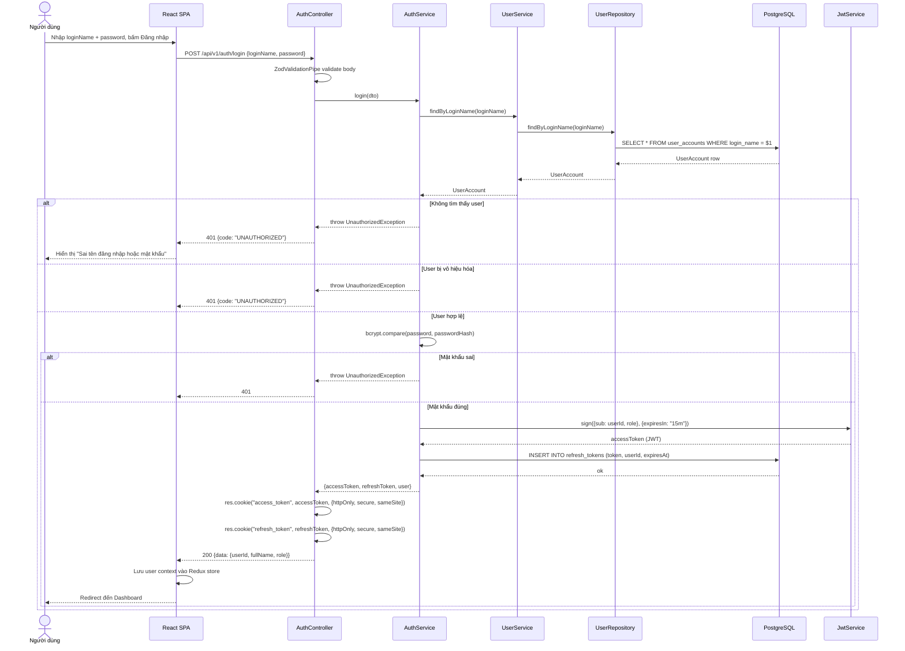

**Luồng thay thế — SD-01b: Refresh token**

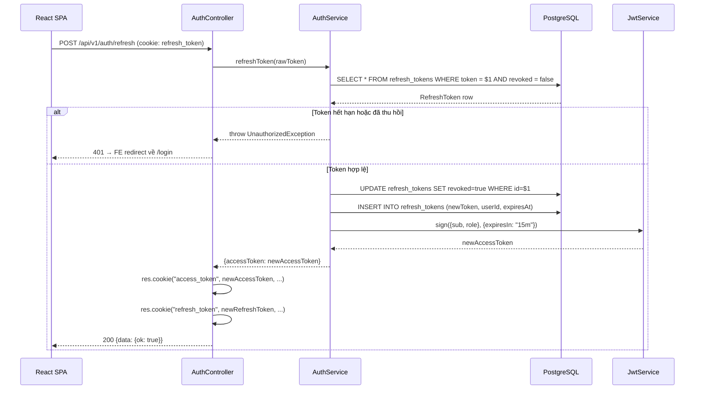

#### 6.2.3 SD-02 — Luồng tạo phiếu dịch vụ và thêm hạng mục

**Kịch bản:** Service Advisor tạo phiếu DV trực tiếp (không từ lịch hẹn) rồi thêm 1 hạng mục dịch vụ.

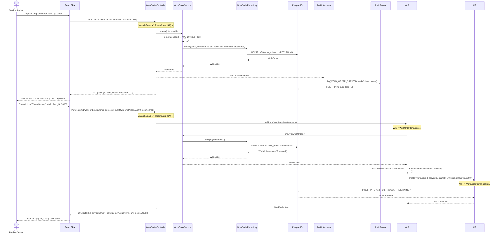

#### 6.2.4 SD-03 — Luồng cập nhật trạng thái phiếu DV (State Machine)

**Kịch bản A (thành công):** Technician chuyển phiếu từ `Repairing` → `ReadyForDelivery`.  
**Kịch bản B (thất bại):** Cố chuyển trực tiếp `Received` → `Delivered` (invalid transition).

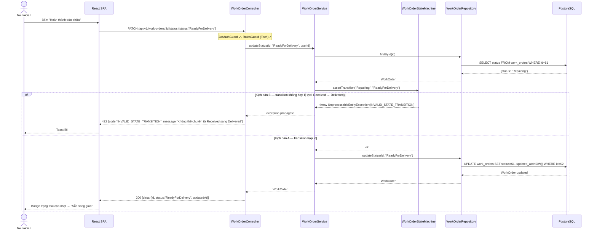

#### 6.2.5 SD-04 — Luồng ghi nhận phụ tùng sử dụng và trừ tồn kho

**Kịch bản:** Inventory Clerk xác nhận phụ tùng dùng cho phiếu DV; hệ thống trừ tồn kho trong Prisma transaction.

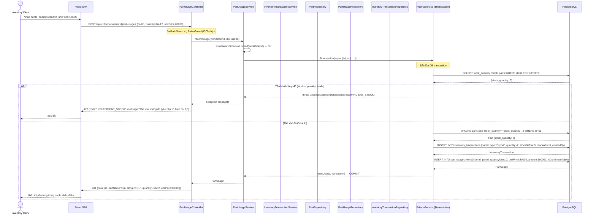

#### 6.2.6 SD-05 — Luồng lập hóa đơn và ghi nhận thanh toán

**Kịch bản:** Cashier lập hóa đơn từ phiếu DV đã `ReadyForDelivery`, sau đó ghi nhận thanh toán tiền mặt.

```mermaid
sequenceDiagram
    actor Cashier
    participant FE as React SPA
    participant IC as InvoiceController
    participant IS as InvoiceService
    participant IR as InvoiceRepository
    participant WOS as WorkOrderService
    participant Prisma as PrismaService ($transaction)
    participant DB as PostgreSQL
    participant PC as PaymentController
    participant PS as PaymentService

    Cashier->>FE: Bấm "Lập hóa đơn" cho phiếu DV
    FE->>IC: POST /api/v1/invoices {workOrderId}
    Note over IC: JwtAuthGuard ✓, RolesGuard (Cashier) ✓

    IC->>IS: createFromWorkOrder(dto, userId)
    IS->>IR: existsByWorkOrder(workOrderId)
    IR->>DB: SELECT id FROM invoices WHERE work_order_id=$1
    DB-->>IR: null

    alt Đã có hóa đơn cho phiếu này
        IS-->>IC: throw ConflictException(CONFLICT)
        IC-->>FE: 409 {code:"CONFLICT"}
    else Chưa có hóa đơn
        IS->>WOS: findById(workOrderId) — lấy items + partUsages
        WOS->>DB: SELECT work_order_items + part_usages JOIN
        DB-->>WOS: {items: [...], partUsages: [...]}
        WOS-->>IS: WorkOrderDetail

        IS->>IS: buildInvoiceLines(workOrderDetail)
        Note over IS: Snapshot tên dịch vụ, tên phụ tùng, đơn giá tại thời điểm lập HĐ

        IS->>IS: calculateTotal(lines) → 850000

        IS->>Prisma: $transaction(async (tx) => { ... })
        Prisma->>DB: INSERT INTO invoices (code:"INV-20260614-001", workOrderId, totalAmount:850000, status:"Unpaid", createdBy)
        DB-->>Prisma: Invoice

        Prisma->>DB: INSERT INTO invoice_lines (...) VALUES (nhiều dòng)
        DB-->>Prisma: InvoiceLine[]

        Prisma->>DB: UPDATE work_orders SET status="Delivered" WHERE id=$1
        DB-->>Prisma: ok — COMMIT

        Prisma-->>IS: Invoice with lines
        IS-->>IC: InvoiceDetail
        IC-->>FE: 201 {data: {id, code, totalAmount:850000, status:"Unpaid", lines:[...]}}
        FE-->>Cashier: Hiển thị hóa đơn, tổng 850.000đ

        Cashier->>FE: Xác nhận thanh toán tiền mặt, bấm "Ghi nhận"
        FE->>PC: POST /api/v1/invoices/:id/payments {amount:850000, method:"Cash"}
        Note over PC: JwtAuthGuard ✓, RolesGuard (Cashier) ✓

        PC->>PS: recordPayment(invoiceId, dto, userId)
        PS->>IR: findById(invoiceId) — kiểm tra status
        IR->>DB: SELECT status FROM invoices WHERE id=$1
        DB-->>IR: {status: "Unpaid"}

        alt Hóa đơn đã thanh toán
            PS-->>PC: throw UnprocessableEntityException(INVOICE_ALREADY_PAID)
            PC-->>FE: 422
        else Chưa thanh toán
            PS->>DB: INSERT INTO payments (invoiceId, amount:850000, method:"Cash", createdBy, paidAt)
            DB-->>PS: Payment
            PS->>IR: updateStatus(invoiceId, "Paid")
            IR->>DB: UPDATE invoices SET status="Paid", updated_at=NOW()
            DB-->>IR: ok
            PS-->>PC: Payment
            PC-->>FE: 200 {data: {invoiceId, paymentId, status:"Paid", paidAt}}
            FE-->>Cashier: Badge "Đã thanh toán"; phiếu DV chuyển sang Delivered
        end
    end
```

#### 6.2.7 Ma trận cross-reference — Use Case × Class × Method

| Sequence | Use Case | Controller | Service | Repository | Method chính |
|---|---|---|---|---|---|
| SD-01 | UC-01 Login | AuthController | AuthService | UserRepository | `login()`, `bcrypt.compare()`, `sign()` |
| SD-01b | UC-01 Refresh | AuthController | AuthService | RefreshTokenRepo | `refreshToken()`, rotate token |
| SD-02 | UC-07, UC-08 | WorkOrderController | WorkOrderService, WorkOrderItemService | WorkOrderRepository, WorkOrderItemRepository | `create()`, `addItem()`, `assertNotLocked()` |
| SD-03 | UC-09 | WorkOrderController | WorkOrderService, WorkOrderStateMachine | WorkOrderRepository | `updateStatus()`, `assertTransition()` |
| SD-04 | UC-13 | PartUsageController | PartUsageService, InventoryTransactionService | PartRepository, PartUsageRepo, InvTxRepo | `recordUsage()`, `$transaction()` |
| SD-05 | UC-14, UC-15 | InvoiceController, PaymentController | InvoiceService, PaymentService | InvoiceRepository, PaymentRepository | `createFromWorkOrder()`, `buildInvoiceLines()`, `recordPayment()` |

### 6.3 UI High Fidelity

#### 6.3.1 Design System — Hệ thống thiết kế giao diện

**Bảng màu (Color Palette):**
| Token | Hex | Dùng cho |
|---|---|---|
| `primary-600` | `#2563EB` | Nút chính, link, border focus |
| `primary-700` | `#1D4ED8` | Hover trạng thái nút chính |
| `primary-50` | `#EFF6FF` | Background highlight, active menu item |
| `success-500` | `#10B981` | Badge "Đã thanh toán", "Hoàn thành" |
| `warning-500` | `#F59E0B` | Badge "Chờ phụ tùng", "Chưa thanh toán" |
| `danger-500` | `#EF4444` | Lỗi validation, badge "Hủy" |
| `info-500` | `#3B82F6` | Badge "Đang sửa", thông báo info |
| `neutral-900` | `#111827` | Văn bản tiêu đề |
| `neutral-600` | `#4B5563` | Văn bản body |
| `neutral-400` | `#9CA3AF` | Placeholder, label phụ |
| `neutral-100` | `#F3F4F6` | Background bảng row xen kẽ |
| `neutral-50` | `#F9FAFB` | Background sidebar, panel |
| `white` | `#FFFFFF` | Background card, modal |

Tất cả cặp màu văn bản/nền đạt tỷ lệ contrast tối thiểu **4.5:1** (WCAG AA).

**Typography:**
| Level | Font | Size | Weight | Line Height | Dùng cho |
|---|---|---|---|---|---|
| `h1` | Inter | 28px | 700 | 1.3 | Tiêu đề trang |
| `h2` | Inter | 22px | 600 | 1.35 | Tiêu đề section, card |
| `h3` | Inter | 18px | 600 | 1.4 | Tiêu đề sub-section |
| `body-lg` | Inter | 16px | 400 | 1.5 | Văn bản chính |
| `body` | Inter | 14px | 400 | 1.5 | Nhãn bảng, form label |
| `body-sm` | Inter | 13px | 400 | 1.4 | Caption, helper text |
| `code` | JetBrains Mono | 13px | 400 | 1.5 | Mã phiếu, mã hóa đơn |

**Spacing scale (base unit 4px):** `4 / 8 / 12 / 16 / 20 / 24 / 32 / 40 / 48 / 64px`

**Border radius:** `4px` (input, button) / `8px` (card, modal) / `12px` (panel lớn) / `9999px` (badge, chip)

**Shadow:**
- `shadow-sm`: `0 1px 2px rgba(0,0,0,0.05)` — input, button mặc định
- `shadow-md`: `0 4px 6px rgba(0,0,0,0.07)` — card, dropdown
- `shadow-lg`: `0 10px 15px rgba(0,0,0,0.10)` — modal, popover

**Grid:** 12-column, gutter 24px; sidebar cố định 240px; content area fluid.

**Breakpoints:** Mobile `375px` / Tablet `768px` / Desktop `1280px+`

**Badge màu theo trạng thái WorkOrder:**
| Trạng thái | Background | Text | Border |
|---|---|---|---|
| Tiếp nhận | `neutral-100` | `neutral-600` | `neutral-300` |
| Chẩn đoán | `info-50` | `info-700` | `info-200` |
| Đang sửa | `primary-50` | `primary-700` | `primary-200` |
| Chờ phụ tùng | `warning-50` | `warning-700` | `warning-200` |
| Sẵn sàng giao | `success-50` | `success-700` | `success-200` |
| Đã giao | `success-100` | `success-800` | `success-300` |
| Hủy | `danger-50` | `danger-700` | `danger-200` |

#### 6.3.2 Màn hình SCR-01 — Đăng nhập

**Layout:** Centered card trên nền `neutral-50`. Card width 400px, padding 40px, `shadow-lg`, border-radius 12px.

```
┌────────────────────────────────────────┐
│         [Logo Garage]  (48px)          │
│   Hệ thống Quản lý Dịch vụ Xe hơi     │  ← h2, neutral-900
│                                        │
│  Tên đăng nhập                         │  ← label body, neutral-600
│  ┌──────────────────────────────────┐  │
│  │  admin                           │  │  ← input 44px height
│  └──────────────────────────────────┘  │
│                                        │
│  Mật khẩu                              │
│  ┌──────────────────────────────────┐  │
│  │  ••••••••               [👁]     │  │  ← password toggle icon
│  └──────────────────────────────────┘  │
│  ⚠ Sai tên đăng nhập hoặc mật khẩu    │  ← error state: danger-500
│                                        │
│  ┌──────────────────────────────────┐  │
│  │         Đăng nhập                │  │  ← primary button, 44px, full-width
│  └──────────────────────────────────┘  │
│                                        │
│  [Loading state: spinner trong nút]    │
└────────────────────────────────────────┘
```

**States:**
- **Default:** Input border `neutral-300`, focus `primary-600` (2px ring)
- **Error:** Input border `danger-500`, helper text màu `danger-500`
- **Loading:** Nút bị disable, hiển thị spinner 16px thay cho text
- **Success:** Redirect ngay; không có trạng thái thành công trên form

#### 6.3.3 Màn hình SCR-07 — Danh sách phiếu dịch vụ

**Layout:** AppLayout (sidebar trái 240px) + Content area.

```
AppLayout
├── Sidebar (240px, bg neutral-50, shadow-sm border-r neutral-200)
│   ├── Logo (32px)
│   ├── Nav items (48px height each, active: bg primary-50 text primary-700)
│   │   ├── Dashboard
│   │   ├── Phiếu dịch vụ  ← active
│   │   ├── Khách hàng
│   │   ├── Lịch hẹn
│   │   ├── Phụ tùng / Kho
│   │   ├── Hóa đơn
│   │   └── Báo cáo
│   └── UserAvatar (bottom, 48px)
│
└── Content
    ├── Header (64px, border-b)
    │   ├── "Phiếu Dịch Vụ" (h1)
    │   └── [+ Tạo phiếu mới]  ← primary button
    │
    ├── Filter Bar (bg white, shadow-sm, padding 16px, gap 12px)
    │   ├── [🔍 Tìm theo mã, biển số...]  ← search input 320px
    │   ├── [Trạng thái ▼]  ← dropdown select
    │   ├── [Từ ngày] [Đến ngày]  ← date picker pair
    │   └── [Làm mới]  ← ghost button
    │
    └── DataTable (bg white, shadow-sm, border-radius 8px)
        ├── Header row (bg neutral-50, font 13px semibold, neutral-500, uppercase)
        │   Mã phiếu | Biển số | Khách hàng | Trạng thái | Kỹ thuật viên | Ngày tạo | Thao tác
        ├── Data rows (48px height, hover: bg neutral-50)
        │   WO-20260614-001 | 51F-12345 | Nguyễn Văn A | [Đang sửa]badge | Trần B | 14/06/2026 | [Xem]
        │   WO-20260614-002 | 59B-67890 | Lê Thị C     | [Tiếp nhận]badge | —      | 14/06/2026 | [Xem]
        └── Pagination (right-aligned: < 1 2 3 ... 12 > | Hiển thị 20/153)
```

#### 6.3.4 Màn hình SCR-08 — Chi tiết phiếu dịch vụ

**Layout:** Single-column content, max-width 960px, centered.

```
Content
├── Breadcrumb: Phiếu dịch vụ / WO-20260614-001
│
├── Header Card (bg white, shadow-md, padding 24px, border-radius 8px)
│   ├── Row 1: "WO-20260614-001" (h1, code font) + [Đang sửa] badge (right)
│   ├── Row 2: Biển số: 51F-12345 | KH: Nguyễn Văn A | Odometer: 45.000 km
│   ├── Row 3: Tạo bởi: Trần SA | Ngày: 14/06/2026 08:30
│   └── Action bar:
│       [Chuyển trạng thái ▼]  ← dropdown với valid next states
│       [Thêm hạng mục]  ← chỉ hiện khi không phải Delivered/Cancelled
│
├── Section "Hạng mục dịch vụ" (card tương tự)
│   ├── Table: STT | Dịch vụ | Kỹ thuật viên | SL | Đơn giá | Thành tiền | [Sửa]
│   │   1 | Thay dầu máy | Trần B | 1 | 150.000 | 150.000 | [✎]
│   │   2 | Rửa xe       | Lê C   | 1 |  80.000 |  80.000 | [✎]
│   └── [+ Thêm hạng mục]  ← text button với icon
│
├── Section "Phụ tùng sử dụng" (card tương tự)
│   ├── Table: STT | Phụ tùng | SL | Đơn giá | Thành tiền | Xác nhận | [Sửa]
│   │   1 | Dầu động cơ 1L | 2 | 80.000 | 160.000 | ✅ IC | [✎]
│   └── [+ Ghi nhận phụ tùng]
│
└── Summary Bar (bg neutral-50, border-t, padding 16px, sticky bottom)
    Tổng hạng mục: 230.000đ | Tổng phụ tùng: 160.000đ |
    Tổng cộng: 390.000đ (body-lg semibold) | [Lập hóa đơn] ← chỉ hiện khi ReadyForDelivery
```

#### 6.3.5 Màn hình SCR-14 — Lập hóa đơn

**Layout:** Modal dialog trên nền overlay (backdrop blur 2px).

```
Modal (width 640px, shadow-lg, border-radius 12px, bg white)
├── Header: "Lập hóa đơn — WO-20260614-001"  (h2) + [×] close
├── Body (padding 24px, max-height 480px, overflow-y auto)
│   ├── Info: Khách hàng: Nguyễn Văn A | Biển số: 51F-12345
│   ├── Divider
│   ├── Table hạng mục dịch vụ (read-only, bg neutral-50)
│   │   Thay dầu máy × 1 = 150.000đ
│   │   Rửa xe × 1 = 80.000đ
│   ├── Table phụ tùng (read-only)
│   │   Dầu động cơ 1L × 2 × 80.000 = 160.000đ
│   ├── Divider
│   └── Tổng cộng: 390.000đ  (h2, primary-700, right-aligned)
│
└── Footer
    [Hủy]  ← ghost button
    [Xác nhận lập hóa đơn]  ← primary button
    (Loading state: nút disabled + spinner)
```

#### 6.3.6 Màn hình SCR-16 — Dashboard báo cáo

**Layout:** Grid 12-column, card-based dashboard.

```
Content
├── Header: "Báo cáo & Thống kê" (h1) + [Tháng này ▼] date range picker
│
├── KPI Row (4 cards, gap 16px)
│   ┌─────────────┐ ┌─────────────┐ ┌─────────────┐ ┌─────────────┐
│   │ Tổng DT     │ │ Phiếu DV    │ │ KH mới      │ │ Tồn thấp    │
│   │ 15.200.000đ │ │ 87 phiếu    │ │ 12 KH       │ │ 3 mặt hàng  │
│   │ ↑ 12% MoM   │ │ ↑ 8%        │ │ → 0%        │ │ ⚠ cảnh báo  │
│   └─────────────┘ └─────────────┘ └─────────────┘ └─────────────┘
│   (text primary-700 / success-600 / neutral / warning-600)
│
├── Row 2 (2 cột: 8 + 4)
│   ├── "Doanh thu theo ngày" (Recharts LineChart, height 280px)
│   │   X: ngày 1-30, Y: triệu đồng; line primary-600; tooltip on hover
│   └── "Phiếu theo trạng thái" (Recharts PieChart, height 280px)
│       Màu: xanh/vàng/đỏ/xám theo badge color system
│
└── Row 3 — "Phụ tùng sắp hết hàng" (full width)
    Table: Mã | Tên | Tồn kho | Ngưỡng | Chênh lệch
    [Dầu nhớt 10W40] | 2 cái | 5 cái | -3 (danger-500 bold)
```

#### 6.3.7 Component states chuẩn — tái sử dụng

**Nút (Button):**
| Variant | Default | Hover | Focus | Disabled | Loading |
|---|---|---|---|---|---|
| Primary | bg `primary-600` text white | bg `primary-700` | ring 2px `primary-300` | opacity 50% | spinner + disabled |
| Secondary | bg white border `neutral-300` text `neutral-700` | bg `neutral-50` | ring 2px `primary-300` | opacity 50% | spinner |
| Danger | bg `danger-600` text white | bg `danger-700` | ring 2px `danger-300` | opacity 50% | spinner |
| Ghost | transparent text `primary-600` | bg `primary-50` | ring 2px | opacity 50% | — |

**Input:**
| State | Border | Background | Label color |
|---|---|---|---|
| Default | `neutral-300` | white | `neutral-600` |
| Focus | `primary-600` (2px) | white | `primary-600` |
| Error | `danger-500` | `danger-50` | `danger-600` |
| Disabled | `neutral-200` | `neutral-100` | `neutral-400` |
| Filled | `neutral-400` | white | `neutral-600` |

**DataTable row states:**
- Default: bg white
- Hover: bg `neutral-50`
- Selected: bg `primary-50` border-l 3px `primary-600`
- Loading: skeleton pulse animation (gray shimmer)
- Empty: centered illustration + text "Không có dữ liệu"

#### 6.3.8 Responsive design — Breakpoints

| Component | Desktop (≥1280px) | Tablet (768–1279px) | Mobile (<768px) |
|---|---|---|---|
| AppLayout | Sidebar cố định 240px | Sidebar dạng overlay (hamburger) | Bottom navigation 4 item |
| DataTable | Hiển thị đầy đủ cột | Ẩn cột phụ (kỹ thuật viên, ngày tạo) | Card list thay vì table |
| WorkOrder Detail | 2 cột (detail + summary) | 1 cột, summary sticky bottom | 1 cột scroll |
| Modals | Centered, width 640px | Centered, width 90% | Bottom sheet full-width |
| Filter Bar | Inline 1 hàng | Collapsed với "Bộ lọc" toggle | Drawer từ bottom |
| KPI Cards | 4 cards 1 hàng | 2 × 2 grid | 1 cột scroll |

### 6.4 Database Detail Design

#### 6.4.1 Tổng quan cơ sở dữ liệu chi tiết
Mục này mở rộng từ thiết kế vật lý ở 5.3, hoàn thiện đặc tả từng cột ở mức sản xuất (production-ready): mô tả nghiệp vụ, valid values, check constraint, sample data, phân loại độ nhạy cảm.

| Thuộc tính | Giá trị |
|---|---|
| Platform | PostgreSQL 16 |
| Character Set | UTF-8 |
| Collation | `vi_VN.UTF-8` |
| Extension | `pgcrypto` (UUID), `pg_stat_statements` (query monitor) |
| Schema | `public` (single schema, Modular Monolith) |
| Quản lý migration | Prisma Migrate (file `.sql` sinh tự động) |

#### 6.4.2 Data Dictionary — Bảng `user_accounts`

**Mục đích:** Lưu trữ tài khoản đăng nhập của nhân viên nội bộ garage. Không lưu thông tin khách hàng.

| Cột | Kiểu | Nullable | Default | Mô tả nghiệp vụ | Valid values / Range | Example | Nhạy cảm |
|---|---|---|---|---|---|---|---|
| `id` | UUID | NOT NULL | `gen_random_uuid()` | Khóa chính, UUIDv7 time-ordered | UUID format | `019...` | Không |
| `login_name` | VARCHAR(50) | NOT NULL | — | Tên đăng nhập, duy nhất toàn hệ thống | `[a-z0-9._-]{3,50}` | `tuan.nguyen` | Không |
| `password_hash` | VARCHAR(100) | NOT NULL | — | Bcrypt hash, cost 12. KHÔNG BAO GIỜ lưu plaintext | bcrypt `$2b$12$...` | `$2b$12$abc...` | **Bí mật** |
| `full_name` | VARCHAR(100) | NOT NULL | — | Họ tên đầy đủ hiển thị trên UI | 1–100 ký tự | `Nguyễn Tuấn Anh` | Không |
| `role` | VARCHAR(30) | NOT NULL | — | Vai trò xác định tập quyền | Admin / ServiceAdvisor / Technician / InventoryClerk / Cashier / Manager | `Technician` | Không |
| `is_active` | BOOLEAN | NOT NULL | `TRUE` | Soft-disable tài khoản; false = không đăng nhập được | true / false | `true` | Không |
| `created_at` | TIMESTAMPTZ | NOT NULL | `NOW()` | Thời điểm tạo tài khoản (UTC) | — | `2026-06-14T08:00:00Z` | Không |
| `updated_at` | TIMESTAMPTZ | NOT NULL | `NOW()` | Thời điểm cập nhật gần nhất | — | `2026-06-14T09:00:00Z` | Không |

**Constraints:**
```sql
PRIMARY KEY (id)
UNIQUE (login_name)                                          -- uq_user_accounts_login_name
CHECK (length(login_name) >= 3)
CHECK (role IN ('Admin','ServiceAdvisor','Technician','InventoryClerk','Cashier','Manager'))
```

**Sample data:**
```
id: 019...  login_name: admin       role: Admin          is_active: true
id: 019...  login_name: sa.trang    role: ServiceAdvisor is_active: true
id: 019...  login_name: tech.minh   role: Technician     is_active: true
```

#### 6.4.3 Data Dictionary — Bảng `work_orders`

**Mục đích:** Phiếu dịch vụ — tài liệu trung tâm theo dõi toàn bộ quá trình sửa chữa từ tiếp nhận đến giao xe.

| Cột | Kiểu | Nullable | Default | Mô tả nghiệp vụ | Valid values / Range | Example |
|---|---|---|---|---|---|---|
| `id` | UUID | NOT NULL | UUIDv7 | PK | UUID | — |
| `code` | VARCHAR(30) | NOT NULL | — | Mã phiếu định dạng `WO-YYYYMMDD-NNN`, duy nhất, không tái sử dụng | Pattern `WO-\d{8}-\d{3,}` | `WO-20260614-001` |
| `vehicle_id` | UUID | NOT NULL | — | FK → vehicles; xe được đưa vào sửa | UUID hợp lệ | — |
| `appointment_id` | UUID | NULL | — | FK → appointments; null nếu khách walk-in | UUID hoặc NULL | — |
| `created_by` | UUID | NOT NULL | — | FK → user_accounts; SA tạo phiếu | UUID hợp lệ | — |
| `status` | VARCHAR(25) | NOT NULL | `'Received'` | Trạng thái hiện tại trong state machine | Received / Diagnosing / Repairing / WaitingParts / ReadyForDelivery / Delivered / Cancelled | `Repairing` |
| `odometer` | INTEGER | NULL | — | Số km tại thời điểm tiếp nhận | ≥ 0, ≤ 9.999.999 | `45000` |
| `note` | TEXT | NULL | — | Ghi chú của SA khi tiếp nhận | Tối đa 2000 ký tự | `Khách yêu cầu thay dầu` |
| `created_at` | TIMESTAMPTZ | NOT NULL | `NOW()` | Thời điểm tạo phiếu | — | `2026-06-14T08:00:00Z` |
| `updated_at` | TIMESTAMPTZ | NOT NULL | `NOW()` | Lần cập nhật gần nhất | — | `2026-06-14T10:30:00Z` |

**Constraints:**
```sql
PRIMARY KEY (id)
UNIQUE (code)
CHECK (odometer IS NULL OR odometer >= 0)
CHECK (status IN ('Received','Diagnosing','Repairing','WaitingParts','ReadyForDelivery','Delivered','Cancelled'))
FOREIGN KEY (vehicle_id) REFERENCES vehicles(id) ON DELETE RESTRICT
FOREIGN KEY (appointment_id) REFERENCES appointments(id) ON DELETE SET NULL
FOREIGN KEY (created_by) REFERENCES user_accounts(id) ON DELETE RESTRICT
```

#### 6.4.4 Data Dictionary — Bảng `parts`

**Mục đích:** Danh mục phụ tùng và vật tư; cột `stock_quantity` là tồn kho thực tế (single source of truth).

| Cột | Kiểu | Nullable | Default | Mô tả | Valid values | Example |
|---|---|---|---|---|---|---|
| `id` | UUID | NOT NULL | UUIDv7 | PK | — | — |
| `code` | VARCHAR(30) | NOT NULL | — | Mã nội bộ phụ tùng, unique | `[A-Z0-9-]{3,30}` | `OIL-10W40-1L` |
| `name` | VARCHAR(150) | NOT NULL | — | Tên thương mại của phụ tùng/vật tư | 1–150 ký tự | `Dầu động cơ 10W-40 1L` |
| `unit` | VARCHAR(20) | NOT NULL | — | Đơn vị tính | cái / lít / bộ / hộp / kg / m | `lít` |
| `stock_quantity` | INTEGER | NOT NULL | `0` | Tồn kho hiện tại. **Không được âm** | ≥ 0 | `15` |
| `min_stock_level` | INTEGER | NOT NULL | `0` | Ngưỡng cảnh báo tồn kho thấp | ≥ 0 | `5` |
| `cost_price` | DECIMAL(12,0) | NOT NULL | — | Giá nhập (VND), không có phần thập phân | > 0 | `85000` |
| `created_at` | TIMESTAMPTZ | NOT NULL | `NOW()` | — | — | — |
| `updated_at` | TIMESTAMPTZ | NOT NULL | `NOW()` | — | — | — |

**Constraints:**
```sql
PRIMARY KEY (id)
UNIQUE (code)
CHECK (stock_quantity >= 0)        -- nghiệp vụ: tồn kho không được âm
CHECK (min_stock_level >= 0)
CHECK (cost_price > 0)
```

#### 6.4.5 Data Dictionary — Bảng `invoice_lines`

**Mục đích:** Dòng chi tiết hóa đơn — snapshot tên/đơn giá tại thời điểm lập. Dữ liệu này KHÔNG THAY ĐỔI sau khi tạo, kể cả khi dịch vụ/phụ tùng gốc bị sửa đổi sau.

| Cột | Kiểu | Nullable | Default | Mô tả | Valid values | Example |
|---|---|---|---|---|---|---|
| `id` | UUID | NOT NULL | UUIDv7 | PK | — | — |
| `invoice_id` | UUID | NOT NULL | — | FK → invoices(id) ON DELETE CASCADE | UUID | — |
| `line_type` | VARCHAR(10) | NOT NULL | — | Phân loại dòng HĐ | `service` / `part` | `service` |
| `description` | VARCHAR(200) | NOT NULL | — | **Snapshot** tên dịch vụ/phụ tùng tại thời điểm lập | — | `Thay dầu máy 10W-40` |
| `ref_id` | UUID | NULL | — | Tham chiếu mềm tới work_order_item hoặc part_usage | UUID hoặc NULL | — |
| `quantity` | SMALLINT | NOT NULL | — | Số lượng | ≥ 1 | `2` |
| `unit_price` | DECIMAL(12,0) | NOT NULL | — | **Snapshot** đơn giá tại thời điểm lập HĐ (VND) | > 0 | `80000` |
| `amount` | DECIMAL(12,0) | NOT NULL | — | = quantity × unit_price. Lưu để tránh tính lại | > 0 | `160000` |

**Constraints:**
```sql
PRIMARY KEY (id)
CHECK (line_type IN ('service','part'))
CHECK (quantity >= 1)
CHECK (unit_price > 0)
CHECK (amount = quantity * unit_price)
FOREIGN KEY (invoice_id) REFERENCES invoices(id) ON DELETE CASCADE
```

#### 6.4.6 Data Dictionary — Bảng `audit_logs`

**Mục đích:** Nhật ký kiểm toán append-only. Ghi lại MỌI thao tác quan trọng để truy vết. Không cho phép UPDATE hoặc DELETE.

| Cột | Kiểu | Nullable | Default | Mô tả | Example |
|---|---|---|---|---|---|
| `id` | UUID | NOT NULL | UUIDv7 | PK | — |
| `user_id` | UUID | NULL | — | FK → user_accounts(id) ON DELETE SET NULL; null nếu system action | — |
| `action` | VARCHAR(50) | NOT NULL | — | Mã hành động định nghĩa trước | `INVOICE_CREATED` |
| `target_type` | VARCHAR(30) | NULL | — | Loại tài nguyên bị tác động | `Invoice` |
| `target_id` | UUID | NULL | — | ID bản ghi bị tác động | — |
| `detail` | TEXT | NULL | — | Mô tả tự nhiên, tối đa 1000 ký tự | `Tạo HĐ INV-001 tổng 850.000đ` |
| `created_at` | TIMESTAMPTZ | NOT NULL | `NOW()` | **Immutable** — không bao giờ cập nhật | `2026-06-14T09:15:00Z` |

**Catalog action codes:**
```
LOGIN_SUCCESS        LOGIN_FAILED          LOGOUT
PASSWORD_CHANGED     USER_CREATED          USER_DEACTIVATED
WORK_ORDER_CREATED   WORK_ORDER_STATUS_CHANGED
WORK_ORDER_ITEM_ADDED
INVENTORY_TRANSACTION_RECORDED
INVOICE_CREATED      PAYMENT_RECORDED
PART_USAGE_CONFIRMED
```

**Quy tắc append-only:** Không có endpoint DELETE/UPDATE trong AuditController. Không có `ON DELETE CASCADE` từ bảng khác tới `audit_logs`.

#### 6.4.7 Chiến lược index chi tiết (bổ sung từ 5.3.6)

Mỗi index dưới đây liên kết với query pattern cụ thể từ API spec (mục 5.2):

```sql
-- FK indexes (bắt buộc, tránh seq-scan khi JOIN)
CREATE INDEX idx_vehicles_customer_id        ON vehicles(customer_id);
CREATE INDEX idx_appointments_vehicle_id     ON appointments(vehicle_id);
CREATE INDEX idx_appointments_created_by     ON appointments(created_by);
CREATE INDEX idx_work_orders_vehicle_id      ON work_orders(vehicle_id);
CREATE INDEX idx_work_orders_appointment_id  ON work_orders(appointment_id);
CREATE INDEX idx_work_order_items_work_order ON work_order_items(work_order_id);
CREATE INDEX idx_work_order_items_service_id ON work_order_items(service_id);
CREATE INDEX idx_part_usages_work_order_id   ON part_usages(work_order_id);
CREATE INDEX idx_part_usages_part_id         ON part_usages(part_id);
CREATE INDEX idx_inventory_tx_part_id        ON inventory_transactions(part_id);
CREATE INDEX idx_invoice_lines_invoice_id    ON invoice_lines(invoice_id);
CREATE INDEX idx_payments_invoice_id         ON payments(invoice_id);
CREATE INDEX idx_reminders_vehicle_id        ON maintenance_reminders(vehicle_id);

-- Business query indexes
CREATE INDEX idx_work_orders_status          ON work_orders(status);
  -- API: GET /work-orders?status=Repairing

CREATE INDEX idx_work_orders_created_at      ON work_orders(created_at DESC);
  -- API: GET /work-orders?from=...&to=...  (báo cáo, phân trang)

CREATE UNIQUE INDEX uq_invoices_work_order_id ON invoices(work_order_id);
  -- Business rule: 1 phiếu DV → 1 HĐ

CREATE INDEX idx_invoices_status_created     ON invoices(status, created_at DESC);
  -- API: GET /invoices?status=Unpaid (Cashier cần xử lý HĐ chưa thanh toán)

CREATE INDEX idx_parts_low_stock             ON parts(stock_quantity)
  WHERE stock_quantity <= min_stock_level;
  -- API: GET /reports/low-stock (partial index, chỉ scan bản ghi cần cảnh báo)

CREATE INDEX idx_audit_logs_user_created     ON audit_logs(user_id, created_at DESC);
  -- API: GET /audit-logs?userId=...&from=...

CREATE INDEX idx_audit_logs_action           ON audit_logs(action);
  -- API: GET /audit-logs?action=INVOICE_CREATED

CREATE INDEX idx_reminders_due_notified      ON maintenance_reminders(due_date, is_notified)
  WHERE is_notified = FALSE;
  -- Cron/batch: tìm nhắc chưa gửi còn hạn

CREATE INDEX idx_appointments_scheduled_at   ON appointments(scheduled_at, status);
  -- API: GET /appointments?from=...&status=Scheduled
```

#### 6.4.8 Constraints toàn vẹn nghiệp vụ (Business Integrity Constraints)

Ngoài FK và CHECK đã liệt kê ở từng bảng, các ràng buộc sau được enforce kết hợp DB + Application:

| Constraint | Bảng | Mức enforce | Mô tả |
|---|---|---|---|
| Tồn kho không âm | `parts.stock_quantity >= 0` | DB CHECK | Prisma transaction phải kiểm tra trước khi trừ |
| 1 phiếu DV → 1 HĐ | `invoices.work_order_id` UNIQUE | DB UNIQUE INDEX | Tránh lập HĐ trùng |
| HĐ bất biến | `invoice_lines` không UPDATE/DELETE | Application | Không có endpoint sửa/xóa dòng HĐ sau khi tạo |
| Audit append-only | `audit_logs` không UPDATE/DELETE | Application | Không có endpoint, không có CASCADE |
| Transition hợp lệ | `work_orders.status` | Application (StateMachine) | DB lưu enum; logic chuyển trạng thái ở WorkOrderStateMachine |
| Inventory snapshot | `part_usages.unit_price`, `work_order_items.unit_price` | Application | Snapshot khi tạo, không đồng bộ với bảng gốc |
| HĐ đã paid → không sửa | `invoices.status = 'Paid'` | Application | PaymentService.assertNotPaid() trước khi ghi payment |

#### 6.4.9 Cấu trúc DDL migration (Prisma Migrate)

Prisma Migrate tự động sinh file SQL từ `schema.prisma`. Thứ tự migration chuẩn:

```
prisma/migrations/
├── 20260614000001_init/
│   └── migration.sql         -- Tạo tất cả bảng cơ bản
├── 20260614000002_indexes/
│   └── migration.sql         -- Thêm index sau khi bảng tồn tại
├── 20260614000003_constraints/
│   └── migration.sql         -- CHECK constraints bổ sung
└── 20260614000004_seed_roles/
    └── migration.sql         -- INSERT tài khoản Admin ban đầu (seed)
```

**Thứ tự DROP (rollback) — ngược với CREATE:**
```
DROP TABLE audit_logs, maintenance_reminders, payments, invoice_lines, invoices;
DROP TABLE part_usages, inventory_transactions, parts, work_order_items, work_orders;
DROP TABLE appointments, vehicles, customers, services, user_accounts;
```

#### 6.4.10 Catalog dữ liệu nhạy cảm (Sensitive Data Catalog)

| Bảng | Cột | Loại nhạy cảm | Biện pháp |
|---|---|---|---|
| `user_accounts` | `password_hash` | Bí mật xác thực | bcrypt hash; không trả về qua API |
| `customers` | `phone`, `email` | PII (Thông tin cá nhân) | HTTPS; RBAC; không log raw |
| `customers` | `tax_code` | PII doanh nghiệp | HTTPS; chỉ SA/Manager truy cập |
| `payments` | `amount`, `method` | Dữ liệu tài chính | RBAC (Cashier/Manager); HTTPS |
| `invoices` | `total_amount` | Dữ liệu tài chính | RBAC; không expose qua report role sai |
| `audit_logs` | `detail` | Log nội bộ | Chỉ Admin/Manager; append-only |

### 7.1 Algorithm

#### 7.1.1 Thuật toán được chọn để đặc tả chi tiết

| Mã | Thuật toán | FR liên quan | Class method | Độ phức tạp |
|---|---|---|---|---|
| ALG-01 | Tính tổng tiền hóa đơn (snapshot aggregate) | FR-14 | `InvoiceService.buildInvoiceLines()`, `calculateTotal()` | Cao |
| ALG-02 | Trừ tồn kho trong transaction | FR-13 | `PartUsageService.recordUsage()`, `deductStock()` | Cao |
| ALG-03 | State machine chuyển trạng thái phiếu DV | FR-09 | `WorkOrderStateMachine.assertTransition()` | Trung bình |
| ALG-04 | Sinh mã phiếu/hóa đơn tuần tự trong ngày | FR-07, FR-14 | `WorkOrderService.generateCode()`, `InvoiceService.generateCode()` | Trung bình |
| ALG-05 | Lọc nhắc lịch bảo dưỡng cần gửi | FR-17 | `ReminderService.findDue()` | Thấp-Trung bình |

#### 7.1.2 ALG-01 — Tính tổng tiền hóa đơn (Snapshot Aggregate)

**Mục đích:** Tổng hợp tất cả hạng mục dịch vụ và phụ tùng đã xác nhận của một phiếu DV thành các dòng hóa đơn bất biến, sau đó tính tổng.

**Input:** `workOrderId: UUID`
**Output:** `{ lines: InvoiceLine[], totalAmount: number }`
**Tiền điều kiện:** WorkOrder tồn tại, status = `ReadyForDelivery`, chưa có Invoice
**Hậu điều kiện:** Mỗi dòng HĐ lưu snapshot (description, unitPrice) tại thời điểm gọi; tổng = sum(line.amount)

```
THUẬT TOÁN buildInvoiceLines(workOrderId):

  BƯỚC 1: Tải dữ liệu
    workOrder ← WorkOrderRepository.findById(workOrderId)
      với eager load: work_order_items (kèm service.name), part_usages (kèm part.name)
      chỉ lấy part_usages.is_confirmed = TRUE

  BƯỚC 2: Xây dựng dòng từ hạng mục dịch vụ
    lines ← []
    FOR EACH item IN workOrder.work_order_items:
      line ← {
        line_type  : 'service',
        description: item.service.name,       // snapshot tên dịch vụ
        ref_id     : item.id,
        quantity   : item.quantity,
        unit_price : item.unit_price,         // snapshot đơn giá tại thời ghi nhận
        amount     : item.quantity × item.unit_price
      }
      APPEND line TO lines
    END FOR

  BƯỚC 3: Xây dựng dòng từ phụ tùng đã xác nhận
    FOR EACH usage IN workOrder.part_usages WHERE is_confirmed = TRUE:
      line ← {
        line_type  : 'part',
        description: usage.part.name,         // snapshot tên phụ tùng
        ref_id     : usage.id,
        quantity   : usage.quantity_used,
        unit_price : usage.unit_price,        // snapshot đơn giá tại thời ghi nhận
        amount     : usage.quantity_used × usage.unit_price
      }
      APPEND line TO lines
    END FOR

  BƯỚC 4: Xử lý trường hợp đặc biệt
    IF lines IS EMPTY:
      THROW BusinessException("Phiếu DV không có hạng mục nào để lập hóa đơn")

  BƯỚC 5: Tính tổng
    totalAmount ← SUM(line.amount FOR EACH line IN lines)

  BƯỚC 6: Kiểm tra tính nhất quán
    IF totalAmount <= 0:
      THROW BusinessException("Tổng tiền hóa đơn không hợp lệ")

  RETURN { lines, totalAmount }
```

**Phân tích độ phức tạp:**
- Thời gian: O(n + m) — n hạng mục DV, m phụ tùng xác nhận
- Không gian: O(n + m) — lưu danh sách dòng trong bộ nhớ
- Thực tế: phiếu DV MVP trung bình 3–8 dòng → không có vấn đề hiệu năng

**Edge cases:**
| Trường hợp | Xử lý |
|---|---|
| Phiếu chỉ có dịch vụ, không phụ tùng | Hợp lệ — lines chỉ có service lines |
| Phụ tùng chưa xác nhận (`is_confirmed=false`) | Bị lọc ra, không tính vào HĐ |
| Service bị vô hiệu hóa sau khi thêm vào phiếu | Snapshot đã lưu tên — không ảnh hưởng |
| Đơn giá = 0 (dịch vụ miễn phí) | Cho phép, amount = 0; tổng có thể = 0 → exception |

#### 7.1.3 ALG-02 — Trừ tồn kho trong Prisma Transaction

**Mục đích:** Ghi nhận phụ tùng sử dụng cho phiếu DV và trừ tồn kho một cách nguyên tử, tránh race condition khi nhiều Technician cùng lúc dùng cùng phụ tùng.

**Input:** `workOrderId: UUID, partId: UUID, quantityUsed: number, unitPrice: number, userId: UUID`
**Output:** `PartUsage` đã tạo
**Tiền điều kiện:** WorkOrder tồn tại và chưa Delivered/Cancelled; Part tồn tại
**Hậu điều kiện:** `parts.stock_quantity` giảm đúng `quantityUsed`; bản ghi `inventory_transactions` và `part_usages` được tạo; tất cả trong 1 transaction

```
THUẬT TOÁN recordUsage(workOrderId, partId, quantityUsed, unitPrice, userId):

  BƯỚC 1: Kiểm tra tiền điều kiện (ngoài transaction)
    workOrder ← WorkOrderService.findById(workOrderId)
    IF workOrder.status IN ['Delivered', 'Cancelled']:
      THROW WorkOrderLockedException("Phiếu đã chốt, không thể thêm phụ tùng")
    IF quantityUsed <= 0:
      THROW ValidationException("Số lượng phải > 0")

  BƯỚC 2: Thực thi trong Prisma $transaction (serializable)
    BEGIN TRANSACTION

      2a. Khóa bản ghi Part để tránh race condition
          part ← SELECT * FROM parts WHERE id = partId FOR UPDATE

      2b. Kiểm tra tồn kho
          IF part.stock_quantity < quantityUsed:
            THROW InsufficientStockException(
              required: quantityUsed,
              available: part.stock_quantity
            )
            → ROLLBACK

      2c. Trừ tồn kho
          stockBefore ← part.stock_quantity
          stockAfter  ← stockBefore - quantityUsed
          UPDATE parts SET stock_quantity = stockAfter WHERE id = partId

      2d. Tạo bản ghi InventoryTransaction (append-only, immutable)
          INSERT INTO inventory_transactions {
            part_id      : partId,
            created_by   : userId,
            type         : 'Export',
            quantity     : -quantityUsed,
            stock_before : stockBefore,
            stock_after  : stockAfter,
            note         : "Xuất kho cho phiếu " + workOrder.code
          }

      2e. Tạo bản ghi PartUsage
          INSERT INTO part_usages {
            work_order_id : workOrderId,
            part_id       : partId,
            quantity_used : quantityUsed,
            unit_price    : unitPrice,
            amount        : quantityUsed × unitPrice,
            is_confirmed  : FALSE,
            created_by    : userId
          }

      COMMIT
    END TRANSACTION

  BƯỚC 3: Trả kết quả
    RETURN PartUsage vừa tạo

```

**Phân tích độ phức tạp:**
- Thời gian: O(1) — thao tác trên 1 bản ghi Part + 2 INSERT
- Cơ chế `FOR UPDATE` đảm bảo serializable cho cùng `partId`

**Edge cases:**
| Trường hợp | Xử lý |
|---|---|
| 2 request đồng thời cùng `partId`, tổng > tồn kho | `FOR UPDATE` serialize; request thứ 2 thấy stock đã trừ → exception |
| `quantityUsed > stock_quantity` | Exception `INSUFFICIENT_STOCK` trước khi UPDATE |
| Transaction bị timeout/lỗi giữa chừng | PostgreSQL tự ROLLBACK; tồn kho không thay đổi |
| Part bị xóa trong lúc transaction | FK RESTRICT ngăn xóa nếu còn `part_usages` tham chiếu |

#### 7.1.4 ALG-03 — State Machine chuyển trạng thái phiếu DV

**Mục đích:** Enforce chính sách chuyển trạng thái hợp lệ; từ chối mọi chuyển trạng thái không nằm trong bảng cho phép.

**Bảng chuyển trạng thái (VALID_TRANSITIONS):**
```
Received        → [Diagnosing, Cancelled]
Diagnosing      → [Repairing, WaitingParts, Cancelled]
Repairing       → [WaitingParts, ReadyForDelivery, Cancelled]
WaitingParts    → [Repairing, Cancelled]
ReadyForDelivery→ [Delivered, Cancelled]
Delivered       → []   (trạng thái cuối)
Cancelled       → []   (trạng thái cuối)
```

```
THUẬT TOÁN assertTransition(currentStatus, newStatus):

  BƯỚC 1: Lấy danh sách trạng thái hợp lệ tiếp theo
    validNextStates ← VALID_TRANSITIONS[currentStatus]

  BƯỚC 2: Kiểm tra trạng thái cuối
    IF validNextStates IS EMPTY:
      THROW InvalidStateTransitionException(
        "Phiếu ở trạng thái " + currentStatus + " không thể chuyển tiếp"
      )

  BƯỚC 3: Kiểm tra transition có hợp lệ không
    IF newStatus NOT IN validNextStates:
      THROW InvalidStateTransitionException(
        "Không thể chuyển từ " + currentStatus + " sang " + newStatus +
        ". Cho phép: " + validNextStates.join(", ")
      )

  BƯỚC 4: Kiểm tra điều kiện bổ sung
    IF newStatus = 'Delivered':
      invoice ← InvoiceRepository.findByWorkOrder(workOrderId)
      IF invoice IS NULL OR invoice.status ≠ 'Paid':
        THROW InvalidStateTransitionException(
          "Phiếu phải có hóa đơn đã thanh toán trước khi giao xe"
        )

  // Nếu không có exception → transition hợp lệ
  RETURN void
```

**Phân tích độ phức tạp:**
- Thời gian: O(1) — hash map lookup; bước kiểm tra Delivered thêm O(1) DB query
- Bảng VALID_TRANSITIONS là constant, không đổi trong runtime

#### 7.1.5 ALG-04 — Sinh mã phiếu/hóa đơn tuần tự trong ngày

**Mục đích:** Tạo mã dễ đọc dạng `WO-YYYYMMDD-NNN` (hoặc `INV-YYYYMMDD-NNN`), duy nhất, tăng dần trong ngày, thread-safe.

```
THUẬT TOÁN generateCode(prefix, date):
  // prefix: "WO" hoặc "INV"
  // date: ngày hiện tại (YYYY-MM-DD)

  BƯỚC 1: Đếm số bản ghi đã tồn tại trong ngày
    // Thực hiện trong cùng transaction với INSERT
    countToday ← SELECT COUNT(*) FROM <bảng>
                  WHERE DATE(created_at) = date

  BƯỚC 2: Tạo số thứ tự
    sequence ← countToday + 1

  BƯỚC 3: Format mã
    dateStr ← date.replace('-', '')       // "20260614"
    seqStr  ← LPAD(sequence, 3, '0')     // "001", "002", ..., "999"
    code    ← prefix + "-" + dateStr + "-" + seqStr
              // Ví dụ: "WO-20260614-001"

  BƯỚC 4: Xử lý collision (nếu 2 request cùng lúc tạo cùng sequence)
    // UNIQUE constraint trên cột code sẽ bắt lỗi duplicate
    // Tầng service retry tối đa 3 lần với sequence tăng dần
    IF INSERT fails với UNIQUE violation:
      sequence ← sequence + 1
      GOTO BƯỚC 3
      (tối đa 3 lần retry)

  RETURN code
```

**Edge cases:**
| Trường hợp | Xử lý |
|---|---|
| Ngày mới (00:00): count = 0 | sequence = 1, code = `WO-20260615-001` |
| Quá 999 phiếu trong ngày | sequence = 1000 → `WO-20260614-1000` (vẫn hợp lệ, VARCHAR(30)) |
| 2 request đồng thời cùng count | UNIQUE violation → retry; tối đa 3 lần |

#### 7.1.6 ALG-05 — Lọc nhắc lịch bảo dưỡng cần gửi

**Mục đích:** Truy vấn danh sách xe cần nhắc lịch bảo dưỡng trong khoảng thời gian tới, chưa được đánh dấu đã nhắc.

**Input:** `daysAhead: number` (mặc định 7 ngày)
**Output:** Danh sách `MaintenanceReminder[]` cần xử lý
**Tiền điều kiện:** Bảng `maintenance_reminders` tồn tại

```
THUẬT TOÁN findDue(daysAhead = 7):

  BƯỚC 1: Tính ngưỡng ngày
    today    ← DATE(NOW())
    deadline ← today + daysAhead days

  BƯỚC 2: Truy vấn DB
    reminders ← SELECT r.*, v.license_plate, c.phone, c.full_name
                 FROM maintenance_reminders r
                   JOIN vehicles v ON r.vehicle_id = v.id
                   JOIN customers c ON v.customer_id = c.id
                 WHERE r.is_notified = FALSE
                   AND r.due_date BETWEEN today AND deadline
                 ORDER BY r.due_date ASC

  BƯỚC 3: Xử lý kết quả rỗng
    IF reminders IS EMPTY:
      RETURN []

  BƯỚC 4: Trả danh sách
    RETURN reminders

  // Sau khi hệ thống gửi thông báo (ngoài scope MVP):
  // UPDATE maintenance_reminders SET is_notified=TRUE WHERE id IN (...)
```

**Ghi chú MVP:** Trong phạm vi MVP, `findDue()` chỉ trả danh sách để Manager xem và liên hệ thủ công. Tự động gửi SMS/email là tính năng post-MVP.

**Phân tích độ phức tạp:**
- Thời gian: O(k) — k là số reminders trong khoảng thời gian; index `idx_reminders_due_notified` đảm bảo chỉ quét bản ghi `is_notified=false`
- Không gian: O(k)

#### 7.1.7 Tổng hợp phân tích độ phức tạp

| Thuật toán | Thời gian | Không gian | Bottleneck | Tối ưu áp dụng |
|---|---|---|---|---|
| ALG-01 buildInvoiceLines | O(n+m) | O(n+m) | Eager load JOIN 3 bảng | Prisma `include` 1 query thay n+1 |
| ALG-02 recordUsage | O(1) | O(1) | `FOR UPDATE` lock | Giữ transaction ngắn, không làm việc ngoài |
| ALG-03 assertTransition | O(1) | O(1) | None | Hash map constant VALID_TRANSITIONS |
| ALG-04 generateCode | O(1) + retry | O(1) | Rare collision | UNIQUE constraint + max 3 retry |
| ALG-05 findDue | O(k) | O(k) | Table scan | Partial index `WHERE is_notified=FALSE` |

### 7.2 Exception Design

#### 7.2.1 Phân cấp Exception (Exception Hierarchy)

Hệ thống sử dụng NestJS built-in `HttpException` làm gốc, mở rộng thành các exception cụ thể theo lớp nghiệp vụ:

```
HttpException (NestJS)
├── BadRequestException (400)         → Validation thất bại
├── UnauthorizedException (401)       → Chưa đăng nhập / token hết hạn
├── ForbiddenException (403)          → Không đủ quyền role
├── NotFoundException (404)           → Tài nguyên không tồn tại
├── ConflictException (409)           → Vi phạm unique constraint
└── AppBusinessException (422)        → Vi phạm nghiệp vụ (custom base)
    ├── InvalidStateTransitionException  → Chuyển trạng thái không hợp lệ
    ├── InsufficientStockException       → Tồn kho không đủ
    ├── WorkOrderLockedException         → Phiếu đã chốt HĐ
    └── InvoiceAlreadyPaidException      → HĐ đã thanh toán
```

**Cấu trúc `AppBusinessException`:**
```typescript
export class AppBusinessException extends HttpException {
  constructor(
    public readonly errorCode: string,
    message: string,
    public readonly details?: Record<string, unknown>,
  ) {
    super({ errorCode, message, details }, HttpStatus.UNPROCESSABLE_ENTITY);
  }
}
```

Mỗi exception mang: `errorCode` (UPPER_SNAKE_CASE), `message` (tiếng Việt thân thiện người dùng), `details` (thông tin kỹ thuật bổ sung, tùy chọn).

#### 7.2.2 Catalog mã lỗi đầy đủ

| Error Code | HTTP | Lớp Exception | Thông báo người dùng | Developer context |
|---|---|---|---|---|
| `VALIDATION_FAILED` | 400 | BadRequestException | "Dữ liệu đầu vào không hợp lệ" | Zod schema error details |
| `UNAUTHORIZED` | 401 | UnauthorizedException | "Vui lòng đăng nhập để tiếp tục" | Token missing/expired |
| `WRONG_CREDENTIALS` | 401 | UnauthorizedException | "Sai tên đăng nhập hoặc mật khẩu" | Login attempt failed |
| `TOKEN_EXPIRED` | 401 | UnauthorizedException | "Phiên làm việc hết hạn, vui lòng đăng nhập lại" | JWT exp exceeded |
| `REFRESH_TOKEN_INVALID` | 401 | UnauthorizedException | "Phiên làm việc không hợp lệ" | Refresh token revoked/not found |
| `FORBIDDEN` | 403 | ForbiddenException | "Bạn không có quyền thực hiện thao tác này" | Role mismatch |
| `NOT_FOUND` | 404 | NotFoundException | "Không tìm thấy {resource}" | ID không tồn tại |
| `CONFLICT` | 409 | ConflictException | "Dữ liệu đã tồn tại trong hệ thống" | Unique constraint violation |
| `LOGIN_NAME_TAKEN` | 409 | ConflictException | "Tên đăng nhập đã được sử dụng" | Duplicate login_name |
| `LICENSE_PLATE_TAKEN` | 409 | ConflictException | "Biển số xe đã tồn tại trong hệ thống" | Duplicate license_plate |
| `PHONE_TAKEN` | 409 | ConflictException | "Số điện thoại đã được đăng ký" | Duplicate phone |
| `PART_CODE_TAKEN` | 409 | ConflictException | "Mã phụ tùng đã tồn tại" | Duplicate part code |
| `INVOICE_EXISTS` | 409 | ConflictException | "Phiếu dịch vụ này đã có hóa đơn" | Duplicate invoice for work order |
| `INVALID_STATE_TRANSITION` | 422 | InvalidStateTransitionException | "Không thể chuyển trạng thái từ {current} sang {new}" | State machine violation |
| `INSUFFICIENT_STOCK` | 422 | InsufficientStockException | "Tồn kho không đủ (yêu cầu: {req}, hiện có: {avail})" | stock_quantity < quantityUsed |
| `WORK_ORDER_LOCKED` | 422 | WorkOrderLockedException | "Phiếu dịch vụ đã chốt hóa đơn, không thể thay đổi" | status = Delivered/Cancelled |
| `INVOICE_ALREADY_PAID` | 422 | InvoiceAlreadyPaidException | "Hóa đơn này đã được thanh toán" | invoice.status = Paid |
| `EMPTY_INVOICE` | 422 | AppBusinessException | "Phiếu dịch vụ chưa có hạng mục nào" | No items to invoice |
| `WORK_ORDER_NOT_READY` | 422 | AppBusinessException | "Phiếu chưa ở trạng thái sẵn sàng giao xe" | status ≠ ReadyForDelivery |
| `DELIVERED_REQUIRES_PAYMENT` | 422 | AppBusinessException | "Cần thanh toán hóa đơn trước khi giao xe" | Invoice not Paid |
| `RATE_LIMIT_EXCEEDED` | 429 | ThrottlerException | "Quá nhiều yêu cầu, vui lòng thử lại sau" | Rate limit hit |
| `INTERNAL_ERROR` | 500 | InternalServerErrorException | "Hệ thống đang gặp sự cố, vui lòng thử lại" | Unhandled exception |

#### 7.2.3 Global Exception Filter (NestJS)

`GlobalExceptionFilter` là điểm tập trung xử lý mọi exception trước khi trả về client:

```
THUẬT TOÁN GlobalExceptionFilter.catch(exception, host):

  1. Xác định loại exception:
     IF exception IS HttpException:
       status ← exception.getStatus()
       body   ← exception.getResponse()
       errorCode ← body.errorCode ?? HTTP_STATUS_TO_CODE[status]
       message   ← body.message
       details   ← body.details ?? []

     ELSE IF exception IS ZodError:
       status    ← 400
       errorCode ← "VALIDATION_FAILED"
       message   ← "Dữ liệu đầu vào không hợp lệ"
       details   ← exception.errors.map(e => {field: e.path, message: e.message})

     ELSE (unknown):
       status    ← 500
       errorCode ← "INTERNAL_ERROR"
       message   ← "Hệ thống đang gặp sự cố"
       LOG.error("Unhandled exception", exception.stack)

  2. Không bao giờ lộ stack trace ra response

  3. Ghi log theo level:
     status 4xx → LOG.warn(errorCode, requestId, path)
     status 5xx → LOG.error(errorCode, requestId, stack)

  4. Trả response chuẩn:
     {
       error: {
         code: errorCode,
         message: message,
         details: details,
         timestamp: ISO8601,
         requestId: req.headers['x-request-id'] ?? uuid()
       }
     }
```

#### 7.2.4 Chiến lược xử lý lỗi theo tầng

| Tầng | Lỗi phát sinh | Hành động | Log level |
|---|---|---|---|
| **Controller** | Bất kỳ (nhờ GlobalExceptionFilter) | Format response chuẩn, không catch trực tiếp | Filter xử lý |
| **Service (Business)** | Vi phạm nghiệp vụ | Throw `AppBusinessException` con phù hợp | WARN |
| **Service (Validation)** | Input không hợp lệ | Throw `BadRequestException` hoặc để ZodPipe xử lý | INFO |
| **Repository** | Prisma error (P2002 unique, P2025 not found) | Map sang `ConflictException` / `NotFoundException` | WARN |
| **Repository** | Prisma connection error | Propagate lên → GlobalFilter → 500 | ERROR |
| **Transaction** | Bất kỳ trong `$transaction` | Prisma tự ROLLBACK; re-throw exception ban đầu | — |

**Mapping Prisma error codes:**
| Prisma Code | Ý nghĩa | Exception |
|---|---|---|
| `P2002` | Unique constraint violation | `ConflictException` |
| `P2025` | Record not found | `NotFoundException` |
| `P2003` | FK constraint violation | `BadRequestException` |
| `P2034` | Transaction conflict (retry) | retry 1 lần, sau đó `InternalServerErrorException` |

#### 7.2.5 Quy tắc logging bảo mật

- **KHÔNG BAO GIỜ** log: `password`, `password_hash`, JWT token, refresh token, thông tin thẻ thanh toán
- **KHÔNG** include stack trace trong response trả về client
- Log `requestId` (UUID) trên mọi request để trace end-to-end
- Log level: `INFO` cho request thành công; `WARN` cho lỗi client (4xx); `ERROR` cho lỗi server (5xx)

### 7.3 Testing

#### 7.3.1 Chiến lược kiểm thử tổng quan

Hệ thống áp dụng mô hình **Testing Pyramid** với phân bổ nỗ lực:
- **Unit Test (70%):** Kiểm thử logic nghiệp vụ từng class độc lập, mock dependency
- **Integration Test (20%):** Kiểm thử API endpoint thực với DB test, không mock Prisma
- **E2E / UAT (10%):** Kiểm thử luồng hoàn chỉnh từ UI đến DB với kịch bản thực tế

**Công cụ:**
| Loại | Backend | Frontend |
|---|---|---|
| Unit Test | Jest + `@nestjs/testing` | Vitest + React Testing Library |
| Integration Test | Jest + Supertest + PostgreSQL test DB | Vitest + MSW (Mock Service Worker) |
| E2E / UAT | Playwright | Playwright |
| Coverage | Istanbul (Jest built-in) | Istanbul (Vitest) |

**Ngưỡng coverage tối thiểu:** 80% line coverage cho service classes và algorithm modules.

#### 7.3.2 Phạm vi Unit Test

**Backend — ưu tiên kiểm thử:**

| Class | Test scenarios chính |
|---|---|
| `WorkOrderStateMachine` | Tất cả valid transition (7 state × n target); tất cả invalid transition; terminal states |
| `InvoiceService.buildInvoiceLines()` | Phiếu có cả service + part; chỉ service; part chưa confirmed bị lọc; phiếu rỗng → exception |
| `PartUsageService.recordUsage()` | Tồn kho đủ → deduct; tồn kho không đủ → exception; workOrder locked → exception |
| `AuthService.login()` | Credentials đúng → tokens; password sai → 401; user inactive → 401 |
| `AuthService.refreshToken()` | Token hợp lệ → rotate; token revoked → 401; token expired → 401 |
| `InvoiceService.createFromWorkOrder()` | Thành công; phiếu đã có HĐ → 409; phiếu không đúng status → 422 |
| `PaymentService.recordPayment()` | Chưa paid → thành công; đã paid → 422 |
| `WorkOrderService.generateCode()` | Format đúng; tăng dần trong ngày; collision retry |

**Ví dụ test case Unit — WorkOrderStateMachine:**
```
TC-UT-01: Received → Diagnosing (valid)
  Input: current="Received", next="Diagnosing"
  Expected: không throw exception

TC-UT-02: Received → Delivered (invalid)
  Input: current="Received", next="Delivered"
  Expected: throw InvalidStateTransitionException(INVALID_STATE_TRANSITION)

TC-UT-03: Delivered → Cancelled (terminal state)
  Input: current="Delivered", next="Cancelled"
  Expected: throw InvalidStateTransitionException("trạng thái cuối")

TC-UT-04: Repairing → ReadyForDelivery khi không có Invoice Paid
  Input: current="Repairing", next="Delivered"
  Expected: throw InvalidStateTransitionException(DELIVERED_REQUIRES_PAYMENT)
```

#### 7.3.3 Phạm vi Integration Test

Integration test dùng PostgreSQL test database riêng (Docker); reset schema trước mỗi test suite.

| API Endpoint | Test cases |
|---|---|
| `POST /auth/login` | Đúng credentials → 200 + cookie; Sai password → 401; User inactive → 401; Rate limit → 429 |
| `POST /auth/refresh` | Token hợp lệ → 200 + new cookie; Token revoked → 401 |
| `POST /work-orders` | SA role → 201; Technician role → 403; Body thiếu vehicleId → 400 |
| `PATCH /work-orders/:id/status` | Valid transition → 200; Invalid transition → 422; WO không tồn tại → 404 |
| `POST /work-orders/:id/part-usages` | Stock đủ → 201; Stock không đủ → 422; WO locked → 422 |
| `POST /invoices` | WO ReadyForDelivery → 201; Đã có HĐ → 409; WO sai status → 422 |
| `POST /invoices/:id/payments` | Unpaid → 200; Paid → 422 |
| `GET /reports/low-stock` | Chỉ Manager role → 200; Technician → 403 |

**Test data strategy:**
- Dùng factory functions tạo dữ liệu test thay vì fixture file cứng
- Mỗi test tạo dữ liệu độc lập → tránh phụ thuộc thứ tự chạy test
- `afterEach`: truncate bảng hoặc dùng DB transaction rollback

#### 7.3.4 Phạm vi UAT — Kịch bản demo

| Kịch bản | Actor | Luồng | FR phủ |
|---|---|---|---|
| UAT-01: Tiếp nhận xe và tạo phiếu DV | Service Advisor | Tạo KH → tạo xe → tạo phiếu → thêm 2 hạng mục | FR-03, FR-07, FR-08 |
| UAT-02: Kỹ thuật viên cập nhật tiến độ | Technician | Chuyển Received→Diagnosing→Repairing→ReadyForDelivery | FR-09 |
| UAT-03: Ghi nhận phụ tùng và kiểm tồn kho | Inventory Clerk | Nhập kho 10 dầu → phiếu dùng 3 → tồn còn 7 | FR-12, FR-13 |
| UAT-04: Lập hóa đơn và thu tiền | Cashier | Lập HĐ → xem dòng HĐ → ghi nhận thanh toán tiền mặt | FR-14, FR-15 |
| UAT-05: Xem báo cáo doanh thu | Manager | Filter theo tháng → xem biểu đồ → low-stock alert | FR-18 |
| UAT-06: Thử leo thang đặc quyền | Technician | Gọi `POST /invoices` → kỳ vọng 403 | FR-01, FR-19 |
| UAT-07: Tra cứu nhật ký kiểm toán | Admin | Filter theo user + action → xem chi tiết | FR-19 |

#### 7.3.5 Non-Functional Testing

| NFR | Loại kiểm thử | Công cụ | Tiêu chí đạt |
|---|---|---|---|
| Response time ≤ 500ms | Load test | k6 | p95 ≤ 500ms với 50 concurrent users |
| Uptime 99% | Stress test | k6 | Không crash sau 30 phút 100 users |
| SQL Injection | Security test | Thủ công + sqlmap | Mọi input đều parameterized |
| XSS | Security test | Thủ công | Helmet CSP block inline script |
| OWASP Top 10 | Security review | OWASP ZAP | Không có critical finding |
| Brute force login | Rate limit test | Thủ công / k6 | 429 sau 10 request/phút |

### 7.4 Development Standard

#### 7.4.1 Quy ước đặt tên (Naming Convention)

**Backend (TypeScript / NestJS):**
| Đối tượng | Quy ước | Ví dụ |
|---|---|---|
| Class | PascalCase | `WorkOrderService`, `PartUsageRepository` |
| Interface | PascalCase, không có prefix `I` | `WorkOrderRepository` |
| Enum | PascalCase | `WorkOrderStatus`, `Role` |
| Enum member | PascalCase | `WorkOrderStatus.Received` |
| Method / function | camelCase | `findById()`, `recordUsage()` |
| Variable / parameter | camelCase | `workOrderId`, `totalAmount` |
| Constant | UPPER_SNAKE_CASE | `VALID_TRANSITIONS`, `JWT_EXPIRY` |
| File | kebab-case | `work-order.service.ts`, `jwt-auth.guard.ts` |
| Test file | `<tên>.spec.ts` | `work-order.service.spec.ts` |
| DTO | `<Action><Resource>Dto` | `CreateWorkOrderDto`, `UpdateStatusDto` |
| NestJS module folder | kebab-case | `work-order/`, `part-usage/` |

**Frontend (TypeScript / React):**
| Đối tượng | Quy ước | Ví dụ |
|---|---|---|
| Component | PascalCase | `WorkOrderDetailPage`, `StatusBadge` |
| Hook | camelCase, prefix `use` | `useWorkOrders()`, `useAuth()` |
| Redux slice | camelCase | `workOrderSlice` |
| Saga | camelCase | `workOrderSaga` |
| File component | PascalCase.tsx | `WorkOrderDetailPage.tsx` |
| File non-component | camelCase.ts | `workOrderApi.ts`, `authSlice.ts` |
| CSS class (Tailwind) | — (utility classes trực tiếp) | — |

**Database (PostgreSQL):**
- Bảng: `snake_case` số nhiều — `work_orders`, `part_usages`
- Cột: `snake_case` — `created_at`, `stock_quantity`
- Index: `idx_<bảng>_<cột>` — `idx_work_orders_status`
- Unique: `uq_<bảng>_<cột>` — `uq_vehicles_license_plate`

#### 7.4.2 Quy ước định dạng code (Code Style)

**Công cụ enforce tự động:**
| Công cụ | Phạm vi | Khi nào chạy |
|---|---|---|
| Prettier | Cả backend + frontend | Pre-commit hook (Husky) |
| ESLint | Backend TS + Frontend TS/TSX | Pre-commit hook + CI |
| TypeScript strict mode | Cả hai | `tsc --noEmit` trong CI |

**Cấu hình Prettier (`.prettierrc`):**
```json
{
  "printWidth": 100,
  "tabWidth": 2,
  "useTabs": false,
  "singleQuote": true,
  "trailingComma": "all",
  "semi": true,
  "arrowParens": "always"
}
```

**ESLint rules bắt buộc:**
- `no-unused-vars`: error
- `no-console`: warn (dùng Logger của NestJS thay thế)
- `@typescript-eslint/no-explicit-any`: error
- `@typescript-eslint/explicit-function-return-type`: warn (service/repository)
- `complexity`: max 10 (cyclomatic complexity)

**Giới hạn kích thước:**
- Method dài tối đa **50 dòng**; nếu dài hơn → tách thành helper private method
- File dài tối đa **300 dòng**; nếu dài hơn → tách module
- Import order: external packages → internal `@/` alias → relative paths

#### 7.4.3 Git Workflow

**Branching model (GitHub Flow đơn giản):**
```
main  ─────────────────────────────────────────── (production-ready luôn)
         ↑ merge via PR
feat/work-order-state-machine  (branch tính năng)
fix/invoice-snapshot-bug       (branch sửa lỗi)
chore/add-eslint-config        (branch cấu hình)
```

**Quy ước đặt tên branch:**
- `feat/<mô-tả-ngắn>` — tính năng mới
- `fix/<mô-tả-lỗi>` — sửa lỗi
- `chore/<mô-tả>` — cấu hình, deps, tooling
- `docs/<mô-tả>` — tài liệu
- `test/<mô-tả>` — thêm test

**Commit message (Conventional Commits):**
```
<type>(<scope>): <mô tả ngắn gọn>

feat(work-order): add state machine transition validation
fix(invoice): snapshot unit price on creation
chore(deps): upgrade Prisma to 5.15
test(auth): add refresh token expiry test
docs(api): update work-order endpoint spec
```

Types: `feat`, `fix`, `chore`, `docs`, `test`, `refactor`, `perf`

#### 7.4.4 Pull Request Checklist

Mọi PR phải đạt **tất cả** tiêu chí trước khi merge:

**Code quality:**
- [ ] Không có `any` type trong TypeScript
- [ ] Không có `console.log` còn sót lại
- [ ] Tất cả lỗi ESLint đã giải quyết
- [ ] Prettier pass (format đúng)
- [ ] TypeScript compile không lỗi

**Testing:**
- [ ] Unit test cho business logic mới
- [ ] Integration test cho endpoint mới (nếu có)
- [ ] Test coverage không giảm so với trước PR
- [ ] Tất cả test cũ vẫn pass

**Security:**
- [ ] Không commit secret, credential, `.env` thật
- [ ] Endpoint mới có `@Roles()` decorator (không để public vô tình)
- [ ] Input mới có Zod validation
- [ ] Không có SQL string interpolation

**Database:**
- [ ] Migration file được tạo bằng `prisma migrate dev` (không sửa tay)
- [ ] Migration có thể rollback

**Tài liệu:**
- [ ] CHANGELOG.md hoặc PR description mô tả thay đổi
- [ ] API spec (5.2) được cập nhật nếu thêm/đổi endpoint

#### 7.4.5 Cấu trúc thư mục chuẩn

**Backend (`apps/backend/src/`):**
```
src/
├── modules/
│   ├── auth/
│   │   ├── auth.controller.ts
│   │   ├── auth.service.ts
│   │   ├── auth.module.ts
│   │   ├── strategies/
│   │   │   └── jwt.strategy.ts
│   │   ├── guards/
│   │   │   ├── jwt-auth.guard.ts
│   │   │   └── roles.guard.ts
│   │   └── dto/
│   │       ├── login.dto.ts
│   │       └── change-password.dto.ts
│   └── work-order/         (pattern tương tự cho mọi module)
├── common/
│   ├── decorators/
│   │   ├── roles.decorator.ts
│   │   └── audit.decorator.ts
│   ├── filters/
│   │   └── global-exception.filter.ts
│   ├── interceptors/
│   │   └── audit.interceptor.ts
│   ├── pipes/
│   │   └── zod-validation.pipe.ts
│   └── types/
│       └── enums.ts
├── prisma/
│   └── prisma.service.ts
├── app.module.ts
└── main.ts
```

**Frontend (`apps/frontend/src/`):**
```
src/
├── features/
│   ├── auth/
│   │   ├── pages/LoginPage.tsx
│   │   ├── slices/authSlice.ts
│   │   └── sagas/authSaga.ts
│   └── work-order/       (pattern tương tự)
├── shared/
│   ├── components/
│   │   ├── AppLayout.tsx
│   │   ├── DataTable.tsx
│   │   └── StatusBadge.tsx
│   ├── hooks/
│   └── utils/
├── store/
│   ├── index.ts
│   └── rootSaga.ts
├── services/
│   └── api.ts            (Axios instance)
└── i18n/
    ├── vi.json
    └── en.json
```

### 7.5 Implementation Plan

#### 7.5.1 Nguyên tắc triển khai

- **Phase-gate:** Không bắt đầu code khi chưa hoàn thành thiết kế tương ứng
- **Vertical slice:** Mỗi sprint hoàn chỉnh 1 module end-to-end (DB → API → UI → test), không build ngang từng tầng
- **Test-first:** Unit test viết song song với code, không để dồn cuối sprint
- **Feature flag:** Tính năng phức tạp (WorkOrder state machine) tách nhánh riêng, merge sau khi test xong

#### 7.5.2 Giai đoạn triển khai

**Phase 0 — Nền tảng (Tuần 1)**

Mục tiêu: Môi trường dev hoạt động, DB schema cơ bản, auth end-to-end.

| Task | Mô tả | Ước tính |
|---|---|---|
| ENV-01 | Setup monorepo: backend NestJS + frontend React + Vite | 0.5 ngày |
| ENV-02 | Cấu hình Docker Compose: PostgreSQL 16 + Adminer | 0.5 ngày |
| ENV-03 | Prisma init, migration đầu tiên: tất cả bảng | 1 ngày |
| ENV-04 | Seed data: tài khoản Admin mặc định, dữ liệu mẫu | 0.5 ngày |
| AUTH-01 | Backend: AuthModule (login, logout, refresh, JwtStrategy) | 1.5 ngày |
| AUTH-02 | Backend: UserModule (CRUD tài khoản) | 1 ngày |
| AUTH-03 | Frontend: LoginPage + authSlice + authSaga + ProtectedRoute | 1 ngày |
| INFRA-01 | GlobalExceptionFilter + ZodValidationPipe + AuditInterceptor | 0.5 ngày |

Milestone P0: **Đăng nhập hoạt động**, tài khoản Admin tạo được tài khoản mới.

---

**Phase 1 — Quản lý khách hàng và phương tiện (Tuần 2)**

Mục tiêu: FR-03, FR-04, FR-05, FR-16 (CRU khách hàng + phương tiện).

| Task | Mô tả | Ước tính |
|---|---|---|
| CUS-01 | Backend: CustomerModule (CRUD, search, phân loại cá nhân/doanh nghiệp) | 1 ngày |
| CUS-02 | Backend: VehicleModule (CRUD, kiểm tra biển số unique) | 1 ngày |
| CUS-03 | Frontend: CustomerListPage + CustomerFormPage | 1 ngày |
| CUS-04 | Frontend: VehicleListPage + VehicleFormPage | 0.5 ngày |
| APT-01 | Backend: AppointmentModule (CRUD lịch hẹn) | 0.5 ngày |
| APT-02 | Frontend: AppointmentListPage + AppointmentFormPage | 0.5 ngày |
| TEST-P1 | Unit test CustomerService, VehicleService; Integration test API | 0.5 ngày |

Milestone P1: **Đăng ký khách hàng, xe, lịch hẹn** hoàn chỉnh.

---

**Phase 2 — Phiếu dịch vụ (Tuần 3–4) — Sprint phức tạp nhất**

Mục tiêu: FR-07, FR-08, FR-09, FR-10 (core work order flow).

| Task | Mô tả | Ước tính |
|---|---|---|
| WO-01 | Backend: WorkOrderStateMachine (VALID_TRANSITIONS, assertTransition) | 0.5 ngày |
| WO-02 | Backend: WorkOrderService (create, updateStatus, generateCode) | 1.5 ngày |
| WO-03 | Backend: WorkOrderRepository (findAll với filter, findById với eager load) | 0.5 ngày |
| WO-04 | Backend: WorkOrderItemService + WorkOrderItemRepository | 1 ngày |
| WO-05 | Backend: ServiceCatalogModule | 0.5 ngày |
| WO-06 | Frontend: WorkOrderListPage + filter | 1 ngày |
| WO-07 | Frontend: WorkOrderCreatePage | 0.5 ngày |
| WO-08 | Frontend: WorkOrderDetailPage (header + item panel + status update) | 1.5 ngày |
| TEST-P2 | Unit test StateMachine (tất cả transition); Integration test WO API | 1 ngày |

Milestone P2: **Tạo phiếu, thêm hạng mục, chuyển trạng thái** hoạt động end-to-end.

---

**Phase 3 — Kho phụ tùng (Tuần 5)**

Mục tiêu: FR-11, FR-12, FR-13 (inventory management).

| Task | Mô tả | Ước tính |
|---|---|---|
| INV-01 | Backend: PartService + PartRepository | 0.5 ngày |
| INV-02 | Backend: InventoryTransactionService (nhập/xuất/điều chỉnh) | 0.5 ngày |
| INV-03 | Backend: PartUsageService.recordUsage() với Prisma $transaction + FOR UPDATE | 1.5 ngày |
| INV-04 | Frontend: PartListPage + PartFormPage | 0.5 ngày |
| INV-05 | Frontend: InventoryTransactionForm | 0.5 ngày |
| INV-06 | Frontend: PartUsagePanel trong WorkOrderDetail | 0.5 ngày |
| TEST-P3 | Unit test PartUsageService (race condition, insufficient stock); Integration test | 1 ngày |

Milestone P3: **Ghi nhận phụ tùng, trừ tồn kho nguyên tử** hoạt động.

---

**Phase 4 — Hóa đơn và thanh toán (Tuần 6)**

Mục tiêu: FR-14, FR-15 (invoicing).

| Task | Mô tả | Ước tính |
|---|---|---|
| INV-01 | Backend: InvoiceService (buildInvoiceLines, snapshot, $transaction) | 1.5 ngày |
| INV-02 | Backend: PaymentService (recordPayment, assertNotPaid) | 0.5 ngày |
| INV-03 | Frontend: InvoiceListPage + InvoiceDetailPage | 1 ngày |
| INV-04 | Frontend: CreateInvoiceModal + PaymentPanel | 0.5 ngày |
| TEST-P4 | Unit test InvoiceService (snapshot, empty invoice); Integration test | 1 ngày |

Milestone P4: **Lập hóa đơn và thu tiền** hoàn chỉnh.

---

**Phase 5 — Báo cáo, nhắc lịch, kiểm toán (Tuần 7)**

Mục tiêu: FR-16..FR-19 (reporting, reminder, audit).

| Task | Mô tả | Ước tính |
|---|---|---|
| RPT-01 | Backend: ReportModule (revenue, work-order summary, low-stock) | 1 ngày |
| RPT-02 | Frontend: ReportDashboardPage + Recharts (LineChart, PieChart) | 1 ngày |
| RMD-01 | Backend: ReminderModule | 0.5 ngày |
| RMD-02 | Frontend: ReminderListPage | 0.5 ngày |
| AUD-01 | Frontend: AuditLogPage | 0.5 ngày |
| TEST-P5 | Integration test report endpoints; UAT scenarios | 0.5 ngày |

Milestone P5: **Dashboard vận hành, nhắc lịch, audit log** hoàn chỉnh.

---

**Phase 6 — Hoàn thiện và kiểm thử tổng thể (Tuần 8)**

| Task | Mô tả | Ước tính |
|---|---|---|
| QA-01 | Security review: OWASP checklist, rate-limit test, brute-force test | 0.5 ngày |
| QA-02 | Load test với k6: 50 concurrent users, kiểm tra p95 ≤ 500ms | 0.5 ngày |
| QA-03 | UAT 7 kịch bản (mục 7.3.4) | 1 ngày |
| QA-04 | Fix lỗi phát sinh từ UAT | 1 ngày |
| DOC-01 | README cài đặt và chạy dev/prod | 0.5 ngày |
| DOC-02 | Đảm bảo .env.example đầy đủ key | 0.5 ngày |

Milestone P6: **MVP sẵn sàng demo**.

#### 7.5.3 Tổng hợp timeline

```
Tuần 1   Tuần 2   Tuần 3   Tuần 4   Tuần 5   Tuần 6   Tuần 7   Tuần 8
[P0 Nền] [P1 KH ] [P2 WO ─────────] [P3 Kho] [P4 HĐ ] [P5 Rpt] [P6 QA ]
 Auth     Cust     WorkOrder Core     Inventory Invoice  Report   UAT/Fix
 DB       Vehicle  StateMachine       PartUsage Payment  Remind   Deploy
 Infra    Appoint  ServiceCatalog     Txn      Snapshot  Audit
```

**Tổng thời gian ước tính:** 8 tuần (~40 ngày làm việc)
**Critical path:** ENV-01 → AUTH → WO-01(StateMachine) → INV-03(PartUsage) → INV-01(Invoice) → QA

#### 7.5.4 Rủi ro và biện pháp phòng ngừa

| Rủi ro | Xác suất | Mức tác động | Biện pháp |
|---|---|---|---|
| Prisma $transaction + FOR UPDATE syntax chưa quen | Cao | Cao | Spike 1 ngày ở đầu Phase 3; proof-of-concept trước khi implement full |
| WorkOrder state machine có edge case phức tạp | Trung bình | Cao | Unit test toàn diện trước khi integrate; review lại với stakeholder |
| Performance báo cáo chậm khi dữ liệu lớn | Thấp (MVP) | Trung bình | Index đã thiết kế ở 5.3.6; monitor với `pg_stat_statements` |
| Responsive UI tablet/mobile không hoạt động tốt | Trung bình | Thấp | Kiểm tra từng component theo bảng 6.3.8 từ Phase 1 |
| Scope creep (thêm tính năng ngoài MVP) | Cao | Trung bình | Giữ danh sách backlog riêng; chỉ implement FR-01..FR-19 trong MVP |

## Quy tắc làm việc mỗi ngày
- Mỗi ngày hoàn thành tối thiểu 1 mục lớn (ví dụ: 1.1 hoặc 1.2)
- Cập nhật tiến độ vào file audit ngay trong ngày
- Chỉ implement code sau khi các mục phân tích/thiết kế cốt lõi được duyệt

## Kết quả đã chốt (Artifacts)
- Functional Requirements MVP (FR-01..FR-19): `docs/report/artifacts/mvp-functional-requirements.md`
- Role-Permission Matrix v1 (6 vai trò): `docs/report/artifacts/role-permission-matrix-v1.md`
